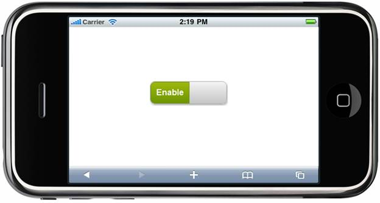

::: {style="DISPLAY: none"}
{#d2h_url_template} {#d2h_package_url style="WIDTH: 0px; DISPLAY: none; HEIGHT: 0px"}
:::

::: {.d2h_secondary_topic style="PADDING-BOTTOM: 10pt; MARGIN: 0pt; PADDING-LEFT: 0pt; PADDING-RIGHT: 0pt; PADDING-TOP: 0pt"}
#### 1.3.2. Events {#events style="tab-stops: 0pt"}

The events of the ToggleButton control are listed and described below:

 

  -------------------------------------------------------------------------------------------------- ---------------------------------------- ----------------------------------------------------------------
  **[Event]{style="COLOR: black"}** []{style="FONT-FAMILY: 'Segoe UI','sans-serif'; COLOR: black"}   **[Parameters]{style="COLOR: black"}**   **[Description]{style="COLOR: black"}**
  [OnTouchStart]{style="COLOR: black"}                                                               inst,args[]{style="COLOR: #c00000"}      Event triggers when the touch starts[]{style="COLOR: #c00000"}
  [OnTouchEnd]{style="COLOR: black"}                                                                 inst,args[]{style="COLOR: #c00000"}      Event rtriggers when the touch ends[]{style="COLOR: #c00000"}
  -------------------------------------------------------------------------------------------------- ---------------------------------------- ----------------------------------------------------------------

 

Using Builder

The following steps will guide you in handling the client-side events through Builder:

3.   In the **view**, invoke the **ToggleButton** helper with the toggle button ID as the first argument and enable the **OnTouchStart** and **OnTouchEnd** with the respective handlers as shown below.

 

+----------------------------------------------------------------------------------------------------------------------------------------------------------------------------------------------------------------------------------------------------------------------------------------------------+
| **[\[ASPX\]]{style="FONT-FAMILY: 'Courier New'"}**                                                                                                                                                                                                                                                 |
|                                                                                                                                                                                                                                                                                                    |
| [        [\<%]{style="BACKGROUND: yellow"}[=]{style="COLOR: blue"} Html.MobSyncfusion().ToggleButton([\"Togg\"]{style="COLOR: #a31515"})\                                                                                                                                                          |
|                 .ToggleState([MobToggleState]{style="COLOR: #2b91af"}.On)\                                                                                                                                                                                                                         |
|                 .OnText([\"Enable\"]{style="COLOR: #a31515"})\                                                                                                                                                                                                                                     |
|                 .OffText([\"Disable\"]{style="COLOR: #a31515"})\                                                                                                                                                                                                                                   |
| ]{style="FONT-FAMILY: 'Courier New'"} [                .OnTouchStart([\"OnStart\"]{style="COLOR: #a31515"})\                                                                                                                                                                                       |
|                 .OnTouchEnd([\"OnEnd\"]{style="COLOR: #a31515"})\                                                                                                                                                                                                                                  |
| ]{style="FONT-FAMILY: 'Courier New'"} [                .AutoFormat([MobSkins]{style="COLOR: #2b91af"}.Spinach) [%\>]{style="BACKGROUND: yellow"}]{style="FONT-FAMILY: 'Courier New'"}                                                                                                              |
|                                                                                                                                                                                                                                                                                                    |
| **[\[Razor\]]{style="FONT-FAMILY: 'Courier New'"}**                                                                                                                                                                                                                                                |
|                                                                                                                                                                                                                                                                                                    |
| [        ]{style="FONT-FAMILY: 'Courier New'; COLOR: blue"} [\@{]{style="FONT-FAMILY: 'Courier New'; BACKGROUND: yellow"} [\                                                                                                                                                                       |
|            ]{style="FONT-FAMILY: 'Courier New'"} [Html.MobSyncfusion().ToggleButton([\"Togg\"]{style="COLOR: #a31515"})\                                                                                                                                                                           |
|                  .ToggleState([MobToggleState]{style="COLOR: #2b91af"}.On)\                                                                                                                                                                                                                        |
|                  .OnText([\"Enable\"]{style="COLOR: #a31515"})\                                                                                                                                                                                                                                    |
|                  .OffText([\"Disable\"]{style="COLOR: #a31515"})\                                                                                                                                                                                                                                  |
| ]{style="FONT-FAMILY: 'Courier New'"} [                 .OnTouchStart([\"OnStart\"]{style="COLOR: #a31515"})\                                                                                                                                                                                      |
|                  .OnTouchEnd([\"OnEnd\"]{style="COLOR: #a31515"})\                                                                                                                                                                                                                                 |
| ]{style="FONT-FAMILY: 'Courier New'"} [                .AutoFormat([MobSkins]{style="COLOR: #2b91af"}.Spinach).Render(); ]{style="FONT-FAMILY: 'Courier New'"} [}]{style="FONT-FAMILY: 'Courier New'; BACKGROUND: yellow"} []{style="FONT-FAMILY: Consolas; BACKGROUND: yellow; FONT-SIZE: 9.5pt"} |
+----------------------------------------------------------------------------------------------------------------------------------------------------------------------------------------------------------------------------------------------------------------------------------------------------+

 

4.   Define the callback methods in the script to handle the specified events.

**[]{style="FONT-FAMILY: 'Calibri','sans-serif'"}**  

+---------------------------------------------------------------------------------------------------------------------------------------------------------------------------+
| **[\[JavaScript\]]{style="FONT-FAMILY: 'Courier New'"}**                                                                                                                  |
|                                                                                                                                                                           |
| [    [\<]{style="COLOR: blue"}[script]{style="COLOR: maroon"}[type]{style="COLOR: red"}[=\"text/javascript\"\>]{style="COLOR: blue"}]{style="FONT-FAMILY: 'Courier New'"} |
|                                                                                                                                                                           |
| [        [function]{style="COLOR: blue"} OnStart(inst, args) {]{style="FONT-FAMILY: 'Courier New'"}                                                                       |
|                                                                                                                                                                           |
| [            [//inst - instance of ToggleButton object]{style="COLOR: darkgreen"}]{style="FONT-FAMILY: 'Courier New'"}                                                    |
|                                                                                                                                                                           |
| [            [//args :    args.element   - ToggleButton item ]{style="COLOR: darkgreen"}]{style="FONT-FAMILY: 'Courier New'"}                                             |
|                                                                                                                                                                           |
| [            [//          args.value            - ToggleButton id]{style="COLOR: darkgreen"}]{style="FONT-FAMILY: 'Courier New'"}                                         |
|                                                                                                                                                                           |
| [            [//          args.text          - on & off state text of the ToggleButton]{style="COLOR: darkgreen"}]{style="FONT-FAMILY: 'Courier New'"}                    |
|                                                                                                                                                                           |
| [        }]{style="FONT-FAMILY: 'Courier New'"}                                                                                                                           |
|                                                                                                                                                                           |
| [        [function]{style="COLOR: blue"} OnEnd(inst, args) {]{style="FONT-FAMILY: Consolas; FONT-SIZE: 9.5pt"}                                                            |
|                                                                                                                                                                           |
| [            [//inst - instance of ToggleButton object]{style="COLOR: darkgreen"}]{style="FONT-FAMILY: Consolas; FONT-SIZE: 9.5pt"}                                       |
|                                                                                                                                                                           |
| [            [//args :    args.element   - ToggleButton item ]{style="COLOR: darkgreen"}]{style="FONT-FAMILY: Consolas; FONT-SIZE: 9.5pt"}                                |
|                                                                                                                                                                           |
| [            [//          args.value            - ToggleButton id]{style="COLOR: darkgreen"}]{style="FONT-FAMILY: Consolas; FONT-SIZE: 9.5pt"}                            |
|                                                                                                                                                                           |
| [            [//          args.text          - on & off state text of the ToggleButton]{style="COLOR: darkgreen"}]{style="FONT-FAMILY: Consolas; FONT-SIZE: 9.5pt"}       |
|                                                                                                                                                                           |
| [        }]{style="FONT-FAMILY: Consolas; FONT-SIZE: 9.5pt"}                                                                                                              |
|                                                                                                                                                                           |
| [    [\</]{style="COLOR: blue"}[script]{style="COLOR: maroon"}[\>]{style="COLOR: blue"}]{style="FONT-FAMILY: Consolas; FONT-SIZE: 9.5pt"}                                 |
|                                                                                                                                                                           |
| []{style="FONT-FAMILY: Consolas; BACKGROUND: yellow; FONT-SIZE: 9.5pt"}                                                                                                   |
+---------------------------------------------------------------------------------------------------------------------------------------------------------------------------+

**[]{style="FONT-FAMILY: 'Calibri','sans-serif'"}**  

5.   Run the application.

**[]{style="FONT-SIZE: 12pt"}**  

Using Properties Model     

The following steps guide you in handling the client-side events through the properties model.

6.   In the **controller**, create an instance of **MobToggleButtonModel**, define the **OnTouchStart** and **OnTouchEnd** events, and pass the instance through **ViewData** to **View** as given below:

[]{style="FONT-FAMILY: 'Calibri','sans-serif'"} 

+--------------------------------------------------------------------------------------------------------------------------------------------------------------------------------------------------+
| **[Controller]{style="FONT-FAMILY: 'Courier New'"}**                                                                                                                                             |
|                                                                                                                                                                                                  |
| [        [public]{style="COLOR: blue"}[ActionResult]{style="COLOR: #2b91af"} ToggleButton()]{style="FONT-FAMILY: Consolas; FONT-SIZE: 9.5pt"}                                                    |
|                                                                                                                                                                                                  |
| [        {]{style="FONT-FAMILY: Consolas; FONT-SIZE: 9.5pt"}                                                                                                                                     |
|                                                                                                                                                                                                  |
| [            [MobToggleButtonModel]{style="COLOR: #2b91af"} model = [new]{style="COLOR: blue"}[MobToggleButtonModel]{style="COLOR: #2b91af"}()]{style="FONT-FAMILY: Consolas; FONT-SIZE: 9.5pt"} |
|                                                                                                                                                                                                  |
| [            {]{style="FONT-FAMILY: Consolas; FONT-SIZE: 9.5pt"}                                                                                                                                 |
|                                                                                                                                                                                                  |
| [                  ]{style="FONT-FAMILY: Consolas; FONT-SIZE: 9.5pt"} [OnText=[\"Enable\"]{style="COLOR: #a31515"},]{style="FONT-FAMILY: 'Courier New'"}                                         |
|                                                                                                                                                                                                  |
| [                OffText=[\"Disable\"]{style="COLOR: #a31515"},]{style="FONT-FAMILY: 'Courier New'"}                                                                                             |
|                                                                                                                                                                                                  |
| [                AutoFormat=[MobSkins]{style="COLOR: #2b91af"}.Spinach,]{style="FONT-FAMILY: 'Courier New'"}                                                                                     |
|                                                                                                                                                                                                  |
| [                OnTouchStart =[\"OnStart\"]{style="COLOR: #a31515"},]{style="FONT-FAMILY: 'Courier New'"}                                                                                       |
|                                                                                                                                                                                                  |
| [                OnTouchEnd ==[\"OnStop\"]{style="COLOR: #a31515"}]{style="FONT-FAMILY: 'Courier New'"} [                ]{style="FONT-FAMILY: Consolas; FONT-SIZE: 9.5pt"}                      |
|                                                                                                                                                                                                  |
| [            };]{style="FONT-FAMILY: Consolas; FONT-SIZE: 9.5pt"}                                                                                                                                |
|                                                                                                                                                                                                  |
| [            ViewData\[[\"Toggle\"]{style="COLOR: #a31515"}\] = model;]{style="FONT-FAMILY: Consolas; FONT-SIZE: 9.5pt"}                                                                         |
|                                                                                                                                                                                                  |
| [            [return]{style="COLOR: blue"} View();]{style="FONT-FAMILY: Consolas; FONT-SIZE: 9.5pt"}                                                                                             |
|                                                                                                                                                                                                  |
| [        }]{style="FONT-FAMILY: Consolas; FONT-SIZE: 9.5pt"}                                                                                                                                     |
|                                                                                                                                                                                                  |
| []{style="FONT-FAMILY: Consolas; BACKGROUND: yellow; FONT-SIZE: 9.5pt"}                                                                                                                          |
+--------------------------------------------------------------------------------------------------------------------------------------------------------------------------------------------------+

 

7.   In the **view**, invoke the **ToggleButton** helper with the **ViewData** key as the first argument.

 

+--------------------------------------------------------------------------------------------------------------------------------------+
| **[\[ASPX\]]{style="FONT-FAMILY: 'Courier New'"}**                                                                                   |
|                                                                                                                                      |
| **[]{style="FONT-FAMILY: 'Courier New'"}**                                                                                           |
|                                                                                                                                      |
| [        [\<%]{style="BACKGROUND: yellow"} {]{style="FONT-FAMILY: 'Courier New'"}                                                    |
|                                                                                                                                      |
| [               Html.MobSyncfusion().ToggleButton([\"Toggle\"]{style="COLOR: #a31515"})]{style="FONT-FAMILY: 'Courier New'"}         |
|                                                                                                                                      |
| [                       .Render();]{style="FONT-FAMILY: 'Courier New'"}                                                              |
|                                                                                                                                      |
| [           }[%\>]{style="BACKGROUND: yellow"}]{style="FONT-FAMILY: 'Courier New'"}                                                  |
|                                                                                                                                      |
| []{style="FONT-FAMILY: 'Courier New'"}                                                                                               |
|                                                                                                                                      |
| **[\[Razor\]]{style="FONT-FAMILY: 'Courier New'"}**                                                                                  |
|                                                                                                                                      |
| **[]{style="FONT-FAMILY: 'Courier New'"}**                                                                                           |
|                                                                                                                                      |
| [    [\@{]{style="BACKGROUND: yellow"}]{style="FONT-FAMILY: 'Courier New'"}                                                          |
|                                                                                                                                      |
| [        Html.MobSyncfusion().ToggleButton([\"Toggle\"]{style="COLOR: #a31515"})]{style="FONT-FAMILY: 'Courier New'"}                |
|                                                                                                                                      |
| [                .Render();]{style="FONT-FAMILY: 'Courier New'"}                                                                     |
|                                                                                                                                      |
| [    [}]{style="BACKGROUND: yellow"}]{style="FONT-FAMILY: 'Courier New'"} []{style="FONT-FAMILY: 'Courier New'; BACKGROUND: yellow"} |
+--------------------------------------------------------------------------------------------------------------------------------------+

 

8.   Define the callback methods in the script to handle the specified events.

**[]{style="FONT-FAMILY: 'Calibri','sans-serif'"}**  

+------------------------------------------------------------------------------------------------------------------------------------------------------------------------------------------------------+
| **[\[JavaScript\]]{style="FONT-FAMILY: 'Courier New'"}**                                                                                                                                             |
|                                                                                                                                                                                                      |
| [    [\<]{style="COLOR: blue"}[script]{style="COLOR: maroon"}[type]{style="COLOR: red"}[=\"text/javascript\"\>]{style="COLOR: blue"}]{style="FONT-FAMILY: 'Courier New'"}                            |
|                                                                                                                                                                                                      |
| [        [function]{style="COLOR: blue"} OnStart(inst, args) {]{style="FONT-FAMILY: 'Courier New'"}                                                                                                  |
|                                                                                                                                                                                                      |
| [            [//inst - instance of ToggleButton object]{style="COLOR: darkgreen"}]{style="FONT-FAMILY: 'Courier New'"}                                                                               |
|                                                                                                                                                                                                      |
| [            [//args :    args.element   - ToggleButton item ]{style="COLOR: darkgreen"}]{style="FONT-FAMILY: 'Courier New'"}                                                                        |
|                                                                                                                                                                                                      |
| [            [//          args.value            - ToggleButton id]{style="COLOR: darkgreen"}]{style="FONT-FAMILY: 'Courier New'"}                                                                    |
|                                                                                                                                                                                                      |
| [            [//          args.text          - on & off state text of the ToggleButton]{style="COLOR: darkgreen"}]{style="FONT-FAMILY: 'Courier New'"}                                               |
|                                                                                                                                                                                                      |
| [        }]{style="FONT-FAMILY: 'Courier New'"}                                                                                                                                                      |
|                                                                                                                                                                                                      |
| [        [function]{style="COLOR: blue"} OnEnd(inst, args) {]{style="FONT-FAMILY: 'Courier New'"}                                                                                                    |
|                                                                                                                                                                                                      |
| [            [//inst - instance of ToggleButton object]{style="COLOR: darkgreen"}]{style="FONT-FAMILY: 'Courier New'"}                                                                               |
|                                                                                                                                                                                                      |
| [            [//args :    args.element   - ToggleButton item ]{style="COLOR: darkgreen"}]{style="FONT-FAMILY: 'Courier New'"}                                                                        |
|                                                                                                                                                                                                      |
| [            [//          args.value            - ToggleButton id]{style="COLOR: darkgreen"}]{style="FONT-FAMILY: 'Courier New'"}                                                                    |
|                                                                                                                                                                                                      |
| [            [//          args.text          - on & off state text of the ToggleButton]{style="COLOR: darkgreen"}]{style="FONT-FAMILY: 'Courier New'"}                                               |
|                                                                                                                                                                                                      |
| [        }]{style="FONT-FAMILY: 'Courier New'"}                                                                                                                                                      |
|                                                                                                                                                                                                      |
| [    [\</]{style="COLOR: blue"}[script]{style="COLOR: maroon"}[\>]{style="COLOR: blue"}]{style="FONT-FAMILY: 'Courier New'"} []{style="FONT-FAMILY: Consolas; BACKGROUND: yellow; FONT-SIZE: 9.5pt"} |
+------------------------------------------------------------------------------------------------------------------------------------------------------------------------------------------------------+

**[]{style="FONT-FAMILY: 'Calibri','sans-serif'"}**  

9.   Run the application.

 

The output is shown in the following screenshot:

{border="0"}

Figure 169: ToggleButton Control---Events

 

 

 

 

[]{#related-topics}
:::
