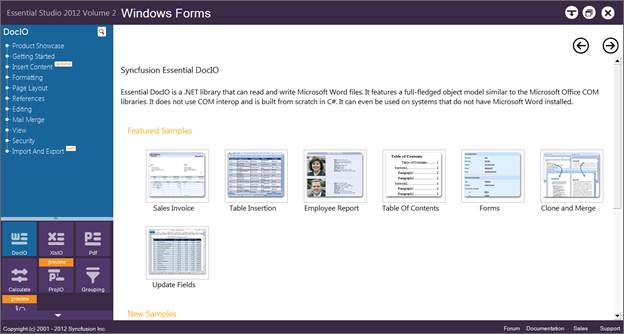
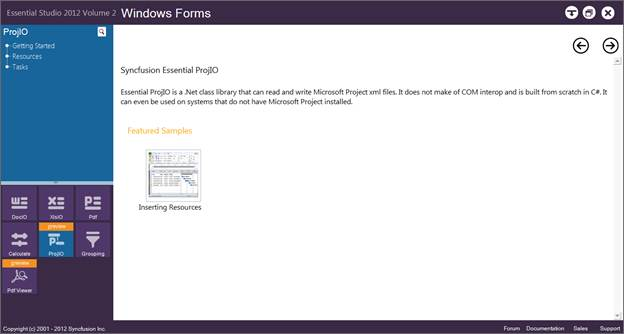
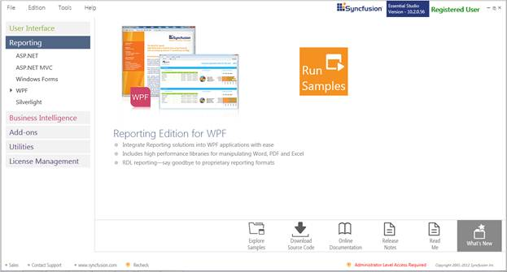
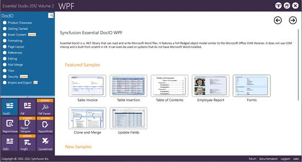
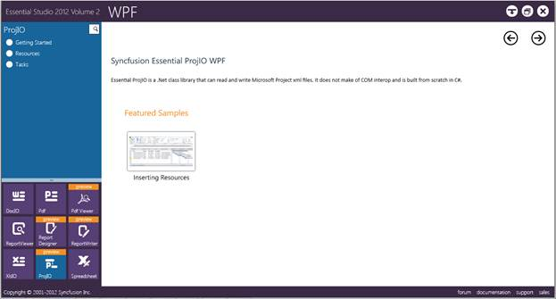

::: {style="DISPLAY: none"}
{#d2h_url_template}{#d2h_package_url style="WIDTH: 0px; DISPLAY: none; HEIGHT: 0px"}
:::

::::: {#nsbanner .d2h_main_nsbanner style="BORDER-BOTTOM: #999999 1px solid; POSITION: relative; PADDING-BOTTOM: 0px; BACKGROUND-COLOR: transparent; PADDING-LEFT: 0px; PADDING-RIGHT: 0px; DISPLAY: none; BORDER-TOP: #999999 1px solid; PADDING-TOP: 0px; LEFT: 0px"}
:::: {#TitleRow .d2h_main_titlerow style="PADDING-BOTTOM: 4px; BACKGROUND-COLOR: transparent; PADDING-LEFT: 22px; WIDTH: 100%; PADDING-RIGHT: 10px; DISPLAY: none; PADDING-TOP: 4px"}
::: {#ienav .d2h_main_ienav style="DISPLAY: none"}
{#D2HPrevious .D2HPreviousEnabled}  {#D2HNext .D2HNextEnabled}
:::
::::
:::::

:::: {#nstext .d2h_main_nstext style="PADDING-BOTTOM: 10px; BACKGROUND-COLOR: transparent; PADDING-LEFT: 22px; PADDING-RIGHT: 10px; HEIGHT: 100%; OVERFLOW: auto; PADDING-TOP: 5px" hasuserbackground="true" valign="bottom"}
::: {#d2h_breadcrumbs .d2h_breadcrumbs}
[Essential Studio User Guide Documentation](ms-xhelp:///?Id=12457748-09e3-4d74-a240-8e049cedf030){.d2h_breadcrumbsNormal}[ \> ]{.d2h_breadcrumbsLinkSeparator}[Reporting Edition](ms-xhelp:///?Id=027aa5b6-6676-4f93-ad23-c20e8c45792e){.d2h_breadcrumbsNormal}[ \> ]{.d2h_breadcrumbsLinkSeparator}[Essential ProjIO](ms-xhelp:///?Id=b95f675f-3e97-4b4b-93b9-e4daba965feb){.d2h_breadcrumbsNormal}[ \> ]{.d2h_breadcrumbsLinkSeparator}[Installation and Deployment](ms-xhelp:///?Id=3ce0c854-8d6d-409b-9fb0-b32dbb079689){.d2h_breadcrumbsNormal}[ \> ]{.d2h_breadcrumbsLinkSeparator}[2.2 Where to Find Samples?](ms-xhelp:///?Id=078b03f8-9a73-4be5-8c9c-aef8345493dc){.d2h_breadcrumbsNormal}
:::

### 2.2.2 Viewing Samples

The samples can be viewed in any of the following three ways:

[·      ]{style="FONT-FAMILY: Symbol"}**Run Samples** -- Click to view the locally installed samples.

[·      ]{style="FONT-FAMILY: Symbol"}**Online Samples**-Click to view online samples.

[·      ]{style="FONT-FAMILY: Symbol"}**Explore Samples** -- Explore samples on disk.

 

To view the samples:

1.   Click **Start -\> All Programs-\> Syncfusion -\> Essential Studio \<x.x.x.x\> -\> Dashboard**. The UI samples are displayed by default.

2.   Select **Reporting**.

 

{border="0"}

Figure 1: Essential Studio Reporting Dashboard

 

The steps to view the ProjIO samples in various platforms are discussed below.

 

Windows

1.   In the Dashboard window, click **Run Samples** for **Windows Forms** under **Reporting** Edition Panel. The **Windows Forms** Sample Browser window is displayed.

 

{border="0"}

Figure 2: Essential Studio Reporting Windows Forms Dashboard

 

2.   Click **ProjIO** from the bottom-left pane. The ProjIO samples are displayed.

 

{border="0"}

Figure 3: Essential Studio Reporting ProjIO Samples

 

3.   Select any sample and browse through the features.

 

WPF

**1.  ** In the dashboard window, click **Run Samples** for **WPF** under **Reporting** edition panel. The **WPF** Sample Browser window is displayed.

\
{border="0"}

Figure 4: Essential Studio Reporting Dashboard

4.   Select **Run Samples**. The default WPF sample will be displayed.

 

{border="0"}

Figure 5: Essential Studio Reporting WPF Dashboard

\
\

5.   Click **ProjIO** form the bottom-left pane and browse through the features.

 

{border="0"}

Figure 5: Essential Studio Reporting ProjIO Samples

 

[]{#related-topics}
::::
