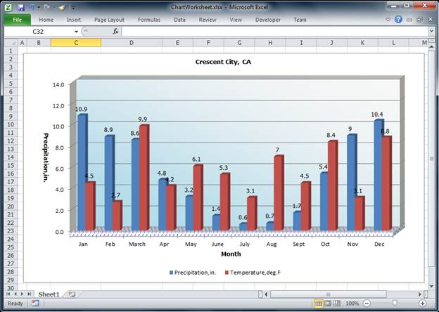

::: {style="DISPLAY: none"}
{#d2h_url_template}{#d2h_package_url style="WIDTH: 0px; DISPLAY: none; HEIGHT: 0px"}
:::

::: {.d2h_secondary_topic style="PADDING-BOTTOM: 10pt; MARGIN: 0pt; PADDING-LEFT: 0pt; PADDING-RIGHT: 0pt; PADDING-TOP: 0pt"}
##### 3-D Chart Wall Settings {#d-chart-wall-settings style="tab-stops: 0pt"}

Essential XlsIO allows users to modify side wall, back wall, and floor settings of a 3-D chart. The following code example explains how to apply these settings to the 3-D chart.

 

+------------------------------------------------------------------------------------------------------------------------------------------------------+
| **[\[C#\]]{style="FONT-FAMILY: 'Courier New'"}**                                                                                                     |
|                                                                                                                                                      |
| [            //Instantiate the spreadsheet creation engine]{style="FONT-FAMILY: 'Courier New'; COLOR: green"}[]{style="FONT-FAMILY: 'Courier New'"}  |
|                                                                                                                                                      |
| [            ExcelEngine excelEngine = [new]{style="COLOR: blue"} ExcelEngine();]{style="FONT-FAMILY: 'Courier New'"}                                |
|                                                                                                                                                      |
| []{style="FONT-FAMILY: 'Courier New'"}                                                                                                               |
|                                                                                                                                                      |
| [            [//Create a new workbook (similar to creating a new workbook in Excel) ]{style="COLOR: green"}]{style="FONT-FAMILY: 'Courier New'"}     |
|                                                                                                                                                      |
| [            [//Open a workbook including data]{style="COLOR: green"}]{style="FONT-FAMILY: 'Courier New'"}                                           |
|                                                                                                                                                      |
| [            IWorkbook workbook = ]{style="FONT-FAMILY: 'Courier New'"}                                                                              |
|                                                                                                                                                      |
| [            excelEngine.Excel.Workbooks.Open([@\"EmbeddedChart.xlsx\"]{style="COLOR: #a31515"});]{style="FONT-FAMILY: 'Courier New'"}               |
|                                                                                                                                                      |
| []{style="FONT-FAMILY: 'Courier New'"}                                                                                                               |
|                                                                                                                                                      |
| [            [//The first worksheet object in the worksheet collection is accessed.]{style="COLOR: green"}]{style="FONT-FAMILY: 'Courier New'"}      |
|                                                                                                                                                      |
| [            IWorksheet sheet = workbook.Worksheets\[0\];]{style="FONT-FAMILY: 'Courier New'"}                                                       |
|                                                                                                                                                      |
| [            sheet.Name = [\"Sample\"]{style="COLOR: #a31515"};]{style="FONT-FAMILY: 'Courier New'"}                                                 |
|                                                                                                                                                      |
| [            ]{style="FONT-FAMILY: 'Courier New'; COLOR: green"}                                                                                     |
|                                                                                                                                                      |
| [            //Add a new chart to the existing worksheet   ]{style="FONT-FAMILY: 'Courier New'; COLOR: green"}[]{style="FONT-FAMILY: 'Courier New'"} |
|                                                                                                                                                      |
| [            IChartShape chart = workbook.Worksheets\[0\].Charts\[0\];            ]{style="FONT-FAMILY: 'Courier New'"}                              |
|                                                                                                                                                      |
| [            ]{style="FONT-FAMILY: 'Courier New'"}                                                                                                   |
|                                                                                                                                                      |
| [            [//Set chart series]{style="COLOR: green"}]{style="FONT-FAMILY: 'Courier New'"}                                                         |
|                                                                                                                                                      |
| [            IChartSerie serieOne = chart.Series\[0\];]{style="FONT-FAMILY: 'Courier New'"}                                                          |
|                                                                                                                                                      |
| [            IChartSerie serieTwo = chart.Series\[1\];]{style="FONT-FAMILY: 'Courier New'"}                                                          |
|                                                                                                                                                      |
| []{style="FONT-FAMILY: 'Courier New'"}                                                                                                               |
|                                                                                                                                                      |
| [            [//Set fill type of chart back wall]{style="COLOR: green"}]{style="FONT-FAMILY: 'Courier New'"}                                         |
|                                                                                                                                                      |
| [            chart.BackWall.Fill.FillType = ExcelFillType.Gradient;]{style="FONT-FAMILY: 'Courier New'"}                                             |
|                                                                                                                                                      |
| []{style="FONT-FAMILY: 'Courier New'"}                                                                                                               |
|                                                                                                                                                      |
| [            [//Set fill options for the back wall]{style="COLOR: green"}]{style="FONT-FAMILY: 'Courier New'"}                                       |
|                                                                                                                                                      |
| [            chart.BackWall.Fill.GradientColorType = ExcelGradientColor.TwoColor;]{style="FONT-FAMILY: 'Courier New'"}                               |
|                                                                                                                                                      |
| [            chart.BackWall.Fill.GradientStyle = ExcelGradientStyle.Diagonl_Down;]{style="FONT-FAMILY: 'Courier New'"}                               |
|                                                                                                                                                      |
| []{style="FONT-FAMILY: 'Courier New'"}                                                                                                               |
|                                                                                                                                                      |
| [            [//Set the foreground and background color of the back wall]{style="COLOR: green"}]{style="FONT-FAMILY: 'Courier New'"}                 |
|                                                                                                                                                      |
| [            chart.BackWall.Fill.ForeColor = System.Drawing.Color.WhiteSmoke;]{style="FONT-FAMILY: 'Courier New'"}                                   |
|                                                                                                                                                      |
| [            chart.BackWall.Fill.BackColor = System.Drawing.Color.LightBlue;]{style="FONT-FAMILY: 'Courier New'"}                                    |
|                                                                                                                                                      |
| []{style="FONT-FAMILY: 'Courier New'"}                                                                                                               |
|                                                                                                                                                      |
| [            [//Set the border line color of the back wall]{style="COLOR: green"}]{style="FONT-FAMILY: 'Courier New'"}                               |
|                                                                                                                                                      |
| [            chart.BackWall.Border.LineColor = System.Drawing.Color.Wheat;]{style="FONT-FAMILY: 'Courier New'"}                                      |
|                                                                                                                                                      |
| []{style="FONT-FAMILY: 'Courier New'"}                                                                                                               |
|                                                                                                                                                      |
| [            [//Set thickness of the back wall]{style="COLOR: green"}]{style="FONT-FAMILY: 'Courier New'"}                                           |
|                                                                                                                                                      |
| [            chart.BackWall.Thickness = 10;]{style="FONT-FAMILY: 'Courier New'"}                                                                     |
|                                                                                                                                                      |
| []{style="FONT-FAMILY: 'Courier New'"}                                                                                                               |
|                                                                                                                                                      |
| [            [//Set fill type of side wall]{style="COLOR: green"}]{style="FONT-FAMILY: 'Courier New'"}                                               |
|                                                                                                                                                      |
| [            chart.SideWall.Fill.FillType = ExcelFillType.SolidColor;]{style="FONT-FAMILY: 'Courier New'"}                                           |
|                                                                                                                                                      |
| []{style="FONT-FAMILY: 'Courier New'"}                                                                                                               |
|                                                                                                                                                      |
| [            [//Set the foreground and background colors of the side wall]{style="COLOR: green"}]{style="FONT-FAMILY: 'Courier New'"}                |
|                                                                                                                                                      |
| [            chart.SideWall.Fill.BackColor = System.Drawing.Color.White;]{style="FONT-FAMILY: 'Courier New'"}                                        |
|                                                                                                                                                      |
| [            chart.SideWall.Fill.ForeColor = System.Drawing.Color.White;]{style="FONT-FAMILY: 'Courier New'"}                                        |
|                                                                                                                                                      |
| []{style="FONT-FAMILY: 'Courier New'"}                                                                                                               |
|                                                                                                                                                      |
| [            [//Set border line color of the side wall]{style="COLOR: green"}]{style="FONT-FAMILY: 'Courier New'"}                                   |
|                                                                                                                                                      |
| [            chart.SideWall.Border.LineColor = System.Drawing.Color.Beige;]{style="FONT-FAMILY: 'Courier New'"}                                      |
|                                                                                                                                                      |
| []{style="FONT-FAMILY: 'Courier New'"}                                                                                                               |
|                                                                                                                                                      |
| [            [//Set fill type of floor]{style="COLOR: green"}]{style="FONT-FAMILY: 'Courier New'"}                                                   |
|                                                                                                                                                      |
| [            chart.Floor.Fill.FillType = ExcelFillType.Pattern;]{style="FONT-FAMILY: 'Courier New'"}                                                 |
|                                                                                                                                                      |
| []{style="FONT-FAMILY: 'Courier New'"}                                                                                                               |
|                                                                                                                                                      |
| [            [//Set pattern type of the floor]{style="COLOR: green"}]{style="FONT-FAMILY: 'Courier New'"}                                            |
|                                                                                                                                                      |
| [            chart.Floor.Fill.Pattern = ExcelGradientPattern.Pat_Divot;]{style="FONT-FAMILY: 'Courier New'"}                                         |
|                                                                                                                                                      |
| []{style="FONT-FAMILY: 'Courier New'"}                                                                                                               |
|                                                                                                                                                      |
| [            [//Set the foreground and background color of the floor]{style="COLOR: green"}]{style="FONT-FAMILY: 'Courier New'"}                     |
|                                                                                                                                                      |
| [            chart.Floor.Fill.ForeColor = System.Drawing.Color.Blue;]{style="FONT-FAMILY: 'Courier New'"}                                            |
|                                                                                                                                                      |
| [            chart.Floor.Fill.BackColor = System.Drawing.Color.White;]{style="FONT-FAMILY: 'Courier New'"}                                           |
|                                                                                                                                                      |
| []{style="FONT-FAMILY: 'Courier New'"}                                                                                                               |
|                                                                                                                                                      |
| [            [//Set thickness of the floor]{style="COLOR: green"}]{style="FONT-FAMILY: 'Courier New'"}                                               |
|                                                                                                                                                      |
| [            chart.Floor.Thickness = 3;]{style="FONT-FAMILY: 'Courier New'"}                                                                         |
|                                                                                                                                                      |
| [            ]{style="FONT-FAMILY: 'Courier New'"}                                                                                                   |
|                                                                                                                                                      |
| [            [//Show value as data labels]{style="COLOR: green"}]{style="FONT-FAMILY: 'Courier New'"}                                                |
|                                                                                                                                                      |
| [            serieOne.DataPoints.DefaultDataPoint.DataLabels.IsValue = [true]{style="COLOR: blue"};]{style="FONT-FAMILY: 'Courier New'"}             |
|                                                                                                                                                      |
| [            serieTwo.DataPoints.DefaultDataPoint.DataLabels.IsValue = [true]{style="COLOR: blue"};]{style="FONT-FAMILY: 'Courier New'"}             |
|                                                                                                                                                      |
| []{style="FONT-FAMILY: 'Courier New'"}                                                                                                               |
|                                                                                                                                                      |
| [            [//Set embedded chart positions]{style="COLOR: green"}]{style="FONT-FAMILY: 'Courier New'"}                                             |
|                                                                                                                                                      |
| [            chart.TopRow = 2;]{style="FONT-FAMILY: 'Courier New'"}                                                                                  |
|                                                                                                                                                      |
| [            chart.BottomRow = 30;]{style="FONT-FAMILY: 'Courier New'"}                                                                              |
|                                                                                                                                                      |
| [            chart.LeftColumn = 5;]{style="FONT-FAMILY: 'Courier New'"}                                                                              |
|                                                                                                                                                      |
| [            chart.RightColumn = 18;]{style="FONT-FAMILY: 'Courier New'"}                                                                            |
|                                                                                                                                                      |
| [            serieTwo.Name = [\"Temperature,deg.F\"]{style="COLOR: #a31515"};]{style="FONT-FAMILY: 'Courier New'"}                                   |
|                                                                                                                                                      |
| []{style="FONT-FAMILY: 'Courier New'"}                                                                                                               |
|                                                                                                                                                      |
| [            [//Set chart legends ]{style="COLOR: green"}]{style="FONT-FAMILY: 'Courier New'"}                                                       |
|                                                                                                                                                      |
| [            chart.Legend.Position = ExcelLegendPosition.Right;]{style="FONT-FAMILY: 'Courier New'"}                                                 |
|                                                                                                                                                      |
| [            chart.Legend.IsVerticalLegend = [false]{style="COLOR: blue"};]{style="FONT-FAMILY: 'Courier New'"}                                      |
|                                                                                                                                                      |
| [            ]{style="FONT-FAMILY: 'Courier New'"}                                                                                                   |
|                                                                                                                                                      |
| [            //Save the workbook]{style="FONT-FAMILY: 'Courier New'; COLOR: green"}[]{style="FONT-FAMILY: 'Courier New'"}                            |
|                                                                                                                                                      |
| [            workbook.SaveAs([\"Sample.xlsx\"]{style="COLOR: #a31515"});]{style="FONT-FAMILY: 'Courier New'"}                                        |
|                                                                                                                                                      |
| []{style="FONT-FAMILY: 'Courier New'"}                                                                                                               |
|                                                                                                                                                      |
| [            ]{style="FONT-FAMILY: 'Courier New'"}[]{style="FONT-FAMILY: 'Courier New'"}                                                             |
+------------------------------------------------------------------------------------------------------------------------------------------------------+

 

+------------------------------------------------------------------------------------------------------------------------------------------------------------------------------------------------------------------------+
| **[\[VB.NET\]]{style="FONT-FAMILY: 'Courier New'"}**[]{style="FONT-FAMILY: 'Courier New'"}                                                                                                                             |
|                                                                                                                                                                                                                        |
| []{style="FONT-FAMILY: 'Courier New'"}                                                                                                                                                                                 |
|                                                                                                                                                                                                                        |
| [           ]{style="FONT-FAMILY: 'Courier New'"}[\'Instantiate the spreadsheet creation engine]{style="FONT-FAMILY: 'Courier New'; COLOR: green"}                                                                     |
|                                                                                                                                                                                                                        |
| [            [Dim]{style="COLOR: blue"} excelEngine [As]{style="COLOR: blue"} [New]{style="COLOR: blue"} ExcelEngine()]{style="FONT-FAMILY: 'Courier New'"}                                                            |
|                                                                                                                                                                                                                        |
| []{style="FONT-FAMILY: 'Courier New'"}                                                                                                                                                                                 |
|                                                                                                                                                                                                                        |
| [            [\'Create a new workbook (similar to creating a new ]{style="COLOR: green"}]{style="FONT-FAMILY: 'Courier New'"}                                                                                          |
|                                                                                                                                                                                                                        |
| [            workbook in Excel)                        ]{style="FONT-FAMILY: 'Courier New'; COLOR: green"}                                                                                                             |
|                                                                                                                                                                                                                        |
| [            [\'Open a workbook including data]{style="COLOR: green"}]{style="FONT-FAMILY: 'Courier New'"}                                                                                                             |
|                                                                                                                                                                                                                        |
| [            [Dim]{style="COLOR: blue"} workbook [As]{style="COLOR: blue"} IWorkbook = ]{style="FONT-FAMILY: 'Courier New'"}                                                                                           |
|                                                                                                                                                                                                                        |
| [            excelEngine.Excel.Workbooks.Open([\"EmbeddedChart.xlsx\"]{style="COLOR: #a31515"})]{style="FONT-FAMILY: 'Courier New'"}                                                                                   |
|                                                                                                                                                                                                                        |
| []{style="FONT-FAMILY: 'Courier New'"}                                                                                                                                                                                 |
|                                                                                                                                                                                                                        |
| [            [\'The first worksheet object in the worksheet collection is ]{style="COLOR: green"}]{style="FONT-FAMILY: 'Courier New'"}                                                                                 |
|                                                                                                                                                                                                                        |
| [             accessed.]{style="FONT-FAMILY: 'Courier New'; COLOR: green"}                                                                                                                                             |
|                                                                                                                                                                                                                        |
| [            [Dim]{style="COLOR: blue"} sheet [As]{style="COLOR: blue"} IWorksheet = workbook.Worksheets(0)]{style="FONT-FAMILY: 'Courier New'"}                                                                       |
|                                                                                                                                                                                                                        |
| [            sheet.Name = [\"Sample\"]{style="COLOR: #a31515"}]{style="FONT-FAMILY: 'Courier New'"}                                                                                                                    |
|                                                                                                                                                                                                                        |
| []{style="FONT-FAMILY: 'Courier New'; COLOR: #a31515"}                                                                                                                                                                 |
|                                                                                                                                                                                                                        |
| [            [\'Add a new chart to the existing worksheet   ]{style="COLOR: green"}]{style="FONT-FAMILY: 'Courier New'"}                                                                                               |
|                                                                                                                                                                                                                        |
| [            [Dim]{style="COLOR: blue"} chart [As]{style="COLOR: blue"} IChartShape = workbook.Worksheets(0).Charts(0)]{style="FONT-FAMILY: 'Courier New'"}                                                            |
|                                                                                                                                                                                                                        |
| [            []{style="COLOR: #a31515"}]{style="FONT-FAMILY: 'Courier New'"}                                                                                                                                           |
|                                                                                                                                                                                                                        |
| [            [\'Set chart series]{style="COLOR: green"}]{style="FONT-FAMILY: 'Courier New'"}                                                                                                                           |
|                                                                                                                                                                                                                        |
| [            [Dim]{style="COLOR: blue"} serieOne [As]{style="COLOR: blue"} IChartSerie = chart.Series(0)]{style="FONT-FAMILY: 'Courier New'"}                                                                          |
|                                                                                                                                                                                                                        |
| [            [Dim]{style="COLOR: blue"} serieTwo [As]{style="COLOR: blue"} IChartSerie = chart.Series(1)            ]{style="FONT-FAMILY: 'Courier New'"}                                                              |
|                                                                                                                                                                                                                        |
| []{style="FONT-FAMILY: 'Courier New'"}                                                                                                                                                                                 |
|                                                                                                                                                                                                                        |
| [            [\'Set fill type of back wall]{style="COLOR: green"}]{style="FONT-FAMILY: 'Courier New'"}                                                                                                                 |
|                                                                                                                                                                                                                        |
| [            chart.BackWall.Fill.FillType = ExcelFillType.Gradient]{style="FONT-FAMILY: 'Courier New'"}                                                                                                                |
|                                                                                                                                                                                                                        |
| []{style="FONT-FAMILY: 'Courier New'"}                                                                                                                                                                                 |
|                                                                                                                                                                                                                        |
| [            [\'Set fill options for the back wall]{style="COLOR: green"}            []{style="COLOR: green"}]{style="FONT-FAMILY: 'Courier New'"}                                                                     |
|                                                                                                                                                                                                                        |
| [            chart.BackWall.Fill.GradientColorType =]{style="FONT-FAMILY: 'Courier New'"}                                                                                                                              |
|                                                                                                                                                                                                                        |
| [            ExcelGradientColor.TwoColor            ]{style="FONT-FAMILY: 'Courier New'"}                                                                                                                              |
|                                                                                                                                                                                                                        |
| [            chart.BackWall.Fill.GradientStyle =]{style="FONT-FAMILY: 'Courier New'"}                                                                                                                                  |
|                                                                                                                                                                                                                        |
| [            ExcelGradientStyle.Diagonl_Down]{style="FONT-FAMILY: 'Courier New'"}                                                                                                                                      |
|                                                                                                                                                                                                                        |
| []{style="FONT-FAMILY: 'Courier New'"}                                                                                                                                                                                 |
|                                                                                                                                                                                                                        |
| [            [\'set]{style="COLOR: green"}[ the foreground and background color of the back wall]{style="COLOR: green"}]{style="FONT-FAMILY: 'Courier New'"}                                                           |
|                                                                                                                                                                                                                        |
| [            chart.BackWall.Fill.ForeColor = System.Drawing.Color.WhiteSmoke]{style="FONT-FAMILY: 'Courier New'"}                                                                                                      |
|                                                                                                                                                                                                                        |
| [            chart.BackWall.Fill.BackColor = System.Drawing.Color.LightBlue]{style="FONT-FAMILY: 'Courier New'"}                                                                                                       |
|                                                                                                                                                                                                                        |
| []{style="FONT-FAMILY: 'Courier New'"}                                                                                                                                                                                 |
|                                                                                                                                                                                                                        |
| [            [\'Set border line color of the back wall]{style="COLOR: green"}]{style="FONT-FAMILY: 'Courier New'"}                                                                                                     |
|                                                                                                                                                                                                                        |
| [            chart.BackWall.Border.LineColor = System.Drawing.Color.Wheat]{style="FONT-FAMILY: 'Courier New'"}                                                                                                         |
|                                                                                                                                                                                                                        |
| []{style="FONT-FAMILY: 'Courier New'"}                                                                                                                                                                                 |
|                                                                                                                                                                                                                        |
| [            [\'Set thickness of the back wall]{style="COLOR: green"}]{style="FONT-FAMILY: 'Courier New'"}                                                                                                             |
|                                                                                                                                                                                                                        |
| [            chart.BackWall.Thickness = 10]{style="FONT-FAMILY: 'Courier New'"}                                                                                                                                        |
|                                                                                                                                                                                                                        |
| []{style="FONT-FAMILY: 'Courier New'"}                                                                                                                                                                                 |
|                                                                                                                                                                                                                        |
| [            [\'Set fill type of side wall]{style="COLOR: green"}]{style="FONT-FAMILY: 'Courier New'"}                                                                                                                 |
|                                                                                                                                                                                                                        |
| [            chart.SideWall.Fill.FillType = ExcelFillType.SolidColor]{style="FONT-FAMILY: 'Courier New'"}                                                                                                              |
|                                                                                                                                                                                                                        |
| []{style="FONT-FAMILY: 'Courier New'"}                                                                                                                                                                                 |
|                                                                                                                                                                                                                        |
| [            [\'Set foreground and backcolor of the side wall]{style="COLOR: green"}]{style="FONT-FAMILY: 'Courier New'"}                                                                                              |
|                                                                                                                                                                                                                        |
| [            chart.SideWall.Fill.BackColor = System.Drawing.Color.White]{style="FONT-FAMILY: 'Courier New'"}                                                                                                           |
|                                                                                                                                                                                                                        |
| [            chart.SideWall.Fill.ForeColor = System.Drawing.Color.White]{style="FONT-FAMILY: 'Courier New'"}                                                                                                           |
|                                                                                                                                                                                                                        |
| []{style="FONT-FAMILY: 'Courier New'"}                                                                                                                                                                                 |
|                                                                                                                                                                                                                        |
| [            [\']{style="COLOR: green"}]{style="FONT-FAMILY: 'Courier New'"}[Set border line color of the side wall]{style="FONT-FAMILY: 'Courier New'; COLOR: green"}[]{style="FONT-FAMILY: 'Courier New'"}           |
|                                                                                                                                                                                                                        |
| [            chart.SideWall.Border.LineColor = System.Drawing.Color.Beige]{style="FONT-FAMILY: 'Courier New'"}                                                                                                         |
|                                                                                                                                                                                                                        |
| []{style="FONT-FAMILY: 'Courier New'"}                                                                                                                                                                                 |
|                                                                                                                                                                                                                        |
| [            [\'Set fill type of floor]{style="COLOR: green"}]{style="FONT-FAMILY: 'Courier New'"}                                                                                                                     |
|                                                                                                                                                                                                                        |
| [            chart.Floor.Fill.FillType = ExcelFillType.Pattern]{style="FONT-FAMILY: 'Courier New'"}                                                                                                                    |
|                                                                                                                                                                                                                        |
| []{style="FONT-FAMILY: 'Courier New'"}                                                                                                                                                                                 |
|                                                                                                                                                                                                                        |
| [            [\'Set pattern type of the floor]{style="COLOR: green"}]{style="FONT-FAMILY: 'Courier New'"}                                                                                                              |
|                                                                                                                                                                                                                        |
| [            chart.Floor.Fill.Pattern = ExcelGradientPattern.Pat_Divot]{style="FONT-FAMILY: 'Courier New'"}                                                                                                            |
|                                                                                                                                                                                                                        |
| []{style="FONT-FAMILY: 'Courier New'"}                                                                                                                                                                                 |
|                                                                                                                                                                                                                        |
| [            [\']{style="COLOR: green"}]{style="FONT-FAMILY: 'Courier New'"}[Set foreground and background color of the floor]{style="FONT-FAMILY: 'Courier New'; COLOR: green"}[]{style="FONT-FAMILY: 'Courier New'"} |
|                                                                                                                                                                                                                        |
| [            chart.Floor.Fill.ForeColor = System.Drawing.Color.Blue]{style="FONT-FAMILY: 'Courier New'"}                                                                                                               |
|                                                                                                                                                                                                                        |
| [            chart.Floor.Fill.BackColor = System.Drawing.Color.White]{style="FONT-FAMILY: 'Courier New'"}                                                                                                              |
|                                                                                                                                                                                                                        |
| []{style="FONT-FAMILY: 'Courier New'"}                                                                                                                                                                                 |
|                                                                                                                                                                                                                        |
| [            [\'Set thickness of the floor]{style="COLOR: green"}]{style="FONT-FAMILY: 'Courier New'"}                                                                                                                 |
|                                                                                                                                                                                                                        |
| [            chart.Floor.Thickness = 3]{style="FONT-FAMILY: 'Courier New'"}                                                                                                                                            |
|                                                                                                                                                                                                                        |
| []{style="FONT-FAMILY: 'Courier New'"}                                                                                                                                                                                 |
|                                                                                                                                                                                                                        |
| [            [\'Show value as data labels]{style="COLOR: green"}]{style="FONT-FAMILY: 'Courier New'"}                                                                                                                  |
|                                                                                                                                                                                                                        |
| [            serieOne.DataPoints.DefaultDataPoint.DataLabels.IsValue = [True]{style="COLOR: blue"}]{style="FONT-FAMILY: 'Courier New'"}                                                                                |
|                                                                                                                                                                                                                        |
| [            serieTwo.DataPoints.DefaultDataPoint.DataLabels.IsValue = [True]{style="COLOR: blue"}]{style="FONT-FAMILY: 'Courier New'"}                                                                                |
|                                                                                                                                                                                                                        |
| []{style="FONT-FAMILY: 'Courier New'; COLOR: blue"}                                                                                                                                                                    |
|                                                                                                                                                                                                                        |
| [            [\'Set embedded chart positions]{style="COLOR: green"}]{style="FONT-FAMILY: 'Courier New'"}                                                                                                               |
|                                                                                                                                                                                                                        |
| [            chart.TopRow = 2]{style="FONT-FAMILY: 'Courier New'"}                                                                                                                                                     |
|                                                                                                                                                                                                                        |
| [            chart.BottomRow = 30]{style="FONT-FAMILY: 'Courier New'"}                                                                                                                                                 |
|                                                                                                                                                                                                                        |
| [            chart.LeftColumn = 5]{style="FONT-FAMILY: 'Courier New'"}                                                                                                                                                 |
|                                                                                                                                                                                                                        |
| [            chart.RightColumn = 18]{style="FONT-FAMILY: 'Courier New'"}                                                                                                                                               |
|                                                                                                                                                                                                                        |
| [            serieTwo.Name = [\"Temperature,deg.F\"]{style="COLOR: #a31515"}]{style="FONT-FAMILY: 'Courier New'"}                                                                                                      |
|                                                                                                                                                                                                                        |
| []{style="FONT-FAMILY: 'Courier New'; COLOR: #a31515"}                                                                                                                                                                 |
|                                                                                                                                                                                                                        |
| [            [\'Set chart legends ]{style="COLOR: green"}]{style="FONT-FAMILY: 'Courier New'"}                                                                                                                         |
|                                                                                                                                                                                                                        |
| [            chart.Legend.Position = ExcelLegendPosition.Right]{style="FONT-FAMILY: 'Courier New'"}                                                                                                                    |
|                                                                                                                                                                                                                        |
| [            chart.Legend.IsVerticalLegend = [False]{style="COLOR: blue"}]{style="FONT-FAMILY: 'Courier New'"}                                                                                                         |
|                                                                                                                                                                                                                        |
| [            ]{style="FONT-FAMILY: 'Courier New'"}                                                                                                                                                                     |
|                                                                                                                                                                                                                        |
| [            [\'Save the workbook]{style="COLOR: green"}]{style="FONT-FAMILY: 'Courier New'"}                                                                                                                          |
|                                                                                                                                                                                                                        |
| [            workbook.SaveAs([\"Sample.xlsx\"]{style="COLOR: #a31515"})]{style="FONT-FAMILY: 'Courier New'"}                                                                                                           |
+------------------------------------------------------------------------------------------------------------------------------------------------------------------------------------------------------------------------+

 

{border="0"}

Figure 78: 3-D Chart Applied with Wall Settings

 

[]{#related-topics}
:::
