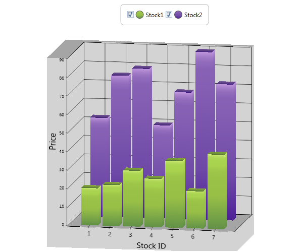

::: {style="DISPLAY: none"}
{#d2h_url_template}{#d2h_package_url style="WIDTH: 0px; DISPLAY: none; HEIGHT: 0px"}
:::

::: {.d2h_secondary_topic style="PADDING-BOTTOM: 10pt; MARGIN: 0pt; PADDING-LEFT: 0pt; PADDING-RIGHT: 0pt; PADDING-TOP: 0pt"}
##### []{#p165}3D Manhattan Bar Chart {#d-manhattan-bar-chart style="tab-stops: 0pt"}

Features

3D Manhattan Chart is a three dimensional charting feature that enables the chart control to visualize data in a three dimensional space (i.e. along the X, Y a, and Z axes). The feature supports basic Chart Types like Column, Bar, Line and Area, and helps the user to plot graphs in the third axis (Z axis), apart from X and Y axes, which already are supported in Chart.

 

Use Case Scenarios

[·      ]{style="FONT-FAMILY: Symbol"}You can avail of 3D Manhattan bar support by using the IsClustered property, when IsClustered is set to false. Each series is plotted in value of Z Axis, whereas Clustered view has series added to only X Axis

[·      ]{style="FONT-FAMILY: Symbol"}You can plot various fields in a chart, using the 3D Manhattan Chart, in a more comprehensive manner, as shown in the following example:

{border="0"}

*Figure* *261: 3D Manhattan Chart*

 

Here, the number of working days and wages of the employee in X, Y and Z axes are plotted correspondingly.

[]{style="COLOR: #c00000"} 

Properties

 

Table 172: Properties Table

  Property                                 Description                                                                                      Type                                                  Data Type   Reference links
  ---------------------------------------- ------------------------------------------------------------------------------------------------ ----------------------------------------------------- ----------- -----------------
  IsClustered[ ]{style="COLOR: #c00000"}   To cluster the series along X axis when isClustered is set to true.[ ]{style="COLOR: #c00000"}   **Dependency Property**[. ]{style="COLOR: #c00000"}   Boolean     NA
  IsRotated                                To allow the 3D Chart to rotate                                                                  **Dependency Property**                               Boolean     NA

[]{style="FONT-FAMILY: 'Calibri','sans-serif'; COLOR: black"} 

Sample Link

To view samples:

1.   Open the WPF Sample Browser from the dashboard.

2.   Navigate to WPF Chart -\> Chart Area -\> 3D Manhattan Chart.

[]{style="COLOR: #c00000"} 

Adding 3D Manhattan Bar Chart to an Application

 

+--------------------------------------------------------------------------------------------------------------------------------------------------------------------------------------------------------------------------------------------------------------------------------------------------------------------------------------------------------------------------------------------------------------------------------------------------------------------------------------------------------------------------------------------+
| **[\[xaml\]]{style="FONT-FAMILY: 'Courier New'"}**                                                                                                                                                                                                                                                                                                                                                                                                                                                                                         |
|                                                                                                                                                                                                                                                                                                                                                                                                                                                                                                                                            |
| [        \<]{style="FONT-FAMILY: 'Courier New'; COLOR: blue"}[sync]{style="FONT-FAMILY: 'Courier New'; COLOR: #a31515"}[:]{style="FONT-FAMILY: 'Courier New'; COLOR: blue"}[Chart]{style="FONT-FAMILY: 'Courier New'; COLOR: #a31515"}[ x]{style="FONT-FAMILY: 'Courier New'; COLOR: red"}[:]{style="FONT-FAMILY: 'Courier New'; COLOR: blue"}[Name]{style="FONT-FAMILY: 'Courier New'; COLOR: red"}[=\"Chart1\" \>]{style="FONT-FAMILY: 'Courier New'; COLOR: blue"}                                                                      |
|                                                                                                                                                                                                                                                                                                                                                                                                                                                                                                                                            |
| [            ]{style="FONT-FAMILY: 'Courier New'; COLOR: #a31515"}[\<]{style="FONT-FAMILY: 'Courier New'; COLOR: blue"}[sync]{style="FONT-FAMILY: 'Courier New'; COLOR: #a31515"}[:]{style="FONT-FAMILY: 'Courier New'; COLOR: blue"}[ChartArea]{style="FONT-FAMILY: 'Courier New'; COLOR: #a31515"}[ [ IsClustered]{style="COLOR: red"}[=\"True\"\>]{style="COLOR: blue"}]{style="FONT-FAMILY: 'Courier New'"}                                                                                                                            |
|                                                                                                                                                                                                                                                                                                                                                                                                                                                                                                                                            |
| [                ]{style="FONT-FAMILY: 'Courier New'; COLOR: #a31515"}[\<]{style="FONT-FAMILY: 'Courier New'; COLOR: blue"}[sync]{style="FONT-FAMILY: 'Courier New'; COLOR: #a31515"}[:]{style="FONT-FAMILY: 'Courier New'; COLOR: blue"}[ChartSeries]{style="FONT-FAMILY: 'Courier New'; COLOR: #a31515"}[ x]{style="FONT-FAMILY: 'Courier New'; COLOR: red"}[:]{style="FONT-FAMILY: 'Courier New'; COLOR: blue"}[Name]{style="FONT-FAMILY: 'Courier New'; COLOR: red"}[=\"series1\"/\>]{style="FONT-FAMILY: 'Courier New'; COLOR: blue"} |
|                                                                                                                                                                                                                                                                                                                                                                                                                                                                                                                                            |
| [            ]{style="FONT-FAMILY: 'Courier New'; COLOR: #a31515"}[\</]{style="FONT-FAMILY: 'Courier New'; COLOR: blue"}[sync]{style="FONT-FAMILY: 'Courier New'; COLOR: #a31515"}[:]{style="FONT-FAMILY: 'Courier New'; COLOR: blue"}[ChartArea]{style="FONT-FAMILY: 'Courier New'; COLOR: #a31515"}[\>]{style="FONT-FAMILY: 'Courier New'; COLOR: blue"}                                                                                                                                                                                 |
|                                                                                                                                                                                                                                                                                                                                                                                                                                                                                                                                            |
| [        ]{style="FONT-FAMILY: 'Courier New'; COLOR: #a31515"}[\</]{style="FONT-FAMILY: 'Courier New'; COLOR: blue"}[sync]{style="FONT-FAMILY: 'Courier New'; COLOR: #a31515"}[:]{style="FONT-FAMILY: 'Courier New'; COLOR: blue"}[Chart]{style="FONT-FAMILY: 'Courier New'; COLOR: #a31515"}[\>]{style="FONT-FAMILY: 'Courier New'; COLOR: blue"}                                                                                                                                                                                         |
+--------------------------------------------------------------------------------------------------------------------------------------------------------------------------------------------------------------------------------------------------------------------------------------------------------------------------------------------------------------------------------------------------------------------------------------------------------------------------------------------------------------------------------------------+

 

+----------------------------------------------------------------------------------------------------+
| **[\[C#\]]{style="FONT-FAMILY: 'Courier New'"}**                                                   |
|                                                                                                    |
| [Chart1.Areas\[0\].IsClustered = [true]{style="COLOR: blue"};]{style="FONT-FAMILY: 'Courier New'"} |
+----------------------------------------------------------------------------------------------------+

 

 

[]{#related-topics}
:::
