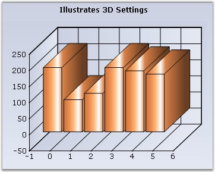
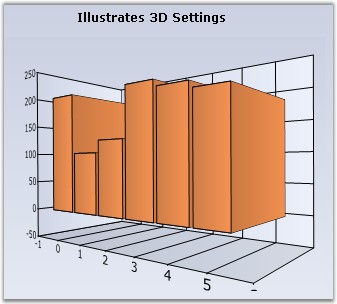
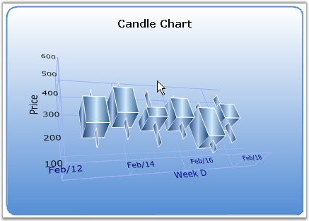

::: {style="DISPLAY: none"}
{#d2h_url_template}{#d2h_package_url style="WIDTH: 0px; DISPLAY: none; HEIGHT: 0px"}
:::

::::: {#nsbanner .d2h_main_nsbanner style="BORDER-BOTTOM: #999999 1px solid; POSITION: relative; PADDING-BOTTOM: 0px; BACKGROUND-COLOR: transparent; PADDING-LEFT: 0px; PADDING-RIGHT: 0px; DISPLAY: none; BORDER-TOP: #999999 1px solid; PADDING-TOP: 0px; LEFT: 0px"}
:::: {#TitleRow .d2h_main_titlerow style="PADDING-BOTTOM: 4px; BACKGROUND-COLOR: transparent; PADDING-LEFT: 22px; WIDTH: 100%; PADDING-RIGHT: 10px; DISPLAY: none; PADDING-TOP: 4px"}
::: {#ienav .d2h_main_ienav style="DISPLAY: none"}
{#D2HPrevious .D2HPreviousEnabled}  {#D2HNext .D2HNextEnabled}
:::
::::
:::::

:::::: {#nstext .d2h_main_nstext style="PADDING-BOTTOM: 10px; BACKGROUND-COLOR: transparent; PADDING-LEFT: 22px; PADDING-RIGHT: 10px; HEIGHT: 100%; OVERFLOW: auto; PADDING-TOP: 5px" hasuserbackground="true" valign="bottom"}
::: {#d2h_breadcrumbs .d2h_breadcrumbs}
[Essential Studio User Guide Documentation](ms-xhelp:///?Id=12457748-09e3-4d74-a240-8e049cedf030){.d2h_breadcrumbsNormal}[ \> ]{.d2h_breadcrumbsLinkSeparator}[User Interface Edition](ms-xhelp:///?Id=c29296b7-531c-413b-a0ec-488ca1f7f669){.d2h_breadcrumbsNormal}[ \> ]{.d2h_breadcrumbsLinkSeparator}[Essential Windows](ms-xhelp:///?Id=e60759d8-47a4-4570-9d7a-16a68d63f2ea){.d2h_breadcrumbsNormal}[ \> ]{.d2h_breadcrumbsLinkSeparator}[Essential Chart]{.d2h_breadcrumbsContentsOnly}[ \> ]{.d2h_breadcrumbsLinkSeparator}[Concepts and Features](ms-xhelp:///?Id=71321e9c-336c-4c1c-a127-be9f135ad4bb){.d2h_breadcrumbsNormal}[ \> ]{.d2h_breadcrumbsLinkSeparator}[Chart Axes](ms-xhelp:///?Id=e0d0de4a-3c3c-41cd-9d94-6496172cab48){.d2h_breadcrumbsNormal}
:::

### 3D Related {#d-related style="tab-stops: 0pt"}

 

Here are some properties that affect the rendering of an axis when in **3D** mode, which is set using the **Series3D** property.

 

::: {align="center"}
+-----------------------------------+-----------------------------------------------------------------------------------------------------------------------+
| Chart control Property            | Description                                                                                                           |
+-----------------------------------+-----------------------------------------------------------------------------------------------------------------------+
| Series3D                          | Specifies if the chart should be rendered in 3D mode.                                                                 |
+-----------------------------------+-----------------------------------------------------------------------------------------------------------------------+
| RealMode3D                        | Specifies if the chart should be rendered in a 3D plane.                                                              |
+-----------------------------------+-----------------------------------------------------------------------------------------------------------------------+
| Depth                             | Specifies the depth of the axes in the z co-ordinate. Default value is **50f**.                                       |
+-----------------------------------+-----------------------------------------------------------------------------------------------------------------------+
| Tilt                              | Specifies the tilt angle relative to Y axis. Default value is **30f**.                                                |
+-----------------------------------+-----------------------------------------------------------------------------------------------------------------------+
| Rotation                          | Specifies the angle of rotation relative to X-axis. Default value is **30f**.                                         |
+-----------------------------------+-----------------------------------------------------------------------------------------------------------------------+
| ColumnDrawMode                    | Specifies the mode of column drawing when in 3D.                                                                      |
|                                   |                                                                                                                       |
|                                   | [·      ]{style="FONT-FAMILY: Symbol"}**PlaneMode** - Columns from different series are drawn with same depth.        |
|                                   |                                                                                                                       |
|                                   | [·      ]{style="FONT-FAMILY: Symbol"}**InDepthMode** - Columns from different series are drawn with different depth. |
+-----------------------------------+-----------------------------------------------------------------------------------------------------------------------+
| EnableMouseRotation               | Enables rotation of the chart at run-time using Middle / Right mouse button.                                          |
+-----------------------------------+-----------------------------------------------------------------------------------------------------------------------+
:::

 

3D Mode Sample

 

+----------------------------------------------------------------------------------------------------------------------------------------------------+
| **[\[C#\]]{style="FONT-FAMILY: 'Courier New'; COLOR: black"}**                                                                                     |
|                                                                                                                                                    |
| **[]{style="FONT-FAMILY: 'Courier New'; COLOR: black"}**                                                                                           |
|                                                                                                                                                    |
| [this]{style="FONT-FAMILY: 'Courier New'; COLOR: blue"}[.chartControl1.Series3D = true;]{style="FONT-FAMILY: 'Courier New'"}                       |
|                                                                                                                                                    |
| [this]{style="FONT-FAMILY: 'Courier New'; COLOR: blue"}[.chartControl1.Depth = 55F;]{style="FONT-FAMILY: 'Courier New'"}                           |
|                                                                                                                                                    |
| [this]{style="FONT-FAMILY: 'Courier New'; COLOR: blue"}[.chartControl1.Tilt = 55F;]{style="FONT-FAMILY: 'Courier New'"}                            |
|                                                                                                                                                    |
| [this]{style="FONT-FAMILY: 'Courier New'; COLOR: blue"}[.chartControl1.[Rotation]{style="COLOR: black"} = 60;]{style="FONT-FAMILY: 'Courier New'"} |
+----------------------------------------------------------------------------------------------------------------------------------------------------+

 

+-------------------------------------------------------------------------------------------------------------------------------------------------+
| **[\[VB.NET\]]{style="FONT-FAMILY: 'Courier New'; COLOR: black"}**                                                                              |
|                                                                                                                                                 |
| **[]{style="FONT-FAMILY: 'Courier New'; COLOR: black"}**                                                                                        |
|                                                                                                                                                 |
| [Me]{style="FONT-FAMILY: 'Courier New'; COLOR: blue"}[.chartControl1.Series3D = [True\                                                          |
| Me]{style="COLOR: blue"}.chartControl1.Depth = 55F]{style="FONT-FAMILY: 'Courier New'"}                                                         |
|                                                                                                                                                 |
| [Me]{style="FONT-FAMILY: 'Courier New'; COLOR: blue"}[.chartControl1.Tilt = 55F]{style="FONT-FAMILY: 'Courier New'"}                            |
|                                                                                                                                                 |
| [Me]{style="FONT-FAMILY: 'Courier New'; COLOR: blue"}[.chartControl1.[Rotation]{style="COLOR: black"} = 60]{style="FONT-FAMILY: 'Courier New'"} |
+-------------------------------------------------------------------------------------------------------------------------------------------------+

[]{style="COLOR: red; FONT-SIZE: 8pt"} 

{border="0"}

 

Figure 269: 3D Chart control with Depth = \"55f\", Tilt = \"55f\"; Rotation = \"60\"

 

Real 3D Mode sample

 

+---------------------------------------------------------------------------------------------------------------------------------------------------------------+
| **[\[C#\]]{style="FONT-FAMILY: 'Courier New'; COLOR: black"}**                                                                                                |
|                                                                                                                                                               |
| **[]{style="FONT-FAMILY: 'Courier New'; COLOR: black"}**                                                                                                      |
|                                                                                                                                                               |
| [this]{style="FONT-FAMILY: 'Courier New'; COLOR: blue"}[.chartControl1.ChartArea.Series3D = [true]{style="COLOR: blue"};]{style="FONT-FAMILY: 'Courier New'"} |
|                                                                                                                                                               |
| [this]{style="FONT-FAMILY: 'Courier New'; COLOR: blue"}[.chartControl1.Tilt = 0;]{style="FONT-FAMILY: 'Courier New'"}                                         |
|                                                                                                                                                               |
| [this]{style="FONT-FAMILY: 'Courier New'; COLOR: blue"}[.chartControl1.Depth = 150;]{style="FONT-FAMILY: 'Courier New'"}                                      |
|                                                                                                                                                               |
| [this]{style="FONT-FAMILY: 'Courier New'; COLOR: blue"}[.chartControl1.Rotation = 10;]{style="FONT-FAMILY: 'Courier New'"}                                    |
|                                                                                                                                                               |
| [this]{style="FONT-FAMILY: 'Courier New'; COLOR: blue"}[.chartControl1.RealMode3D = [true]{style="COLOR: blue"};]{style="FONT-FAMILY: 'Courier New'"}         |
+---------------------------------------------------------------------------------------------------------------------------------------------------------------+

 

+------------------------------------------------------------------------------------------------------------------------------------------------------------+
| **[\[VB.NET\]]{style="FONT-FAMILY: 'Courier New'; COLOR: black"}**                                                                                         |
|                                                                                                                                                            |
| **[]{style="FONT-FAMILY: 'Courier New'; COLOR: black"}**                                                                                                   |
|                                                                                                                                                            |
| [Me]{style="FONT-FAMILY: 'Courier New'; COLOR: blue"}[.chartControl1.ChartArea.Series3D = [True]{style="COLOR: blue"}]{style="FONT-FAMILY: 'Courier New'"} |
|                                                                                                                                                            |
| [Me]{style="FONT-FAMILY: 'Courier New'; COLOR: blue"}[.chartControl1.Tilt = 0]{style="FONT-FAMILY: 'Courier New'"}                                         |
|                                                                                                                                                            |
| [Me]{style="FONT-FAMILY: 'Courier New'; COLOR: blue"}[.chartControl1.Depth = 150]{style="FONT-FAMILY: 'Courier New'"}                                      |
|                                                                                                                                                            |
| [Me]{style="FONT-FAMILY: 'Courier New'; COLOR: blue"}[.chartControl1.Rotation = 10]{style="FONT-FAMILY: 'Courier New'"}                                    |
|                                                                                                                                                            |
| [Me]{style="FONT-FAMILY: 'Courier New'; COLOR: blue"}[.chartControl1.RealMode3D = [True]{style="COLOR: blue"}]{style="FONT-FAMILY: 'Courier New'"}         |
+------------------------------------------------------------------------------------------------------------------------------------------------------------+

[]{style="COLOR: red; FONT-SIZE: 8pt"} 

{border="0"}

 

 

Figure 270: 3D Chart in a 3D plane with Tilt = \"0\"; Depth = \"150\"; Rotation = \"10\"

 

Rotating Chart

[]{style="FONT-FAMILY: 'Segoe UI','sans-serif'"} 

The end-users can be allowed to rotate the chart at run-time, using the mouse (middle or right mouse button) by setting the **EnableMouseRotation** property to **true**.

[]{style="FONT-FAMILY: 'Segoe UI','sans-serif'"} 

::: {style="BORDER-BOTTOM: windowtext 1pt solid; BORDER-LEFT: medium none; PADDING-BOTTOM: 1pt; MARGIN-TOP: 9pt; PADDING-LEFT: 0pt; PADDING-RIGHT: 0pt; MARGIN-BOTTOM: 9pt; BORDER-TOP: windowtext 1pt solid; BORDER-RIGHT: medium none; PADDING-TOP: 1pt"}
[{border="0"}]{style="FONT-FAMILY: 'Segoe UI','sans-serif'"}Note: Rotation will not be possible with the LEFT-MOUSE button by enabling this property.
:::

[]{style="FONT-FAMILY: 'Segoe UI','sans-serif'"} 

+----------------------------------------------------------------------------------------------------------------------------------------------------------------+
| **[\[C#\]]{style="FONT-FAMILY: 'Courier New'; COLOR: black"}**                                                                                                 |
|                                                                                                                                                                |
| **[]{style="FONT-FAMILY: 'Courier New'; COLOR: black"}**                                                                                                       |
|                                                                                                                                                                |
| [this]{style="FONT-FAMILY: 'Courier New'; COLOR: blue"}[.chartControl1.RealMode3D = [true]{style="COLOR: blue"};]{style="FONT-FAMILY: 'Courier New'"}          |
|                                                                                                                                                                |
| [this]{style="FONT-FAMILY: 'Courier New'; COLOR: blue"}[.chartControl1.EnableMouseRotation = [true]{style="COLOR: blue"};]{style="FONT-FAMILY: 'Courier New'"} |
+----------------------------------------------------------------------------------------------------------------------------------------------------------------+

[]{style="FONT-FAMILY: 'Segoe UI','sans-serif'"} 

+-------------------------------------------------------------------------------------------------------------------------------------------------------------+
| **[\[VB.NET\]]{style="FONT-FAMILY: 'Courier New'; COLOR: black"}**                                                                                          |
|                                                                                                                                                             |
| **[]{style="FONT-FAMILY: 'Courier New'; COLOR: black"}**                                                                                                    |
|                                                                                                                                                             |
| [Me]{style="FONT-FAMILY: 'Courier New'; COLOR: blue"}[.chartControl1.RealMode3D = [True]{style="COLOR: blue"}]{style="FONT-FAMILY: 'Courier New'"}          |
|                                                                                                                                                             |
| [Me]{style="FONT-FAMILY: 'Courier New'; COLOR: blue"}[.chartControl1.EnableMouseRotation = [True]{style="COLOR: blue"}]{style="FONT-FAMILY: 'Courier New'"} |
+-------------------------------------------------------------------------------------------------------------------------------------------------------------+

[]{style="FONT-FAMILY: 'Segoe UI','sans-serif'"} 

{border="0"}

[]{style="FONT-FAMILY: 'Segoe UI','sans-serif'"} 

Figure 271: Real3D Mode Chart being Rotated By Using Mouse

[]{#p188} 

[]{#related-topics}
::::::
