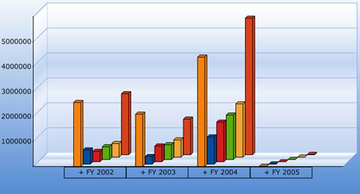

::: {style="DISPLAY: none"}
{#d2h_url_template}{#d2h_package_url style="WIDTH: 0px; DISPLAY: none; HEIGHT: 0px"}
:::

::::: {#nsbanner .d2h_main_nsbanner style="BORDER-BOTTOM: #999999 1px solid; POSITION: relative; PADDING-BOTTOM: 0px; BACKGROUND-COLOR: transparent; PADDING-LEFT: 0px; PADDING-RIGHT: 0px; DISPLAY: none; BORDER-TOP: #999999 1px solid; PADDING-TOP: 0px; LEFT: 0px"}
:::: {#TitleRow .d2h_main_titlerow style="PADDING-BOTTOM: 4px; BACKGROUND-COLOR: transparent; PADDING-LEFT: 22px; WIDTH: 100%; PADDING-RIGHT: 10px; DISPLAY: none; PADDING-TOP: 4px"}
::: {#ienav .d2h_main_ienav style="DISPLAY: none"}
{#D2HPrevious .D2HPreviousEnabled}  {#D2HNext .D2HNextEnabled}
:::
::::
:::::

::::: {#nstext .d2h_main_nstext style="PADDING-BOTTOM: 10px; BACKGROUND-COLOR: transparent; PADDING-LEFT: 22px; PADDING-RIGHT: 10px; HEIGHT: 100%; OVERFLOW: auto; PADDING-TOP: 5px" hasuserbackground="true" valign="bottom"}
::: {#d2h_breadcrumbs .d2h_breadcrumbs}
[Essential Studio User Guide Documentation](ms-xhelp:///?Id=12457748-09e3-4d74-a240-8e049cedf030){.d2h_breadcrumbsNormal}[ \> ]{.d2h_breadcrumbsLinkSeparator}[Business Intelligence Edition](ms-xhelp:///?Id=fdf33dd8-62b2-47b9-ad7b-fc50e590bca5){.d2h_breadcrumbsNormal}[ \> ]{.d2h_breadcrumbsLinkSeparator}[Essential BI ASP.NET](ms-xhelp:///?Id=99c6694e-59c3-4c59-abb5-ce9ce9a948bc){.d2h_breadcrumbsNormal}[ \> ]{.d2h_breadcrumbsLinkSeparator}[Essential BI Chart]{.d2h_breadcrumbsContentsOnly}[ \> ]{.d2h_breadcrumbsLinkSeparator}[Concepts and Features](ms-xhelp:///?Id=be4e11fe-e0a1-44d7-aa3a-05cf8b78bdb8){.d2h_breadcrumbsNormal}[ \> ]{.d2h_breadcrumbsLinkSeparator}[Chart Appearance](ms-xhelp:///?Id=6b450f80-063f-4b1a-8de8-c88c1c925ebe){.d2h_breadcrumbsNormal}
:::

### 3D View {#d-view style="tab-stops: 0pt"}

 

The three-dimensional view is set by assigning *True* to Series3D property. The following code snippet gives a complete picture on how to set the 3D view in OlapChart.

 

+----------------------------------------------------------------------------------------------------------------------------------------------------------------------------------------+
| **[\[C#\]]{style="FONT-FAMILY: 'Courier New'"}**[]{style="FONT-FAMILY: 'Courier New'"}                                                                                                 |
|                                                                                                                                                                                        |
| [this]{style="FONT-FAMILY: 'Courier New'; COLOR: blue"}[.olapChart1.]{style="FONT-FAMILY: 'Courier New'"}[Series3D = [true]{style="COLOR: blue"};]{style="FONT-FAMILY: 'Courier New'"} |
+----------------------------------------------------------------------------------------------------------------------------------------------------------------------------------------+

 

+----------------------------------------------------------------------------------------------------------------------------------------------------------------------------------------+
| **[\[VB\]]{style="FONT-FAMILY: 'Courier New'"}**[]{style="FONT-FAMILY: 'Courier New'"}                                                                                                 |
|                                                                                                                                                                                        |
| [this]{style="FONT-FAMILY: 'Courier New'; COLOR: blue"}[.olapChart1.]{style="FONT-FAMILY: 'Courier New'"}[Series3D = [true]{style="COLOR: blue"};]{style="FONT-FAMILY: 'Courier New'"} |
+----------------------------------------------------------------------------------------------------------------------------------------------------------------------------------------+

 

{border="0"}

 

Figure 43: 3D View

[]{#_Spacing_and_Text} 

Table 22: Series3D Property

 

::: {align="center"}
+----------------------------------+------------------------------------------------------------------------------------+-------------------------------------+---------------------------------+---------------------------+
| Property                         | Descriptions                                                                       | Type                                | Data                            | Reference Link            |
|                                  |                                                                                    |                                     |                                 |                           |
|                                  |                                                                                    |                                     | type                            |                           |
+----------------------------------+------------------------------------------------------------------------------------+-------------------------------------+---------------------------------+---------------------------+
| Series3D[]{style="COLOR: black"} | [Enables/Disables the three dimensional appreance of chart.]{style="COLOR: black"} | [Server side]{style="COLOR: black"} | [boolean]{style="COLOR: black"} | [-]{style="COLOR: black"} |
+----------------------------------+------------------------------------------------------------------------------------+-------------------------------------+---------------------------------+---------------------------+
:::

 

Sample Link

A sample demo is available at the following location:

 

..\\Syncfusion\\EssentialStudio\\\<Version Number\>\\BI\\Web\\OlapChart.Web\\Samples\\3.5\\Chart Types\\Column Chart\\

[]{#related-topics}
:::::
