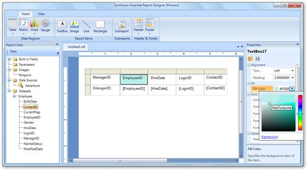

::: {style="DISPLAY: none"}
{#d2h_url_template}{#d2h_package_url style="WIDTH: 0px; DISPLAY: none; HEIGHT: 0px"}
:::

::::: {#nsbanner .d2h_main_nsbanner style="BORDER-BOTTOM: #999999 1px solid; POSITION: relative; PADDING-BOTTOM: 0px; BACKGROUND-COLOR: transparent; PADDING-LEFT: 0px; PADDING-RIGHT: 0px; DISPLAY: none; BORDER-TOP: #999999 1px solid; PADDING-TOP: 0px; LEFT: 0px"}
:::: {#TitleRow .d2h_main_titlerow style="PADDING-BOTTOM: 4px; BACKGROUND-COLOR: transparent; PADDING-LEFT: 22px; WIDTH: 100%; PADDING-RIGHT: 10px; DISPLAY: none; PADDING-TOP: 4px"}
::: {#ienav .d2h_main_ienav style="DISPLAY: none"}
{#D2HPrevious .D2HPreviousEnabled}  {#D2HNext .D2HNextEnabled}
:::
::::
:::::

::: {#nstext .d2h_main_nstext style="PADDING-BOTTOM: 10px; BACKGROUND-COLOR: transparent; PADDING-LEFT: 22px; PADDING-RIGHT: 10px; HEIGHT: 100%; OVERFLOW: auto; PADDING-TOP: 5px" hasuserbackground="true" valign="bottom"}
### 4.3.1 Applying Styles to the Table []{style="FONT-FAMILY: 'Cambria','serif'"}

You can apply styles to cells of the table using the **Properties** grid or **Properties** dialog. To change the background color of a cell, select a color that you want to apply from the **Fill Color** drop-down combo box.

 

{border="0"}

Figure 27: Set Fill Color

 

[]{#related-topics}
:::
