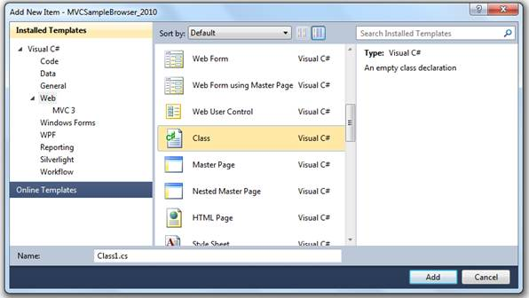

::: {style="DISPLAY: none"}
{#d2h_url_template}{#d2h_package_url style="WIDTH: 0px; DISPLAY: none; HEIGHT: 0px"}
:::

::::: {#nsbanner .d2h_main_nsbanner style="BORDER-BOTTOM: #999999 1px solid; POSITION: relative; PADDING-BOTTOM: 0px; BACKGROUND-COLOR: transparent; PADDING-LEFT: 0px; PADDING-RIGHT: 0px; DISPLAY: none; BORDER-TOP: #999999 1px solid; PADDING-TOP: 0px; LEFT: 0px"}
:::: {#TitleRow .d2h_main_titlerow style="PADDING-BOTTOM: 4px; BACKGROUND-COLOR: transparent; PADDING-LEFT: 22px; WIDTH: 100%; PADDING-RIGHT: 10px; DISPLAY: none; PADDING-TOP: 4px"}
::: {#ienav .d2h_main_ienav style="DISPLAY: none"}
{#D2HPrevious .D2HPreviousEnabled}  {#D2HNext .D2HNextEnabled}
:::
::::
:::::

:::: {#nstext .d2h_main_nstext style="PADDING-BOTTOM: 10px; BACKGROUND-COLOR: transparent; PADDING-LEFT: 22px; PADDING-RIGHT: 10px; HEIGHT: 100%; OVERFLOW: auto; PADDING-TOP: 5px" hasuserbackground="true" valign="bottom"}
::: {#d2h_breadcrumbs .d2h_breadcrumbs}
[Essential Studio User Guide Documentation](ms-xhelp:///?Id=12457748-09e3-4d74-a240-8e049cedf030){.d2h_breadcrumbsNormal}[ \> ]{.d2h_breadcrumbsLinkSeparator}[User Interface Edition](ms-xhelp:///?Id=c29296b7-531c-413b-a0ec-488ca1f7f669){.d2h_breadcrumbsNormal}[ \> ]{.d2h_breadcrumbsLinkSeparator}[Essential ASP.NET MVC](ms-xhelp:///?Id=4b14e7d1-65c4-4f67-b1aa-2c37709905a5){.d2h_breadcrumbsNormal}[ \> ]{.d2h_breadcrumbsLinkSeparator}[Essential Diagram]{.d2h_breadcrumbsContentsOnly}[ \> ]{.d2h_breadcrumbsLinkSeparator}[How do I](ms-xhelp:///?Id=d217e351-1033-4004-81d7-d400a51e195d){.d2h_breadcrumbsNormal}
:::

## 5.3 Creating the Generic Collection Model {#creating-the-generic-collection-model style="MARGIN-LEFT: 28.8pt"}

1.  [Right-click the **Models** folder in the **Solution Explorer** window and select the menu option **Add New Item**.]{style="FONT-FAMILY: 'Arial','sans-serif'"}

2.  [In the **Add New Item** window, select the **Web** category.]{style="FONT-FAMILY: 'Arial','sans-serif'"}

{border="0"}

Figure 157: Add New Item

3.  [Select the **Class** file and give the class file name **Company.cs.** Click the **Add** button.]{style="FONT-FAMILY: 'Arial','sans-serif'"}

4.  [Create a company class containing **Dept Id**, **Dept Name**, **Head Dept**, and **Shape** as properties.]{style="FONT-FAMILY: 'Arial','sans-serif'"}

+----------------------------------------------------------------------------------------------------------------------------------------------------------------------------------------------------------------------------------+
| [    [public]{style="COLOR: blue"} [class]{style="COLOR: blue"} [Company]{style="COLOR: #2b91af"}]{style="FONT-FAMILY: 'Courier New'; FONT-SIZE: 11pt"}                                                                          |
|                                                                                                                                                                                                                                  |
| [    {]{style="FONT-FAMILY: 'Courier New'; FONT-SIZE: 11pt"}                                                                                                                                                                     |
|                                                                                                                                                                                                                                  |
| [        [///]{style="COLOR: gray"}[ ]{style="COLOR: green"}[\<summary\>]{style="COLOR: gray"}]{style="FONT-FAMILY: 'Courier New'; FONT-SIZE: 11pt"}                                                                             |
|                                                                                                                                                                                                                                  |
| [        [///]{style="COLOR: gray"}[ Gets or sets the dept id.]{style="COLOR: green"}]{style="FONT-FAMILY: 'Courier New'; FONT-SIZE: 11pt"}                                                                                      |
|                                                                                                                                                                                                                                  |
| [        [///]{style="COLOR: gray"}[ ]{style="COLOR: green"}[\</summary\>]{style="COLOR: gray"}]{style="FONT-FAMILY: 'Courier New'; FONT-SIZE: 11pt"}                                                                            |
|                                                                                                                                                                                                                                  |
| [        [///]{style="COLOR: gray"}[ ]{style="COLOR: green"}[\<value\>]{style="COLOR: gray"}[The dept id.]{style="COLOR: green"}[\</value\>]{style="COLOR: gray"}]{style="FONT-FAMILY: 'Courier New'; FONT-SIZE: 11pt"}          |
|                                                                                                                                                                                                                                  |
| [        [public]{style="COLOR: blue"} [string]{style="COLOR: blue"} DeptId { [get]{style="COLOR: blue"}; [set]{style="COLOR: blue"}; }]{style="FONT-FAMILY: 'Courier New'; FONT-SIZE: 11pt"}                                    |
|                                                                                                                                                                                                                                  |
| [        [///]{style="COLOR: gray"}[ ]{style="COLOR: green"}[\<summary\>]{style="COLOR: gray"}]{style="FONT-FAMILY: 'Courier New'; FONT-SIZE: 11pt"}                                                                             |
|                                                                                                                                                                                                                                  |
| [        [///]{style="COLOR: gray"}[ Gets or sets the name of the dept.]{style="COLOR: green"}]{style="FONT-FAMILY: 'Courier New'; FONT-SIZE: 11pt"}                                                                             |
|                                                                                                                                                                                                                                  |
| [        [///]{style="COLOR: gray"}[ ]{style="COLOR: green"}[\</summary\>]{style="COLOR: gray"}]{style="FONT-FAMILY: 'Courier New'; FONT-SIZE: 11pt"}                                                                            |
|                                                                                                                                                                                                                                  |
| [        [///]{style="COLOR: gray"}[ ]{style="COLOR: green"}[\<value\>]{style="COLOR: gray"}[The name of the dept.]{style="COLOR: green"}[\</value\>]{style="COLOR: gray"}]{style="FONT-FAMILY: 'Courier New'; FONT-SIZE: 11pt"} |
|                                                                                                                                                                                                                                  |
| [        [public]{style="COLOR: blue"} [string]{style="COLOR: blue"} DeptName { [get]{style="COLOR: blue"}; [set]{style="COLOR: blue"}; }]{style="FONT-FAMILY: 'Courier New'; FONT-SIZE: 11pt"}                                  |
|                                                                                                                                                                                                                                  |
| [        [///]{style="COLOR: gray"}[ ]{style="COLOR: green"}[\<summary\>]{style="COLOR: gray"}]{style="FONT-FAMILY: 'Courier New'; FONT-SIZE: 11pt"}                                                                             |
|                                                                                                                                                                                                                                  |
| [        [///]{style="COLOR: gray"}[ Gets or sets the head dept.]{style="COLOR: green"}]{style="FONT-FAMILY: 'Courier New'; FONT-SIZE: 11pt"}                                                                                    |
|                                                                                                                                                                                                                                  |
| [        [///]{style="COLOR: gray"}[ ]{style="COLOR: green"}[\</summary\>]{style="COLOR: gray"}]{style="FONT-FAMILY: 'Courier New'; FONT-SIZE: 11pt"}                                                                            |
|                                                                                                                                                                                                                                  |
| [        [///]{style="COLOR: gray"}[ ]{style="COLOR: green"}[\<value\>]{style="COLOR: gray"}[The head dept.]{style="COLOR: green"}[\</value\>]{style="COLOR: gray"}]{style="FONT-FAMILY: 'Courier New'; FONT-SIZE: 11pt"}        |
|                                                                                                                                                                                                                                  |
| [        [public]{style="COLOR: blue"} [string]{style="COLOR: blue"} HeadDept { [get]{style="COLOR: blue"}; [set]{style="COLOR: blue"}; }]{style="FONT-FAMILY: 'Courier New'; FONT-SIZE: 11pt"}                                  |
|                                                                                                                                                                                                                                  |
| [        [///]{style="COLOR: gray"}[ ]{style="COLOR: green"}[\<summary\>]{style="COLOR: gray"}]{style="FONT-FAMILY: 'Courier New'; FONT-SIZE: 11pt"}                                                                             |
|                                                                                                                                                                                                                                  |
| [        [///]{style="COLOR: gray"}[ Gets or sets the shape.]{style="COLOR: green"}]{style="FONT-FAMILY: 'Courier New'; FONT-SIZE: 11pt"}                                                                                        |
|                                                                                                                                                                                                                                  |
| [        [///]{style="COLOR: gray"}[ ]{style="COLOR: green"}[\</summary\>]{style="COLOR: gray"}]{style="FONT-FAMILY: 'Courier New'; FONT-SIZE: 11pt"}                                                                            |
|                                                                                                                                                                                                                                  |
| [        [///]{style="COLOR: gray"}[ ]{style="COLOR: green"}[\<value\>]{style="COLOR: gray"}[The shape.]{style="COLOR: green"}[\</value\>]{style="COLOR: gray"}]{style="FONT-FAMILY: 'Courier New'; FONT-SIZE: 11pt"}            |
|                                                                                                                                                                                                                                  |
| [        [public]{style="COLOR: blue"} [Shapes]{style="COLOR: #2b91af"} Shape { [get]{style="COLOR: blue"}; [set]{style="COLOR: blue"}; }]{style="FONT-FAMILY: 'Courier New'; FONT-SIZE: 11pt"}                                  |
|                                                                                                                                                                                                                                  |
| [        [///]{style="COLOR: gray"}[ ]{style="COLOR: green"}[\<summary\>]{style="COLOR: gray"}]{style="FONT-FAMILY: 'Courier New'; FONT-SIZE: 11pt"}                                                                             |
|                                                                                                                                                                                                                                  |
| [        [///]{style="COLOR: gray"}[ Gets or sets the width.]{style="COLOR: green"}]{style="FONT-FAMILY: 'Courier New'; FONT-SIZE: 11pt"}                                                                                        |
|                                                                                                                                                                                                                                  |
| [        [///]{style="COLOR: gray"}[ ]{style="COLOR: green"}[\</summary\>]{style="COLOR: gray"}]{style="FONT-FAMILY: 'Courier New'; FONT-SIZE: 11pt"}                                                                            |
|                                                                                                                                                                                                                                  |
| [        [///]{style="COLOR: gray"}[ ]{style="COLOR: green"}[\<value\>]{style="COLOR: gray"}[The width.]{style="COLOR: green"}[\</value\>]{style="COLOR: gray"}]{style="FONT-FAMILY: 'Courier New'; FONT-SIZE: 11pt"}            |
|                                                                                                                                                                                                                                  |
| [        [public]{style="COLOR: blue"} [int]{style="COLOR: blue"} Width { [get]{style="COLOR: blue"}; [set]{style="COLOR: blue"}; }]{style="FONT-FAMILY: 'Courier New'; FONT-SIZE: 11pt"}                                        |
|                                                                                                                                                                                                                                  |
| [        [///]{style="COLOR: gray"}[ ]{style="COLOR: green"}[\<summary\>]{style="COLOR: gray"}]{style="FONT-FAMILY: 'Courier New'; FONT-SIZE: 11pt"}                                                                             |
|                                                                                                                                                                                                                                  |
| [        [///]{style="COLOR: gray"}[ Gets or sets the height.]{style="COLOR: green"}]{style="FONT-FAMILY: 'Courier New'; FONT-SIZE: 11pt"}                                                                                       |
|                                                                                                                                                                                                                                  |
| [        [///]{style="COLOR: gray"}[ ]{style="COLOR: green"}[\</summary\>]{style="COLOR: gray"}]{style="FONT-FAMILY: 'Courier New'; FONT-SIZE: 11pt"}                                                                            |
|                                                                                                                                                                                                                                  |
| [        [///]{style="COLOR: gray"}[ ]{style="COLOR: green"}[\<value\>]{style="COLOR: gray"}[The height.]{style="COLOR: green"}[\</value\>]{style="COLOR: gray"}]{style="FONT-FAMILY: 'Courier New'; FONT-SIZE: 11pt"}           |
|                                                                                                                                                                                                                                  |
| [        [public]{style="COLOR: blue"} [int]{style="COLOR: blue"} Height { [get]{style="COLOR: blue"}; [set]{style="COLOR: blue"}; }]{style="FONT-FAMILY: 'Courier New'; FONT-SIZE: 11pt"}                                       |
|                                                                                                                                                                                                                                  |
| [    }]{style="FONT-FAMILY: 'Courier New'; FONT-SIZE: 11pt"}                                                                                                                                                                     |
|                                                                                                                                                                                                                                  |
| []{style="FONT-FAMILY: 'Courier New'; FONT-SIZE: 11pt"}                                                                                                                                                                          |
+----------------------------------------------------------------------------------------------------------------------------------------------------------------------------------------------------------------------------------+

 

5.  [Create another **DataContext** class to generate the company list as shown below.]{style="FONT-FAMILY: 'Arial','sans-serif'"}

+-----------------------------------------------------------------------------------------------------------------------------------------------------------------------------------------------------------------------------------------------------------------------------------------------------------------------------------------------------------------------------------------------+
| [    [public]{style="COLOR: blue"} [class]{style="COLOR: blue"} [CompanyDataContext]{style="COLOR: #2b91af"}]{style="FONT-FAMILY: 'Courier New'"}                                                                                                                                                                                                                                             |
|                                                                                                                                                                                                                                                                                                                                                                                               |
| [    {]{style="FONT-FAMILY: 'Courier New'"}                                                                                                                                                                                                                                                                                                                                                   |
|                                                                                                                                                                                                                                                                                                                                                                                               |
| [        [///]{style="COLOR: gray"}[ ]{style="COLOR: green"}[\<summary\>]{style="COLOR: gray"}]{style="FONT-FAMILY: 'Courier New'"}                                                                                                                                                                                                                                                           |
|                                                                                                                                                                                                                                                                                                                                                                                               |
| [        [///]{style="COLOR: gray"}[ Gets the company.]{style="COLOR: green"}]{style="FONT-FAMILY: 'Courier New'"}                                                                                                                                                                                                                                                                            |
|                                                                                                                                                                                                                                                                                                                                                                                               |
| [        [///]{style="COLOR: gray"}[ ]{style="COLOR: green"}[\</summary\>]{style="COLOR: gray"}]{style="FONT-FAMILY: 'Courier New'"}                                                                                                                                                                                                                                                          |
|                                                                                                                                                                                                                                                                                                                                                                                               |
| [        [///]{style="COLOR: gray"}[ ]{style="COLOR: green"}[\<value\>]{style="COLOR: gray"}[The company.]{style="COLOR: green"}[\</value\>]{style="COLOR: gray"}]{style="FONT-FAMILY: 'Courier New'"}                                                                                                                                                                                        |
|                                                                                                                                                                                                                                                                                                                                                                                               |
| [        [public]{style="COLOR: blue"} [List]{style="COLOR: #2b91af"}\<[Company]{style="COLOR: #2b91af"}\> Company]{style="FONT-FAMILY: 'Courier New'"}                                                                                                                                                                                                                                       |
|                                                                                                                                                                                                                                                                                                                                                                                               |
| [        {]{style="FONT-FAMILY: 'Courier New'"}                                                                                                                                                                                                                                                                                                                                               |
|                                                                                                                                                                                                                                                                                                                                                                                               |
| [            [get]{style="COLOR: blue"}]{style="FONT-FAMILY: 'Courier New'"}                                                                                                                                                                                                                                                                                                                  |
|                                                                                                                                                                                                                                                                                                                                                                                               |
| [            {]{style="FONT-FAMILY: 'Courier New'"}                                                                                                                                                                                                                                                                                                                                           |
|                                                                                                                                                                                                                                                                                                                                                                                               |
| [                [List]{style="COLOR: #2b91af"}\<[Company]{style="COLOR: #2b91af"}\> company = [new]{style="COLOR: blue"} [List]{style="COLOR: #2b91af"}\<[Company]{style="COLOR: #2b91af"}\>();]{style="FONT-FAMILY: 'Courier New'"}                                                                                                                                                         |
|                                                                                                                                                                                                                                                                                                                                                                                               |
| [                company.Add([new]{style="COLOR: blue"} [Company]{style="COLOR: #2b91af"}() { DeptId = [\"Client\"]{style="COLOR: #a31515"}, DeptName = [\"Client\"]{style="COLOR: #a31515"}, HeadDept = [\"0\"]{style="COLOR: #a31515"}, Height = 50, Width = 150, Shape = [Shapes]{style="COLOR: #2b91af"}.RoundedRectangle });]{style="FONT-FAMILY: 'Courier New'"}                        |
|                                                                                                                                                                                                                                                                                                                                                                                               |
| []{style="FONT-FAMILY: 'Courier New'"}                                                                                                                                                                                                                                                                                                                                                        |
|                                                                                                                                                                                                                                                                                                                                                                                               |
| [                company.Add([new]{style="COLOR: blue"} [Company]{style="COLOR: #2b91af"}() { DeptId = [\"Company\"]{style="COLOR: #a31515"}, DeptName = [\"Company\"]{style="COLOR: #a31515"}, HeadDept = [\"Client\"]{style="COLOR: #a31515"}, Height = 50, Width = 150, Shape = [Shapes]{style="COLOR: #2b91af"}.RoundedRectangle });]{style="FONT-FAMILY: 'Courier New'"}                 |
|                                                                                                                                                                                                                                                                                                                                                                                               |
| []{style="FONT-FAMILY: 'Courier New'"}                                                                                                                                                                                                                                                                                                                                                        |
|                                                                                                                                                                                                                                                                                                                                                                                               |
| [                company.Add([new]{style="COLOR: blue"} [Company]{style="COLOR: #2b91af"}() { DeptId = [\"Plant\"]{style="COLOR: #a31515"}, DeptName = [\"Plant\"]{style="COLOR: #a31515"}, HeadDept = [\"Company\"]{style="COLOR: #a31515"}, Height = 50, Width = 150, Shape = [Shapes]{style="COLOR: #2b91af"}.RoundedRectangle });]{style="FONT-FAMILY: 'Courier New'"}                    |
|                                                                                                                                                                                                                                                                                                                                                                                               |
| []{style="FONT-FAMILY: 'Courier New'"}                                                                                                                                                                                                                                                                                                                                                        |
|                                                                                                                                                                                                                                                                                                                                                                                               |
| [                company.Add([new]{style="COLOR: blue"} [Company]{style="COLOR: #2b91af"}() { DeptId = [\"Sales\"]{style="COLOR: #a31515"}, DeptName = [\"Sales Organisation\"]{style="COLOR: #a31515"}, HeadDept = [\"Company\"]{style="COLOR: #a31515"}, Height = 50, Width = 150, Shape = [Shapes]{style="COLOR: #2b91af"}.RoundedRectangle });]{style="FONT-FAMILY: 'Courier New'"}       |
|                                                                                                                                                                                                                                                                                                                                                                                               |
| []{style="FONT-FAMILY: 'Courier New'"}                                                                                                                                                                                                                                                                                                                                                        |
|                                                                                                                                                                                                                                                                                                                                                                                               |
| [                company.Add([new]{style="COLOR: blue"} [Company]{style="COLOR: #2b91af"}() { DeptId = [\"Purchase\"]{style="COLOR: #a31515"}, DeptName = [\"Purchase Organisation\"]{style="COLOR: #a31515"}, HeadDept = [\"Company\"]{style="COLOR: #a31515"}, Height = 50, Width = 150, Shape = [Shapes]{style="COLOR: #2b91af"}.RoundedRectangle });]{style="FONT-FAMILY: 'Courier New'"} |
|                                                                                                                                                                                                                                                                                                                                                                                               |
| []{style="FONT-FAMILY: 'Courier New'"}                                                                                                                                                                                                                                                                                                                                                        |
|                                                                                                                                                                                                                                                                                                                                                                                               |
| [                company.Add([new]{style="COLOR: blue"} [Company]{style="COLOR: #2b91af"}() { DeptId = [\"Shipping\"]{style="COLOR: #a31515"}, DeptName = [\"Shipping Point\"]{style="COLOR: #a31515"}, HeadDept = [\"Plant\"]{style="COLOR: #a31515"}, Height = 50, Width = 150, Shape = [Shapes]{style="COLOR: #2b91af"}.RoundedRectangle });]{style="FONT-FAMILY: 'Courier New'"}          |
|                                                                                                                                                                                                                                                                                                                                                                                               |
| []{style="FONT-FAMILY: 'Courier New'"}                                                                                                                                                                                                                                                                                                                                                        |
|                                                                                                                                                                                                                                                                                                                                                                                               |
| [                company.Add([new]{style="COLOR: blue"} [Company]{style="COLOR: #2b91af"}() { DeptId = [\"WholeSale\"]{style="COLOR: #a31515"}, DeptName = [\"WholeSale Distribution\"]{style="COLOR: #a31515"}, HeadDept = [\"Sales\"]{style="COLOR: #a31515"}, Height = 50, Width = 150, Shape = [Shapes]{style="COLOR: #2b91af"}.RoundedRectangle });]{style="FONT-FAMILY: 'Courier New'"} |
|                                                                                                                                                                                                                                                                                                                                                                                               |
| []{style="FONT-FAMILY: 'Courier New'"}                                                                                                                                                                                                                                                                                                                                                        |
|                                                                                                                                                                                                                                                                                                                                                                                               |
| [                company.Add([new]{style="COLOR: blue"} [Company]{style="COLOR: #2b91af"}() { DeptId = [\"Internet\"]{style="COLOR: #a31515"}, DeptName = [\"Internet Distribution\"]{style="COLOR: #a31515"}, HeadDept = [\"Sales\"]{style="COLOR: #a31515"}, Height = 50, Width = 150, Shape = [Shapes]{style="COLOR: #2b91af"}.RoundedRectangle });]{style="FONT-FAMILY: 'Courier New'"}   |
|                                                                                                                                                                                                                                                                                                                                                                                               |
| []{style="FONT-FAMILY: 'Courier New'"}                                                                                                                                                                                                                                                                                                                                                        |
|                                                                                                                                                                                                                                                                                                                                                                                               |
| [                company.Add([new]{style="COLOR: blue"} [Company]{style="COLOR: #2b91af"}() { DeptId = [\"Division1\"]{style="COLOR: #a31515"}, DeptName = [\"Division\"]{style="COLOR: #a31515"}, HeadDept = [\"WholeSale\"]{style="COLOR: #a31515"}, Height = 50, Width = 150, Shape = [Shapes]{style="COLOR: #2b91af"}.RoundedRectangle });]{style="FONT-FAMILY: 'Courier New'"}           |
|                                                                                                                                                                                                                                                                                                                                                                                               |
| []{style="FONT-FAMILY: 'Courier New'"}                                                                                                                                                                                                                                                                                                                                                        |
|                                                                                                                                                                                                                                                                                                                                                                                               |
| [                company.Add([new]{style="COLOR: blue"} [Company]{style="COLOR: #2b91af"}() { DeptId = [\"Division2\"]{style="COLOR: #a31515"}, DeptName = [\"Division\"]{style="COLOR: #a31515"}, HeadDept = [\"WholeSale\"]{style="COLOR: #a31515"}, Height = 50, Width = 150, Shape = [Shapes]{style="COLOR: #2b91af"}.RoundedRectangle });]{style="FONT-FAMILY: 'Courier New'"}           |
|                                                                                                                                                                                                                                                                                                                                                                                               |
| []{style="FONT-FAMILY: 'Courier New'"}                                                                                                                                                                                                                                                                                                                                                        |
|                                                                                                                                                                                                                                                                                                                                                                                               |
| [                company.Add([new]{style="COLOR: blue"} [Company]{style="COLOR: #2b91af"}() { DeptId = [\"Division3\"]{style="COLOR: #a31515"}, DeptName = [\"Division\"]{style="COLOR: #a31515"}, HeadDept = [\"Internet\"]{style="COLOR: #a31515"}, Height = 50, Width = 150, Shape = [Shapes]{style="COLOR: #2b91af"}.RoundedRectangle });]{style="FONT-FAMILY: 'Courier New'"}            |
|                                                                                                                                                                                                                                                                                                                                                                                               |
| []{style="FONT-FAMILY: 'Courier New'"}                                                                                                                                                                                                                                                                                                                                                        |
|                                                                                                                                                                                                                                                                                                                                                                                               |
| [                company.Add([new]{style="COLOR: blue"} [Company]{style="COLOR: #2b91af"}() { DeptId = [\"Division4\"]{style="COLOR: #a31515"}, DeptName = [\"Division\"]{style="COLOR: #a31515"}, HeadDept = [\"Internet\"]{style="COLOR: #a31515"}, Height = 50, Width = 150, Shape = [Shapes]{style="COLOR: #2b91af"}.RoundedRectangle });]{style="FONT-FAMILY: 'Courier New'"}            |
|                                                                                                                                                                                                                                                                                                                                                                                               |
| [                [return]{style="COLOR: blue"} company;]{style="FONT-FAMILY: 'Courier New'"}                                                                                                                                                                                                                                                                                                  |
|                                                                                                                                                                                                                                                                                                                                                                                               |
| [            }]{style="FONT-FAMILY: 'Courier New'"}                                                                                                                                                                                                                                                                                                                                           |
|                                                                                                                                                                                                                                                                                                                                                                                               |
| [        }]{style="FONT-FAMILY: 'Courier New'"}                                                                                                                                                                                                                                                                                                                                               |
|                                                                                                                                                                                                                                                                                                                                                                                               |
| [    }]{style="FONT-FAMILY: 'Courier New'"}                                                                                                                                                                                                                                                                                                                                                   |
+-----------------------------------------------------------------------------------------------------------------------------------------------------------------------------------------------------------------------------------------------------------------------------------------------------------------------------------------------------------------------------------------------+

 

 

[]{#related-topics}
::::
