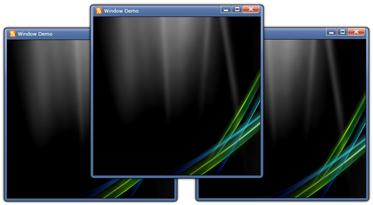

::: {style="DISPLAY: none"}
{#d2h_url_template}{#d2h_package_url style="WIDTH: 0px; DISPLAY: none; HEIGHT: 0px"}
:::

::: {.d2h_secondary_topic style="PADDING-BOTTOM: 10pt; MARGIN: 0pt; PADDING-LEFT: 0pt; PADDING-RIGHT: 0pt; PADDING-TOP: 0pt"}
##### []{#_Activate_Window_Control}Activate Window Control

The Window Control can be activated using the property *BringToFront()*. This method brings the WindowControl to front if there is more than one Window Control.

+--------------------------------------------------------------------------------------------------------------------------------------------------------------------------------------------------------------------+
| C#                                                                                                                                                                                                                 |
+--------------------------------------------------------------------------------------------------------------------------------------------------------------------------------------------------------------------+
| [WindowControl]{style="FONT-FAMILY: Consolas; COLOR: #2b91af; FONT-SIZE: 9.5pt"}[ window = [new]{style="COLOR: blue"} [WindowControl]{style="COLOR: #2b91af"}();]{style="FONT-FAMILY: Consolas; FONT-SIZE: 9.5pt"} |
|                                                                                                                                                                                                                    |
| [window.BringToFront();]{style="FONT-FAMILY: Consolas; FONT-SIZE: 9.5pt"}                                                                                                                                          |
+--------------------------------------------------------------------------------------------------------------------------------------------------------------------------------------------------------------------+

 

{border="0"}

Figure 1088: Activated Window Control

[]{#related-topics}
:::
