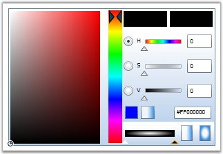

::: {style="DISPLAY: none"}
{#d2h_url_template}{#d2h_package_url style="WIDTH: 0px; DISPLAY: none; HEIGHT: 0px"}
:::

::: {.d2h_secondary_topic style="PADDING-BOTTOM: 10pt; MARGIN: 0pt; PADDING-LEFT: 0pt; PADDING-RIGHT: 0pt; PADDING-TOP: 0pt"}
#### []{#_Adding_BrushEdit_to}Adding BrushEdit to the Application[]{#p160}

 

You have now [created a Silverlight application and deployed Essential Tools]{style="COLOR: windowtext; TEXT-DECORATION: none; text-underline: none"}. Let\'s see how to add BrushEdit control to this application.

 

The BrushEdit control can be added to the Silverlight application by using either XAML or C# code. The following code sample illustrates how to add the BrushEdit control to the application.

 

+-------------------------------------------------------------------------------------------------------------------------------------------------------------------------------------------------------------------------------------------------------------------------------------------------------------------------------------------------------------------------------------------------------------------------------------------------------------------------------------------------------------------------------------------------------------------------------------------------------------+
| **[\[XAML\]]{style="FONT-FAMILY: 'Courier New'; COLOR: black"}**                                                                                                                                                                                                                                                                                                                                                                                                                                                                                                                                            |
|                                                                                                                                                                                                                                                                                                                                                                                                                                                                                                                                                                                                             |
| []{style="FONT-FAMILY: 'Courier New'; COLOR: black"}                                                                                                                                                                                                                                                                                                                                                                                                                                                                                                                                                        |
|                                                                                                                                                                                                                                                                                                                                                                                                                                                                                                                                                                                                             |
| [\<]{style="FONT-FAMILY: 'Courier New'; COLOR: blue"}[syncfusion]{style="FONT-FAMILY: 'Courier New'; COLOR: #a31515"}[:]{style="FONT-FAMILY: 'Courier New'; COLOR: blue"}[BrushEdit]{style="FONT-FAMILY: 'Courier New'; COLOR: #a31515"}[ Height]{style="FONT-FAMILY: 'Courier New'; COLOR: red"}[=\"150\"]{style="FONT-FAMILY: 'Courier New'; COLOR: blue"}[ Width]{style="FONT-FAMILY: 'Courier New'; COLOR: red"}[=\"300\"]{style="FONT-FAMILY: 'Courier New'; COLOR: blue"}[ Name]{style="FONT-FAMILY: 'Courier New'; COLOR: red"}[=\"brushedit\" /\>]{style="FONT-FAMILY: 'Courier New'; COLOR: blue"} |
+-------------------------------------------------------------------------------------------------------------------------------------------------------------------------------------------------------------------------------------------------------------------------------------------------------------------------------------------------------------------------------------------------------------------------------------------------------------------------------------------------------------------------------------------------------------------------------------------------------------+

 

+-------------------------------------------------------------------------------------------------------------------------------------------------------------------------------+
| **[\[C#\]]{style="FONT-FAMILY: 'Courier New'; COLOR: black"}**                                                                                                                |
|                                                                                                                                                                               |
| []{style="FONT-FAMILY: 'Courier New'; COLOR: black"}                                                                                                                          |
|                                                                                                                                                                               |
| [BrushEdit]{style="FONT-FAMILY: 'Courier New'; COLOR: teal"}[ brushedit = [new]{style="COLOR: blue"} [BrushEdit]{style="COLOR: teal"}();]{style="FONT-FAMILY: 'Courier New'"} |
|                                                                                                                                                                               |
| [grid.Children.Add(brushedit);]{style="FONT-FAMILY: 'Courier New'"}                                                                                                           |
+-------------------------------------------------------------------------------------------------------------------------------------------------------------------------------+

 

The preceding code adds the following control to the application.     

     

{border="0"}

 

Figure 347: BrushEdit

 

[]{#related-topics}
:::
