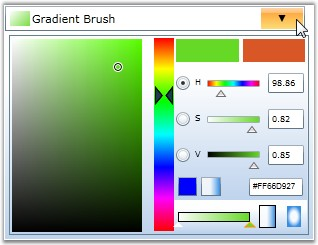

::: {style="DISPLAY: none"}
{#d2h_url_template}{#d2h_package_url style="WIDTH: 0px; DISPLAY: none; HEIGHT: 0px"}
:::

::: {.d2h_secondary_topic style="PADDING-BOTTOM: 10pt; MARGIN: 0pt; PADDING-LEFT: 0pt; PADDING-RIGHT: 0pt; PADDING-TOP: 0pt"}
#### []{#p159}[]{#_Adding_BrushSelector_to}Adding BrushSelector to the Application

 

You have now [created a Silverlight application and deployed Essential Tools]{style="COLOR: windowtext; TEXT-DECORATION: none; text-underline: none"}. Let\'s see how to add BrushSelector control to this application.

 

BrushSelector can be added to the Silverlight application by using either XAML or C# code. The following code sample illustrates how to add the BrushSelector control to the application.

 

+---------------------------------------------------------------------------------------------------------------------------------------------------------------------------------------------------------------------------------------------------------------------------------------------------------------------------------------------------------------------------------------------------------------------------------------------------------------------------------------------------------------------------------------------------------------------------------------------------------------------+
| **[\[XAML\]]{style="FONT-FAMILY: 'Courier New'; COLOR: black"}**                                                                                                                                                                                                                                                                                                                                                                                                                                                                                                                                                    |
|                                                                                                                                                                                                                                                                                                                                                                                                                                                                                                                                                                                                                     |
| []{style="FONT-FAMILY: 'Courier New'; COLOR: black"}                                                                                                                                                                                                                                                                                                                                                                                                                                                                                                                                                                |
|                                                                                                                                                                                                                                                                                                                                                                                                                                                                                                                                                                                                                     |
| [\<]{style="FONT-FAMILY: 'Courier New'; COLOR: blue"}[syncfusion]{style="FONT-FAMILY: 'Courier New'; COLOR: #a31515"}[:]{style="FONT-FAMILY: 'Courier New'; COLOR: blue"}[BrushSelector]{style="FONT-FAMILY: 'Courier New'; COLOR: #a31515"}[ Height]{style="FONT-FAMILY: 'Courier New'; COLOR: red"}[=\"150\"]{style="FONT-FAMILY: 'Courier New'; COLOR: blue"}[ Width]{style="FONT-FAMILY: 'Courier New'; COLOR: red"}[=\"300\"]{style="FONT-FAMILY: 'Courier New'; COLOR: blue"}[ Name]{style="FONT-FAMILY: 'Courier New'; COLOR: red"}[=\"brushselector\" /\>]{style="FONT-FAMILY: 'Courier New'; COLOR: blue"} |
+---------------------------------------------------------------------------------------------------------------------------------------------------------------------------------------------------------------------------------------------------------------------------------------------------------------------------------------------------------------------------------------------------------------------------------------------------------------------------------------------------------------------------------------------------------------------------------------------------------------------+

 

+-------------------------------------------------------------------------------------------------------------------------------------------------------------------------------------------+
| **[\[C#\]]{style="FONT-FAMILY: 'Courier New'; COLOR: black"}**                                                                                                                            |
|                                                                                                                                                                                           |
| []{style="FONT-FAMILY: 'Courier New'; COLOR: black"}                                                                                                                                      |
|                                                                                                                                                                                           |
| [BrushSelector]{style="FONT-FAMILY: 'Courier New'; COLOR: teal"}[ brushselector = [new]{style="COLOR: blue"} [BrushSelector]{style="COLOR: teal"}();]{style="FONT-FAMILY: 'Courier New'"} |
|                                                                                                                                                                                           |
| [grid.Children.Add(brushselector);]{style="FONT-FAMILY: 'Courier New'"}                                                                                                                   |
+-------------------------------------------------------------------------------------------------------------------------------------------------------------------------------------------+

 

The preceding code adds the following control to the application.

 

{border="0"}

 

Figure 346: BrushSelector

[]{#related-topics}
:::
