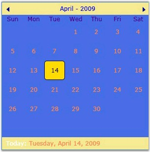

::: {style="DISPLAY: none"}
{#d2h_url_template}{#d2h_package_url style="WIDTH: 0px; DISPLAY: none; HEIGHT: 0px"}
:::

::: {.d2h_secondary_topic style="PADDING-BOTTOM: 10pt; MARGIN: 0pt; PADDING-LEFT: 0pt; PADDING-RIGHT: 0pt; PADDING-TOP: 0pt"}
#### []{#_Adding_Calendar_Control}Adding Calendar Control to the Application[]{#p231}

 

You have now [created a Silverlight application and deployed Essential Tools]{style="COLOR: windowtext; TEXT-DECORATION: none; text-underline: none"}. Let\'s see how to add Calendar control to this application.

 

The following code example illustrates how to add the Calendar control to an application.

 

+-------------------------------------------------------------------------------------------------------------------------------------------------------------------------------------------------------------------------------------------------------------------------------------------------------------------------------------------------------------------------------------------------------------------------------------+
| **[\[XAML\]]{style="FONT-FAMILY: 'Courier New'; COLOR: black"}**                                                                                                                                                                                                                                                                                                                                                                    |
|                                                                                                                                                                                                                                                                                                                                                                                                                                     |
| []{style="FONT-FAMILY: 'Courier New'; COLOR: black"}                                                                                                                                                                                                                                                                                                                                                                                |
|                                                                                                                                                                                                                                                                                                                                                                                                                                     |
| [\<]{style="FONT-FAMILY: 'Courier New'; COLOR: blue"}[Syncfusion]{style="FONT-FAMILY: 'Courier New'; COLOR: maroon"}[:]{style="FONT-FAMILY: 'Courier New'; COLOR: blue"}[CalendarControl]{style="FONT-FAMILY: 'Courier New'; COLOR: maroon"}[ [x]{style="COLOR: maroon"}[:]{style="COLOR: blue"}[Name]{style="COLOR: red"}[="calendarcontrol"]{style="COLOR: blue"} [/\>]{style="COLOR: blue"}]{style="FONT-FAMILY: 'Courier New'"} |
+-------------------------------------------------------------------------------------------------------------------------------------------------------------------------------------------------------------------------------------------------------------------------------------------------------------------------------------------------------------------------------------------------------------------------------------+

 

+-----------------------------------------------------------------------------------------------------------------------+
| **[\[C#\]]{style="FONT-FAMILY: 'Courier New'; COLOR: black"}**                                                        |
|                                                                                                                       |
| []{style="FONT-FAMILY: 'Courier New'"}                                                                                |
|                                                                                                                       |
| [CalendarControl calendarcontrol = [new]{style="COLOR: blue"} CalendarControl();]{style="FONT-FAMILY: 'Courier New'"} |
+-----------------------------------------------------------------------------------------------------------------------+

 

{border="0"}

 

Figure 456 : Calendar Control

 

 

[]{#related-topics}
:::
