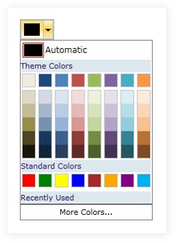

::: {style="DISPLAY: none"}
{#d2h_url_template}{#d2h_package_url style="WIDTH: 0px; DISPLAY: none; HEIGHT: 0px"}
:::

::: {.d2h_secondary_topic style="PADDING-BOTTOM: 10pt; MARGIN: 0pt; PADDING-LEFT: 0pt; PADDING-RIGHT: 0pt; PADDING-TOP: 0pt"}
#### []{#p424}[]{#_Adding_Color_Picker}Adding Color Picker to the Application

 

You have now [[created a Silverlight application and deployed Essential Tools]{style="COLOR: windowtext; TEXT-DECORATION: none; text-underline: none"}](../../../../../../../../Documents%20and%20Settings/riaj/Desktop/styling%20for%20ui%20silverlight/tools%20silverlight/tools%20part%202.docx#_Creating_a_Silverlight). Let\'s see how to add Color Picker control to this application.

 

The following code snippet illustrates how to add the Color Picker control to the application.

 

+------------------------------------------------------------------------------------------------------------------------------------------------------------------------------------------------------------------------------------------------------------------------------------------------------------------------------------------------------------------------------------------------------------------------------------------------------------------------------------------------------------------------------------------------------------------------------------------------------------------------------------------------------------------------------------------------------------------------------------------+
| **[\[XAML\]]{style="FONT-FAMILY: 'Courier New'; COLOR: black"}**                                                                                                                                                                                                                                                                                                                                                                                                                                                                                                                                                                                                                                                                         |
|                                                                                                                                                                                                                                                                                                                                                                                                                                                                                                                                                                                                                                                                                                                                          |
| []{style="FONT-FAMILY: 'Courier New'; COLOR: #a31515"}                                                                                                                                                                                                                                                                                                                                                                                                                                                                                                                                                                                                                                                                                   |
|                                                                                                                                                                                                                                                                                                                                                                                                                                                                                                                                                                                                                                                                                                                                          |
| [\<]{style="FONT-FAMILY: 'Courier New'; COLOR: blue"}[Syncfusion]{style="FONT-FAMILY: 'Courier New'; COLOR: #a31515"}[:]{style="FONT-FAMILY: 'Courier New'; COLOR: blue"}[ColorPickerPalette]{style="FONT-FAMILY: 'Courier New'; COLOR: #a31515"}[ x]{style="FONT-FAMILY: 'Courier New'; COLOR: red"}[:]{style="FONT-FAMILY: 'Courier New'; COLOR: blue"}[Name]{style="FONT-FAMILY: 'Courier New'; COLOR: red"}[=\"ColorPicker\"\>\</]{style="FONT-FAMILY: 'Courier New'; COLOR: blue"}[Syncfusion]{style="FONT-FAMILY: 'Courier New'; COLOR: #a31515"}[:]{style="FONT-FAMILY: 'Courier New'; COLOR: blue"}[ColorPickerPalette]{style="FONT-FAMILY: 'Courier New'; COLOR: #a31515"}[\>]{style="FONT-FAMILY: 'Courier New'; COLOR: blue"} |
+------------------------------------------------------------------------------------------------------------------------------------------------------------------------------------------------------------------------------------------------------------------------------------------------------------------------------------------------------------------------------------------------------------------------------------------------------------------------------------------------------------------------------------------------------------------------------------------------------------------------------------------------------------------------------------------------------------------------------------------+

 

+---------------------------------------------------------------------------------------------------------------------------------------------------------------------------------------------------------+
| **[\[C#\]]{style="FONT-FAMILY: 'Courier New'; COLOR: black"}**                                                                                                                                          |
|                                                                                                                                                                                                         |
| []{style="FONT-FAMILY: 'Courier New'"}                                                                                                                                                                  |
|                                                                                                                                                                                                         |
| [ColorPickerPalette]{style="FONT-FAMILY: 'Courier New'; COLOR: #2b91af"}[ colorPicker = [new]{style="COLOR: blue"} [ColorPickerPalette]{style="COLOR: #2b91af"}();]{style="FONT-FAMILY: 'Courier New'"} |
|                                                                                                                                                                                                         |
| [colorPicker.Name = [\"ColorPicker\"]{style="COLOR: #a31515"};]{style="FONT-FAMILY: 'Courier New'"}                                                                                                     |
+---------------------------------------------------------------------------------------------------------------------------------------------------------------------------------------------------------+

 

{border="0"}

**** 

Figure 958: Color Picker with Theme set to \'Office\' (Default Theme)

[]{#related-topics}
:::
