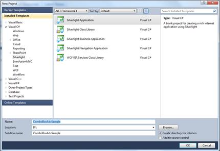
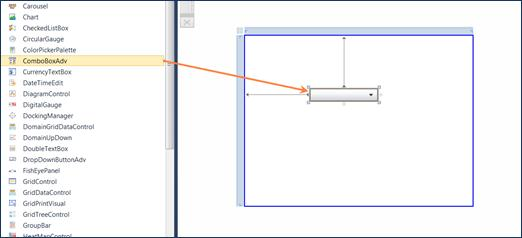
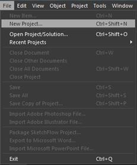
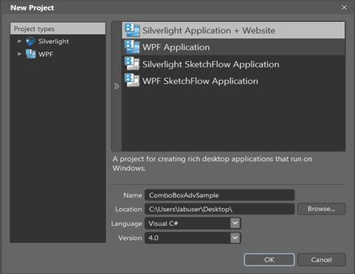
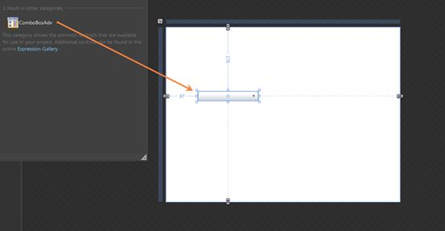

::: {style="DISPLAY: none"}
{#d2h_url_template}{#d2h_package_url style="WIDTH: 0px; DISPLAY: none; HEIGHT: 0px"}
:::

::: {.d2h_secondary_topic style="PADDING-BOTTOM: 10pt; MARGIN: 0pt; PADDING-LEFT: 0pt; PADDING-RIGHT: 0pt; PADDING-TOP: 0pt"}
##### Adding ComboBoxAdv to an Application

The ComboBoxAdv control can be added to an application by using the following applications:

[·      ]{style="FONT-FAMILY: Symbol"}Microsoft Visual Studio

[·      ]{style="FONT-FAMILY: Symbol"}Microsoft Expression Blend

###### Creating the ComboBoxAdv Control in Visual Studio

To create a ComboBoxAdv instance in Visual Studio:

1.   Open Visual Studio.[ ]{style="COLOR: #15428b"}

2.   On the File menu, select New, and then select Project. The New Project dialog box displays.

[]{style="FONT-FAMILY: 'Calibri','sans-serif'"} 

{border="0"}

Figure 1184: File Menu

3.   In the New Project dialog box, select Silverlight Application.

4.   In the Name field, type the name of the project.

5.   Click OK.

[]{style="FONT-FAMILY: 'Calibri','sans-serif'"} 

{border="0"}

Figure 1185: New Project Dialog Box

6.   Drag the **ComboBoxAdv** control from the **Toolbox** window to the **Design View**. An instance of the **ComboBoxAdv** control is created in **Design** view.

[]{style="FONT-FAMILY: 'Calibri','sans-serif'"} 

{border="0"}

Figure 1186: ComboBoxAdv Control after Dragging to Design View

###### Creating the ComboBoxAdv Control in Expression Blend

To create ComboBoxAdv instance in Expression Blend:

1.   Open Expression Blend.

2.   On the File menu, select New Project. The New Project dialog box opens.

[]{style="FONT-FAMILY: 'Arial','sans-serif'"} 

{border="0"}

Figure 1187:  File Menu

3.   In the Project type's pane, select Silverlight, and then select Silverlight Application.

4.   In the Name field, type the name of the project, and then click OK.

[]{style="FONT-FAMILY: 'Calibri','sans-serif'"} 

{border="0"}

Figure 1188: New Project Dialog Box

5.   On the **Window** menu, select **Assets**. The **Assets Library** dialog box opens.

6.   In the **Search** box, type **ComboBoxAdv**. The search results are displayed.

7.   Drag the **ComboBoxAdv** control to **Design** view. An instance of the **ComboBoxAdv** control is created.

[]{style="FONT-FAMILY: 'Calibri','sans-serif'"} 

{border="0"}

Figure 1189: ComboBoxAdv Control in Design View

[]{#related-topics}
:::
