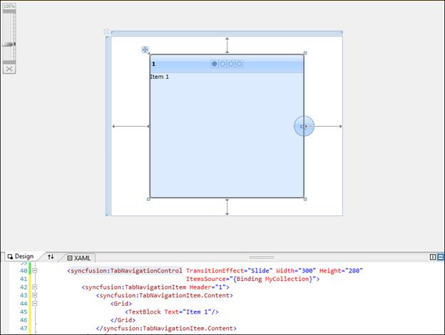

::: {style="DISPLAY: none"}
{#d2h_url_template}{#d2h_package_url style="WIDTH: 0px; DISPLAY: none; HEIGHT: 0px"}
:::

::::: {#nsbanner .d2h_main_nsbanner style="BORDER-BOTTOM: #999999 1px solid; POSITION: relative; PADDING-BOTTOM: 0px; BACKGROUND-COLOR: transparent; PADDING-LEFT: 0px; PADDING-RIGHT: 0px; DISPLAY: none; BORDER-TOP: #999999 1px solid; PADDING-TOP: 0px; LEFT: 0px"}
:::: {#TitleRow .d2h_main_titlerow style="PADDING-BOTTOM: 4px; BACKGROUND-COLOR: transparent; PADDING-LEFT: 22px; WIDTH: 100%; PADDING-RIGHT: 10px; DISPLAY: none; PADDING-TOP: 4px"}
::: {#ienav .d2h_main_ienav style="DISPLAY: none"}
{#D2HPrevious .D2HPreviousEnabled}  {#D2HNext .D2HNextEnabled}
:::
::::
:::::

::: {#nstext .d2h_main_nstext style="PADDING-BOTTOM: 10px; BACKGROUND-COLOR: transparent; PADDING-LEFT: 22px; PADDING-RIGHT: 10px; HEIGHT: 100%; OVERFLOW: auto; PADDING-TOP: 5px" hasuserbackground="true" valign="bottom"}
### Adding Tab Navigation Control to an Application

 

To add Tab Navigation control to a Visual Studio.NET project:

1.   Open a **VS2010** project. The Syncfusion controls are listed in the toolbox.

{border="0"}[]{style="BACKGROUND: yellow"}

Figure 828: Syncfusion Controls

2.   Click and drag the **Tab Navigation** control from the toolbox and drop it in the designer.

{border="0"}[]{style="BACKGROUND: yellow"}

Figure 829: Tab Navigation Control in Designer

 

3.   **Syncfusion.Tools.Silverlight and Syncfusion.Shared.Silverlight** assemblies will be added automatically to the application reference.

{border="0"}[]{style="BACKGROUND: yellow"}

Figure 830: Assemblies added to References

4.   Press **F4** or open the **properties** window to customize the control by setting the required properties.

{border="0"}[]{style="BACKGROUND: yellow"}

Figure 831: Customization using Properties Window

 

5.   Add Items to the control manually or through **Items Source** property.

6.   Press **F5** to run the application.

{border="0"}

Figure 832: The Output

To enable transition effects, items should be added to the control. The following sections explain the methods through which you can add items.

 

[]{#related-topics}
:::
