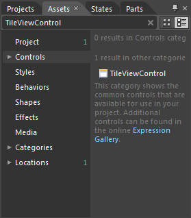
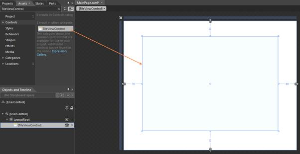
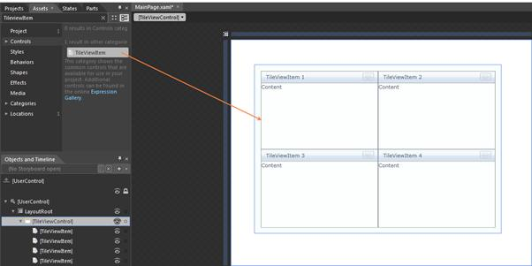

::: {style="DISPLAY: none"}
{#d2h_url_template}{#d2h_package_url style="WIDTH: 0px; DISPLAY: none; HEIGHT: 0px"}
:::

::: {.d2h_secondary_topic style="PADDING-BOTTOM: 10pt; MARGIN: 0pt; PADDING-LEFT: 0pt; PADDING-RIGHT: 0pt; PADDING-TOP: 0pt"}
#### Adding through Blend

The following are the step-by-step procedure for adding the TileViewControl to an application through Microsoft Expression Blend.

 

1.   Create a new Silverlight Application in Microsoft Expression Blend.

2.   Add the following reference to the sample application.

[·      ]{style="FONT-FAMILY: Symbol"}Syncfusion.Shared.Silverlight.dll

3.   On the Window menu, select Assets. This will open the Assets Library dialog box.

4.   In the search box, type "TileViewControl." The search results will then be displayed as shown below.

{border="0"}

Figure 853: Asset window showing the search results

 

5.   Drag-and-drop the TileViewControl to the sample application.

 

{border="0"}

Figure 854: Sample application screen after the TileViewControl is drag and dropped

 

6.   Again in search box, type "TileViewItem" and then the search results will display TileviewItem.

7.   Now drag-and-drop the TileViewItem to the sample application.

{border="0"}

 

Figure 855: Sample application screen after the TileViewItems are drag and dropped

 

[]{#related-topics}
:::
