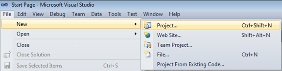

::: {style="DISPLAY: none"}
{#d2h_url_template}{#d2h_package_url style="WIDTH: 0px; DISPLAY: none; HEIGHT: 0px"}
:::

::: {.d2h_secondary_topic style="PADDING-BOTTOM: 10pt; MARGIN: 0pt; PADDING-LEFT: 0pt; PADDING-RIGHT: 0pt; PADDING-TOP: 0pt"}
#### Adding through c#

Follow the below steps to add Carousel control by using Visual Studio:

 

1.   Open Visual Studio. On the File menu, select **New -\> Project**. This opens the New Project Dialog box.

 

{border="0"}

Figure 1128: Open New Project

 

2.   In the Project Dialog window, select **Silverlight Application** and in the Name field type the name of the project, and then click **OK**.

 

3.   Add the following reference with the sample project.

**        Syncfusion.Shared.Silverlight.dll**

 

4.   Click and open the C# file and add the Carousel control to your application.

5.   The below code shows how the Carousel control can be added to an application.

 

+----------------------------------------------------------------------------------------------------------------------------------------------+
| **[\[C#\]]{style="FONT-FAMILY: 'Courier New'"}**                                                                                             |
|                                                                                                                                              |
| [           ]{style="FONT-FAMILY: 'Courier New'"}                                                                                            |
|                                                                                                                                              |
| []{style="FONT-FAMILY: 'Courier New'"}                                                                                                       |
|                                                                                                                                              |
| [Carousel]{style="FONT-FAMILY: 'Courier New'; COLOR: #2b91af"}[ carousel = [new]{style="COLOR: blue"} [Carousel]{style="COLOR: #2b91af"}();\ |
| carousel.Items.Add([new]{style="COLOR: blue"} [CarouselItem]{style="COLOR: #2b91af"}() { Content = [\"1\"]{style="COLOR: #a31515"} });\      |
| carousel.Items.Add([new]{style="COLOR: blue"} [CarouselItem]{style="COLOR: #2b91af"}() { Content = [\"2\"]{style="COLOR: #a31515"} });\      |
| carousel.Items.Add([new]{style="COLOR: blue"} [CarouselItem]{style="COLOR: #2b91af"}() { Content = [\"3\"]{style="COLOR: #a31515"} });\      |
| carousel.Items.Add([new]{style="COLOR: blue"} [CarouselItem]{style="COLOR: #2b91af"}() { Content = [\"4\"]{style="COLOR: #a31515"} });\      |
| carousel.Items.Add([new]{style="COLOR: blue"} [CarouselItem]{style="COLOR: #2b91af"}() { Content = [\"5\"]{style="COLOR: #a31515"} });\      |
| [this]{style="COLOR: blue"}.LayoutRoot.Children.Add(carousel);]{style="FONT-FAMILY: 'Courier New'"}                                          |
|                                                                                                                                              |
| []{style="FONT-FAMILY: 'Courier New'"}                                                                                                       |
+----------------------------------------------------------------------------------------------------------------------------------------------+

 

 

[]{#related-topics}
:::
