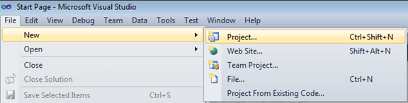
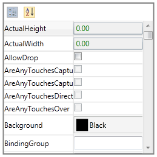

::: {style="DISPLAY: none"}
{#d2h_url_template}{#d2h_package_url style="WIDTH: 0px; DISPLAY: none; HEIGHT: 0px"}
:::

::: {.d2h_secondary_topic style="PADDING-BOTTOM: 10pt; MARGIN: 0pt; PADDING-LEFT: 0pt; PADDING-RIGHT: 0pt; PADDING-TOP: 0pt"}
#### Adding through c#

Following are the steps to add the PropertyGrid control by using VisualStudio in C#.:

 

1.   Open Visual Studio. On the **File** menu, select **New -\> Project**. This opens the New Project Dialog box.

 

{border="0"}

Figure 1146: VisualStudio -Opening the Project

 

 

2.   On the Project Dialog window, select **Silverlight Application**, in the Name field, type the name of the project, and then click **OK**.

 

3.   Add the following reference with the sample project:

**Syncfusion.PropertyGrid.Silverlight.dll**

**Syncfusion.Shared.Silverlight.dll**

**Syncfusion.Tools.Silverlight.dll**

 

4.   Click the C# file and add the PropertyGrid control to your application as follows.

 

+----------------------------------------------------------------------------------------------------------------------------------------------------------------------------------------------+
| **[\[C#\]]{style="FONT-FAMILY: 'Courier New'"}**                                                                                                                                             |
|                                                                                                                                                                                              |
| []{style="FONT-FAMILY: 'Courier New'"}                                                                                                                                                       |
|                                                                                                                                                                                              |
| [            ]{style="FONT-FAMILY: Consolas"}                                                                                                                                                |
|                                                                                                                                                                                              |
| [Syncfusion.Windows.PropertyGrid.[PropertyGrid]{style="COLOR: #2b91af"} propertyGrid = [new]{style="COLOR: blue"} Syncfusion.Windows.PropertyGrid.[PropertyGrid]{style="COLOR: #2b91af"}();\ |
| propertyGrid.Height = 250;\                                                                                                                                                                  |
| propertyGrid.Width = 250;\                                                                                                                                                                   |
| propertyGrid.BorderBrush = [new]{style="COLOR: blue"} [SolidColorBrush]{style="COLOR: #2b91af"}([Colors]{style="COLOR: #2b91af"}.Gray);\                                                     |
| propertyGrid.BorderThickness = [new]{style="COLOR: blue"} [Thickness]{style="COLOR: #2b91af"}(2);\                                                                                           |
| propertyGrid.SelectedObject = [new]{style="COLOR: blue"} [Button]{style="COLOR: #2b91af"}();\                                                                                                |
| LayoutRoot.Children.Add(propertyGrid);]{style="FONT-FAMILY: 'Courier New'"}                                                                                                                  |
|                                                                                                                                                                                              |
| []{style="FONT-FAMILY: 'Courier New'"}                                                                                                                                                       |
+----------------------------------------------------------------------------------------------------------------------------------------------------------------------------------------------+

 

{border="0"}

Figure 1147: PropertyGrid

 

[]{#related-topics}
:::
