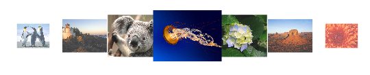

::: {style="DISPLAY: none"}
{#d2h_url_template}{#d2h_package_url style="WIDTH: 0px; DISPLAY: none; HEIGHT: 0px"}
:::

::: {.d2h_secondary_topic style="PADDING-BOTTOM: 10pt; MARGIN: 0pt; PADDING-LEFT: 0pt; PADDING-RIGHT: 0pt; PADDING-TOP: 0pt"}
#### Adding through XAML

Follow the below steps to add Carousel by using Visual Studio in XAML.

 

1.   Create a new application in Visual Studio.

2.   In the Visual Studio Toolbox, click Syncfusion Silverlight Toolbox tab and select Carousel.

3.   Drag and Drop the Carousel to design view, in order to add the Carousel control to your application.

4.   In the Properties window, customize the properties of the Carousel.

The below code shows how Carousel can be added to an application by using Visual Studio in XAML.

 

+------------------------------------------------------------------------------------------------------------------------------------------------------------------------------------------------------------------------------------------------------------------------------------------------------------------------------------------------------------------------------------------------------------------------------------------------------------------------------------+
| **[\[XAML\]]{style="FONT-FAMILY: 'Courier New'"}**                                                                                                                                                                                                                                                                                                                                                                                                                                 |
|                                                                                                                                                                                                                                                                                                                                                                                                                                                                                    |
| [           ]{style="FONT-FAMILY: 'Courier New'"}                                                                                                                                                                                                                                                                                                                                                                                                                                  |
|                                                                                                                                                                                                                                                                                                                                                                                                                                                                                    |
| [\<]{style="FONT-FAMILY: 'Courier New'; COLOR: blue"}[syncfusion]{style="FONT-FAMILY: 'Courier New'; COLOR: #a31515"}[:]{style="FONT-FAMILY: 'Courier New'; COLOR: blue"}[Carousel]{style="FONT-FAMILY: 'Courier New'; COLOR: #a31515"}[ Height]{style="FONT-FAMILY: 'Courier New'; COLOR: red"}[=\"400\"]{style="FONT-FAMILY: 'Courier New'; COLOR: blue"}[ Width]{style="FONT-FAMILY: 'Courier New'; COLOR: red"}[=\"450\"\>]{style="FONT-FAMILY: 'Courier New'; COLOR: blue"}[\ |
| [    ]{style="COLOR: #a31515"}[\<]{style="COLOR: blue"}[syncfusion]{style="COLOR: #a31515"}[:]{style="COLOR: blue"}[Carousel.Path]{style="COLOR: #a31515"}[\>]{style="COLOR: blue"}\                                                                                                                                                                                                                                                                                               |
| [        ]{style="COLOR: #a31515"}[\<]{style="COLOR: blue"}[Path]{style="COLOR: #a31515"}[ Data]{style="COLOR: red"}[=\"M0,300 L600,300\"]{style="COLOR: blue"}[ Stroke]{style="COLOR: red"}[=\"Blue\"]{style="COLOR: blue"}[ StrokeThickness]{style="COLOR: red"}[=\"2\"]{style="COLOR: blue"}[ HorizontalAlignment]{style="COLOR: red"}[=\"Stretch\"]{style="COLOR: blue"}[ VerticalAlignment]{style="COLOR: red"}[=\"Stretch\"/\>]{style="COLOR: blue"}\                        |
| [    ]{style="COLOR: #a31515"}[\</]{style="COLOR: blue"}[syncfusion]{style="COLOR: #a31515"}[:]{style="COLOR: blue"}[Carousel.Path]{style="COLOR: #a31515"}[\>]{style="COLOR: blue"}\                                                                                                                                                                                                                                                                                              |
| [    ]{style="COLOR: #a31515"}[\<]{style="COLOR: blue"}[syncfusion]{style="COLOR: #a31515"}[:]{style="COLOR: blue"}[CarouselItem]{style="COLOR: #a31515"}[\>]{style="COLOR: blue"}\                                                                                                                                                                                                                                                                                                |
| [        ]{style="COLOR: #a31515"}[\<]{style="COLOR: blue"}[syncfusion]{style="COLOR: #a31515"}[:]{style="COLOR: blue"}[CarouselItem.Content]{style="COLOR: #a31515"}[\>]{style="COLOR: blue"}\                                                                                                                                                                                                                                                                                    |
| [                    ]{style="COLOR: #a31515"}\                                                                                                                                                                                                                                                                                                                                                                                                                                    |
| [            ]{style="COLOR: #a31515"}[\<]{style="COLOR: blue"}[Viewbox]{style="COLOR: #a31515"}[ Height]{style="COLOR: red"}[=\"100\"]{style="COLOR: blue"}[ Width]{style="COLOR: red"}[=\"100\"\>]{style="COLOR: blue"}\                                                                                                                                                                                                                                                         |
| [                ]{style="COLOR: #a31515"}[\<]{style="COLOR: blue"}[Image]{style="COLOR: #a31515"}[ Source]{style="COLOR: red"}[=\"/CarouselDemo;component/Images/Chrysanthemum.jpg\"/\>]{style="COLOR: blue"}\                                                                                                                                                                                                                                                                    |
| [            ]{style="COLOR: #a31515"}[\</]{style="COLOR: blue"}[Viewbox]{style="COLOR: #a31515"}[\>]{style="COLOR: blue"}\                                                                                                                                                                                                                                                                                                                                                        |
| [        ]{style="COLOR: #a31515"}[\</]{style="COLOR: blue"}[syncfusion]{style="COLOR: #a31515"}[:]{style="COLOR: blue"}[CarouselItem.Content]{style="COLOR: #a31515"}[\>]{style="COLOR: blue"}\                                                                                                                                                                                                                                                                                   |
| [    ]{style="COLOR: #a31515"}[\</]{style="COLOR: blue"}[syncfusion]{style="COLOR: #a31515"}[:]{style="COLOR: blue"}[CarouselItem]{style="COLOR: #a31515"}[\>]{style="COLOR: blue"}\                                                                                                                                                                                                                                                                                               |
|  \                                                                                                                                                                                                                                                                                                                                                                                                                                                                                 |
| [    ]{style="COLOR: #a31515"}[\<]{style="COLOR: blue"}[syncfusion]{style="COLOR: #a31515"}[:]{style="COLOR: blue"}[CarouselItem]{style="COLOR: #a31515"}[\>]{style="COLOR: blue"}\                                                                                                                                                                                                                                                                                                |
| [        ]{style="COLOR: #a31515"}[\<]{style="COLOR: blue"}[syncfusion]{style="COLOR: #a31515"}[:]{style="COLOR: blue"}[CarouselItem.Content]{style="COLOR: #a31515"}[\>]{style="COLOR: blue"}\                                                                                                                                                                                                                                                                                    |
| [            ]{style="COLOR: #a31515"}[\<]{style="COLOR: blue"}[Viewbox]{style="COLOR: #a31515"}[ Height]{style="COLOR: red"}[=\"100\"]{style="COLOR: blue"}[ Width]{style="COLOR: red"}[=\"100\"\>]{style="COLOR: blue"}\                                                                                                                                                                                                                                                         |
| [                ]{style="COLOR: #a31515"}[\<]{style="COLOR: blue"}[Image]{style="COLOR: #a31515"}[ Source]{style="COLOR: red"}[=\"/CarouselDemo;component/Images/Desert.jpg\"/\>]{style="COLOR: blue"}\                                                                                                                                                                                                                                                                           |
| [            ]{style="COLOR: #a31515"}[\</]{style="COLOR: blue"}[Viewbox]{style="COLOR: #a31515"}[\>]{style="COLOR: blue"}\                                                                                                                                                                                                                                                                                                                                                        |
| [        ]{style="COLOR: #a31515"}[\</]{style="COLOR: blue"}[syncfusion]{style="COLOR: #a31515"}[:]{style="COLOR: blue"}[CarouselItem.Content]{style="COLOR: #a31515"}[\>]{style="COLOR: blue"}\                                                                                                                                                                                                                                                                                   |
| [    ]{style="COLOR: #a31515"}[\</]{style="COLOR: blue"}[syncfusion]{style="COLOR: #a31515"}[:]{style="COLOR: blue"}[CarouselItem]{style="COLOR: #a31515"}[\>]{style="COLOR: blue"}\                                                                                                                                                                                                                                                                                               |
|  \                                                                                                                                                                                                                                                                                                                                                                                                                                                                                 |
| [    ]{style="COLOR: #a31515"}[\<]{style="COLOR: blue"}[syncfusion]{style="COLOR: #a31515"}[:]{style="COLOR: blue"}[CarouselItem]{style="COLOR: #a31515"}[\>]{style="COLOR: blue"}\                                                                                                                                                                                                                                                                                                |
| [        ]{style="COLOR: #a31515"}[\<]{style="COLOR: blue"}[syncfusion]{style="COLOR: #a31515"}[:]{style="COLOR: blue"}[CarouselItem.Content]{style="COLOR: #a31515"}[\>]{style="COLOR: blue"}\                                                                                                                                                                                                                                                                                    |
| [            ]{style="COLOR: #a31515"}[\<]{style="COLOR: blue"}[Viewbox]{style="COLOR: #a31515"}[ Height]{style="COLOR: red"}[=\"100\"]{style="COLOR: blue"}[ Width]{style="COLOR: red"}[=\"100\"\>]{style="COLOR: blue"}\                                                                                                                                                                                                                                                         |
| [                ]{style="COLOR: #a31515"}[\<]{style="COLOR: blue"}[Image]{style="COLOR: #a31515"}[ Source]{style="COLOR: red"}[=\"/CarouselDemo;component/Images/Hydrangeas.jpg\"/\>]{style="COLOR: blue"}\                                                                                                                                                                                                                                                                       |
| [            ]{style="COLOR: #a31515"}[\</]{style="COLOR: blue"}[Viewbox]{style="COLOR: #a31515"}[\>]{style="COLOR: blue"}\                                                                                                                                                                                                                                                                                                                                                        |
| [        ]{style="COLOR: #a31515"}[\</]{style="COLOR: blue"}[syncfusion]{style="COLOR: #a31515"}[:]{style="COLOR: blue"}[CarouselItem.Content]{style="COLOR: #a31515"}[\>]{style="COLOR: blue"}\                                                                                                                                                                                                                                                                                   |
| [    ]{style="COLOR: #a31515"}[\</]{style="COLOR: blue"}[syncfusion]{style="COLOR: #a31515"}[:]{style="COLOR: blue"}[CarouselItem]{style="COLOR: #a31515"}[\>]{style="COLOR: blue"}\                                                                                                                                                                                                                                                                                               |
|  \                                                                                                                                                                                                                                                                                                                                                                                                                                                                                 |
| [    ]{style="COLOR: #a31515"}[\<]{style="COLOR: blue"}[syncfusion]{style="COLOR: #a31515"}[:]{style="COLOR: blue"}[CarouselItem]{style="COLOR: #a31515"}[\>]{style="COLOR: blue"}\                                                                                                                                                                                                                                                                                                |
| [        ]{style="COLOR: #a31515"}[\<]{style="COLOR: blue"}[syncfusion]{style="COLOR: #a31515"}[:]{style="COLOR: blue"}[CarouselItem.Content]{style="COLOR: #a31515"}[\>]{style="COLOR: blue"}\                                                                                                                                                                                                                                                                                    |
| [            ]{style="COLOR: #a31515"}[\<]{style="COLOR: blue"}[Viewbox]{style="COLOR: #a31515"}[ Height]{style="COLOR: red"}[=\"100\"]{style="COLOR: blue"}[ Width]{style="COLOR: red"}[=\"100\"\>]{style="COLOR: blue"}\                                                                                                                                                                                                                                                         |
| [                ]{style="COLOR: #a31515"}[\<]{style="COLOR: blue"}[Image]{style="COLOR: #a31515"}[ Source]{style="COLOR: red"}[=\"/CarouselDemo;component/Images/Jellyfish.jpg\"/\>]{style="COLOR: blue"}\                                                                                                                                                                                                                                                                        |
| [            ]{style="COLOR: #a31515"}[\</]{style="COLOR: blue"}[Viewbox]{style="COLOR: #a31515"}[\>]{style="COLOR: blue"}\                                                                                                                                                                                                                                                                                                                                                        |
| [        ]{style="COLOR: #a31515"}[\</]{style="COLOR: blue"}[syncfusion]{style="COLOR: #a31515"}[:]{style="COLOR: blue"}[CarouselItem.Content]{style="COLOR: #a31515"}[\>]{style="COLOR: blue"}\                                                                                                                                                                                                                                                                                   |
| [    ]{style="COLOR: #a31515"}[\</]{style="COLOR: blue"}[syncfusion]{style="COLOR: #a31515"}[:]{style="COLOR: blue"}[CarouselItem]{style="COLOR: #a31515"}[\>]{style="COLOR: blue"}\                                                                                                                                                                                                                                                                                               |
|  \                                                                                                                                                                                                                                                                                                                                                                                                                                                                                 |
| [    ]{style="COLOR: #a31515"}[\<]{style="COLOR: blue"}[syncfusion]{style="COLOR: #a31515"}[:]{style="COLOR: blue"}[CarouselItem]{style="COLOR: #a31515"}[\>]{style="COLOR: blue"}\                                                                                                                                                                                                                                                                                                |
| [        ]{style="COLOR: #a31515"}[\<]{style="COLOR: blue"}[syncfusion]{style="COLOR: #a31515"}[:]{style="COLOR: blue"}[CarouselItem.Content]{style="COLOR: #a31515"}[\>]{style="COLOR: blue"}\                                                                                                                                                                                                                                                                                    |
| [            ]{style="COLOR: #a31515"}[\<]{style="COLOR: blue"}[Viewbox]{style="COLOR: #a31515"}[ Height]{style="COLOR: red"}[=\"100\"]{style="COLOR: blue"}[ Width]{style="COLOR: red"}[=\"100\"\>]{style="COLOR: blue"}\                                                                                                                                                                                                                                                         |
| [                ]{style="COLOR: #a31515"}[\<]{style="COLOR: blue"}[Image]{style="COLOR: #a31515"}[ Source]{style="COLOR: red"}[=\"/CarouselDemo;component/Images/Koala.jpg\"/\>]{style="COLOR: blue"}\                                                                                                                                                                                                                                                                            |
| [            ]{style="COLOR: #a31515"}[\</]{style="COLOR: blue"}[Viewbox]{style="COLOR: #a31515"}[\>]{style="COLOR: blue"}\                                                                                                                                                                                                                                                                                                                                                        |
| [        ]{style="COLOR: #a31515"}[\</]{style="COLOR: blue"}[syncfusion]{style="COLOR: #a31515"}[:]{style="COLOR: blue"}[CarouselItem.Content]{style="COLOR: #a31515"}[\>]{style="COLOR: blue"}\                                                                                                                                                                                                                                                                                   |
| [    ]{style="COLOR: #a31515"}[\</]{style="COLOR: blue"}[syncfusion]{style="COLOR: #a31515"}[:]{style="COLOR: blue"}[CarouselItem]{style="COLOR: #a31515"}[\>]{style="COLOR: blue"}\                                                                                                                                                                                                                                                                                               |
|  \                                                                                                                                                                                                                                                                                                                                                                                                                                                                                 |
| [    ]{style="COLOR: #a31515"}[\<]{style="COLOR: blue"}[syncfusion]{style="COLOR: #a31515"}[:]{style="COLOR: blue"}[CarouselItem]{style="COLOR: #a31515"}[\>]{style="COLOR: blue"}\                                                                                                                                                                                                                                                                                                |
| [        ]{style="COLOR: #a31515"}[\<]{style="COLOR: blue"}[syncfusion]{style="COLOR: #a31515"}[:]{style="COLOR: blue"}[CarouselItem.Content]{style="COLOR: #a31515"}[\>]{style="COLOR: blue"}\                                                                                                                                                                                                                                                                                    |
| [            ]{style="COLOR: #a31515"}[\<]{style="COLOR: blue"}[Viewbox]{style="COLOR: #a31515"}[ Height]{style="COLOR: red"}[=\"100\"]{style="COLOR: blue"}[ Width]{style="COLOR: red"}[=\"100\"\>]{style="COLOR: blue"}\                                                                                                                                                                                                                                                         |
| [                ]{style="COLOR: #a31515"}[\<]{style="COLOR: blue"}[Image]{style="COLOR: #a31515"}[ Source]{style="COLOR: red"}[=\"/CarouselDemo;component/Images/Lighthouse.jpg\"/\>]{style="COLOR: blue"}\                                                                                                                                                                                                                                                                       |
| [            ]{style="COLOR: #a31515"}[\</]{style="COLOR: blue"}[Viewbox]{style="COLOR: #a31515"}[\>]{style="COLOR: blue"}\                                                                                                                                                                                                                                                                                                                                                        |
| [        ]{style="COLOR: #a31515"}[\</]{style="COLOR: blue"}[syncfusion]{style="COLOR: #a31515"}[:]{style="COLOR: blue"}[CarouselItem.Content]{style="COLOR: #a31515"}[\>]{style="COLOR: blue"}\                                                                                                                                                                                                                                                                                   |
| [    ]{style="COLOR: #a31515"}[\</]{style="COLOR: blue"}[syncfusion]{style="COLOR: #a31515"}[:]{style="COLOR: blue"}[CarouselItem]{style="COLOR: #a31515"}[\>]{style="COLOR: blue"}\                                                                                                                                                                                                                                                                                               |
|  \                                                                                                                                                                                                                                                                                                                                                                                                                                                                                 |
| [    ]{style="COLOR: #a31515"}[\<]{style="COLOR: blue"}[syncfusion]{style="COLOR: #a31515"}[:]{style="COLOR: blue"}[CarouselItem]{style="COLOR: #a31515"}[\>]{style="COLOR: blue"}\                                                                                                                                                                                                                                                                                                |
| [        ]{style="COLOR: #a31515"}[\<]{style="COLOR: blue"}[syncfusion]{style="COLOR: #a31515"}[:]{style="COLOR: blue"}[CarouselItem.Content]{style="COLOR: #a31515"}[\>]{style="COLOR: blue"}\                                                                                                                                                                                                                                                                                    |
| [            ]{style="COLOR: #a31515"}[\<]{style="COLOR: blue"}[Viewbox]{style="COLOR: #a31515"}[ Height]{style="COLOR: red"}[=\"100\"]{style="COLOR: blue"}[ Width]{style="COLOR: red"}[=\"100\"\>]{style="COLOR: blue"}\                                                                                                                                                                                                                                                         |
| [                ]{style="COLOR: #a31515"}[\<]{style="COLOR: blue"}[Image]{style="COLOR: #a31515"}[ Source]{style="COLOR: red"}[=\"/CarouselDemo;component/Images/Penguins.jpg\"/\>]{style="COLOR: blue"}\                                                                                                                                                                                                                                                                         |
| [            ]{style="COLOR: #a31515"}[\</]{style="COLOR: blue"}[Viewbox]{style="COLOR: #a31515"}[\>]{style="COLOR: blue"}\                                                                                                                                                                                                                                                                                                                                                        |
| [        ]{style="COLOR: #a31515"}[\</]{style="COLOR: blue"}[syncfusion]{style="COLOR: #a31515"}[:]{style="COLOR: blue"}[CarouselItem.Content]{style="COLOR: #a31515"}[\>]{style="COLOR: blue"}\                                                                                                                                                                                                                                                                                   |
| [    ]{style="COLOR: #a31515"}[\</]{style="COLOR: blue"}[syncfusion]{style="COLOR: #a31515"}[:]{style="COLOR: blue"}[CarouselItem]{style="COLOR: #a31515"}[\>]{style="COLOR: blue"}\                                                                                                                                                                                                                                                                                               |
|  \                                                                                                                                                                                                                                                                                                                                                                                                                                                                                 |
| [    ]{style="COLOR: #a31515"}[\<]{style="COLOR: blue"}[syncfusion]{style="COLOR: #a31515"}[:]{style="COLOR: blue"}[CarouselItem]{style="COLOR: #a31515"}[\>]{style="COLOR: blue"}\                                                                                                                                                                                                                                                                                                |
| [        ]{style="COLOR: #a31515"}[\<]{style="COLOR: blue"}[syncfusion]{style="COLOR: #a31515"}[:]{style="COLOR: blue"}[CarouselItem.Content]{style="COLOR: #a31515"}[\>]{style="COLOR: blue"}\                                                                                                                                                                                                                                                                                    |
| [            ]{style="COLOR: #a31515"}[\<]{style="COLOR: blue"}[Viewbox]{style="COLOR: #a31515"}[ Height]{style="COLOR: red"}[=\"100\"]{style="COLOR: blue"}[ Width]{style="COLOR: red"}[=\"100\"\>]{style="COLOR: blue"}\                                                                                                                                                                                                                                                         |
| [                ]{style="COLOR: #a31515"}[\<]{style="COLOR: blue"}[Image]{style="COLOR: #a31515"}[ Source]{style="COLOR: red"}[=\"/CarouselDemo;component/Images/Tulips.jpg\"/\>]{style="COLOR: blue"}\                                                                                                                                                                                                                                                                           |
| [            ]{style="COLOR: #a31515"}[\</]{style="COLOR: blue"}[Viewbox]{style="COLOR: #a31515"}[\>]{style="COLOR: blue"}\                                                                                                                                                                                                                                                                                                                                                        |
| [        ]{style="COLOR: #a31515"}[\</]{style="COLOR: blue"}[syncfusion]{style="COLOR: #a31515"}[:]{style="COLOR: blue"}[CarouselItem.Content]{style="COLOR: #a31515"}[\>]{style="COLOR: blue"}\                                                                                                                                                                                                                                                                                   |
| [    ]{style="COLOR: #a31515"}[\</]{style="COLOR: blue"}[syncfusion]{style="COLOR: #a31515"}[:]{style="COLOR: blue"}[CarouselItem]{style="COLOR: #a31515"}[\>]{style="COLOR: blue"}\                                                                                                                                                                                                                                                                                               |
|  \                                                                                                                                                                                                                                                                                                                                                                                                                                                                                 |
| [\</]{style="COLOR: blue"}[syncfusion]{style="COLOR: #a31515"}[:]{style="COLOR: blue"}[Carousel]{style="COLOR: #a31515"}[\>]{style="COLOR: blue"}]{style="FONT-FAMILY: 'Courier New'"}                                                                                                                                                                                                                                                                                             |
+------------------------------------------------------------------------------------------------------------------------------------------------------------------------------------------------------------------------------------------------------------------------------------------------------------------------------------------------------------------------------------------------------------------------------------------------------------------------------------+

 

{border="0"}

Figure 1129: Carousel

 

[]{#related-topics}
:::
