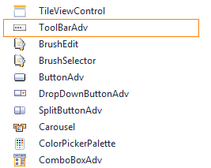

::: {style="DISPLAY: none"}
{#d2h_url_template}{#d2h_package_url style="WIDTH: 0px; DISPLAY: none; HEIGHT: 0px"}
:::

:::: {.d2h_secondary_topic style="PADDING-BOTTOM: 10pt; MARGIN: 0pt; PADDING-LEFT: 0pt; PADDING-RIGHT: 0pt; PADDING-TOP: 0pt"}
#### Adding ToolBarAdv to a WPF Application

            Follow the below steps to add ToolBarAdv Control to WPF Application:

1.   Create a new WPF project.

2.   ToolBarAdv Control will be listed in the Tool Box.

 

{border="0"}

Figure 1194: ToolBarAdv in Tool Box

 

3.   Drag and drop the control to the designer.

 

::: {style="BORDER-BOTTOM: windowtext 1pt solid; BORDER-LEFT: medium none; PADDING-BOTTOM: 1pt; MARGIN-TOP: 9pt; PADDING-LEFT: 0pt; PADDING-RIGHT: 0pt; MARGIN-BOTTOM: 9pt; BORDER-TOP: windowtext 1pt solid; BORDER-RIGHT: medium none; PADDING-TOP: 1pt"}
Note: Following XAML code will be automatically added in the XAML Viewer. You can also manually add this code instead of dragging the control from ToolBox.
:::

 

 

+-------------------------------------------------------------------------------------------------------------------------------------------------------------------------------------------------------------------------------------------------------------------------------------------------------------------------------------------------------------------------------------------------------------------------------------------------------------------------------------------------------------------------------------------------------------------------------------------------------------------------------------------------------------------------------------------------------------------------------------------------------------------------------------------------------------------------------------------------------------------------------------------------------------------------------------------------------------------------------------------------------------------------------------------------+
| **[\[XAML\]]{style="FONT-FAMILY: 'Courier New'"}**                                                                                                                                                                                                                                                                                                                                                                                                                                                                                                                                                                                                                                                                                                                                                                                                                                                                                                                                                                                              |
|                                                                                                                                                                                                                                                                                                                                                                                                                                                                                                                                                                                                                                                                                                                                                                                                                                                                                                                                                                                                                                                 |
| [\<]{style="FONT-FAMILY: 'Courier New'; COLOR: blue"}[syncfusion]{style="FONT-FAMILY: 'Courier New'; COLOR: #a31515"}[:]{style="FONT-FAMILY: 'Courier New'; COLOR: blue"}[ToolBarAdv]{style="FONT-FAMILY: 'Courier New'; COLOR: #a31515"}[ Height]{style="FONT-FAMILY: 'Courier New'; COLOR: red"}[=\"100\"]{style="FONT-FAMILY: 'Courier New'; COLOR: blue"}[ HorizontalAlignment]{style="FONT-FAMILY: 'Courier New'; COLOR: red"}[=\"Left\"]{style="FONT-FAMILY: 'Courier New'; COLOR: blue"}[ Margin]{style="FONT-FAMILY: 'Courier New'; COLOR: red"}[=\"92,90,0,0\"]{style="FONT-FAMILY: 'Courier New'; COLOR: blue"}[ Name]{style="FONT-FAMILY: 'Courier New'; COLOR: red"}[=\"toolBarAdv1\"]{style="FONT-FAMILY: 'Courier New'; COLOR: blue"}[ VerticalAlignment]{style="FONT-FAMILY: 'Courier New'; COLOR: red"}[=\"Top\"]{style="FONT-FAMILY: 'Courier New'; COLOR: blue"}[ Width]{style="FONT-FAMILY: 'Courier New'; COLOR: red"}[=\"200\" /\>]{style="FONT-FAMILY: 'Courier New'; COLOR: blue"}[]{style="FONT-FAMILY: 'Courier New'"} |
|                                                                                                                                                                                                                                                                                                                                                                                                                                                                                                                                                                                                                                                                                                                                                                                                                                                                                                                                                                                                                                                 |
| **[]{style="FONT-FAMILY: 'Courier New'"}**                                                                                                                                                                                                                                                                                                                                                                                                                                                                                                                                                                                                                                                                                                                                                                                                                                                                                                                                                                                                      |
+-------------------------------------------------------------------------------------------------------------------------------------------------------------------------------------------------------------------------------------------------------------------------------------------------------------------------------------------------------------------------------------------------------------------------------------------------------------------------------------------------------------------------------------------------------------------------------------------------------------------------------------------------------------------------------------------------------------------------------------------------------------------------------------------------------------------------------------------------------------------------------------------------------------------------------------------------------------------------------------------------------------------------------------------------+

 

4.   ToolBarAdv Control is added.

 

 

[]{#related-topics}
::::
