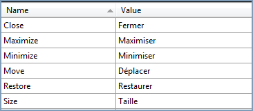

::: {style="DISPLAY: none"}
{#d2h_url_template}{#d2h_package_url style="WIDTH: 0px; DISPLAY: none; HEIGHT: 0px"}
:::

::: {.d2h_secondary_topic style="PADDING-BOTTOM: 10pt; MARGIN: 0pt; PADDING-LEFT: 0pt; PADDING-RIGHT: 0pt; PADDING-TOP: 0pt"}
#### Add Supported Cultures

Add supported cultures for a project is the very important one to do in the sample application project before you go to run the application:

1.   In the Solution Explorer, right-click your sample application project and choose *Unload Project* from the Context menu. Then the project will be unavailable.

2.   Right-click the project again, and select the *Edit SampleProjectName.csproj* option.

3.   In the *.csproj* file, find the *\<SupportedCultures\>\</SupportedCultures\>* tags. By default, the tags will be empty. So, add the cultures that you want to be supported, separating each with a semicolon if many.

For example: \<SupportedCultures\>fr-FR \</SupportedCultures\>

4.   Save the project and right-click the SampleProjectName.csproj to reload it.

5.   Choose *Reload SampleProjectName.csproj*.

In the .resx file, change the following values:

{border="0"}

Figure 1122: Add supported cultures

[]{#related-topics}
:::
