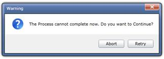

::: {style="DISPLAY: none"}
{#d2h_url_template}{#d2h_package_url style="WIDTH: 0px; DISPLAY: none; HEIGHT: 0px"}
:::

::: {.d2h_secondary_topic style="PADDING-BOTTOM: 10pt; MARGIN: 0pt; PADDING-LEFT: 0pt; PADDING-RIGHT: 0pt; PADDING-TOP: 0pt"}
##### []{#_Alert_Window}Alert Window

The Alert Window allows the user to alert the end user with certain a message. The Alert Window can be shown by calling the Static method *ShowAlert()* of Window Control class. It will take the following arguments:

[·      ]{style="FONT-FAMILY: Symbol"}Message

[·      ]{style="FONT-FAMILY: Symbol"}Title

[·      ]{style="FONT-FAMILY: Symbol"}DialogIcon

[·      ]{style="FONT-FAMILY: Symbol"}DialogButton

[·      ]{style="FONT-FAMILY: Symbol"}ClosedEventHandler

[·      ]{style="FONT-FAMILY: Symbol"}AnimationType

The following code shows a simple Alert Window:

  ------------------------------------------------------------------------------------------------------------------------------------------------------------------------------------------------------------------------------------
  C#
  [WindowControl]{style="FONT-FAMILY: Consolas; COLOR: #2b91af; FONT-SIZE: 9.5pt"}[.ShowAlert([\"Hello World!!\"]{style="COLOR: #a31515"}, [\"Message\"]{style="COLOR: #a31515"});]{style="FONT-FAMILY: Consolas; FONT-SIZE: 9.5pt"}
  ------------------------------------------------------------------------------------------------------------------------------------------------------------------------------------------------------------------------------------

 

{border="0"}

Figure 1089: Message

  -------------------------------------------------------------------------------------------------------------------------------------------------------------------------------------------------------------------------------------------------------------------------------------------------------------------------------------------------------------------------------------------------------------------------------------------------------------
  C#
  [WindowControl]{style="FONT-FAMILY: Consolas; COLOR: #2b91af; FONT-SIZE: 9.5pt"}[.ShowAlert([\"The Process cannot complete now. Do you want to Continue?\"]{style="COLOR: #a31515"}, [\"Warning\"]{style="COLOR: #a31515"}, [DialogIcon]{style="COLOR: #2b91af"}.Question, [DialogButton]{style="COLOR: #2b91af"}.AbortRetry, [null]{style="COLOR: blue"}, [AnimationType]{style="COLOR: #2b91af"}.Fade);]{style="FONT-FAMILY: Consolas; FONT-SIZE: 9.5pt"}
  -------------------------------------------------------------------------------------------------------------------------------------------------------------------------------------------------------------------------------------------------------------------------------------------------------------------------------------------------------------------------------------------------------------------------------------------------------------

 

{border="0"}

Figure 1090: Warning

 

+-------------------------------------------------------------------------------------------------------------------------------------------------------------------------------------------------------------------------------------------------------------------------------------------------------------------------------------------------------------------------------------------------------------------------------------------------------------------------------------------------------------------------------------------+
| C#                                                                                                                                                                                                                                                                                                                                                                                                                                                                                                                                        |
+-------------------------------------------------------------------------------------------------------------------------------------------------------------------------------------------------------------------------------------------------------------------------------------------------------------------------------------------------------------------------------------------------------------------------------------------------------------------------------------------------------------------------------------------+
| [WindowControl]{style="FONT-FAMILY: Consolas; COLOR: #2b91af; FONT-SIZE: 9.5pt"}[.ShowAlert([\"The Process cannot complete now. Do you want to Continue?\"]{style="COLOR: #a31515"}, [\"Warning\"]{style="COLOR: #a31515"}, [DialogIcon]{style="COLOR: #2b91af"}.Exclamation, [DialogButton]{style="COLOR: #2b91af"}.YesNo, [new]{style="COLOR: blue"} [ClosedEventHandler]{style="COLOR: #2b91af"}(OnClosed), [AnimationType]{style="COLOR: #2b91af"}.Fade);[]{style="COLOR: #a31515"}]{style="FONT-FAMILY: Consolas; FONT-SIZE: 9.5pt"} |
|                                                                                                                                                                                                                                                                                                                                                                                                                                                                                                                                           |
| []{style="FONT-FAMILY: Consolas; FONT-SIZE: 9.5pt"}                                                                                                                                                                                                                                                                                                                                                                                                                                                                                       |
|                                                                                                                                                                                                                                                                                                                                                                                                                                                                                                                                           |
| [private]{style="FONT-FAMILY: Consolas; COLOR: blue; FONT-SIZE: 9.5pt"}[ [void]{style="COLOR: blue"} OnClosed([object]{style="COLOR: blue"} sender, [ClosedEventArgs]{style="COLOR: #2b91af"} e)]{style="FONT-FAMILY: Consolas; FONT-SIZE: 9.5pt"}                                                                                                                                                                                                                                                                                        |
|                                                                                                                                                                                                                                                                                                                                                                                                                                                                                                                                           |
| [{]{style="FONT-FAMILY: Consolas; FONT-SIZE: 9.5pt"}                                                                                                                                                                                                                                                                                                                                                                                                                                                                                      |
|                                                                                                                                                                                                                                                                                                                                                                                                                                                                                                                                           |
| [}]{style="FONT-FAMILY: Consolas; FONT-SIZE: 9.5pt"}                                                                                                                                                                                                                                                                                                                                                                                                                                                                                      |
+-------------------------------------------------------------------------------------------------------------------------------------------------------------------------------------------------------------------------------------------------------------------------------------------------------------------------------------------------------------------------------------------------------------------------------------------------------------------------------------------------------------------------------------------+

 

[]{#related-topics}
:::
