::: {style="DISPLAY: none"}
{#d2h_url_template}{#d2h_package_url style="WIDTH: 0px; DISPLAY: none; HEIGHT: 0px"}
:::

::: {.d2h_secondary_topic style="PADDING-BOTTOM: 10pt; MARGIN: 0pt; PADDING-LEFT: 0pt; PADDING-RIGHT: 0pt; PADDING-TOP: 0pt"}
##### Appearance

The Office 2010 UI in the Ribbon control looks like the Microsoft Office 2010 UI. The Office 2010 UI in the Ribbon control has many changes when compared to the Office 2007 UI. The Ribbon control has many new elements added to it and the visual styles for all the elements have been changed to achieve the Office 2010 UI. The following are the main elements of the Office 2010 UI:

 

[·      ]{style="FONT-FAMILY: Symbol"}Application icon

[·      ]{style="FONT-FAMILY: Symbol"}Toggle button

[·      ]{style="FONT-FAMILY: Symbol"}Back Stage button

[·      ]{style="FONT-FAMILY: Symbol"}Back Stage

[·      ]{style="FONT-FAMILY: Symbol"}Quick Access Toolbar (QAT)

[·      ]{style="FONT-FAMILY: Symbol"}Ribbon window

[·      ]{style="FONT-FAMILY: Symbol"}Button panel

[·      ]{style="FONT-FAMILY: Symbol"}Office 2010 UI themes

 

Application Icon

The Application icon is built-in the Ribbon control and is located in the upper-left corner of the control. Users can customize the Application icon by using the Icon property of the Ribbon, as shown in the following code snippet.

***[]{style="FONT-FAMILY: 'Courier New'"}*** 

+---------------------------------------------------------------------------------------------------------------------------------------------------------------------------------------------------------------------------------------------------------------------------------------------------------------------------------------------------------------------------------------------------------------------------------------------------------------------------------------------------------------------------------------------------------------+
| **[\[C#\]   ]{style="FONT-FAMILY: 'Courier New'"}**                                                                                                                                                                                                                                                                                                                                                                                                                                                                                                           |
|                                                                                                                                                                                                                                                                                                                                                                                                                                                                                                                                                               |
| **[     ]{style="FONT-FAMILY: 'Courier New'"}**                                                                                                                                                                                                                                                                                                                                                                                                                                                                                                               |
|                                                                                                                                                                                                                                                                                                                                                                                                                                                                                                                                                               |
| [    ]{style="FONT-FAMILY: 'Courier New'; COLOR: #a31515"}[\<]{style="FONT-FAMILY: 'Courier New'; COLOR: blue"}[syncfusion]{style="FONT-FAMILY: 'Courier New'; COLOR: #a31515"}[:]{style="FONT-FAMILY: 'Courier New'; COLOR: blue"}[Ribbon]{style="FONT-FAMILY: 'Courier New'; COLOR: #a31515"}[ shared]{style="FONT-FAMILY: 'Courier New'; COLOR: red"}[:]{style="FONT-FAMILY: 'Courier New'; COLOR: blue"}[SkinManager.VisualStyle]{style="FONT-FAMILY: 'Courier New'; COLOR: red"}[=\"Office2010Black\" ]{style="FONT-FAMILY: 'Courier New'; COLOR: blue"} |
|                                                                                                                                                                                                                                                                                                                                                                                                                                                                                                                                                               |
| [         ]{style="FONT-FAMILY: 'Courier New'; COLOR: blue"}[Title]{style="FONT-FAMILY: 'Courier New'; COLOR: red"}[=\"Syncfusion Office2010 UI\"  ]{style="FONT-FAMILY: 'Courier New'; COLOR: blue"}[Name]{style="FONT-FAMILY: 'Courier New'; COLOR: red"}[=\"MyRibbon\"]{style="FONT-FAMILY: 'Courier New'; COLOR: blue"}                                                                                                                                                                                                                                   |
|                                                                                                                                                                                                                                                                                                                                                                                                                                                                                                                                                               |
| [                                          ]{style="FONT-FAMILY: 'Courier New'; COLOR: blue"}[Icon]{style="FONT-FAMILY: 'Courier New'; COLOR: red"}[=\"/Resources/logo.png\" \>]{style="FONT-FAMILY: 'Courier New'; COLOR: blue"}[           ]{style="FONT-FAMILY: 'Courier New'; COLOR: #a31515"}[]{style="FONT-FAMILY: 'Courier New'"}                                                                                                                                                                                                                      |
|                                                                                                                                                                                                                                                                                                                                                                                                                                                                                                                                                               |
| [            ]{style="FONT-FAMILY: 'Courier New'; COLOR: #a31515"}[\<]{style="FONT-FAMILY: 'Courier New'; COLOR: blue"}[syncfusion]{style="FONT-FAMILY: 'Courier New'; COLOR: #a31515"}[:]{style="FONT-FAMILY: 'Courier New'; COLOR: blue"}[RibbonTab]{style="FONT-FAMILY: 'Courier New'; COLOR: #a31515"}[ Caption]{style="FONT-FAMILY: 'Courier New'; COLOR: red"}[=\"Tab1\"\>]{style="FONT-FAMILY: 'Courier New'; COLOR: blue"}[]{style="FONT-FAMILY: 'Courier New'"}                                                                                      |
|                                                                                                                                                                                                                                                                                                                                                                                                                                                                                                                                                               |
| [                ]{style="FONT-FAMILY: 'Courier New'; COLOR: #a31515"}[\<]{style="FONT-FAMILY: 'Courier New'; COLOR: blue"}[syncfusion]{style="FONT-FAMILY: 'Courier New'; COLOR: #a31515"}[:]{style="FONT-FAMILY: 'Courier New'; COLOR: blue"}[RibbonBar]{style="FONT-FAMILY: 'Courier New'; COLOR: #a31515"}[ Header]{style="FONT-FAMILY: 'Courier New'; COLOR: red"}[=\"Ribbon Bar1\"/\>]{style="FONT-FAMILY: 'Courier New'; COLOR: blue"}[]{style="FONT-FAMILY: 'Courier New'"}                                                                           |
|                                                                                                                                                                                                                                                                                                                                                                                                                                                                                                                                                               |
| [                ]{style="FONT-FAMILY: 'Courier New'; COLOR: #a31515"}[\<]{style="FONT-FAMILY: 'Courier New'; COLOR: blue"}[syncfusion]{style="FONT-FAMILY: 'Courier New'; COLOR: #a31515"}[:]{style="FONT-FAMILY: 'Courier New'; COLOR: blue"}[RibbonBar]{style="FONT-FAMILY: 'Courier New'; COLOR: #a31515"}[ Header]{style="FONT-FAMILY: 'Courier New'; COLOR: red"}[=\"Ribbon Bar1\"/\>]{style="FONT-FAMILY: 'Courier New'; COLOR: blue"}[]{style="FONT-FAMILY: 'Courier New'"}                                                                           |
|                                                                                                                                                                                                                                                                                                                                                                                                                                                                                                                                                               |
| [                ]{style="FONT-FAMILY: 'Courier New'; COLOR: #a31515"}[\<]{style="FONT-FAMILY: 'Courier New'; COLOR: blue"}[syncfusion]{style="FONT-FAMILY: 'Courier New'; COLOR: #a31515"}[:]{style="FONT-FAMILY: 'Courier New'; COLOR: blue"}[RibbonBar]{style="FONT-FAMILY: 'Courier New'; COLOR: #a31515"}[ Header]{style="FONT-FAMILY: 'Courier New'; COLOR: red"}[=\"Ribbon Bar1\"/\>]{style="FONT-FAMILY: 'Courier New'; COLOR: blue"}[]{style="FONT-FAMILY: 'Courier New'"}                                                                           |
|                                                                                                                                                                                                                                                                                                                                                                                                                                                                                                                                                               |
| [            ]{style="FONT-FAMILY: 'Courier New'; COLOR: #a31515"}[\</]{style="FONT-FAMILY: 'Courier New'; COLOR: blue"}[syncfusion]{style="FONT-FAMILY: 'Courier New'; COLOR: #a31515"}[:]{style="FONT-FAMILY: 'Courier New'; COLOR: blue"}[RibbonTab]{style="FONT-FAMILY: 'Courier New'; COLOR: #a31515"}[\>]{style="FONT-FAMILY: 'Courier New'; COLOR: blue"}[]{style="FONT-FAMILY: 'Courier New'"}                                                                                                                                                        |
|                                                                                                                                                                                                                                                                                                                                                                                                                                                                                                                                                               |
| [     ]{style="FONT-FAMILY: 'Courier New'; COLOR: #a31515"}[\</]{style="FONT-FAMILY: 'Courier New'; COLOR: blue"}[syncfusion]{style="FONT-FAMILY: 'Courier New'; COLOR: #a31515"}[:]{style="FONT-FAMILY: 'Courier New'; COLOR: blue"}[Ribbon]{style="FONT-FAMILY: 'Courier New'; COLOR: #a31515"}[\>]{style="FONT-FAMILY: 'Courier New'; COLOR: blue"}                                                                                                                                                                                                        |
|                                                                                                                                                                                                                                                                                                                                                                                                                                                                                                                                                               |
| [                                      ]{style="FONT-FAMILY: 'Courier New'; COLOR: red"}[       [ ]{style="COLOR: red"}]{style="FONT-FAMILY: 'Courier New'"}[]{style="FONT-FAMILY: 'Courier New'"}                                                                                                                                                                                                                                                                                                                                                            |
+---------------------------------------------------------------------------------------------------------------------------------------------------------------------------------------------------------------------------------------------------------------------------------------------------------------------------------------------------------------------------------------------------------------------------------------------------------------------------------------------------------------------------------------------------------------+

 

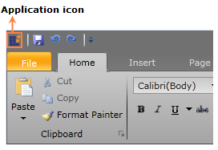{border="0"}

Figure 671: Application Icon

 

Toggle Button

The Toggle button is a new element in the Ribbon control with the Office 2010 UI, which is located in the upper-right corner of the control near the Tab Panel item. The Toggle button is used to change the Ribbon state just like the Microsoft Office 2010 UI. The Toggle button has two states, namely Normal and Hide. The Toggle button will be added to the Ribbon control when the Office 2010 UI themes are applied.

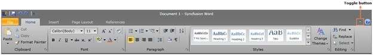{border="0"}

Figure 672: Toggle Button

 

Back Stage Button

The Back Stage button is a new element in the Ribbon control with the Office 2010 UI. It is just like the Application Menu in the Office 2007 UI. The Back Stage button will be added to the Ribbon control when the Office 2010 UI themes are applied and it can be clicked to open the Back Stage UI.

 

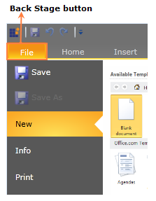{border="0"}

Figure 673: Back Stage Button

 

Back Stage

The Back Stage is a new UI in the Office 2010 UI, which displays application commands, such as Save, Save As, Open, and Exit. The Back Stage UI can be opened by clicking the Back Stage button.

When the Back Stage UI is open, it will fill the entire Ribbon window content and none of the tabs will be selected in the Ribbon control. Also, the QAT and the Ribbon Toggle button will be disabled when the Back Stage UI is open. The Back Stage UI contains the following two elements:

Back Stage Command button

Back Stage Tab item

The Back Stage Command button is used to perform simple actions in Silverlight applications by using the application commands.

The Back Stage Tab item is used to display the content of the tab item just like the Tab control. The content of the Back Stage tab item will be displayed in the right pane of the Back Stage UI, as shown in the screen shot displayed below. The content of the tab item can also be customized.

 

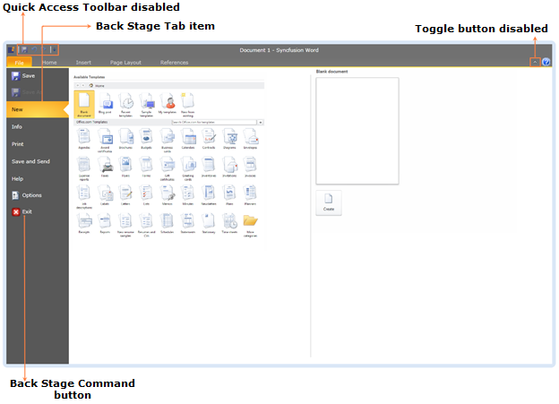{border="0"}

Figure 674: Back Stage UI

 

QAT

The appearance of the QAT in the Office 2010 UI is different when compared to the Office 2007 UI. In the Office 2010 UI, two separators are added to the QAT when it is displayed above the Ribbon and they will be disabled when the QAT is displayed below the Ribbon.

 

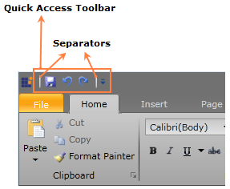{border="0"}

Figure 675: QAT with Separators

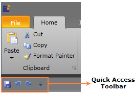{border="0"}

Figure 676: QAT Displayed Below the Ribbon

 

Ribbon Window

The Ribbon window supports the creation of Silverlight applications with the Office 2010 UI in a window in any browser. The Ribbon window also supports the Office 2010 UI themes. You can use a Silverlight application as a window application in any browser.

 

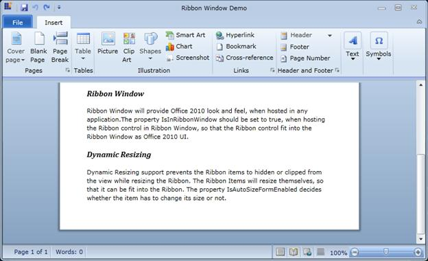{border="0"}

Figure 677: Office 2010 UI in a Window

 

 

Button Panel

The Button panel in the Office 2010 UI has the SeparatorVisibility property to control the visibility of the separators. You can customize the Button panel by changing the value of the SeparatorVisibility property. By default, the value of the SeparatorVisibility property is "Visible". The code for the default Button panel is shown in the following code snippet.

***[]{style="FONT-FAMILY: 'Courier New'"}*** 

+-------------------------------------------------------------------------------------------------------------------------------------------------------------------------------------------------------------------------------------------------------------------------------------------------------------------------------------------------------------------------------------------------------------------------------------------------------------------------------------------------------------------------------------------------------+
| **[\[C#\]   ]{style="FONT-FAMILY: 'Courier New'"}**                                                                                                                                                                                                                                                                                                                                                                                                                                                                                                   |
|                                                                                                                                                                                                                                                                                                                                                                                                                                                                                                                                                       |
| **[     ]{style="FONT-FAMILY: 'Courier New'"}**                                                                                                                                                                                                                                                                                                                                                                                                                                                                                                       |
|                                                                                                                                                                                                                                                                                                                                                                                                                                                                                                                                                       |
| [\<]{style="FONT-FAMILY: 'Courier New'; COLOR: blue"}[syncfusion]{style="FONT-FAMILY: 'Courier New'; COLOR: #a31515"}[:]{style="FONT-FAMILY: 'Courier New'; COLOR: blue"}[ButtonPanel]{style="FONT-FAMILY: 'Courier New'; COLOR: #a31515"}[ Margin]{style="FONT-FAMILY: 'Courier New'; COLOR: red"}[=\"0\" \>]{style="FONT-FAMILY: 'Courier New'; COLOR: blue"}[]{style="FONT-FAMILY: 'Courier New'"}                                                                                                                                                 |
|                                                                                                                                                                                                                                                                                                                                                                                                                                                                                                                                                       |
| [\<]{style="FONT-FAMILY: 'Courier New'; COLOR: blue"}[syncfusion]{style="FONT-FAMILY: 'Courier New'; COLOR: #a31515"}[:]{style="FONT-FAMILY: 'Courier New'; COLOR: blue"}[RibbonButton]{style="FONT-FAMILY: 'Courier New'; COLOR: #a31515"}[ SizeMode]{style="FONT-FAMILY: 'Courier New'; COLOR: red"}[=\"Small\" ]{style="FONT-FAMILY: 'Courier New'; COLOR: blue"}[SmallIcon]{style="FONT-FAMILY: 'Courier New'; COLOR: red"}[=\"ClearFormatting16.png\"/\>]{style="FONT-FAMILY: 'Courier New'; COLOR: blue"}[]{style="FONT-FAMILY: 'Courier New'"} |
|                                                                                                                                                                                                                                                                                                                                                                                                                                                                                                                                                       |
| [\</]{style="FONT-FAMILY: 'Courier New'; COLOR: blue"}[syncfusion]{style="FONT-FAMILY: 'Courier New'; COLOR: #a31515"}[:]{style="FONT-FAMILY: 'Courier New'; COLOR: blue"}[ButtonPanel]{style="FONT-FAMILY: 'Courier New'; COLOR: #a31515"}[\>]{style="FONT-FAMILY: 'Courier New'; COLOR: blue"}                                                                                                                                                                                                                                                      |
|                                                                                                                                                                                                                                                                                                                                                                                                                                                                                                                                                       |
| []{style="FONT-FAMILY: 'Courier New'"}                                                                                                                                                                                                                                                                                                                                                                                                                                                                                                                |
+-------------------------------------------------------------------------------------------------------------------------------------------------------------------------------------------------------------------------------------------------------------------------------------------------------------------------------------------------------------------------------------------------------------------------------------------------------------------------------------------------------------------------------------------------------+

 

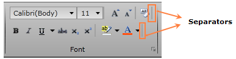{border="0"}

Figure 678: Button Panel with Separators

The separators in the Button panel can be collapsed, as shown in the following code snippet.

 

+-------------------------------------------------------------------------------------------------------------------------------------------------------------------------------------------------------------------------------------------------------------------------------------------------------------------------------------------------------------------------------------------------------------------------------------------------------------------------------------------------------------------------------------------------------+
| **[\[C#\]   ]{style="FONT-FAMILY: 'Courier New'"}**                                                                                                                                                                                                                                                                                                                                                                                                                                                                                                   |
|                                                                                                                                                                                                                                                                                                                                                                                                                                                                                                                                                       |
| **[     ]{style="FONT-FAMILY: 'Courier New'"}**                                                                                                                                                                                                                                                                                                                                                                                                                                                                                                       |
|                                                                                                                                                                                                                                                                                                                                                                                                                                                                                                                                                       |
| [\<]{style="FONT-FAMILY: 'Courier New'; COLOR: blue"}[syncfusion]{style="FONT-FAMILY: 'Courier New'; COLOR: #a31515"}[:]{style="FONT-FAMILY: 'Courier New'; COLOR: blue"}[ButtonPanel]{style="FONT-FAMILY: 'Courier New'; COLOR: #a31515"}[ Margin]{style="FONT-FAMILY: 'Courier New'; COLOR: red"}[=\"0\"  ]{style="FONT-FAMILY: 'Courier New'; COLOR: blue"}[SeparatorVisibility]{style="FONT-FAMILY: 'Courier New'; COLOR: red"}[=\"Collapsed\"\>]{style="FONT-FAMILY: 'Courier New'; COLOR: blue"}[]{style="FONT-FAMILY: 'Courier New'"}          |
|                                                                                                                                                                                                                                                                                                                                                                                                                                                                                                                                                       |
| [\<]{style="FONT-FAMILY: 'Courier New'; COLOR: blue"}[syncfusion]{style="FONT-FAMILY: 'Courier New'; COLOR: #a31515"}[:]{style="FONT-FAMILY: 'Courier New'; COLOR: blue"}[RibbonButton]{style="FONT-FAMILY: 'Courier New'; COLOR: #a31515"}[ SizeMode]{style="FONT-FAMILY: 'Courier New'; COLOR: red"}[=\"Small\" ]{style="FONT-FAMILY: 'Courier New'; COLOR: blue"}[SmallIcon]{style="FONT-FAMILY: 'Courier New'; COLOR: red"}[=\"ClearFormatting16.png\"/\>]{style="FONT-FAMILY: 'Courier New'; COLOR: blue"}[]{style="FONT-FAMILY: 'Courier New'"} |
|                                                                                                                                                                                                                                                                                                                                                                                                                                                                                                                                                       |
| [\</]{style="FONT-FAMILY: 'Courier New'; COLOR: blue"}[syncfusion]{style="FONT-FAMILY: 'Courier New'; COLOR: #a31515"}[:]{style="FONT-FAMILY: 'Courier New'; COLOR: blue"}[ButtonPanel]{style="FONT-FAMILY: 'Courier New'; COLOR: #a31515"}[\>]{style="FONT-FAMILY: 'Courier New'; COLOR: blue"}                                                                                                                                                                                                                                                      |
|                                                                                                                                                                                                                                                                                                                                                                                                                                                                                                                                                       |
| []{style="FONT-FAMILY: 'Courier New'"}                                                                                                                                                                                                                                                                                                                                                                                                                                                                                                                |
+-------------------------------------------------------------------------------------------------------------------------------------------------------------------------------------------------------------------------------------------------------------------------------------------------------------------------------------------------------------------------------------------------------------------------------------------------------------------------------------------------------------------------------------------------------+

        

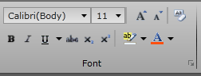{border="0"}

Figure 679: Button Panel with Separators Collapsed

 

Office 2010 UI Themes

You can customize the Office 2010 UI in the Ribbon control in a Silverlight application by using the following themes:

Office 2010Black

Office 2010Blue

Office2010Silver

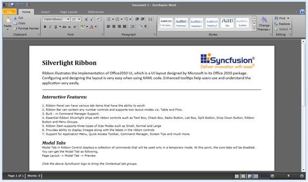{border="0"}

Figure 680: Office2010Black Theme

 

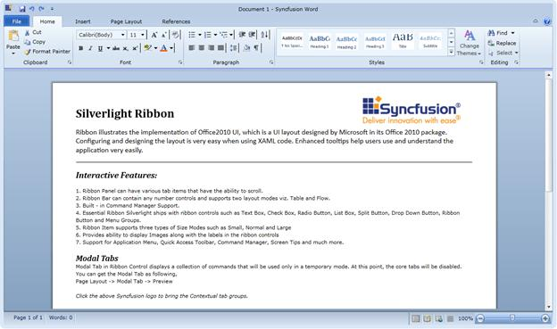{border="0"}

Figure 681: Office2010Blue Theme

 

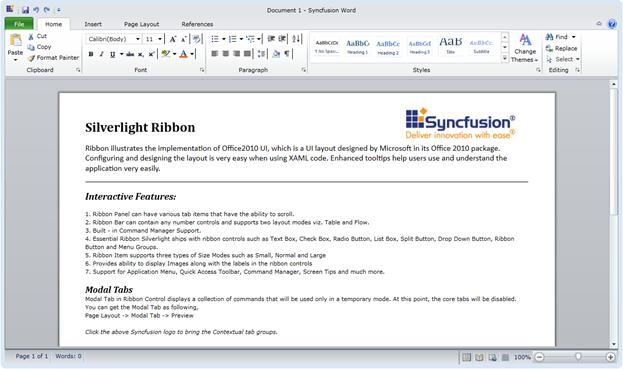{border="0"}

Figure 682: Office2010Silver Theme

 

 

[]{#related-topics}
:::
