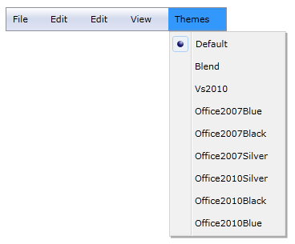
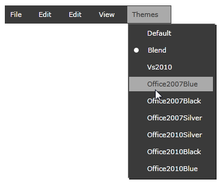
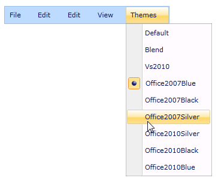
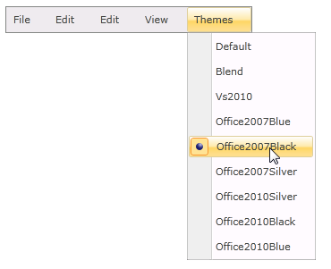
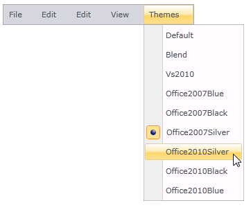
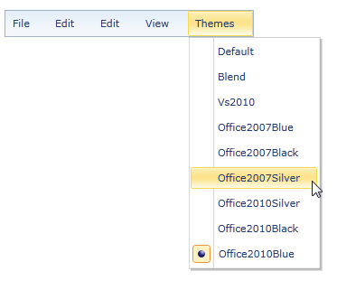
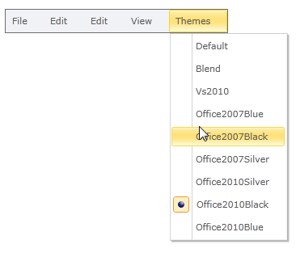
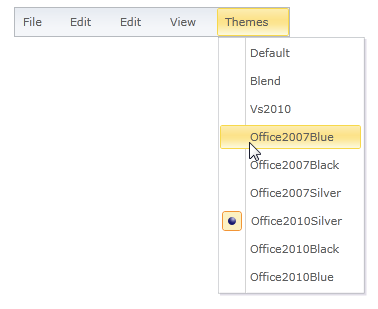
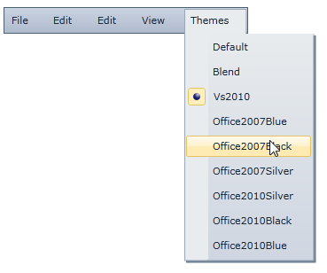
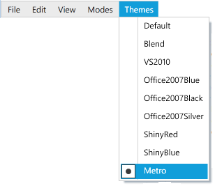

::: {style="DISPLAY: none"}
{#d2h_url_template}{#d2h_package_url style="WIDTH: 0px; DISPLAY: none; HEIGHT: 0px"}
:::

::::: {#nsbanner .d2h_main_nsbanner style="BORDER-BOTTOM: #999999 1px solid; POSITION: relative; PADDING-BOTTOM: 0px; BACKGROUND-COLOR: transparent; PADDING-LEFT: 0px; PADDING-RIGHT: 0px; DISPLAY: none; BORDER-TOP: #999999 1px solid; PADDING-TOP: 0px; LEFT: 0px"}
:::: {#TitleRow .d2h_main_titlerow style="PADDING-BOTTOM: 4px; BACKGROUND-COLOR: transparent; PADDING-LEFT: 22px; WIDTH: 100%; PADDING-RIGHT: 10px; DISPLAY: none; PADDING-TOP: 4px"}
::: {#ienav .d2h_main_ienav style="DISPLAY: none"}
{#D2HPrevious .D2HPreviousEnabled}  {#D2HNext .D2HNextEnabled}
:::
::::
:::::

::: {#nstext .d2h_main_nstext style="PADDING-BOTTOM: 10px; BACKGROUND-COLOR: transparent; PADDING-LEFT: 22px; PADDING-RIGHT: 10px; HEIGHT: 100%; OVERFLOW: auto; PADDING-TOP: 5px" hasuserbackground="true" valign="bottom"}
### Appearance

The appearance of the MenuAdv control can be changed by using the VisualStyle property. The following styles are supported by the MenuAdv control:

[·      ]{style="FONT-FAMILY: Symbol"}Windows7

[·      ]{style="FONT-FAMILY: Symbol"}Blend

[·      ]{style="FONT-FAMILY: Symbol"}Office2007Blue

[·      ]{style="FONT-FAMILY: Symbol"}Office2007Black

[·      ]{style="FONT-FAMILY: Symbol"}Office2007Silver

[·      ]{style="FONT-FAMILY: Symbol"}Office2010Blue

[·      ]{style="FONT-FAMILY: Symbol"}Office2010Black

[·      ]{style="FONT-FAMILY: Symbol"}Office2010Silver

[·      ]{style="FONT-FAMILY: Symbol"}Vs2010

[·      ]{style="FONT-FAMILY: Symbol"}Metro

 

Different visual styles can applied to the control, as shown in the following code snippet.

 

+--------------------------------------------------------------------------------------------------------------------------------------------------------------------------------------------------------------------------------------------------------------------------------------------------------------------------------------------------------------------------------------------------------------------+
| **[\[XAML\]]{style="FONT-FAMILY: 'Courier New'"}**                                                                                                                                                                                                                                                                                                                                                                 |
|                                                                                                                                                                                                                                                                                                                                                                                                                    |
| [\<]{style="FONT-FAMILY: 'Courier New'; COLOR: blue"}[shared:]{style="FONT-FAMILY: 'Courier New'; COLOR: #a31515"}[MenuAdv Height]{style="FONT-FAMILY: 'Courier New'; COLOR: red"}[=\"25\"]{style="FONT-FAMILY: 'Courier New'; COLOR: blue"}[ Width]{style="FONT-FAMILY: 'Courier New'; COLOR: red"}[=\"200\"]{style="FONT-FAMILY: 'Courier New'; COLOR: blue"}[ ]{style="FONT-FAMILY: 'Courier New'; COLOR: red"} |
|                                                                                                                                                                                                                                                                                                                                                                                                                    |
| [shared]{style="FONT-FAMILY: 'Courier New'; COLOR: red"}[:]{style="FONT-FAMILY: 'Courier New'; COLOR: blue"}[SkinManager.SetVisualStyle]{style="FONT-FAMILY: 'Courier New'; COLOR: red"}[=\"Office2007Blue\"/\>]{style="FONT-FAMILY: 'Courier New'; COLOR: blue"}[]{style="FONT-FAMILY: 'Courier New'"}                                                                                                            |
+--------------------------------------------------------------------------------------------------------------------------------------------------------------------------------------------------------------------------------------------------------------------------------------------------------------------------------------------------------------------------------------------------------------------+

 

+----------------------------------------------------------------------------------------------------------------------------------------------------------+
| **[\[C#\]]{style="FONT-FAMILY: 'Courier New'"}**                                                                                                         |
|                                                                                                                                                          |
| [SkinManager]{style="FONT-FAMILY: 'Courier New'; COLOR: #2b91af"}[.SetVisualStyle([this]{style="COLOR: blue"}, ]{style="FONT-FAMILY: 'Courier New'"}     |
|                                                                                                                                                          |
| [Syncfusion.Windows.Controls.Theming.[VisualStyle]{style="COLOR: #2b91af"}[.Office2007Blue]{style="COLOR: black"});]{style="FONT-FAMILY: 'Courier New'"} |
|                                                                                                                                                          |
| []{style="FONT-FAMILY: Consolas"}                                                                                                                        |
+----------------------------------------------------------------------------------------------------------------------------------------------------------+

 

{border="0"}

Figure 947: Windows7

{border="0"}

Figure 948: Blend

{border="0"}

Figure 949: Office2007Blue

{border="0"}

Figure 950: Office2007Black

{border="0"}

Figure 951: ** **Office2007Silver

{border="0"}

Figure 952: Office2010Blue

{border="0"}

Figure 953: Office2010Black

{border="0"}

Figure 954: Office2010Silver

 

{border="0"}

Figure 955: Vs2010

 

{border="0"}

Figure 956: Metro

 

[]{#related-topics}
:::
