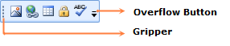

::: {style="DISPLAY: none"}
{#d2h_url_template}{#d2h_package_url style="WIDTH: 0px; DISPLAY: none; HEIGHT: 0px"}
:::

::: {.d2h_secondary_topic style="PADDING-BOTTOM: 10pt; MARGIN: 0pt; PADDING-LEFT: 0pt; PADDING-RIGHT: 0pt; PADDING-TOP: 0pt"}
#### Appearance and Structure of the Control

 

{border="0"}

Figure 1195: ToolBarAdv

[]{style="COLOR: #4e84c4; FONT-SIZE: 16pt"} 

[·      ]{style="FONT-FAMILY: Symbol"}The **Overflow Button** is the ToggleButton, when you click this OverflowPanel will be displayed.

[·      ]{style="FONT-FAMILY: Symbol"}The **Gripper** is used to drag the ToolBarAdv to change its Band. You can float and dock the ToolBarAdv by clicking the gripper and dragging the ToolBarAdv, When the ToolBarAdv is hosted in ToolBarManager.

[]{#related-topics}
:::
