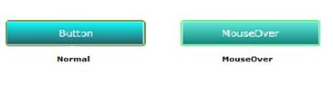

::: {style="DISPLAY: none"}
{#d2h_url_template}{#d2h_package_url style="WIDTH: 0px; DISPLAY: none; HEIGHT: 0px"}
:::

::: {.d2h_secondary_topic style="PADDING-BOTTOM: 10pt; MARGIN: 0pt; PADDING-LEFT: 0pt; PADDING-RIGHT: 0pt; PADDING-TOP: 0pt"}
#### Apply Custom Brushes for Silverlight Controls.

You can customize the brushes used in the built-in skins for the Microsoft controls.

The following steps explain how to apply the custom brushes for the Silverlight controls.

 

1.   Create a new ResourceDictionary in the sample. Define the brushes in the newly created ResourceDictionary. Each brush should have a unique key. Keys in the new ResourceDictionary and the keys defined in the Syncfusion ResourceDictionary must be same.

 

      Key name for each control is available in the following location.

 

[[http://www.syncfusion.com/uploads/redirect.aspx?&team=support&file=SL_KeyFile579216365.zip]{.UGHyperlink}](http://www.syncfusion.com/uploads/redirect.aspx?&team=support&file=SL_KeyFile579216365.zip)[]{.UGHyperlink}

 

2.   Enable the custom brush before setting the custom brushes. This can be set by using the **SetIsCustomBrushEnabled** property.

3.   Set the custom brushes using the **SetCustomBrushDictionary** method. This method has two arguments.

 

[·      ]{style="FONT-FAMILY: Symbol"}First argument specifies the name of the control.

[·      ]{style="FONT-FAMILY: Symbol"}Second one specifies the ResourceDictionary.                                                      

The below code snippet illustrates how to set the custom brushes to the control.

 

+-------------------------------------------------------------------------------------------------------------------------------------------------------------------------------------------------------------------------------------+
| **[\[C#\]]{style="FONT-FAMILY: 'Courier New'"}**                                                                                                                                                                                    |
|                                                                                                                                                                                                                                     |
| [// Set the VisualStyle.]{style="FONT-FAMILY: 'Courier New'; COLOR: green"}                                                                                                                                                         |
|                                                                                                                                                                                                                                     |
| [SkinManager]{style="FONT-FAMILY: 'Courier New'; COLOR: #2b91af"}[.SetVisualStyle(button, [VisualStyle]{style="COLOR: #2b91af"}.Office2007Blue);]{style="FONT-FAMILY: 'Courier New'"}                                               |
|                                                                                                                                                                                                                                     |
| [// Enable the Custom Brush.]{style="FONT-FAMILY: 'Courier New'; COLOR: green"}[]{style="FONT-FAMILY: 'Courier New'"}                                                                                                               |
|                                                                                                                                                                                                                                     |
| [SkinManager]{style="FONT-FAMILY: 'Courier New'; COLOR: #2b91af"}[.SetIsCustomBrushEnabled(button, [true]{style="COLOR: blue"});]{style="FONT-FAMILY: 'Courier New'"}                                                               |
|                                                                                                                                                                                                                                     |
| [// Define the ResourceDictionary.]{style="FONT-FAMILY: 'Courier New'; COLOR: green"}[]{style="FONT-FAMILY: 'Courier New'"}                                                                                                         |
|                                                                                                                                                                                                                                     |
| [ResourceDictionary]{style="FONT-FAMILY: 'Courier New'; COLOR: #2b91af"}[ resource = [new]{style="COLOR: blue"} [ResourceDictionary]{style="COLOR: #2b91af"}();]{style="FONT-FAMILY: 'Courier New'"}                                |
|                                                                                                                                                                                                                                     |
| [// Load the ResourceDictionary source.]{style="FONT-FAMILY: 'Courier New'; COLOR: green"}[]{style="FONT-FAMILY: 'Courier New'"}                                                                                                    |
|                                                                                                                                                                                                                                     |
| [r.Source = [new]{style="COLOR: blue"} [Uri]{style="COLOR: #2b91af"}([@\"/checksample;Component/Brushes.xaml\"]{style="COLOR: #a31515"},[UriKind]{style="COLOR: #2b91af"}.RelativeOrAbsolute);]{style="FONT-FAMILY: 'Courier New'"} |
|                                                                                                                                                                                                                                     |
| [// Set Custom Brush.]{style="FONT-FAMILY: 'Courier New'; COLOR: green"}[]{style="FONT-FAMILY: 'Courier New'"}                                                                                                                      |
|                                                                                                                                                                                                                                     |
| [SkinManager]{style="FONT-FAMILY: 'Courier New'; COLOR: #2b91af"}[.SetCustomBrushDictionary(button, resource);]{style="FONT-FAMILY: 'Courier New'"}                                                                                 |
|                                                                                                                                                                                                                                     |
| []{style="FONT-FAMILY: 'Courier New'"}                                                                                                                                                                                              |
+-------------------------------------------------------------------------------------------------------------------------------------------------------------------------------------------------------------------------------------+

 

The output is as shown below.

{border="0"}

Figure 1161: Button with Custom Brushes

 

[]{#related-topics}
:::
