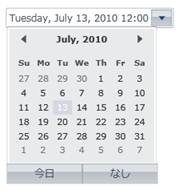

::: {style="DISPLAY: none"}
{#d2h_url_template}{#d2h_package_url style="WIDTH: 0px; DISPLAY: none; HEIGHT: 0px"}
:::

::: {.d2h_secondary_topic style="PADDING-BOTTOM: 10pt; MARGIN: 0pt; PADDING-LEFT: 0pt; PADDING-RIGHT: 0pt; PADDING-TOP: 0pt"}
#### Assign Current UI Culture to the Application

 

By Default, Current Culture will be "en-US" which you can check it from **"System.Threading.Thread.CurrentThread.CurrentUICulture".**

Now, change CurrentUICulture as you want, as like below

Here, CurentUICulture should be set before **IntializeComponent** in your StartUp page (Here, MainPage.xaml.cs) or you can do in App.xaml.cs in the Application_Startup event.

+------------------------------------------------------------------------------------------------------------------------------------------------------------------------------------------------------------------------------------------------------+
| **[CS (MainPage.xaml.cs)]{style="FONT-FAMILY: 'Courier New'"}**                                                                                                                                                                                      |
+------------------------------------------------------------------------------------------------------------------------------------------------------------------------------------------------------------------------------------------------------+
| [public]{style="FONT-FAMILY: 'Courier New'; COLOR: blue"}[ MainPage()]{style="FONT-FAMILY: 'Courier New'"}                                                                                                                                           |
|                                                                                                                                                                                                                                                      |
| [{]{style="FONT-FAMILY: 'Courier New'"}                                                                                                                                                                                                              |
|                                                                                                                                                                                                                                                      |
| [System.Threading.[Thread]{style="COLOR: #2b91af"}.CurrentThread.CurrentUICulture = [new]{style="COLOR: blue"} System.Globalization.[CultureInfo]{style="COLOR: #2b91af"}([\"ja-JP\"]{style="COLOR: #a31515"});]{style="FONT-FAMILY: 'Courier New'"} |
|                                                                                                                                                                                                                                                      |
| []{style="FONT-FAMILY: 'Courier New'"}                                                                                                                                                                                                               |
|                                                                                                                                                                                                                                                      |
| [InitializeComponent();]{style="FONT-FAMILY: 'Courier New'"}                                                                                                                                                                                         |
|                                                                                                                                                                                                                                                      |
| [}]{style="FONT-FAMILY: 'Courier New'"}                                                                                                                                                                                                              |
+------------------------------------------------------------------------------------------------------------------------------------------------------------------------------------------------------------------------------------------------------+

 

Or

+------------------------------------------------------------------------------------------------------------------------------------------------------------------------------------------------------------------------------------------------------+
| **[CS (App.xaml.cs)]{style="FONT-FAMILY: 'Courier New'"}**                                                                                                                                                                                           |
+------------------------------------------------------------------------------------------------------------------------------------------------------------------------------------------------------------------------------------------------------+
| [private]{style="FONT-FAMILY: 'Courier New'; COLOR: blue"}[ [void]{style="COLOR: blue"} Application_Startup([object]{style="COLOR: blue"} sender, [StartupEventArgs]{style="COLOR: #2b91af"} e)]{style="FONT-FAMILY: 'Courier New'"}                 |
|                                                                                                                                                                                                                                                      |
| [{]{style="FONT-FAMILY: 'Courier New'"}                                                                                                                                                                                                              |
|                                                                                                                                                                                                                                                      |
| [System.Threading.[Thread]{style="COLOR: #2b91af"}.CurrentThread.CurrentUICulture = [new]{style="COLOR: blue"} System.Globalization.[CultureInfo]{style="COLOR: #2b91af"}([\"ja-JP\"]{style="COLOR: #a31515"});]{style="FONT-FAMILY: 'Courier New'"} |
|                                                                                                                                                                                                                                                      |
| [this]{style="FONT-FAMILY: 'Courier New'; COLOR: blue"}[.RootVisual = [new]{style="COLOR: blue"} [MainPage]{style="COLOR: #2b91af"}();]{style="FONT-FAMILY: 'Courier New'"}                                                                          |
|                                                                                                                                                                                                                                                      |
| [}]{style="FONT-FAMILY: 'Courier New'"}                                                                                                                                                                                                              |
+------------------------------------------------------------------------------------------------------------------------------------------------------------------------------------------------------------------------------------------------------+

 

{border="0"}

Figure 449: DateTimeEdit -- Japanese Culture

[]{#related-topics}
:::
