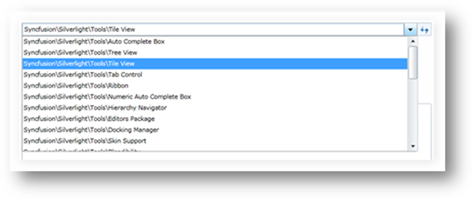

::: {style="DISPLAY: none"}
{#d2h_url_template}{#d2h_package_url style="WIDTH: 0px; DISPLAY: none; HEIGHT: 0px"}
:::

::: {.d2h_secondary_topic style="PADDING-BOTTOM: 10pt; MARGIN: 0pt; PADDING-LEFT: 0pt; PADDING-RIGHT: 0pt; PADDING-TOP: 0pt"}
##### AutoComplete

1.   Click on the HierarchyNavigatorItemsControl to start the Edit mode, which enables the AutoComplete function.

2.   When you type in a navigation path, a list will be displayed below the HierarchyNavigatorItemsControl, showing the navigation items you can choose.

 

{border="0"}

Figure 1025: Navigation items list

**[]{style="FONT-FAMILY: 'Cambria','serif'; COLOR: #4f81bd"}** 

[]{#related-topics}
:::
