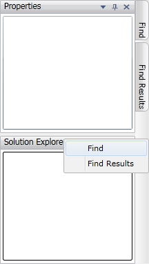

::: {style="DISPLAY: none"}
{#d2h_url_template}{#d2h_package_url style="WIDTH: 0px; DISPLAY: none; HEIGHT: 0px"}
:::

::: {.d2h_secondary_topic style="PADDING-BOTTOM: 10pt; MARGIN: 0pt; PADDING-LEFT: 0pt; PADDING-RIGHT: 0pt; PADDING-TOP: 0pt"}
#### []{#_Ref264440350}[]{#_AutohideTabContextMenu}AutohideTabContextMenu

 

When you right click the side panel, context menu will appear listing the windows that are autohidden in this panel. If you select any item, particular window will be activated[.]{style="FONT-FAMILY: 'Times New Roman','serif'; FONT-SIZE: 14pt"}

{border="0"}

Figure 90: AutoHideTabContextMenu

 

We can prevent this context menu from appearing by cancelling the AutohideTabContextMenuOpen event.

+------------------------------------------------------------------------------------------------------------------------------------------------------------------------------------------------------------------------------------------------------------------------------------+
| [\[C#\]]{style="FONT-FAMILY: 'Courier New'"}                                                                                                                                                                                                                                       |
|                                                                                                                                                                                                                                                                                    |
| []{style="FONT-FAMILY: 'Courier New'; COLOR: blue"}                                                                                                                                                                                                                                |
|                                                                                                                                                                                                                                                                                    |
| [this]{style="FONT-FAMILY: 'Courier New'; COLOR: blue"}[.dockingManager.AutoHideTabContextMenuOpen += [new]{style="COLOR: blue"} [AutoHideTabContextMenuOpenEventHandler]{style="COLOR: #2b91af"}(dockingManager_AutoHideTabContextMenuOpen);]{style="FONT-FAMILY: 'Courier New'"} |
|                                                                                                                                                                                                                                                                                    |
| [   ]{style="FONT-FAMILY: 'Courier New'"}                                                                                                                                                                                                                                          |
|                                                                                                                                                                                                                                                                                    |
| []{style="FONT-FAMILY: 'Courier New'"}                                                                                                                                                                                                                                             |
|                                                                                                                                                                                                                                                                                    |
| [void]{style="FONT-FAMILY: 'Courier New'; COLOR: blue"}[ dockingManager_AutoHideTabContextMenuOpen([object]{style="COLOR: blue"} sender, [AutoHideTabContextMenuOpenEventArgs]{style="COLOR: #2b91af"} args)]{style="FONT-FAMILY: 'Courier New'"}                                  |
|                                                                                                                                                                                                                                                                                    |
| [        {]{style="FONT-FAMILY: 'Courier New'"}                                                                                                                                                                                                                                    |
|                                                                                                                                                                                                                                                                                    |
| [            args.Cancel = [true]{style="COLOR: blue"};]{style="FONT-FAMILY: 'Courier New'"}                                                                                                                                                                                       |
|                                                                                                                                                                                                                                                                                    |
| [        }]{style="FONT-FAMILY: 'Courier New'"}                                                                                                                                                                                                                                    |
|                                                                                                                                                                                                                                                                                    |
| []{style="FONT-FAMILY: 'Courier New'"}                                                                                                                                                                                                                                             |
+------------------------------------------------------------------------------------------------------------------------------------------------------------------------------------------------------------------------------------------------------------------------------------+

[]{style="FONT-SIZE: 14pt"} 

[]{#related-topics}
:::
