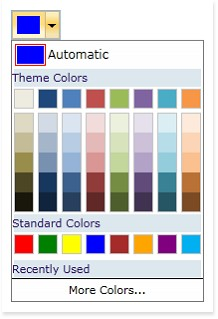

::: {style="DISPLAY: none"}
{#d2h_url_template}{#d2h_package_url style="WIDTH: 0px; DISPLAY: none; HEIGHT: 0px"}
:::

::: {.d2h_secondary_topic style="PADDING-BOTTOM: 10pt; MARGIN: 0pt; PADDING-LEFT: 0pt; PADDING-RIGHT: 0pt; PADDING-TOP: 0pt"}
#### []{#_Automatic_Color}Automatic Color

 

[]{#p432}Automatic color is the default color which is set as the selected color of the Color Picker control when SelectedColor property is not set. Black is the default automatic. Any required color can be set as the default automatic color.

 

The following is the code snippet illustrates how to set an automatic color:

 

+-------------------------------------------------------------------------------------------------------------------------------------------------------------------------------------------------------------------------------------------------------------------------------------------------------------------------------------------------------------------------------------------------------------------------------------------------------------------------------------------------------------------------------------------------------------------------------------------------------------------------------------------------------------------------------------------------------------------------+
| **[\[XAML\]]{style="FONT-FAMILY: 'Courier New'; COLOR: black"}**                                                                                                                                                                                                                                                                                                                                                                                                                                                                                                                                                                                                                                                        |
|                                                                                                                                                                                                                                                                                                                                                                                                                                                                                                                                                                                                                                                                                                                         |
| []{style="FONT-FAMILY: 'Courier New'; COLOR: #a31515"}                                                                                                                                                                                                                                                                                                                                                                                                                                                                                                                                                                                                                                                                  |
|                                                                                                                                                                                                                                                                                                                                                                                                                                                                                                                                                                                                                                                                                                                         |
| [\<]{style="FONT-FAMILY: 'Courier New'; COLOR: blue"}[Syncfusion]{style="FONT-FAMILY: 'Courier New'; COLOR: #a31515"}[:]{style="FONT-FAMILY: 'Courier New'; COLOR: blue"}[ColorPickerPalette]{style="FONT-FAMILY: 'Courier New'; COLOR: #a31515"}[ AutomaticColor]{style="FONT-FAMILY: 'Courier New'; COLOR: red"}[=\"Blue\"]{style="FONT-FAMILY: 'Courier New'; COLOR: blue"}[ ]{style="FONT-FAMILY: 'Courier New'; COLOR: red"}[ ]{style="FONT-FAMILY: 'Courier New'; COLOR: blue"}[x]{style="FONT-FAMILY: 'Courier New'; COLOR: red"}[:]{style="FONT-FAMILY: 'Courier New'; COLOR: blue"}[Name]{style="FONT-FAMILY: 'Courier New'; COLOR: red"}[=\"ColorPicker\"\>]{style="FONT-FAMILY: 'Courier New'; COLOR: blue"} |
|                                                                                                                                                                                                                                                                                                                                                                                                                                                                                                                                                                                                                                                                                                                         |
| [\</]{style="FONT-FAMILY: 'Courier New'; COLOR: blue"}[Syncfusion]{style="FONT-FAMILY: 'Courier New'; COLOR: #a31515"}[:]{style="FONT-FAMILY: 'Courier New'; COLOR: blue"}[ColorPickerPalette]{style="FONT-FAMILY: 'Courier New'; COLOR: #a31515"}[\>]{style="FONT-FAMILY: 'Courier New'; COLOR: blue"}                                                                                                                                                                                                                                                                                                                                                                                                                 |
+-------------------------------------------------------------------------------------------------------------------------------------------------------------------------------------------------------------------------------------------------------------------------------------------------------------------------------------------------------------------------------------------------------------------------------------------------------------------------------------------------------------------------------------------------------------------------------------------------------------------------------------------------------------------------------------------------------------------------+

 

+---------------------------------------------------------------------------------------------------------------------------------------------------------------------------------------------------------+
| **[\[C#\]]{style="FONT-FAMILY: 'Courier New'; COLOR: black"}**                                                                                                                                          |
|                                                                                                                                                                                                         |
| []{style="FONT-FAMILY: 'Courier New'; COLOR: black"}                                                                                                                                                    |
|                                                                                                                                                                                                         |
| [ColorPickerPalette]{style="FONT-FAMILY: 'Courier New'; COLOR: #2b91af"}[ colorPicker = [new]{style="COLOR: blue"} [ColorPickerPalette]{style="COLOR: #2b91af"}();]{style="FONT-FAMILY: 'Courier New'"} |
|                                                                                                                                                                                                         |
| [colorPicker.AutomaticColor = [new]{style="COLOR: blue"} [SolidColorBrush]{style="COLOR: #2b91af"}([Colors]{style="COLOR: #2b91af"}.Blue);]{style="FONT-FAMILY: 'Courier New'"}                         |
+---------------------------------------------------------------------------------------------------------------------------------------------------------------------------------------------------------+

 

Run the application. The following output is displayed.

 

{border="0"}

**** 

Figure 966: Color Picker with Automatic color set to Blue which inturn sets the Selected color as Blue

[]{#related-topics}
:::
