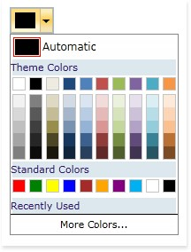
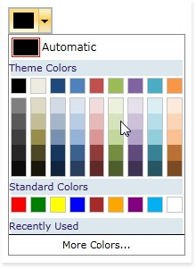

::: {style="DISPLAY: none"}
{#d2h_url_template}{#d2h_package_url style="WIDTH: 0px; DISPLAY: none; HEIGHT: 0px"}
:::

::: {.d2h_secondary_topic style="PADDING-BOTTOM: 10pt; MARGIN: 0pt; PADDING-LEFT: 0pt; PADDING-RIGHT: 0pt; PADDING-TOP: 0pt"}
#### []{#_Automatic_ColorSetting_Black}Automatic ColorSetting Black and White Visibility[]{#p433}

 

The user can set the visibility of White/Black or both colors. They can be either shown or hidden in the Theme Colors Panel. Theme Colors is a collection of eight predefined colors. The user can add Black or White or both colors in the panel, if required. This can be achieved using the BlackWhiteVisibility property.

 

The following is the code snippet illustrating **BlackWhiteVisibility** property.

 

+---------------------------------------------------------------------------------------------------------------------------------------------------------------------------------------------------------------------------------------------------------------------------------------------------------------------------------------------------------------------------------------------------------------------------------------------------------------------------------------------------------------------------------------------------------------------------------------------------------------------------+
| **[\[XAML\]]{style="FONT-FAMILY: 'Courier New'; COLOR: black"}**                                                                                                                                                                                                                                                                                                                                                                                                                                                                                                                                                          |
|                                                                                                                                                                                                                                                                                                                                                                                                                                                                                                                                                                                                                           |
| []{style="FONT-FAMILY: 'Courier New'; COLOR: #a31515"}                                                                                                                                                                                                                                                                                                                                                                                                                                                                                                                                                                    |
|                                                                                                                                                                                                                                                                                                                                                                                                                                                                                                                                                                                                                           |
| [\<]{style="FONT-FAMILY: 'Courier New'; COLOR: blue"}[Syncfusion]{style="FONT-FAMILY: 'Courier New'; COLOR: #a31515"}[:]{style="FONT-FAMILY: 'Courier New'; COLOR: blue"}[ColorPickerPalette]{style="FONT-FAMILY: 'Courier New'; COLOR: #a31515"}[ BlackWhiteVisibility]{style="FONT-FAMILY: 'Courier New'; COLOR: red"}[=\"Both\"]{style="FONT-FAMILY: 'Courier New'; COLOR: blue"}[  x]{style="FONT-FAMILY: 'Courier New'; COLOR: red"}[:]{style="FONT-FAMILY: 'Courier New'; COLOR: blue"}[Name]{style="FONT-FAMILY: 'Courier New'; COLOR: red"}[=\"ColorPicker\"\>]{style="FONT-FAMILY: 'Courier New'; COLOR: blue"}  |
|                                                                                                                                                                                                                                                                                                                                                                                                                                                                                                                                                                                                                           |
| [\</]{style="FONT-FAMILY: 'Courier New'; COLOR: blue"}[Syncfusion]{style="FONT-FAMILY: 'Courier New'; COLOR: #a31515"}[:]{style="FONT-FAMILY: 'Courier New'; COLOR: blue"}[ColorPickerPalette]{style="FONT-FAMILY: 'Courier New'; COLOR: #a31515"}[\>]{style="FONT-FAMILY: 'Courier New'; COLOR: blue"}                                                                                                                                                                                                                                                                                                                   |
|                                                                                                                                                                                                                                                                                                                                                                                                                                                                                                                                                                                                                           |
| []{style="FONT-FAMILY: 'Courier New'"}                                                                                                                                                                                                                                                                                                                                                                                                                                                                                                                                                                                    |
|                                                                                                                                                                                                                                                                                                                                                                                                                                                                                                                                                                                                                           |
| [\<]{style="FONT-FAMILY: 'Courier New'; COLOR: blue"}[Syncfusion]{style="FONT-FAMILY: 'Courier New'; COLOR: #a31515"}[:]{style="FONT-FAMILY: 'Courier New'; COLOR: blue"}[ColorPickerPalette]{style="FONT-FAMILY: 'Courier New'; COLOR: #a31515"}[ BlackWhiteVisibility]{style="FONT-FAMILY: 'Courier New'; COLOR: red"}[=\"Black\"]{style="FONT-FAMILY: 'Courier New'; COLOR: blue"}[  x]{style="FONT-FAMILY: 'Courier New'; COLOR: red"}[:]{style="FONT-FAMILY: 'Courier New'; COLOR: blue"}[Name]{style="FONT-FAMILY: 'Courier New'; COLOR: red"}[=\"ColorPicker\"\>]{style="FONT-FAMILY: 'Courier New'; COLOR: blue"} |
|                                                                                                                                                                                                                                                                                                                                                                                                                                                                                                                                                                                                                           |
| [\</]{style="FONT-FAMILY: 'Courier New'; COLOR: blue"}[Syncfusion]{style="FONT-FAMILY: 'Courier New'; COLOR: #a31515"}[:]{style="FONT-FAMILY: 'Courier New'; COLOR: blue"}[ColorPickerPalette]{style="FONT-FAMILY: 'Courier New'; COLOR: #a31515"}[\>]{style="FONT-FAMILY: 'Courier New'; COLOR: blue"}                                                                                                                                                                                                                                                                                                                   |
|                                                                                                                                                                                                                                                                                                                                                                                                                                                                                                                                                                                                                           |
| []{style="FONT-FAMILY: 'Courier New'"}                                                                                                                                                                                                                                                                                                                                                                                                                                                                                                                                                                                    |
|                                                                                                                                                                                                                                                                                                                                                                                                                                                                                                                                                                                                                           |
| [\<]{style="FONT-FAMILY: 'Courier New'; COLOR: blue"}[Syncfusion]{style="FONT-FAMILY: 'Courier New'; COLOR: #a31515"}[:]{style="FONT-FAMILY: 'Courier New'; COLOR: blue"}[ColorPickerPalette]{style="FONT-FAMILY: 'Courier New'; COLOR: #a31515"}[ BlackWhiteVisibility]{style="FONT-FAMILY: 'Courier New'; COLOR: red"}[=\"White\"]{style="FONT-FAMILY: 'Courier New'; COLOR: blue"}[  x]{style="FONT-FAMILY: 'Courier New'; COLOR: red"}[:]{style="FONT-FAMILY: 'Courier New'; COLOR: blue"}[Name]{style="FONT-FAMILY: 'Courier New'; COLOR: red"}[=\"ColorPicker\"\>]{style="FONT-FAMILY: 'Courier New'; COLOR: blue"} |
|                                                                                                                                                                                                                                                                                                                                                                                                                                                                                                                                                                                                                           |
| [\</]{style="FONT-FAMILY: 'Courier New'; COLOR: blue"}[Syncfusion]{style="FONT-FAMILY: 'Courier New'; COLOR: #a31515"}[:]{style="FONT-FAMILY: 'Courier New'; COLOR: blue"}[ColorPickerPalette]{style="FONT-FAMILY: 'Courier New'; COLOR: #a31515"}[\>]{style="FONT-FAMILY: 'Courier New'; COLOR: blue"}                                                                                                                                                                                                                                                                                                                   |
+---------------------------------------------------------------------------------------------------------------------------------------------------------------------------------------------------------------------------------------------------------------------------------------------------------------------------------------------------------------------------------------------------------------------------------------------------------------------------------------------------------------------------------------------------------------------------------------------------------------------------+

 

+---------------------------------------------------------------------------------------------------------------------------------------------------------------------------------------------------------+
| **[\[C#\]]{style="FONT-FAMILY: 'Courier New'; COLOR: black"}**                                                                                                                                          |
|                                                                                                                                                                                                         |
| []{style="FONT-FAMILY: 'Courier New'; COLOR: black"}                                                                                                                                                    |
|                                                                                                                                                                                                         |
| [ColorPickerPalette]{style="FONT-FAMILY: 'Courier New'; COLOR: #2b91af"}[ colorPicker = [new]{style="COLOR: blue"} [ColorPickerPalette]{style="COLOR: #2b91af"}();]{style="FONT-FAMILY: 'Courier New'"} |
|                                                                                                                                                                                                         |
| [colorPicker.BlackWhiteVisibility = [BlackWhiteVisible]{style="COLOR: #2b91af"}.Both;]{style="FONT-FAMILY: 'Courier New'"}                                                                              |
|                                                                                                                                                                                                         |
| [colorPicker.BlackWhiteVisibility = [BlackWhiteVisible]{style="COLOR: #2b91af"}.Black;]{style="FONT-FAMILY: 'Courier New'"}                                                                             |
|                                                                                                                                                                                                         |
| [colorPicker.BlackWhiteVisibility = [BlackWhiteVisible]{style="COLOR: #2b91af"}.White;]{style="FONT-FAMILY: 'Courier New'"}                                                                             |
+---------------------------------------------------------------------------------------------------------------------------------------------------------------------------------------------------------+

 

Run the application. The following output is displayed.

 

{border="0"}

 

Figure 967: Color Picker with BlackWhiteVisibility set to Both (Black and White are Visible)

**** 

{border="0"}

**** 

Figure 968: Color Picker with BlackWhiteVisibility set to Black(White is Hidden)

[]{#related-topics}
:::
