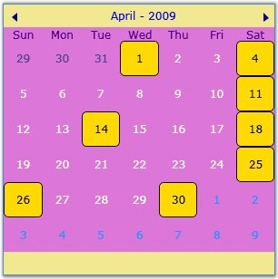

::: {style="DISPLAY: none"}
{#d2h_url_template}{#d2h_package_url style="WIDTH: 0px; DISPLAY: none; HEIGHT: 0px"}
:::

::: {.d2h_secondary_topic style="PADDING-BOTTOM: 10pt; MARGIN: 0pt; PADDING-LEFT: 0pt; PADDING-RIGHT: 0pt; PADDING-TOP: 0pt"}
##### []{#_Background_Color_2}Background Color

[]{#p246} 

You can set the background color for the CalendarControl by using the **Background** property. The following code example illustrates how to set this property.

 

+-----------------------------------------------------------------------------------------------------------------------------------------------------------------------------------------------------------------------------------------------------------------------------------------------------------------------------------------------------------------------------------------------------------------------------------------------------------------------------------------------------------+
| **[\[XAML\]]{style="FONT-FAMILY: 'Courier New'; COLOR: black"}**                                                                                                                                                                                                                                                                                                                                                                                                                                          |
|                                                                                                                                                                                                                                                                                                                                                                                                                                                                                                           |
| []{style="FONT-FAMILY: 'Courier New'; COLOR: black"}                                                                                                                                                                                                                                                                                                                                                                                                                                                      |
|                                                                                                                                                                                                                                                                                                                                                                                                                                                                                                           |
| [\<]{style="FONT-FAMILY: 'Courier New'; COLOR: blue"}[Syncfusion]{style="FONT-FAMILY: 'Courier New'; COLOR: maroon"}[:]{style="FONT-FAMILY: 'Courier New'; COLOR: blue"}[CalendarControl]{style="FONT-FAMILY: 'Courier New'; COLOR: maroon"}[ [x]{style="COLOR: maroon"}[:]{style="COLOR: blue"}[Name]{style="COLOR: red"}[="calendarcontrol"]{style="COLOR: blue"} [Background]{style="COLOR: red"}[=\"RoyalBlue\"]{style="COLOR: blue"} [/\>]{style="COLOR: blue"}]{style="FONT-FAMILY: 'Courier New'"} |
+-----------------------------------------------------------------------------------------------------------------------------------------------------------------------------------------------------------------------------------------------------------------------------------------------------------------------------------------------------------------------------------------------------------------------------------------------------------------------------------------------------------+

 

+----------------------------------------------------------------------------------------------------------------------------------+
| **[\[C#\]]{style="FONT-FAMILY: 'Courier New'; COLOR: black"}**                                                                   |
|                                                                                                                                  |
| []{style="FONT-FAMILY: 'Courier New'"}                                                                                           |
|                                                                                                                                  |
| [CalendarControl calendarcontrol = [new]{style="COLOR: blue"} CalendarControl();]{style="FONT-FAMILY: 'Courier New'"}            |
|                                                                                                                                  |
| [calendarcontrol.Background = [new]{style="COLOR: blue"} SolidColorBrush(Colors.RoyalBlue);]{style="FONT-FAMILY: 'Courier New'"} |
+----------------------------------------------------------------------------------------------------------------------------------+

 

{border="0"}

 

Figure 472: Background = \"Orchid\"

[]{#related-topics}
:::
