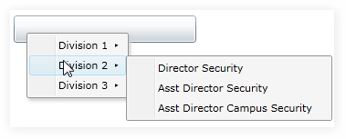

::: {style="DISPLAY: none"}
{#d2h_url_template}{#d2h_package_url style="WIDTH: 0px; DISPLAY: none; HEIGHT: 0px"}
:::

::: {.d2h_secondary_topic style="PADDING-BOTTOM: 10pt; MARGIN: 0pt; PADDING-LEFT: 0pt; PADDING-RIGHT: 0pt; PADDING-TOP: 0pt"}
#### Binding and Date Template

Use ItemsSource property, to bind ContextMenuAdv to a collection of business objects. . The hierarchical data template allows you to bind data that is hierarchical and self-referencing.

+------------------------------------------------------------------------------------------------------------------------------------------------------------------------------------------------------------------------------------------------------------------------------------------------------------------------------------------------------------------------------------------------------------------------------------------------------------------------------------------------------------------------------------------------------------------------------------------------------------------------------------------------------------------------------------------------------------------------------------------------------------------------------------------------------------------------------------------------------------------------------------------------------------------------------------------------------------------------------------+
| **[\[XAML\]]{style="FONT-SIZE: 12pt"}**                                                                                                                                                                                                                                                                                                                                                                                                                                                                                                                                                                                                                                                                                                                                                                                                                                                                                                                                            |
|                                                                                                                                                                                                                                                                                                                                                                                                                                                                                                                                                                                                                                                                                                                                                                                                                                                                                                                                                                                    |
| **[]{style="FONT-SIZE: 12pt"}**                                                                                                                                                                                                                                                                                                                                                                                                                                                                                                                                                                                                                                                                                                                                                                                                                                                                                                                                                    |
|                                                                                                                                                                                                                                                                                                                                                                                                                                                                                                                                                                                                                                                                                                                                                                                                                                                                                                                                                                                    |
| [\<]{style="FONT-FAMILY: 'Calibri','sans-serif'; COLOR: blue; FONT-SIZE: 9.5pt"}[context]{style="FONT-FAMILY: 'Calibri','sans-serif'; COLOR: #a31515; FONT-SIZE: 9.5pt"}[:]{style="FONT-FAMILY: 'Calibri','sans-serif'; COLOR: blue; FONT-SIZE: 9.5pt"}[ContextMenuAdvService.ContextMenuAdv]{style="FONT-FAMILY: 'Calibri','sans-serif'; COLOR: #a31515; FONT-SIZE: 9.5pt"}[\>]{style="FONT-FAMILY: 'Calibri','sans-serif'; COLOR: blue; FONT-SIZE: 9.5pt"}[]{style="FONT-FAMILY: 'Calibri','sans-serif'; FONT-SIZE: 9.5pt"}                                                                                                                                                                                                                                                                                                                                                                                                                                                      |
|                                                                                                                                                                                                                                                                                                                                                                                                                                                                                                                                                                                                                                                                                                                                                                                                                                                                                                                                                                                    |
| [                ]{style="FONT-FAMILY: 'Calibri','sans-serif'; COLOR: #a31515; FONT-SIZE: 9.5pt"}[\<]{style="FONT-FAMILY: 'Calibri','sans-serif'; COLOR: blue; FONT-SIZE: 9.5pt"}[context]{style="FONT-FAMILY: 'Calibri','sans-serif'; COLOR: #a31515; FONT-SIZE: 9.5pt"}[:]{style="FONT-FAMILY: 'Calibri','sans-serif'; COLOR: blue; FONT-SIZE: 9.5pt"}[ContextMenuAdv]{style="FONT-FAMILY: 'Calibri','sans-serif'; COLOR: #a31515; FONT-SIZE: 9.5pt"}[\>]{style="FONT-FAMILY: 'Calibri','sans-serif'; COLOR: blue; FONT-SIZE: 9.5pt"}                                                                                                                                                                                                                                                                                                                                                                                                                                            |
|                                                                                                                                                                                                                                                                                                                                                                                                                                                                                                                                                                                                                                                                                                                                                                                                                                                                                                                                                                                    |
| [                    \<!\--ItemSource Binding\--\>]{style="FONT-FAMILY: 'Calibri','sans-serif'; COLOR: green; FONT-SIZE: 9.5pt"}                                                                                                                                                                                                                                                                                                                                                                                                                                                                                                                                                                                                                                                                                                                                                                                                                                                   |
|                                                                                                                                                                                                                                                                                                                                                                                                                                                                                                                                                                                                                                                                                                                                                                                                                                                                                                                                                                                    |
| [                    ]{style="FONT-FAMILY: 'Calibri','sans-serif'; COLOR: #a31515; FONT-SIZE: 9.5pt"}[\<]{style="FONT-FAMILY: 'Calibri','sans-serif'; COLOR: blue; FONT-SIZE: 9.5pt"}[context]{style="FONT-FAMILY: 'Calibri','sans-serif'; COLOR: #a31515; FONT-SIZE: 9.5pt"}[:]{style="FONT-FAMILY: 'Calibri','sans-serif'; COLOR: blue; FONT-SIZE: 9.5pt"}[ContextMenuAdv.ItemsSource]{style="FONT-FAMILY: 'Calibri','sans-serif'; COLOR: #a31515; FONT-SIZE: 9.5pt"}[\>]{style="FONT-FAMILY: 'Calibri','sans-serif'; COLOR: blue; FONT-SIZE: 9.5pt"}[]{style="FONT-FAMILY: 'Calibri','sans-serif'; FONT-SIZE: 9.5pt"}                                                                                                                                                                                                                                                                                                                                                           |
|                                                                                                                                                                                                                                                                                                                                                                                                                                                                                                                                                                                                                                                                                                                                                                                                                                                                                                                                                                                    |
| [                        ]{style="FONT-FAMILY: 'Calibri','sans-serif'; COLOR: #a31515; FONT-SIZE: 9.5pt"}[\<]{style="FONT-FAMILY: 'Calibri','sans-serif'; COLOR: blue; FONT-SIZE: 9.5pt"}[local]{style="FONT-FAMILY: 'Calibri','sans-serif'; COLOR: #a31515; FONT-SIZE: 9.5pt"}[:]{style="FONT-FAMILY: 'Calibri','sans-serif'; COLOR: blue; FONT-SIZE: 9.5pt"}[CustomItemSource]{style="FONT-FAMILY: 'Calibri','sans-serif'; COLOR: #a31515; FONT-SIZE: 9.5pt"}[/\>]{style="FONT-FAMILY: 'Calibri','sans-serif'; COLOR: blue; FONT-SIZE: 9.5pt"}[]{style="FONT-FAMILY: 'Calibri','sans-serif'; FONT-SIZE: 9.5pt"}                                                                                                                                                                                                                                                                                                                                                                  |
|                                                                                                                                                                                                                                                                                                                                                                                                                                                                                                                                                                                                                                                                                                                                                                                                                                                                                                                                                                                    |
| [                    ]{style="FONT-FAMILY: 'Calibri','sans-serif'; COLOR: #a31515; FONT-SIZE: 9.5pt"}[\</]{style="FONT-FAMILY: 'Calibri','sans-serif'; COLOR: blue; FONT-SIZE: 9.5pt"}[context]{style="FONT-FAMILY: 'Calibri','sans-serif'; COLOR: #a31515; FONT-SIZE: 9.5pt"}[:]{style="FONT-FAMILY: 'Calibri','sans-serif'; COLOR: blue; FONT-SIZE: 9.5pt"}[ContextMenuAdv.ItemsSource]{style="FONT-FAMILY: 'Calibri','sans-serif'; COLOR: #a31515; FONT-SIZE: 9.5pt"}[\>]{style="FONT-FAMILY: 'Calibri','sans-serif'; COLOR: blue; FONT-SIZE: 9.5pt"}                                                                                                                                                                                                                                                                                                                                                                                                                           |
|                                                                                                                                                                                                                                                                                                                                                                                                                                                                                                                                                                                                                                                                                                                                                                                                                                                                                                                                                                                    |
| [                    \<!\--Item Template\--\>]{style="FONT-FAMILY: 'Calibri','sans-serif'; COLOR: green; FONT-SIZE: 9.5pt"}                                                                                                                                                                                                                                                                                                                                                                                                                                                                                                                                                                                                                                                                                                                                                                                                                                                        |
|                                                                                                                                                                                                                                                                                                                                                                                                                                                                                                                                                                                                                                                                                                                                                                                                                                                                                                                                                                                    |
| [                    ]{style="FONT-FAMILY: 'Calibri','sans-serif'; COLOR: #a31515; FONT-SIZE: 9.5pt"}[\<]{style="FONT-FAMILY: 'Calibri','sans-serif'; COLOR: blue; FONT-SIZE: 9.5pt"}[context]{style="FONT-FAMILY: 'Calibri','sans-serif'; COLOR: #a31515; FONT-SIZE: 9.5pt"}[:]{style="FONT-FAMILY: 'Calibri','sans-serif'; COLOR: blue; FONT-SIZE: 9.5pt"}[ContextMenuAdv.ItemTemplate]{style="FONT-FAMILY: 'Calibri','sans-serif'; COLOR: #a31515; FONT-SIZE: 9.5pt"}[\>]{style="FONT-FAMILY: 'Calibri','sans-serif'; COLOR: blue; FONT-SIZE: 9.5pt"}[]{style="FONT-FAMILY: 'Calibri','sans-serif'; FONT-SIZE: 9.5pt"}                                                                                                                                                                                                                                                                                                                                                          |
|                                                                                                                                                                                                                                                                                                                                                                                                                                                                                                                                                                                                                                                                                                                                                                                                                                                                                                                                                                                    |
| [                        ]{style="FONT-FAMILY: 'Calibri','sans-serif'; COLOR: #a31515; FONT-SIZE: 9.5pt"}[\<]{style="FONT-FAMILY: 'Calibri','sans-serif'; COLOR: blue; FONT-SIZE: 9.5pt"}[common]{style="FONT-FAMILY: 'Calibri','sans-serif'; COLOR: #a31515; FONT-SIZE: 9.5pt"}[:]{style="FONT-FAMILY: 'Calibri','sans-serif'; COLOR: blue; FONT-SIZE: 9.5pt"}[HierarchicalDataTemplate]{style="FONT-FAMILY: 'Calibri','sans-serif'; COLOR: #a31515; FONT-SIZE: 9.5pt"}[ ItemsSource]{style="FONT-FAMILY: 'Calibri','sans-serif'; COLOR: red; FONT-SIZE: 9.5pt"}[=\"{]{style="FONT-FAMILY: 'Calibri','sans-serif'; COLOR: blue; FONT-SIZE: 9.5pt"}[Binding]{style="FONT-FAMILY: 'Calibri','sans-serif'; COLOR: #a31515; FONT-SIZE: 9.5pt"}[ Items]{style="FONT-FAMILY: 'Calibri','sans-serif'; COLOR: red; FONT-SIZE: 9.5pt"}[}\"\>]{style="FONT-FAMILY: 'Calibri','sans-serif'; COLOR: blue; FONT-SIZE: 9.5pt"}[]{style="FONT-FAMILY: 'Calibri','sans-serif'; FONT-SIZE: 9.5pt"} |
|                                                                                                                                                                                                                                                                                                                                                                                                                                                                                                                                                                                                                                                                                                                                                                                                                                                                                                                                                                                    |
| [                            ]{style="FONT-FAMILY: 'Calibri','sans-serif'; COLOR: #a31515; FONT-SIZE: 9.5pt"}[\<]{style="FONT-FAMILY: 'Calibri','sans-serif'; COLOR: blue; FONT-SIZE: 9.5pt"}[TextBlock]{style="FONT-FAMILY: 'Calibri','sans-serif'; COLOR: #a31515; FONT-SIZE: 9.5pt"}[ Text]{style="FONT-FAMILY: 'Calibri','sans-serif'; COLOR: red; FONT-SIZE: 9.5pt"}[=\"{]{style="FONT-FAMILY: 'Calibri','sans-serif'; COLOR: blue; FONT-SIZE: 9.5pt"}[Binding]{style="FONT-FAMILY: 'Calibri','sans-serif'; COLOR: #a31515; FONT-SIZE: 9.5pt"}[ myString]{style="FONT-FAMILY: 'Calibri','sans-serif'; COLOR: red; FONT-SIZE: 9.5pt"}[}\"/\>]{style="FONT-FAMILY: 'Calibri','sans-serif'; COLOR: blue; FONT-SIZE: 9.5pt"}[]{style="FONT-FAMILY: 'Calibri','sans-serif'; FONT-SIZE: 9.5pt"}                                                                                                                                                                                     |
|                                                                                                                                                                                                                                                                                                                                                                                                                                                                                                                                                                                                                                                                                                                                                                                                                                                                                                                                                                                    |
| [                        ]{style="FONT-FAMILY: 'Calibri','sans-serif'; COLOR: #a31515; FONT-SIZE: 9.5pt"}[\</]{style="FONT-FAMILY: 'Calibri','sans-serif'; COLOR: blue; FONT-SIZE: 9.5pt"}[common]{style="FONT-FAMILY: 'Calibri','sans-serif'; COLOR: #a31515; FONT-SIZE: 9.5pt"}[:]{style="FONT-FAMILY: 'Calibri','sans-serif'; COLOR: blue; FONT-SIZE: 9.5pt"}[HierarchicalDataTemplate]{style="FONT-FAMILY: 'Calibri','sans-serif'; COLOR: #a31515; FONT-SIZE: 9.5pt"}[\>]{style="FONT-FAMILY: 'Calibri','sans-serif'; COLOR: blue; FONT-SIZE: 9.5pt"}[]{style="FONT-FAMILY: 'Calibri','sans-serif'; FONT-SIZE: 9.5pt"}                                                                                                                                                                                                                                                                                                                                                         |
|                                                                                                                                                                                                                                                                                                                                                                                                                                                                                                                                                                                                                                                                                                                                                                                                                                                                                                                                                                                    |
| [                    ]{style="FONT-FAMILY: 'Calibri','sans-serif'; COLOR: #a31515; FONT-SIZE: 9.5pt"}[\</]{style="FONT-FAMILY: 'Calibri','sans-serif'; COLOR: blue; FONT-SIZE: 9.5pt"}[context]{style="FONT-FAMILY: 'Calibri','sans-serif'; COLOR: #a31515; FONT-SIZE: 9.5pt"}[:]{style="FONT-FAMILY: 'Calibri','sans-serif'; COLOR: blue; FONT-SIZE: 9.5pt"}[ContextMenuAdv.ItemTemplate]{style="FONT-FAMILY: 'Calibri','sans-serif'; COLOR: #a31515; FONT-SIZE: 9.5pt"}[\>]{style="FONT-FAMILY: 'Calibri','sans-serif'; COLOR: blue; FONT-SIZE: 9.5pt"}[]{style="FONT-FAMILY: 'Calibri','sans-serif'; FONT-SIZE: 9.5pt"}                                                                                                                                                                                                                                                                                                                                                         |
|                                                                                                                                                                                                                                                                                                                                                                                                                                                                                                                                                                                                                                                                                                                                                                                                                                                                                                                                                                                    |
| [                ]{style="FONT-FAMILY: 'Calibri','sans-serif'; COLOR: #a31515; FONT-SIZE: 9.5pt"}[\</]{style="FONT-FAMILY: 'Calibri','sans-serif'; COLOR: blue; FONT-SIZE: 9.5pt"}[context]{style="FONT-FAMILY: 'Calibri','sans-serif'; COLOR: #a31515; FONT-SIZE: 9.5pt"}[:]{style="FONT-FAMILY: 'Calibri','sans-serif'; COLOR: blue; FONT-SIZE: 9.5pt"}[ContextMenuAdv]{style="FONT-FAMILY: 'Calibri','sans-serif'; COLOR: #a31515; FONT-SIZE: 9.5pt"}[\>]{style="FONT-FAMILY: 'Calibri','sans-serif'; COLOR: blue; FONT-SIZE: 9.5pt"}[]{style="FONT-FAMILY: 'Calibri','sans-serif'; FONT-SIZE: 9.5pt"}                                                                                                                                                                                                                                                                                                                                                                          |
|                                                                                                                                                                                                                                                                                                                                                                                                                                                                                                                                                                                                                                                                                                                                                                                                                                                                                                                                                                                    |
| [    \</]{style="FONT-FAMILY: 'Calibri','sans-serif'; COLOR: blue; FONT-SIZE: 9.5pt"}[context]{style="FONT-FAMILY: 'Calibri','sans-serif'; COLOR: #a31515; FONT-SIZE: 9.5pt"}[:]{style="FONT-FAMILY: 'Calibri','sans-serif'; COLOR: blue; FONT-SIZE: 9.5pt"}[ContextMenuAdvService.ContextMenuAdv]{style="FONT-FAMILY: 'Calibri','sans-serif'; COLOR: #a31515; FONT-SIZE: 9.5pt"}[\>]{style="FONT-FAMILY: 'Calibri','sans-serif'; COLOR: blue; FONT-SIZE: 9.5pt"}**[]{style="FONT-SIZE: 11pt"}**                                                                                                                                                                                                                                                                                                                                                                                                                                                                                   |
+------------------------------------------------------------------------------------------------------------------------------------------------------------------------------------------------------------------------------------------------------------------------------------------------------------------------------------------------------------------------------------------------------------------------------------------------------------------------------------------------------------------------------------------------------------------------------------------------------------------------------------------------------------------------------------------------------------------------------------------------------------------------------------------------------------------------------------------------------------------------------------------------------------------------------------------------------------------------------------+

[]{style="FONT-FAMILY: 'Calibri','sans-serif'; COLOR: black; FONT-SIZE: 11pt"} 

The following is the Business Object used in this example.

+--------------------------------------------------------------------------------------------------------------------------------------------------------------------------------------------------------------------------------------------------------------------------+
| **[\[XAML\]]{style="FONT-SIZE: 12pt"}**                                                                                                                                                                                                                                  |
|                                                                                                                                                                                                                                                                          |
| []{style="FONT-FAMILY: 'Calibri','sans-serif'; FONT-SIZE: 11pt"}                                                                                                                                                                                                         |
|                                                                                                                                                                                                                                                                          |
| [    [public]{style="COLOR: blue"} [class]{style="COLOR: blue"} [CustomItemSource]{style="COLOR: #2b91af"} : [ObservableCollection]{style="COLOR: #2b91af"}\<[ObjectModel]{style="COLOR: #2b91af"}\>]{style="FONT-FAMILY: 'Calibri','sans-serif'; FONT-SIZE: 9.5pt"}     |
|                                                                                                                                                                                                                                                                          |
| [    {]{style="FONT-FAMILY: 'Calibri','sans-serif'; FONT-SIZE: 9.5pt"}                                                                                                                                                                                                   |
|                                                                                                                                                                                                                                                                          |
| [        [public]{style="COLOR: blue"} CustomItemSource()]{style="FONT-FAMILY: 'Calibri','sans-serif'; FONT-SIZE: 9.5pt"}                                                                                                                                                |
|                                                                                                                                                                                                                                                                          |
| [        {]{style="FONT-FAMILY: 'Calibri','sans-serif'; FONT-SIZE: 9.5pt"}                                                                                                                                                                                               |
|                                                                                                                                                                                                                                                                          |
| [            [this]{style="COLOR: blue"}.Add([new]{style="COLOR: blue"} [ObjectModel]{style="COLOR: #2b91af"}([\"Division 1\"]{style="COLOR: #a31515"},]{style="FONT-FAMILY: 'Calibri','sans-serif'; FONT-SIZE: 9.5pt"}                                                  |
|                                                                                                                                                                                                                                                                          |
| [                         [new]{style="COLOR: blue"} [ObjectModel]{style="COLOR: #2b91af"}([\"Director Fire & Life Safety\"]{style="COLOR: #a31515"}, ]{style="FONT-FAMILY: 'Calibri','sans-serif'; FONT-SIZE: 9.5pt"}                                                   |
|                                                                                                                                                                                                                                                                          |
| [                             [new]{style="COLOR: blue"} [ObjectModel]{style="COLOR: #2b91af"}([\"Asst Dr.Emergency Preparedness\"]{style="COLOR: #a31515"})),]{style="FONT-FAMILY: 'Calibri','sans-serif'; FONT-SIZE: 9.5pt"}                                           |
|                                                                                                                                                                                                                                                                          |
| [                         [new]{style="COLOR: blue"} [ObjectModel]{style="COLOR: #2b91af"}([\"Director Security\"]{style="COLOR: #a31515"}, ]{style="FONT-FAMILY: 'Calibri','sans-serif'; FONT-SIZE: 9.5pt"}                                                             |
|                                                                                                                                                                                                                                                                          |
| [                             new]{style="FONT-FAMILY: 'Calibri','sans-serif'; COLOR: blue; FONT-SIZE: 9.5pt"}[ [ObjectModel]{style="COLOR: #2b91af"}([\"Medical Security\"]{style="COLOR: #a31515"}), ]{style="FONT-FAMILY: 'Calibri','sans-serif'; FONT-SIZE: 9.5pt"}  |
|                                                                                                                                                                                                                                                                          |
| [                             new]{style="FONT-FAMILY: 'Calibri','sans-serif'; COLOR: blue; FONT-SIZE: 9.5pt"}[ [ObjectModel]{style="COLOR: #2b91af"}([\"Campus Security\"]{style="COLOR: #a31515"}))));]{style="FONT-FAMILY: 'Calibri','sans-serif'; FONT-SIZE: 9.5pt"} |
|                                                                                                                                                                                                                                                                          |
| [            [this]{style="COLOR: blue"}.Add([new]{style="COLOR: blue"} [ObjectModel]{style="COLOR: #2b91af"}([\"Division 2\"]{style="COLOR: #a31515"}, ]{style="FONT-FAMILY: 'Calibri','sans-serif'; FONT-SIZE: 9.5pt"}                                                 |
|                                                                                                                                                                                                                                                                          |
| [                         [new]{style="COLOR: blue"} [ObjectModel]{style="COLOR: #2b91af"}([\"Director Security\"]{style="COLOR: #a31515"}), ]{style="FONT-FAMILY: 'Calibri','sans-serif'; FONT-SIZE: 9.5pt"}                                                            |
|                                                                                                                                                                                                                                                                          |
| [                         [new]{style="COLOR: blue"} [ObjectModel]{style="COLOR: #2b91af"}([\"Asst Director Security\"]{style="COLOR: #a31515"}), ]{style="FONT-FAMILY: 'Calibri','sans-serif'; FONT-SIZE: 9.5pt"}                                                       |
|                                                                                                                                                                                                                                                                          |
| [                         [new]{style="COLOR: blue"} [ObjectModel]{style="COLOR: #2b91af"}([\"Asst Director Campus Security\"]{style="COLOR: #a31515"})));]{style="FONT-FAMILY: 'Calibri','sans-serif'; FONT-SIZE: 9.5pt"}                                               |
|                                                                                                                                                                                                                                                                          |
| [            [this]{style="COLOR: blue"}.Add([new]{style="COLOR: blue"} [ObjectModel]{style="COLOR: #2b91af"}([\"Division 3\"]{style="COLOR: #a31515"},]{style="FONT-FAMILY: 'Calibri','sans-serif'; FONT-SIZE: 9.5pt"}                                                  |
|                                                                                                                                                                                                                                                                          |
| [                         [new]{style="COLOR: blue"} [ObjectModel]{style="COLOR: #2b91af"}([\"Teaching Professional\"]{style="COLOR: #a31515"}, ]{style="FONT-FAMILY: 'Calibri','sans-serif'; FONT-SIZE: 9.5pt"}                                                         |
|                                                                                                                                                                                                                                                                          |
| [                            [new]{style="COLOR: blue"} [ObjectModel]{style="COLOR: #2b91af"}([\"Co-ordinator\"]{style="COLOR: #a31515"}))));]{style="FONT-FAMILY: 'Calibri','sans-serif'; FONT-SIZE: 9.5pt"}                                                            |
|                                                                                                                                                                                                                                                                          |
| [        }]{style="FONT-FAMILY: 'Calibri','sans-serif'; FONT-SIZE: 9.5pt"}                                                                                                                                                                                               |
|                                                                                                                                                                                                                                                                          |
| [    }]{style="FONT-FAMILY: 'Calibri','sans-serif'; FONT-SIZE: 9.5pt"}[]{style="FONT-FAMILY: 'Calibri','sans-serif'; FONT-SIZE: 11pt"}                                                                                                                                   |
+--------------------------------------------------------------------------------------------------------------------------------------------------------------------------------------------------------------------------------------------------------------------------+

[]{style="FONT-FAMILY: 'Calibri','sans-serif'; FONT-SIZE: 11pt"} 

[]{style="FONT-FAMILY: 'Calibri','sans-serif'; FONT-SIZE: 11pt"} 

{border="0"}

Figure 887: ContextMenuAdv

[]{#related-topics}
:::
