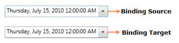

::: {style="DISPLAY: none"}
{#d2h_url_template}{#d2h_package_url style="WIDTH: 0px; DISPLAY: none; HEIGHT: 0px"}
:::

::: {.d2h_secondary_topic style="PADDING-BOTTOM: 10pt; MARGIN: 0pt; PADDING-LEFT: 0pt; PADDING-RIGHT: 0pt; PADDING-TOP: 0pt"}
#### []{#_Culture}[]{#_Culture_Support}Binding Support

Data binding is the process of establishing connection between application UI and business logic. Databinding can be unidirectional (source to target), or bidirectional (source to target and target to source). User can bind the data to DateTimeEdit control through DateTime property.

 

The following example shows a simple binding between the **DateTime** property of DateTimeEditcontrol and another DateTimeEdit control.

 

+-----------------------------------------------------------------------------------------------------------------------------------------------------------------------------------------------------------------------------------------------------------------------------------------------------------------------------------------------------------------------------------------------------------------------------------------------------------------------------------------------------------------------------------------------------------------------------------------------------------------------------------------------------------------------------------------------------------------------------------------------------------------------------------------------------------------------------------------------------------------------------------------------+
| [XAML]{style="COLOR: white"}                                                                                                                                                                                                                                                                                                                                                                                                                                                                                                                                                                                                                                                                                                                                                                                                                                                                  |
+-----------------------------------------------------------------------------------------------------------------------------------------------------------------------------------------------------------------------------------------------------------------------------------------------------------------------------------------------------------------------------------------------------------------------------------------------------------------------------------------------------------------------------------------------------------------------------------------------------------------------------------------------------------------------------------------------------------------------------------------------------------------------------------------------------------------------------------------------------------------------------------------------+
| [\<]{style="FONT-FAMILY: Consolas; COLOR: blue; FONT-SIZE: 9.5pt"}[syncfusion]{style="FONT-FAMILY: 'Courier New'; COLOR: #a31515"}[:]{style="FONT-FAMILY: 'Courier New'; COLOR: blue"}[DateTimeEdit]{style="FONT-FAMILY: 'Courier New'; COLOR: #a31515"}[ x]{style="FONT-FAMILY: 'Courier New'; COLOR: red"}[:]{style="FONT-FAMILY: 'Courier New'; COLOR: blue"}[Name]{style="FONT-FAMILY: 'Courier New'; COLOR: red"}[=\"dateTimeEdit1\"]{style="FONT-FAMILY: 'Courier New'; COLOR: blue"}[ Height]{style="FONT-FAMILY: 'Courier New'; COLOR: red"}[=\"25\"]{style="FONT-FAMILY: 'Courier New'; COLOR: blue"}[ Width]{style="FONT-FAMILY: 'Courier New'; COLOR: red"}[=\"220\"]{style="FONT-FAMILY: 'Courier New'; COLOR: blue"}[ Margin]{style="FONT-FAMILY: 'Courier New'; COLOR: red"}[=\"10\"/\>]{style="FONT-FAMILY: 'Courier New'; COLOR: blue"}[]{style="FONT-FAMILY: 'Courier New'"} |
|                                                                                                                                                                                                                                                                                                                                                                                                                                                                                                                                                                                                                                                                                                                                                                                                                                                                                               |
| []{style="FONT-FAMILY: 'Courier New'; COLOR: blue"}                                                                                                                                                                                                                                                                                                                                                                                                                                                                                                                                                                                                                                                                                                                                                                                                                                           |
|                                                                                                                                                                                                                                                                                                                                                                                                                                                                                                                                                                                                                                                                                                                                                                                                                                                                                               |
| [\<]{style="FONT-FAMILY: 'Courier New'; COLOR: blue"}[syncfusion]{style="FONT-FAMILY: 'Courier New'; COLOR: #a31515"}[:]{style="FONT-FAMILY: 'Courier New'; COLOR: blue"}[DateTimeEdit]{style="FONT-FAMILY: 'Courier New'; COLOR: #a31515"}[ x]{style="FONT-FAMILY: 'Courier New'; COLOR: red"}[:]{style="FONT-FAMILY: 'Courier New'; COLOR: blue"}[Name]{style="FONT-FAMILY: 'Courier New'; COLOR: red"}[=\"dateTimeEdit2\"]{style="FONT-FAMILY: 'Courier New'; COLOR: blue"}[ Height]{style="FONT-FAMILY: 'Courier New'; COLOR: red"}[=\"25\"]{style="FONT-FAMILY: 'Courier New'; COLOR: blue"}[ Width]{style="FONT-FAMILY: 'Courier New'; COLOR: red"}[=\"220\"]{style="FONT-FAMILY: 'Courier New'; COLOR: blue"}[ ]{style="FONT-FAMILY: 'Courier New'; COLOR: red"}                                                                                                                       |
|                                                                                                                                                                                                                                                                                                                                                                                                                                                                                                                                                                                                                                                                                                                                                                                                                                                                                               |
| [                         DateTime]{style="FONT-FAMILY: 'Courier New'; COLOR: red"}[=\"{]{style="FONT-FAMILY: 'Courier New'; COLOR: blue"}[Binding]{style="FONT-FAMILY: 'Courier New'; COLOR: #a31515"}[ ElementName]{style="FONT-FAMILY: 'Courier New'; COLOR: red"}[=dateTimeEdit1, ]{style="FONT-FAMILY: 'Courier New'; COLOR: blue"}                                                                                                                                                                                                                                                                                                                                                                                                                                                                                                                                                      |
|                                                                                                                                                                                                                                                                                                                                                                                                                                                                                                                                                                                                                                                                                                                                                                                                                                                                                               |
| [                                            ]{style="FONT-FAMILY: 'Courier New'; COLOR: blue"}[Path]{style="FONT-FAMILY: 'Courier New'; COLOR: red"}[=DateTime,]{style="FONT-FAMILY: 'Courier New'; COLOR: blue"}[Mode]{style="FONT-FAMILY: 'Courier New'; COLOR: red"}[=TwoWay}\"]{style="FONT-FAMILY: 'Courier New'; COLOR: blue"}[]{style="FONT-FAMILY: 'Courier New'; COLOR: red"}                                                                                                                                                                                                                                                                                                                                                                                                                                                                                                       |
|                                                                                                                                                                                                                                                                                                                                                                                                                                                                                                                                                                                                                                                                                                                                                                                                                                                                                               |
| [                         Margin]{style="FONT-FAMILY: 'Courier New'; COLOR: red"}[=\"10\"/\>]{style="FONT-FAMILY: 'Courier New'; COLOR: blue"}*[]{style="FONT-FAMILY: Consolas; COLOR: blue; FONT-SIZE: 9.5pt"}*                                                                                                                                                                                                                                                                                                                                                                                                                                                                                                                                                                                                                                                                              |
+-----------------------------------------------------------------------------------------------------------------------------------------------------------------------------------------------------------------------------------------------------------------------------------------------------------------------------------------------------------------------------------------------------------------------------------------------------------------------------------------------------------------------------------------------------------------------------------------------------------------------------------------------------------------------------------------------------------------------------------------------------------------------------------------------------------------------------------------------------------------------------------------------+

 

{border="0"}*[]{style="COLOR: black"}*

Figure 427: Data binding source and Target[]{style="COLOR: black"}

See Also

[Setting Date]{.UGHyperlink}[]{.UGHyperlink}

[NullValue Support]{.UGHyperlink}[]{.UGHyperlink}

[Maximum and Minimum Value]{.UGHyperlink}[]{.UGHyperlink}

[]{#related-topics}
:::
