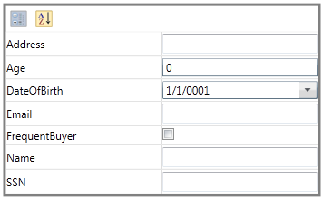

::: {style="DISPLAY: none"}
{#d2h_url_template}{#d2h_package_url style="WIDTH: 0px; DISPLAY: none; HEIGHT: 0px"}
:::

::: {.d2h_secondary_topic style="PADDING-BOTTOM: 10pt; MARGIN: 0pt; PADDING-LEFT: 0pt; PADDING-RIGHT: 0pt; PADDING-TOP: 0pt"}
#### Binding with any object

Denotes the object for which PropertyGrid displays Properties. You can set the **SelectedObject** property to any object.

Using SelectedObject in an Application

When the **SelectedObject** property binds to an object, the properties of that object is then parsed and displayed in the PropertyGrid. In the below example, properties of the Customer class is parsed and displayed in the PropertyGrid.

 

+--------------------------------------------------------------------------------------------------------------------------------------------------------------------------------------------------------------------------------------------------------------------------------------------------------------------------------------------------------------------------------------------------------------------------------------------------------------------------------------------------------------------------------------------------------------------------------------------------------------------------------------------------------------------------------------------------------------------------------------------------------------------------------------------------------------------------------------------------------------------------------------------------------------------------------------------------------------------------------------------------------------------------------------------------------------------------------------------------------------------------------------------------+
| **[\[XAML\]]{style="FONT-FAMILY: 'Courier New'"}**                                                                                                                                                                                                                                                                                                                                                                                                                                                                                                                                                                                                                                                                                                                                                                                                                                                                                                                                                                                                                                                                                               |
|                                                                                                                                                                                                                                                                                                                                                                                                                                                                                                                                                                                                                                                                                                                                                                                                                                                                                                                                                                                                                                                                                                                                                  |
| [           ]{style="FONT-FAMILY: 'Courier New'"}                                                                                                                                                                                                                                                                                                                                                                                                                                                                                                                                                                                                                                                                                                                                                                                                                                                                                                                                                                                                                                                                                                |
|                                                                                                                                                                                                                                                                                                                                                                                                                                                                                                                                                                                                                                                                                                                                                                                                                                                                                                                                                                                                                                                                                                                                                  |
| [\<]{style="FONT-FAMILY: 'Courier New'; COLOR: blue"}[syncfusion]{style="FONT-FAMILY: 'Courier New'; COLOR: #a31515"}[:]{style="FONT-FAMILY: 'Courier New'; COLOR: blue"}[PropertyGrid]{style="FONT-FAMILY: 'Courier New'; COLOR: #a31515"}[ x]{style="FONT-FAMILY: 'Courier New'; COLOR: red"}[:]{style="FONT-FAMILY: 'Courier New'; COLOR: blue"}[Name]{style="FONT-FAMILY: 'Courier New'; COLOR: red"}[=\"propertyGrid\"]{style="FONT-FAMILY: 'Courier New'; COLOR: blue"}[ Width]{style="FONT-FAMILY: 'Courier New'; COLOR: red"}[=\"350\"]{style="FONT-FAMILY: 'Courier New'; COLOR: blue"}[ BorderBrush]{style="FONT-FAMILY: 'Courier New'; COLOR: red"}[=\"Gray\"]{style="FONT-FAMILY: 'Courier New'; COLOR: blue"}[ BorderThickness]{style="FONT-FAMILY: 'Courier New'; COLOR: red"}[=\"3\"]{style="FONT-FAMILY: 'Courier New'; COLOR: blue"}[ HorizontalAlignment]{style="FONT-FAMILY: 'Courier New'; COLOR: red"}[=\"Center\"]{style="FONT-FAMILY: Consolas; COLOR: blue"}[ VerticalAlignment]{style="FONT-FAMILY: Consolas; COLOR: red"}[=\"Center\"/\>]{style="FONT-FAMILY: Consolas; COLOR: blue"}[]{style="FONT-FAMILY: Consolas"} |
|                                                                                                                                                                                                                                                                                                                                                                                                                                                                                                                                                                                                                                                                                                                                                                                                                                                                                                                                                                                                                                                                                                                                                  |
| []{style="FONT-FAMILY: 'Courier New'"}                                                                                                                                                                                                                                                                                                                                                                                                                                                                                                                                                                                                                                                                                                                                                                                                                                                                                                                                                                                                                                                                                                           |
+--------------------------------------------------------------------------------------------------------------------------------------------------------------------------------------------------------------------------------------------------------------------------------------------------------------------------------------------------------------------------------------------------------------------------------------------------------------------------------------------------------------------------------------------------------------------------------------------------------------------------------------------------------------------------------------------------------------------------------------------------------------------------------------------------------------------------------------------------------------------------------------------------------------------------------------------------------------------------------------------------------------------------------------------------------------------------------------------------------------------------------------------------+

 

+--------------------------------------------------------------------------------------------------------------------------------------------------------------------------------------------------------------------------------------------------------------+
| **[\[C#\]]{style="FONT-FAMILY: 'Courier New'"}**                                                                                                                                                                                                             |
|                                                                                                                                                                                                                                                              |
| [           ]{style="FONT-FAMILY: 'Courier New'"}                                                                                                                                                                                                            |
|                                                                                                                                                                                                                                                              |
| [\                                                                                                                                                                                                                                                           |
| [this]{style="COLOR: blue"}.propertyGrid.SelectedObject = [new]{style="COLOR: blue"} [Customer]{style="COLOR: #2b91af"}();\                                                                                                                                  |
| \                                                                                                                                                                                                                                                            |
|  \                                                                                                                                                                                                                                                           |
|     [public]{style="COLOR: blue"} [class]{style="COLOR: blue"} [Customer]{style="COLOR: #2b91af"}\                                                                                                                                                           |
|     {\                                                                                                                                                                                                                                                       |
|         [private]{style="COLOR: blue"} [string]{style="COLOR: blue"} \_name;\                                                                                                                                                                                |
|         [private]{style="COLOR: blue"} [int]{style="COLOR: blue"} \_age;\                                                                                                                                                                                    |
|         [private]{style="COLOR: blue"} [DateTime]{style="COLOR: #2b91af"} \_dateOfBirth;\                                                                                                                                                                    |
|         [private]{style="COLOR: blue"} [string]{style="COLOR: blue"} \_SSN;\                                                                                                                                                                                 |
|         [private]{style="COLOR: blue"} [string]{style="COLOR: blue"} \_address;\                                                                                                                                                                             |
|         [private]{style="COLOR: blue"} [string]{style="COLOR: blue"} \_email;\                                                                                                                                                                               |
|         [private]{style="COLOR: blue"} [bool]{style="COLOR: blue"} \_frequentBuyer;\                                                                                                                                                                         |
|         \[[CategoryAttribute]{style="COLOR: #2b91af"}([\"ID Settings\"]{style="COLOR: #a31515"}), [DescriptionAttribute]{style="COLOR: #2b91af"}([\"Name of the customer\"]{style="COLOR: #a31515"})\]\                                                      |
|         [public]{style="COLOR: blue"} [string]{style="COLOR: blue"} Name\                                                                                                                                                                                    |
|         {\                                                                                                                                                                                                                                                   |
|             [get]{style="COLOR: blue"}\                                                                                                                                                                                                                      |
|             {\                                                                                                                                                                                                                                               |
|                 [return]{style="COLOR: blue"} \_name;\                                                                                                                                                                                                       |
|             }\                                                                                                                                                                                                                                               |
|             [set]{style="COLOR: blue"}\                                                                                                                                                                                                                      |
|             {\                                                                                                                                                                                                                                               |
|                 \_name = [value]{style="COLOR: blue"};\                                                                                                                                                                                                      |
|             }\                                                                                                                                                                                                                                               |
|         }\                                                                                                                                                                                                                                                   |
|  \                                                                                                                                                                                                                                                           |
|         \[[CategoryAttribute]{style="COLOR: #2b91af"}([\"ID Settings\"]{style="COLOR: #a31515"}),\                                                                                                                                                           |
|         [DescriptionAttribute]{style="COLOR: #2b91af"}([\"Social Security Number of the customer\"]{style="COLOR: #a31515"})\]\                                                                                                                              |
|         [public]{style="COLOR: blue"} [string]{style="COLOR: blue"} SSN\                                                                                                                                                                                     |
|         {\                                                                                                                                                                                                                                                   |
|             [get]{style="COLOR: blue"}\                                                                                                                                                                                                                      |
|             {\                                                                                                                                                                                                                                               |
|                 [return]{style="COLOR: blue"} \_SSN;\                                                                                                                                                                                                        |
|             }\                                                                                                                                                                                                                                               |
|             [set]{style="COLOR: blue"}\                                                                                                                                                                                                                      |
|             {\                                                                                                                                                                                                                                               |
|                 \_SSN = [value]{style="COLOR: blue"};\                                                                                                                                                                                                       |
|             }\                                                                                                                                                                                                                                               |
|         }\                                                                                                                                                                                                                                                   |
|         \[[CategoryAttribute]{style="COLOR: #2b91af"}([\"ID Settings\"]{style="COLOR: #a31515"}),\                                                                                                                                                           |
|         [DescriptionAttribute]{style="COLOR: #2b91af"}([\"Address of the customer\"]{style="COLOR: #a31515"})\]\                                                                                                                                             |
|         [public]{style="COLOR: blue"} [string]{style="COLOR: blue"} Address\                                                                                                                                                                                 |
|         {\                                                                                                                                                                                                                                                   |
|             [get]{style="COLOR: blue"}\                                                                                                                                                                                                                      |
|             {\                                                                                                                                                                                                                                               |
|                 [return]{style="COLOR: blue"} \_address;\                                                                                                                                                                                                    |
|             }\                                                                                                                                                                                                                                               |
|             [set]{style="COLOR: blue"}\                                                                                                                                                                                                                      |
|             {\                                                                                                                                                                                                                                               |
|                 \_address = [value]{style="COLOR: blue"};\                                                                                                                                                                                                   |
|             }\                                                                                                                                                                                                                                               |
|         }\                                                                                                                                                                                                                                                   |
|         \[[CategoryAttribute]{style="COLOR: #2b91af"}([\"ID Settings\"]{style="COLOR: #a31515"}),\                                                                                                                                                           |
|         [DescriptionAttribute]{style="COLOR: #2b91af"}([\"Date of Birth of the Customer (optional)\"]{style="COLOR: #a31515"})\]\                                                                                                                            |
|         [public]{style="COLOR: blue"} [DateTime]{style="COLOR: #2b91af"} DateOfBirth\                                                                                                                                                                        |
|         {\                                                                                                                                                                                                                                                   |
|             [get]{style="COLOR: blue"}\                                                                                                                                                                                                                      |
|             {\                                                                                                                                                                                                                                               |
|                 [return]{style="COLOR: blue"} \_dateOfBirth;\                                                                                                                                                                                                |
|             }\                                                                                                                                                                                                                                               |
|             [set]{style="COLOR: blue"}\                                                                                                                                                                                                                      |
|             {\                                                                                                                                                                                                                                               |
|                 \_dateOfBirth = [value]{style="COLOR: blue"};\                                                                                                                                                                                               |
|             }\                                                                                                                                                                                                                                               |
|         }\                                                                                                                                                                                                                                                   |
|         \[[CategoryAttribute]{style="COLOR: #2b91af"}([\"ID Settings\"]{style="COLOR: #a31515"}), [DescriptionAttribute]{style="COLOR: #2b91af"}([\"Age of the customer\"]{style="COLOR: #a31515"})\]\                                                       |
|         [public]{style="COLOR: blue"} [int]{style="COLOR: blue"} Age\                                                                                                                                                                                        |
|         {\                                                                                                                                                                                                                                                   |
|             [get]{style="COLOR: blue"}\                                                                                                                                                                                                                      |
|             {\                                                                                                                                                                                                                                               |
|                 [return]{style="COLOR: blue"} \_age;\                                                                                                                                                                                                        |
|             }\                                                                                                                                                                                                                                               |
|             [set]{style="COLOR: blue"}\                                                                                                                                                                                                                      |
|             {\                                                                                                                                                                                                                                               |
|                 \_age = [value]{style="COLOR: blue"};\                                                                                                                                                                                                       |
|             }\                                                                                                                                                                                                                                               |
|         }\                                                                                                                                                                                                                                                   |
|         \[[CategoryAttribute]{style="COLOR: #2b91af"}([\"Marketting Settings\"]{style="COLOR: #a31515"}), [DescriptionAttribute]{style="COLOR: #2b91af"}([\"If the customer as bought more than 10 times, this is set to true\"]{style="COLOR: #a31515"})\]\ |
|         [public]{style="COLOR: blue"} [bool]{style="COLOR: blue"} FrequentBuyer\                                                                                                                                                                             |
|         {\                                                                                                                                                                                                                                                   |
|             [get]{style="COLOR: blue"}\                                                                                                                                                                                                                      |
|             {\                                                                                                                                                                                                                                               |
|                 [return]{style="COLOR: blue"} \_frequentBuyer;\                                                                                                                                                                                              |
|             }\                                                                                                                                                                                                                                               |
|             [set]{style="COLOR: blue"}\                                                                                                                                                                                                                      |
|             {\                                                                                                                                                                                                                                               |
|                 \_frequentBuyer = [value]{style="COLOR: blue"};\                                                                                                                                                                                             |
|             }\                                                                                                                                                                                                                                               |
|         }\                                                                                                                                                                                                                                                   |
|         \[[CategoryAttribute]{style="COLOR: #2b91af"}([\"Marketting Settings\"]{style="COLOR: #a31515"}), [DescriptionAttribute]{style="COLOR: #2b91af"}([\"Most current e-mail of the customer\"]{style="COLOR: #a31515"})\]\                               |
|         [public]{style="COLOR: blue"} [string]{style="COLOR: blue"} Email\                                                                                                                                                                                   |
|         {\                                                                                                                                                                                                                                                   |
|             [get]{style="COLOR: blue"}\                                                                                                                                                                                                                      |
|             {\                                                                                                                                                                                                                                               |
|                 [return]{style="COLOR: blue"} \_email;\                                                                                                                                                                                                      |
|             }\                                                                                                                                                                                                                                               |
|             [set]{style="COLOR: blue"}\                                                                                                                                                                                                                      |
|             {\                                                                                                                                                                                                                                               |
|                 \_email = [value]{style="COLOR: blue"};\                                                                                                                                                                                                     |
|             }\                                                                                                                                                                                                                                               |
|         }\                                                                                                                                                                                                                                                   |
|     } \                                                                                                                                                                                                                                                      |
| }]{style="FONT-FAMILY: 'Courier New'"}                                                                                                                                                                                                                       |
|                                                                                                                                                                                                                                                              |
| []{style="FONT-FAMILY: 'Courier New'"}                                                                                                                                                                                                                       |
+--------------------------------------------------------------------------------------------------------------------------------------------------------------------------------------------------------------------------------------------------------------+

 

{border="0"}

Figure 1152: PropertyGrid

Properties

Table 66: SelectedObject Table

+----------------+-------------------------------------------------------------------------------------------------------------------------------+--------------------+----------------------+-----------------+
| Property       | Description                                                                                                                   | Type               | Data Type            | Reference links |
+----------------+-------------------------------------------------------------------------------------------------------------------------------+--------------------+----------------------+-----------------+
| SelectedObject | Denotes the object for which the PropertyGrid displays the Properties. You can set the SelectedObject property to any object. | DependencyProperty | Object               |                 |
|                |                                                                                                                               |                    |                      |                 |
|                |                                                                                                                               |                    | Default Value : Null |                 |
+----------------+-------------------------------------------------------------------------------------------------------------------------------+--------------------+----------------------+-----------------+

 

Sample Link

 

7.   Select Start -\> Programs -\> Syncfusion -\> Essential Studio x.x.xx -\> Dashboard.

8.   Select   Run Locally Installed Samples in Silverlight Button.

9.   Now expand the PropertyGrid treeview item in the Sample Browser.

10.  Choose any one of the samples listed under it to launch.

[]{style="COLOR: #c00000"} 

[]{#related-topics}
:::
