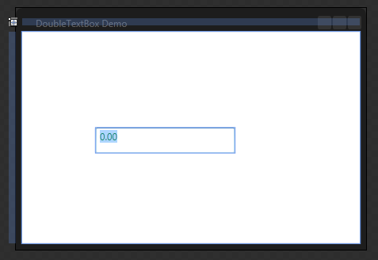
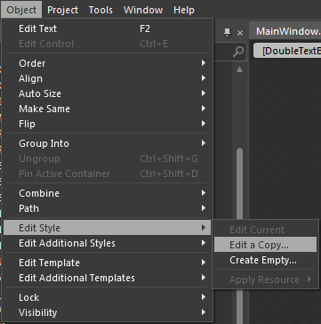
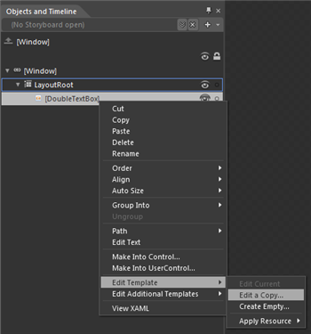
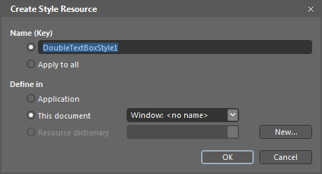
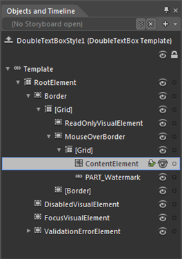
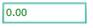

::: {style="DISPLAY: none"}
{#d2h_url_template}{#d2h_package_url style="WIDTH: 0px; DISPLAY: none; HEIGHT: 0px"}
:::

::::: {#nsbanner .d2h_main_nsbanner style="BORDER-BOTTOM: #999999 1px solid; POSITION: relative; PADDING-BOTTOM: 0px; BACKGROUND-COLOR: transparent; PADDING-LEFT: 0px; PADDING-RIGHT: 0px; DISPLAY: none; BORDER-TOP: #999999 1px solid; PADDING-TOP: 0px; LEFT: 0px"}
:::: {#TitleRow .d2h_main_titlerow style="PADDING-BOTTOM: 4px; BACKGROUND-COLOR: transparent; PADDING-LEFT: 22px; WIDTH: 100%; PADDING-RIGHT: 10px; DISPLAY: none; PADDING-TOP: 4px"}
::: {#ienav .d2h_main_ienav style="DISPLAY: none"}
{#D2HPrevious .D2HPreviousEnabled}  {#D2HNext .D2HNextEnabled}
:::
::::
:::::

::: {#nstext .d2h_main_nstext style="PADDING-BOTTOM: 10px; BACKGROUND-COLOR: transparent; PADDING-LEFT: 22px; PADDING-RIGHT: 10px; HEIGHT: 100%; OVERFLOW: auto; PADDING-TOP: 5px" hasuserbackground="true" valign="bottom"}
### Blendability

DoubleTextBox Template can be edited using Expression Blend in order to get a good look and feel for an application.

This can be accomplished by creating a simple Silverlight application in Blend.

            Then drag and drop DoubleTextBox into application from **Assets** tab.

{border="0"}

Figure 70: Creating the DoubleTextBox

 

After creating the DoubleTextBox, select it and go to "**Object**" -\> "**Edit Style**" -\> "**Edit a Copy**" to edit the Template of DoubleTextBox.

 

{border="0"}

Figure 71: To edit the Template of DoubleTextBox.

 

There is another way to Edit Template., Right click on DoubleTextBox control in Object and Timeline.Choose Edit Template option as shown below.

 

{border="0"}

Figure 72: Edit Template

 

This will open a dialog where you can give a name of your style and define exactly where you want to store it.

 

{border="0"}

Figure 73: Create Style Resource

 

The above steps includes some lines of XAML within your application. This XAML represents the default style for percent PercentTextBox.

+---------------------------------------------------------------------------------------------------------------------------------------------------------------------------------------------------------------------------------------------------------------------------------------------------------------------------------------------------------------------------------------------------------------------------------------------------------------------------------------------------------------------------------------+
| [\<]{style="FONT-FAMILY: 'Courier New'; COLOR: blue"}[syncfusion]{style="FONT-FAMILY: 'Courier New'; COLOR: #a31515"}[:]{style="FONT-FAMILY: 'Courier New'; COLOR: blue"}[DoubleTextBox]{style="FONT-FAMILY: 'Courier New'; COLOR: #a31515"}[ Height]{style="FONT-FAMILY: 'Courier New'; COLOR: red"}[=\"25\"]{style="FONT-FAMILY: 'Courier New'; COLOR: blue"}[ Width]{style="FONT-FAMILY: 'Courier New'; COLOR: red"}[=\"150\"]{style="FONT-FAMILY: 'Courier New'; COLOR: blue"}[ ]{style="FONT-FAMILY: 'Courier New'; COLOR: red"} |
|                                                                                                                                                                                                                                                                                                                                                                                                                                                                                                                                       |
| [                          Style]{style="FONT-FAMILY: 'Courier New'; COLOR: red"}[=\"{]{style="FONT-FAMILY: 'Courier New'; COLOR: blue"}[StaticResource]{style="FONT-FAMILY: 'Courier New'; COLOR: #a31515"}[ DoubleTextBoxStyle1]{style="FONT-FAMILY: 'Courier New'; COLOR: red"}[}\"/\>]{style="FONT-FAMILY: 'Courier New'; COLOR: blue"}[   ]{style="FONT-FAMILY: 'Courier New'; COLOR: #a31515"}                                                                                                                                  |
+---------------------------------------------------------------------------------------------------------------------------------------------------------------------------------------------------------------------------------------------------------------------------------------------------------------------------------------------------------------------------------------------------------------------------------------------------------------------------------------------------------------------------------------+

 

All template items are now found in the Objects and Timeline window.

{border="0"}

Figure 74: Objects and Timeline window

Now you can edit each Part in the template. Here is the code to modify the Mouse over state of the DoubleTextBox.

+----------------------------------------------------------------------------------------------------------------------------------------------------------------------------------------------------------------------------------------------------------------------------------------------------------------------------------------------------------------------------------------------------------------------------------------------------------------------------------------------------------------------------------------------------------------------------------+
| [XAML]{style="FONT-FAMILY: 'Courier New'"}                                                                                                                                                                                                                                                                                                                                                                                                                                                                                                                                       |
+----------------------------------------------------------------------------------------------------------------------------------------------------------------------------------------------------------------------------------------------------------------------------------------------------------------------------------------------------------------------------------------------------------------------------------------------------------------------------------------------------------------------------------------------------------------------------------+
| [\<]{style="FONT-FAMILY: 'Courier New'; COLOR: blue"}[VisualState]{style="FONT-FAMILY: 'Courier New'; COLOR: #a31515"}[ x]{style="FONT-FAMILY: 'Courier New'; COLOR: red"}[:]{style="FONT-FAMILY: 'Courier New'; COLOR: blue"}[Name]{style="FONT-FAMILY: 'Courier New'; COLOR: red"}[=\"MouseOver\"\>]{style="FONT-FAMILY: 'Courier New'; COLOR: blue"}[]{style="FONT-FAMILY: 'Courier New'"}                                                                                                                                                                                    |
|                                                                                                                                                                                                                                                                                                                                                                                                                                                                                                                                                                                  |
| [      ]{style="FONT-FAMILY: 'Courier New'; COLOR: #a31515"}[\<]{style="FONT-FAMILY: 'Courier New'; COLOR: blue"}[Storyboard]{style="FONT-FAMILY: 'Courier New'; COLOR: #a31515"}[\>]{style="FONT-FAMILY: 'Courier New'; COLOR: blue"}[]{style="FONT-FAMILY: 'Courier New'"}                                                                                                                                                                                                                                                                                                     |
|                                                                                                                                                                                                                                                                                                                                                                                                                                                                                                                                                                                  |
| [            ]{style="FONT-FAMILY: 'Courier New'; COLOR: #a31515"}[\<]{style="FONT-FAMILY: 'Courier New'; COLOR: blue"}[ColorAnimationUsingKeyFrames]{style="FONT-FAMILY: 'Courier New'; COLOR: #a31515"}[ Storyboard.TargetProperty]{style="FONT-FAMILY: 'Courier New'; COLOR: red"}[=\"(Border.BorderBrush).(SolidColorBrush.Color)\"]{style="FONT-FAMILY: 'Courier New'; COLOR: blue"}[ Storyboard.TargetName]{style="FONT-FAMILY: 'Courier New'; COLOR: red"}[=\"MouseOverBorder\"\>]{style="FONT-FAMILY: 'Courier New'; COLOR: blue"}[]{style="FONT-FAMILY: 'Courier New'"} |
|                                                                                                                                                                                                                                                                                                                                                                                                                                                                                                                                                                                  |
| [                  ]{style="FONT-FAMILY: 'Courier New'; COLOR: #a31515"}[\<]{style="FONT-FAMILY: 'Courier New'; COLOR: blue"}[SplineColorKeyFrame]{style="FONT-FAMILY: 'Courier New'; COLOR: #a31515"}[ KeyTime]{style="FONT-FAMILY: 'Courier New'; COLOR: red"}[=\"0\"]{style="FONT-FAMILY: 'Courier New'; COLOR: blue"}[ Value]{style="FONT-FAMILY: 'Courier New'; COLOR: red"}[=\"#FF22DCB9\"/\>]{style="FONT-FAMILY: 'Courier New'; COLOR: blue"}[]{style="FONT-FAMILY: 'Courier New'"}                                                                                      |
|                                                                                                                                                                                                                                                                                                                                                                                                                                                                                                                                                                                  |
| [            ]{style="FONT-FAMILY: 'Courier New'; COLOR: #a31515"}[\</]{style="FONT-FAMILY: 'Courier New'; COLOR: blue"}[ColorAnimationUsingKeyFrames]{style="FONT-FAMILY: 'Courier New'; COLOR: #a31515"}[\>]{style="FONT-FAMILY: 'Courier New'; COLOR: blue"}[]{style="FONT-FAMILY: 'Courier New'"}                                                                                                                                                                                                                                                                            |
|                                                                                                                                                                                                                                                                                                                                                                                                                                                                                                                                                                                  |
| [      ]{style="FONT-FAMILY: 'Courier New'; COLOR: #a31515"}[\</]{style="FONT-FAMILY: 'Courier New'; COLOR: blue"}[Storyboard]{style="FONT-FAMILY: 'Courier New'; COLOR: #a31515"}[\>]{style="FONT-FAMILY: 'Courier New'; COLOR: blue"}[]{style="FONT-FAMILY: 'Courier New'"}                                                                                                                                                                                                                                                                                                    |
|                                                                                                                                                                                                                                                                                                                                                                                                                                                                                                                                                                                  |
| [\</]{style="FONT-FAMILY: 'Courier New'; COLOR: blue"}[VisualState]{style="FONT-FAMILY: 'Courier New'; COLOR: #a31515"}[\>]{style="FONT-FAMILY: 'Courier New'; COLOR: blue"}                                                                                                                                                                                                                                                                                                                                                                                                     |
+----------------------------------------------------------------------------------------------------------------------------------------------------------------------------------------------------------------------------------------------------------------------------------------------------------------------------------------------------------------------------------------------------------------------------------------------------------------------------------------------------------------------------------------------------------------------------------+

 

{border="0"}

Figure 75: DoubleTextBox

 

[]{#related-topics}
:::
