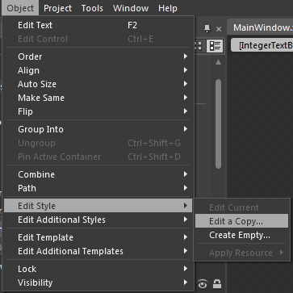
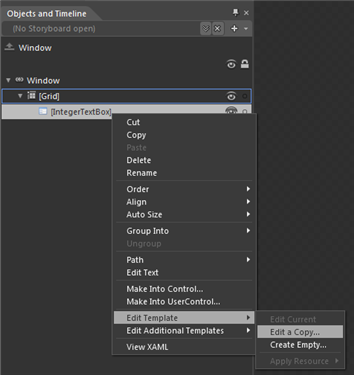
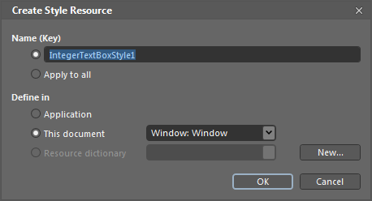
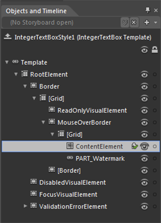
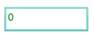

::: {style="DISPLAY: none"}
{#d2h_url_template}{#d2h_package_url style="WIDTH: 0px; DISPLAY: none; HEIGHT: 0px"}
:::

::::: {#nsbanner .d2h_main_nsbanner style="BORDER-BOTTOM: #999999 1px solid; POSITION: relative; PADDING-BOTTOM: 0px; BACKGROUND-COLOR: transparent; PADDING-LEFT: 0px; PADDING-RIGHT: 0px; DISPLAY: none; BORDER-TOP: #999999 1px solid; PADDING-TOP: 0px; LEFT: 0px"}
:::: {#TitleRow .d2h_main_titlerow style="PADDING-BOTTOM: 4px; BACKGROUND-COLOR: transparent; PADDING-LEFT: 22px; WIDTH: 100%; PADDING-RIGHT: 10px; DISPLAY: none; PADDING-TOP: 4px"}
::: {#ienav .d2h_main_ienav style="DISPLAY: none"}
{#D2HPrevious .D2HPreviousEnabled}  {#D2HNext .D2HNextEnabled}
:::
::::
:::::

::: {#nstext .d2h_main_nstext style="PADDING-BOTTOM: 10px; BACKGROUND-COLOR: transparent; PADDING-LEFT: 22px; PADDING-RIGHT: 10px; HEIGHT: 100%; OVERFLOW: auto; PADDING-TOP: 5px" hasuserbackground="true" valign="bottom"}
### []{#_Blendability}Blendability

The user can edit the IntegerTextBox template to give a nice look and feel using Expression Blend. Start by creating a simple Silverlight application in Blend.

After this, simply drag and drop the IntegerTextBox into the application from the Assets tab.

 

{border="0"}

Figure 162: The IntegerTextBox in the application

[]{style="FONT-FAMILY: 'Calibri','sans-serif'; FONT-SIZE: 11pt"} 

After creating the IntegerTextBox, select it and go to "Object" -\> "Edit Style" -\> "Edit a Copy", to edit the template of the IntegerTextBox.

 

{border="0"}

Figure 163: "Object" -\> "Edit Style" -\> "Edit a Copy"

[]{style="FONT-FAMILY: 'Calibri','sans-serif'; FONT-SIZE: 11pt"} 

To edit the template in another way, in Object and Timeline, right-click the IntegerTextBox control and choose the Edit Template option as shown below.

 

{border="0"}

Figure 164: Objects and Timeline window

 

This will open a dialog (below) where we can give our style a name and define exactly where we'd like to store it.

 

{border="0"}

Figure 165: Create Style Resource

 

What's produced through this set of steps is quite a bit of XAML, which is placed within our application. This XAML represents the default style for the Integer Textbox.

 

+-----------------------------------------------------------------------------------------------------------------------------------------------------------------------------------------------------------------------------------------------------------------------------------------------------------------------------------------------------------------------------------------------------------------------------------------------------------------------------------------------------------------------------------------------------------------------------------------------------------------------------------------------------------+
| **[\[XAML\]]{style="FONT-FAMILY: 'Courier New'"}**                                                                                                                                                                                                                                                                                                                                                                                                                                                                                                                                                                                                        |
|                                                                                                                                                                                                                                                                                                                                                                                                                                                                                                                                                                                                                                                           |
| **[]{style="FONT-FAMILY: 'Courier New'"}**                                                                                                                                                                                                                                                                                                                                                                                                                                                                                                                                                                                                                |
|                                                                                                                                                                                                                                                                                                                                                                                                                                                                                                                                                                                                                                                           |
| [\<]{style="FONT-FAMILY: 'Courier New'; COLOR: blue"}[syncfusion]{style="FONT-FAMILY: 'Courier New'; COLOR: #a31515"}[:]{style="FONT-FAMILY: 'Courier New'; COLOR: blue"}[IntegerTextBox]{style="FONT-FAMILY: 'Courier New'; COLOR: #a31515"}[ Width]{style="FONT-FAMILY: 'Courier New'; COLOR: red"}[=\"150\"]{style="FONT-FAMILY: 'Courier New'; COLOR: blue"}[ Height]{style="FONT-FAMILY: 'Courier New'; COLOR: red"}[=\"25\"]{style="FONT-FAMILY: 'Courier New'; COLOR: blue"}[ VerticalAlignment]{style="FONT-FAMILY: 'Courier New'; COLOR: red"}[=\"Top\"]{style="FONT-FAMILY: 'Courier New'; COLOR: blue"}[ ]{style="FONT-FAMILY: 'Courier New'"} |
|                                                                                                                                                                                                                                                                                                                                                                                                                                                                                                                                                                                                                                                           |
| [                          [ Style]{style="COLOR: red"}[=\"{]{style="COLOR: blue"}[StaticResource]{style="COLOR: #a31515"}[ IntegerTextBoxStyle1]{style="COLOR: red"}[}\"/\>]{style="COLOR: blue"}]{style="FONT-FAMILY: 'Courier New'"}                                                                                                                                                                                                                                                                                                                                                                                                                   |
+-----------------------------------------------------------------------------------------------------------------------------------------------------------------------------------------------------------------------------------------------------------------------------------------------------------------------------------------------------------------------------------------------------------------------------------------------------------------------------------------------------------------------------------------------------------------------------------------------------------------------------------------------------------+

[]{style="FONT-FAMILY: 'Calibri','sans-serif'; FONT-SIZE: 11pt"} 

All template items can now be found in the Objects and Timeline window.

{border="0"}

Figure 166: Objects and Timeline window

 

Now, the user can edit each part in the template. Here is the code to modify the Mouse over state of the IntegerTextBox.

 

+-------------------------------------------------------------------------------------------------------------------------------------------------------------------------------------------------------------------------------------------------------------------------------------------------------------------------------------------------------------------------------------------------------------------------------------------------------------------------------------------------------------------------------------------------------------------------------------------------------------------------------------------------+
| **[\[XAML\]]{style="FONT-FAMILY: 'Courier New'"}**                                                                                                                                                                                                                                                                                                                                                                                                                                                                                                                                                                                              |
|                                                                                                                                                                                                                                                                                                                                                                                                                                                                                                                                                                                                                                                 |
| []{style="FONT-FAMILY: 'Courier New'"}                                                                                                                                                                                                                                                                                                                                                                                                                                                                                                                                                                                                          |
|                                                                                                                                                                                                                                                                                                                                                                                                                                                                                                                                                                                                                                                 |
| **[\<]{style="FONT-FAMILY: 'Courier New'; COLOR: blue"}[VisualState]{style="FONT-FAMILY: 'Courier New'; COLOR: #a31515"}[ x]{style="FONT-FAMILY: 'Courier New'; COLOR: red"}[:]{style="FONT-FAMILY: 'Courier New'; COLOR: blue"}[Name]{style="FONT-FAMILY: 'Courier New'; COLOR: red"}[=\"MouseOver\"\>]{style="FONT-FAMILY: 'Courier New'; COLOR: blue"}[]{style="FONT-FAMILY: 'Courier New'"}**                                                                                                                                                                                                                                               |
|                                                                                                                                                                                                                                                                                                                                                                                                                                                                                                                                                                                                                                                 |
| **[      ]{style="FONT-FAMILY: 'Courier New'; COLOR: #a31515"}[\<]{style="FONT-FAMILY: 'Courier New'; COLOR: blue"}[Storyboard]{style="FONT-FAMILY: 'Courier New'; COLOR: #a31515"}[\>]{style="FONT-FAMILY: 'Courier New'; COLOR: blue"}[]{style="FONT-FAMILY: 'Courier New'"}**                                                                                                                                                                                                                                                                                                                                                                |
|                                                                                                                                                                                                                                                                                                                                                                                                                                                                                                                                                                                                                                                 |
| **[            ]{style="FONT-FAMILY: 'Courier New'; COLOR: #a31515"}[\<]{style="FONT-FAMILY: 'Courier New'; COLOR: blue"}[ColorAnimationUsingKeyFrames]{style="FONT-FAMILY: 'Courier New'; COLOR: #a31515"}[ Storyboard.TargetName]{style="FONT-FAMILY: 'Courier New'; COLOR: red"}[=\"]{style="FONT-FAMILY: 'Courier New'; COLOR: blue"}**[MouseOverBorder**\"**]{style="FONT-FAMILY: 'Courier New'; COLOR: blue"}**[ Storyboard.TargetProperty]{style="FONT-FAMILY: 'Courier New'; COLOR: red"}[=\"(Border.BorderBrush).(SolidColorBrush.Color)\"\>]{style="FONT-FAMILY: 'Courier New'; COLOR: blue"}[]{style="FONT-FAMILY: 'Courier New'"}** |
|                                                                                                                                                                                                                                                                                                                                                                                                                                                                                                                                                                                                                                                 |
| **[                  ]{style="FONT-FAMILY: 'Courier New'; COLOR: #a31515"}[\<]{style="FONT-FAMILY: 'Courier New'; COLOR: blue"}[SplineColorKeyFrame]{style="FONT-FAMILY: 'Courier New'; COLOR: #a31515"}[ KeyTime]{style="FONT-FAMILY: 'Courier New'; COLOR: red"}[=\"0\"]{style="FONT-FAMILY: 'Courier New'; COLOR: blue"}[ Value]{style="FONT-FAMILY: 'Courier New'; COLOR: red"}**[=\"#FF22DCB9**\"/\>**]{style="FONT-FAMILY: 'Courier New'; COLOR: blue"}**[]{style="FONT-FAMILY: 'Courier New'"}**                                                                                                                                         |
|                                                                                                                                                                                                                                                                                                                                                                                                                                                                                                                                                                                                                                                 |
| **[            ]{style="FONT-FAMILY: 'Courier New'; COLOR: #a31515"}[\</]{style="FONT-FAMILY: 'Courier New'; COLOR: blue"}[ColorAnimationUsingKeyFrames]{style="FONT-FAMILY: 'Courier New'; COLOR: #a31515"}[\>]{style="FONT-FAMILY: 'Courier New'; COLOR: blue"}[]{style="FONT-FAMILY: 'Courier New'"}**                                                                                                                                                                                                                                                                                                                                       |
|                                                                                                                                                                                                                                                                                                                                                                                                                                                                                                                                                                                                                                                 |
| **[      ]{style="FONT-FAMILY: 'Courier New'; COLOR: #a31515"}[\</]{style="FONT-FAMILY: 'Courier New'; COLOR: blue"}[Storyboard]{style="FONT-FAMILY: 'Courier New'; COLOR: #a31515"}[\>]{style="FONT-FAMILY: 'Courier New'; COLOR: blue"}[]{style="FONT-FAMILY: 'Courier New'"}**                                                                                                                                                                                                                                                                                                                                                               |
|                                                                                                                                                                                                                                                                                                                                                                                                                                                                                                                                                                                                                                                 |
| **[\</]{style="FONT-FAMILY: 'Courier New'; COLOR: blue"}[VisualState]{style="FONT-FAMILY: 'Courier New'; COLOR: #a31515"}[\>]{style="FONT-FAMILY: 'Courier New'; COLOR: blue"}**[]{style="FONT-FAMILY: 'Courier New'"}                                                                                                                                                                                                                                                                                                                                                                                                                          |
+-------------------------------------------------------------------------------------------------------------------------------------------------------------------------------------------------------------------------------------------------------------------------------------------------------------------------------------------------------------------------------------------------------------------------------------------------------------------------------------------------------------------------------------------------------------------------------------------------------------------------------------------------+

[]{style="FONT-FAMILY: 'Calibri','sans-serif'; FONT-SIZE: 11pt"} 

{border="0"}

Figure 167: IntegerTextBox

[]{style="FONT-FAMILY: 'Calibri','sans-serif'; FONT-SIZE: 11pt"} 

 

See Also

[Creating IntegerTextBox by using Blend]{.UGHyperlink}[]{.UGHyperlink}

[[]{style="TEXT-DECORATION: none"}]{.UGHyperlink} 

[]{#related-topics}
:::
