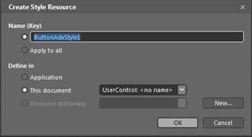
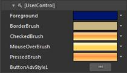

::: {style="DISPLAY: none"}
{#d2h_url_template}{#d2h_package_url style="WIDTH: 0px; DISPLAY: none; HEIGHT: 0px"}
:::

::: {.d2h_secondary_topic style="PADDING-BOTTOM: 10pt; MARGIN: 0pt; PADDING-LEFT: 0pt; PADDING-RIGHT: 0pt; PADDING-TOP: 0pt"}
#### Blendability

The Button Controls can be easily editable using Expression Blend:

1.   Open the Sample in Expression Blend. Right-click the Button Control and choose the **Edit Template** option as shown below:

[]{style="FONT-FAMILY: 'Calibri','sans-serif'"} 

{border="0"}

Figure 1056: Button Control using Expression Blend

**[]{style="FONT-FAMILY: 'Calibri','sans-serif'"}** 

2.   A window will appear as shownin the following screenshot. Click OK to create a new style for the Button Control.

 

{border="0"}

Figure 1057: Create Style Resource

All the resources will be displayed on the resources pane on the right side of the Design area. These resources can be editable to create a new Style:

{border="0"}

 

{border="0"}

Figure 1058: ButtonControlAdv style edited in Blend[]{style="FONT-FAMILY: 'Calibri','sans-serif'"}

[]{style="FONT-FAMILY: 'Calibri','sans-serif'"} 

[]{style="FONT-FAMILY: 'Calibri','sans-serif'"} 

[]{#related-topics}
:::
