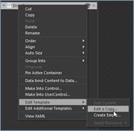
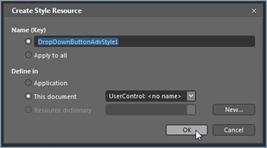
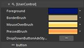

::: {style="DISPLAY: none"}
{#d2h_url_template}{#d2h_package_url style="WIDTH: 0px; DISPLAY: none; HEIGHT: 0px"}
:::

::::: {#nsbanner .d2h_main_nsbanner style="BORDER-BOTTOM: #999999 1px solid; POSITION: relative; PADDING-BOTTOM: 0px; BACKGROUND-COLOR: transparent; PADDING-LEFT: 0px; PADDING-RIGHT: 0px; DISPLAY: none; BORDER-TOP: #999999 1px solid; PADDING-TOP: 0px; LEFT: 0px"}
:::: {#TitleRow .d2h_main_titlerow style="PADDING-BOTTOM: 4px; BACKGROUND-COLOR: transparent; PADDING-LEFT: 22px; WIDTH: 100%; PADDING-RIGHT: 10px; DISPLAY: none; PADDING-TOP: 4px"}
::: {#ienav .d2h_main_ienav style="DISPLAY: none"}
{#D2HPrevious .D2HPreviousEnabled}  {#D2HNext .D2HNextEnabled}
:::
::::
:::::

::: {#nstext .d2h_main_nstext style="PADDING-BOTTOM: 10px; BACKGROUND-COLOR: transparent; PADDING-LEFT: 22px; PADDING-RIGHT: 10px; HEIGHT: 100%; OVERFLOW: auto; PADDING-TOP: 5px" hasuserbackground="true" valign="bottom"}
### Blendability

The Button Controls can be easily edited by using Expression Blend. The steps to edit the Button Controls by using Expression Blend are as follows:

[·      ]{style="FONT-FAMILY: Symbol"}Open the Sample in Expression Blend. Right-click the Button Control and select the **Edit Template** option, as shown below.

[]{style="FONT-FAMILY: 'Calibri','sans-serif'"} 

[]{style="FONT-FAMILY: 'Calibri','sans-serif'"} 

[]{style="FONT-FAMILY: 'Calibri','sans-serif'"} 

{border="0"}

Figure 1078: Editing the copy by using Expression Blend

[·      ]{style="FONT-FAMILY: Symbol"}A window will appear as shown below. Click **OK** to create a new style for the Button Control.

 

 

{border="0"}

Figure 1079: Style Resource window

[·      ]{style="FONT-FAMILY: Symbol"}All the resources will be displayed on the resources pane in the right side of the design area. These resources can be edited to create a new style.

[]{style="FONT-FAMILY: 'Calibri','sans-serif'"} 

[]{style="FONT-FAMILY: 'Calibri','sans-serif'"} 

{border="0"}

Figure 1080: Resources

{border="0"}

Figure 1081: DropDownButtonAdv style edited in Expression Blend

[]{#related-topics}
:::
