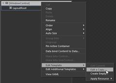
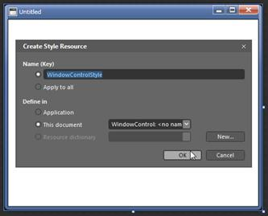
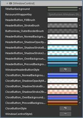
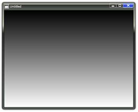

::: {style="DISPLAY: none"}
{#d2h_url_template}{#d2h_package_url style="WIDTH: 0px; DISPLAY: none; HEIGHT: 0px"}
:::

::: {.d2h_secondary_topic style="PADDING-BOTTOM: 10pt; MARGIN: 0pt; PADDING-LEFT: 0pt; PADDING-RIGHT: 0pt; PADDING-TOP: 0pt"}
#### Blendability

The template of Window Control can be easily editable in Expression Blend, to give a nice look and feel. The following steps should be followed to edit the template in Expression Blend.

1.   Open the sample in Expression Blend.

2.   Right-click on Window Control and choose Edit Template option as shown below:

{border="0"}

Figure 1118: Window Control

 

3.   A window will appear as shown below. Click OK to create a new style for Window Control

{border="0"}

Figure 1119: Window

[·      ]{style="FONT-FAMILY: Symbol"}All the resources will be displayed on the resources pane on the right side of the Design area. These resources can be editable to create a new Style.

{border="0"}

Figure 1120: Window Control

{border="0"}

Figure 1121: Window Control style edited using Expression Blend.

 

 

[]{#related-topics}
:::
