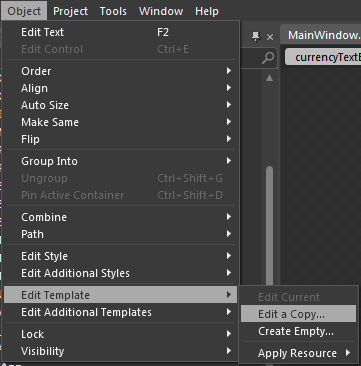
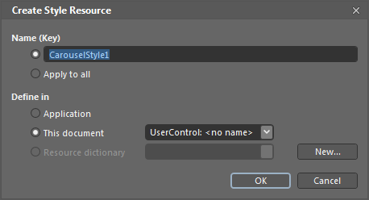
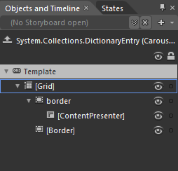
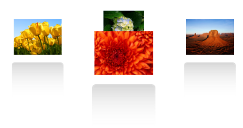

::: {style="DISPLAY: none"}
{#d2h_url_template}{#d2h_package_url style="WIDTH: 0px; DISPLAY: none; HEIGHT: 0px"}
:::

::: {.d2h_secondary_topic style="PADDING-BOTTOM: 10pt; MARGIN: 0pt; PADDING-LEFT: 0pt; PADDING-RIGHT: 0pt; PADDING-TOP: 0pt"}
#### Blendability

The template of the Carousel control can be easily editable in Expression Blend, to give a nice look and feel.

 

Using Blendability Support in an Application

Following are the steps to edit the template in Expression Blend.

 

1.   Open the Carousel control in blend.

2.   Go to Object -\> Edit Style -\> Edit a Copy to edit the template of the Carousel control as shown below:

 

{border="0"}

Figure 1135: Blend - Edit Template

 

A window will open as shown below where you can create a new style for the Carousel control and can define exactly where you would like to store it.

 

{border="0"}

Figure 1136: Blend - Create New style

 

What's produced through this set of steps is quite a bit of XAML which is placed within your application. This XAML represents the default style for the Carousel control. In the same way, you can edit the template of CarouselItem.

 

{border="0"}

Figure 1137: Blend - Objects and Timeline

 

Now you can edit each part in the template and can create custom look and feel for the control. In the below sample, template for CarouselItem is edited to give a reflection effect.

 

+---------------------------------------------------------------------------------------------------------------------------------------------------------------------------------------------------------------------------------------------------------------------------------------------------------------------------------------------------------------------------------------------------------------------------------------------------------------------------------------------------------------------------------+
| **[\[XAML\]]{style="FONT-FAMILY: 'Courier New'"}**                                                                                                                                                                                                                                                                                                                                                                                                                                                                              |
|                                                                                                                                                                                                                                                                                                                                                                                                                                                                                                                                 |
| [           ]{style="FONT-FAMILY: 'Courier New'"}                                                                                                                                                                                                                                                                                                                                                                                                                                                                               |
|                                                                                                                                                                                                                                                                                                                                                                                                                                                                                                                                 |
| [\<]{style="FONT-FAMILY: Consolas; COLOR: blue"}[Style]{style="FONT-FAMILY: Consolas; COLOR: #a31515"}[ TargetType]{style="FONT-FAMILY: Consolas; COLOR: red"}[=\"syncfusion:CarouselItem\"\>]{style="FONT-FAMILY: Consolas; COLOR: blue"}[\                                                                                                                                                                                                                                                                                    |
| [         ]{style="COLOR: #a31515"}[\<]{style="COLOR: blue"}[Setter]{style="COLOR: #a31515"}[ Property]{style="COLOR: red"}[=\"Template\"\>]{style="COLOR: blue"}\                                                                                                                                                                                                                                                                                                                                                              |
| [                 ]{style="COLOR: #a31515"}[\<]{style="COLOR: blue"}[Setter.Value]{style="COLOR: #a31515"}[\>]{style="COLOR: blue"}\                                                                                                                                                                                                                                                                                                                                                                                            |
| [                          ]{style="COLOR: #a31515"}[\<]{style="COLOR: blue"}[ControlTemplate]{style="COLOR: #a31515"}[ TargetType]{style="COLOR: red"}[=\"syncfusion:CarouselItem\"\>]{style="COLOR: blue"}\                                                                                                                                                                                                                                                                                                                   |
| [                                  ]{style="COLOR: #a31515"}[\<]{style="COLOR: blue"}[Grid]{style="COLOR: #a31515"}[\>]{style="COLOR: blue"}\                                                                                                                                                                                                                                                                                                                                                                                   |
| [                                            ]{style="COLOR: #a31515"}[\<]{style="COLOR: blue"}[Grid.RowDefinitions]{style="COLOR: #a31515"}[\>]{style="COLOR: blue"}\                                                                                                                                                                                                                                                                                                                                                          |
| [                                                    ]{style="COLOR: #a31515"}[\<]{style="COLOR: blue"}[RowDefinition]{style="COLOR: #a31515"}[/\>]{style="COLOR: blue"}\                                                                                                                                                                                                                                                                                                                                                       |
| [                                                    ]{style="COLOR: #a31515"}[\<]{style="COLOR: blue"}[RowDefinition]{style="COLOR: #a31515"}[/\>]{style="COLOR: blue"}\                                                                                                                                                                                                                                                                                                                                                       |
| [                                            ]{style="COLOR: #a31515"}[\</]{style="COLOR: blue"}[Grid.RowDefinitions]{style="COLOR: #a31515"}[\>]{style="COLOR: blue"}\                                                                                                                                                                                                                                                                                                                                                         |
| [                                            ]{style="COLOR: #a31515"}[\<]{style="COLOR: blue"}[Border]{style="COLOR: #a31515"}[ x]{style="COLOR: red"}[:]{style="COLOR: blue"}[Name]{style="COLOR: red"}[=\"border\"]{style="COLOR: blue"}[ BorderBrush]{style="COLOR: red"}[=\"#FF333333\"]{style="COLOR: blue"}[ RenderTransformOrigin]{style="COLOR: red"}[=\"0.5,0.5\"]{style="COLOR: blue"}[ CornerRadius]{style="COLOR: red"}[=\"4\"]{style="COLOR: blue"}[ Padding]{style="COLOR: red"}[=\"4\"\>]{style="COLOR: blue"}\ |
| [                                            ]{style="COLOR: #a31515"}\                                                                                                                                                                                                                                                                                                                                                                                                                                                         |
| [                                                    ]{style="COLOR: #a31515"}[\<]{style="COLOR: blue"}[ContentPresenter]{style="COLOR: #a31515"}[ Content]{style="COLOR: red"}[=\"{]{style="COLOR: blue"}[TemplateBinding]{style="COLOR: #a31515"}[ Content]{style="COLOR: red"}[}\"]{style="COLOR: blue"} \                                                                                                                                                                                                                   |
|                                                     [         ContentTemplate]{style="COLOR: red"}[=\"{]{style="COLOR: blue"}[TemplateBinding]{style="COLOR: #a31515"}[ ContentTemplate]{style="COLOR: red"}[}\" /\>]{style="COLOR: blue"}\                                                                                                                                                                                                                                                                                     |
| [                                            ]{style="COLOR: #a31515"}[\</]{style="COLOR: blue"}[Border]{style="COLOR: #a31515"}[\>]{style="COLOR: blue"}\                                                                                                                                                                                                                                                                                                                                                                      |
|  \                                                                                                                                                                                                                                                                                                                                                                                                                                                                                                                              |
| [                    ]{style="COLOR: #a31515"}[\<]{style="COLOR: blue"}[Border]{style="COLOR: #a31515"}[ BorderThickness]{style="COLOR: red"}[=\"2\"]{style="COLOR: blue"}[ Grid.Row]{style="COLOR: red"}[=\"1\"]{style="COLOR: blue"}[ Height]{style="COLOR: red"}[=\"100\"]{style="COLOR: blue"}[ VerticalAlignment]{style="COLOR: red"}[=\"Top\"]{style="COLOR: blue"}[ HorizontalAlignment]{style="COLOR: red"}[=\"Stretch\"]{style="COLOR: blue"}[ CornerRadius]{style="COLOR: red"}[=\"5\"\>]{style="COLOR: blue"}\       |
| [                        ]{style="COLOR: #a31515"}[\<]{style="COLOR: blue"}[Border.BorderBrush]{style="COLOR: #a31515"}[\>]{style="COLOR: blue"}\                                                                                                                                                                                                                                                                                                                                                                               |
| [                            ]{style="COLOR: #a31515"}[\<]{style="COLOR: blue"}[LinearGradientBrush]{style="COLOR: #a31515"}[ EndPoint]{style="COLOR: red"}[=\"0.5,1\"]{style="COLOR: blue"}[ StartPoint]{style="COLOR: red"}[=\"0.5,0\"\>]{style="COLOR: blue"}\                                                                                                                                                                                                                                                               |
| [                                ]{style="COLOR: #a31515"}[\<]{style="COLOR: blue"}[GradientStop]{style="COLOR: #a31515"}[ Color]{style="COLOR: red"}[=\"#FFDADADA\"]{style="COLOR: blue"}[ Offset]{style="COLOR: red"}[=\"0\"/\>]{style="COLOR: blue"}\                                                                                                                                                                                                                                                                        |
| [                                ]{style="COLOR: #a31515"}[\<]{style="COLOR: blue"}[GradientStop]{style="COLOR: #a31515"}[ Color]{style="COLOR: red"}[=\"Transparent\"]{style="COLOR: blue"}[ Offset]{style="COLOR: red"}[=\"0.712\"/\>]{style="COLOR: blue"}\                                                                                                                                                                                                                                                                  |
| [                            ]{style="COLOR: #a31515"}[\</]{style="COLOR: blue"}[LinearGradientBrush]{style="COLOR: #a31515"}[\>]{style="COLOR: blue"}\                                                                                                                                                                                                                                                                                                                                                                         |
| [                        ]{style="COLOR: #a31515"}[\</]{style="COLOR: blue"}[Border.BorderBrush]{style="COLOR: #a31515"}[\>]{style="COLOR: blue"}\                                                                                                                                                                                                                                                                                                                                                                              |
| [                        ]{style="COLOR: #a31515"}[\<]{style="COLOR: blue"}[Border.Background]{style="COLOR: #a31515"}[\>]{style="COLOR: blue"}\                                                                                                                                                                                                                                                                                                                                                                                |
| [                            ]{style="COLOR: #a31515"}[\<]{style="COLOR: blue"}[LinearGradientBrush]{style="COLOR: #a31515"}[ EndPoint]{style="COLOR: red"}[=\"0.5,1\"]{style="COLOR: blue"}[ StartPoint]{style="COLOR: red"}[=\"0.5,0\"\>]{style="COLOR: blue"}\                                                                                                                                                                                                                                                               |
| [                                ]{style="COLOR: #a31515"}[\<]{style="COLOR: blue"}[GradientStop]{style="COLOR: #a31515"}[ Color]{style="COLOR: red"}[=\"#FFDADADA\"/\>]{style="COLOR: blue"}\                                                                                                                                                                                                                                                                                                                                  |
| [                                ]{style="COLOR: #a31515"}[\<]{style="COLOR: blue"}[GradientStop]{style="COLOR: #a31515"}[ Color]{style="COLOR: red"}[=\"Transparent\"]{style="COLOR: blue"}[ Offset]{style="COLOR: red"}[=\"0.705\"/\>]{style="COLOR: blue"}\                                                                                                                                                                                                                                                                  |
| [                            ]{style="COLOR: #a31515"}[\</]{style="COLOR: blue"}[LinearGradientBrush]{style="COLOR: #a31515"}[\>]{style="COLOR: blue"}\                                                                                                                                                                                                                                                                                                                                                                         |
| [                        ]{style="COLOR: #a31515"}[\</]{style="COLOR: blue"}[Border.Background]{style="COLOR: #a31515"}[\>]{style="COLOR: blue"}\                                                                                                                                                                                                                                                                                                                                                                               |
|  \                                                                                                                                                                                                                                                                                                                                                                                                                                                                                                                              |
| [                    ]{style="COLOR: #a31515"}[\</]{style="COLOR: blue"}[Border]{style="COLOR: #a31515"}[\>]{style="COLOR: blue"}\                                                                                                                                                                                                                                                                                                                                                                                              |
| [                ]{style="COLOR: #a31515"}[\</]{style="COLOR: blue"}[Grid]{style="COLOR: #a31515"}[\>]{style="COLOR: blue"}\                                                                                                                                                                                                                                                                                                                                                                                                    |
| [                          ]{style="COLOR: #a31515"}[\</]{style="COLOR: blue"}[ControlTemplate]{style="COLOR: #a31515"}[\>]{style="COLOR: blue"}\                                                                                                                                                                                                                                                                                                                                                                               |
| [                 ]{style="COLOR: #a31515"}[\</]{style="COLOR: blue"}[Setter.Value]{style="COLOR: #a31515"}[\>]{style="COLOR: blue"}\                                                                                                                                                                                                                                                                                                                                                                                           |
| [         ]{style="COLOR: #a31515"}[\</]{style="COLOR: blue"}[Setter]{style="COLOR: #a31515"}[\>]{style="COLOR: blue"}\                                                                                                                                                                                                                                                                                                                                                                                                         |
| [\</]{style="COLOR: blue"}[Style]{style="COLOR: #a31515"}[\>]{style="COLOR: blue"}]{style="FONT-FAMILY: Consolas"}                                                                                                                                                                                                                                                                                                                                                                                                              |
|                                                                                                                                                                                                                                                                                                                                                                                                                                                                                                                                 |
| []{style="FONT-FAMILY: 'Courier New'"}                                                                                                                                                                                                                                                                                                                                                                                                                                                                                          |
+---------------------------------------------------------------------------------------------------------------------------------------------------------------------------------------------------------------------------------------------------------------------------------------------------------------------------------------------------------------------------------------------------------------------------------------------------------------------------------------------------------------------------------+

 

{border="0"}

*Figure* *1138: Carousel with Reflection Effect*

[]{style="COLOR: #c00000"} 

[]{#related-topics}
:::
