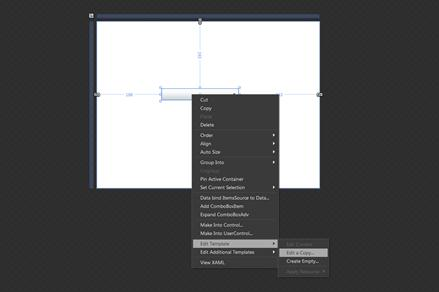

::: {style="DISPLAY: none"}
{#d2h_url_template}{#d2h_package_url style="WIDTH: 0px; DISPLAY: none; HEIGHT: 0px"}
:::

::: {.d2h_secondary_topic style="PADDING-BOTTOM: 10pt; MARGIN: 0pt; PADDING-LEFT: 0pt; PADDING-RIGHT: 0pt; PADDING-TOP: 0pt"}
##### Blendability

You can edit the style of ComboBoxAdv by using Expression Blend. To edit the ComboBoxAdv control's style in Expression Blend:

1.   Drag the **ComboBoxAdv** control to the **Design** view. The **ComboBoxAdv** control will appear as shown in the screen shot displayed below.

2.   Right-click the **ComboBoxAdv** control, select **Edit Template**, and then select **Edit a Copy**.

{border="0"}

Figure 1190: ComboBoxAdv Control in Edit Template

[]{#related-topics}
:::
