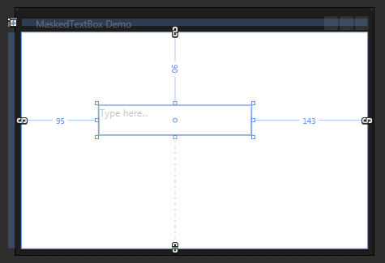
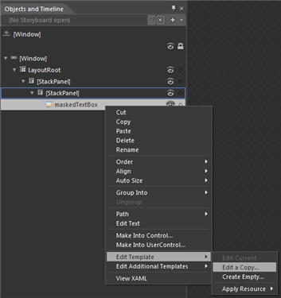
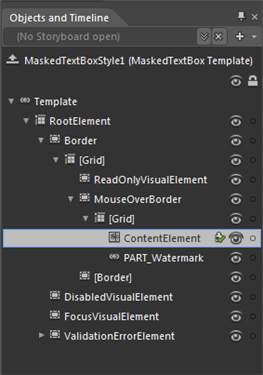
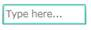

::: {style="DISPLAY: none"}
{#d2h_url_template}{#d2h_package_url style="WIDTH: 0px; DISPLAY: none; HEIGHT: 0px"}
:::

::::: {#nsbanner .d2h_main_nsbanner style="BORDER-BOTTOM: #999999 1px solid; POSITION: relative; PADDING-BOTTOM: 0px; BACKGROUND-COLOR: transparent; PADDING-LEFT: 0px; PADDING-RIGHT: 0px; DISPLAY: none; BORDER-TOP: #999999 1px solid; PADDING-TOP: 0px; LEFT: 0px"}
:::: {#TitleRow .d2h_main_titlerow style="PADDING-BOTTOM: 4px; BACKGROUND-COLOR: transparent; PADDING-LEFT: 22px; WIDTH: 100%; PADDING-RIGHT: 10px; DISPLAY: none; PADDING-TOP: 4px"}
::: {#ienav .d2h_main_ienav style="DISPLAY: none"}
{#D2HPrevious .D2HPreviousEnabled}  {#D2HNext .D2HNextEnabled}
:::
::::
:::::

::: {#nstext .d2h_main_nstext style="PADDING-BOTTOM: 10px; BACKGROUND-COLOR: transparent; PADDING-LEFT: 22px; PADDING-RIGHT: 10px; HEIGHT: 100%; OVERFLOW: auto; PADDING-TOP: 5px" hasuserbackground="true" valign="bottom"}
### Blendability

You can edit MaskedTextBox Template using Expression Blend in order to give a nice look and feel. Start by creating simple Silverlight application in Blend.

After this simply drag and drop MaskedTextBox into application from **Assets** tab.

{border="0"}

Figure 197: Edit MaskedTextBox Template using Expression Blend

After creating the MaskedTextBox, select it and go to "**Object**" -\> "**Edit Style**" -\> "**Edit a Copy**" to edit the Template of MaskedTextBox.

{border="0"}

Figure 198: "Object" -\> "Edit Style" -\> "Edit a Copy" 

Another way to Edit Template, Right click on MaskedTextBox control in Object and Timeline and choose Edit Template option as shown below

{border="0"}

Figure 199: Another way to Edit Template

 

This will open a dialog (below) where you can give our style a name and define exactly where you want to store it.

{border="0"}

Figure 200: Create Style Resource

[]{style="FONT-FAMILY: 'Calibri','sans-serif'; FONT-SIZE: 11pt"} 

The above steps include some lines of XAML within your application. This XAML represents the default style for percent MaskedTextBox.

[]{style="FONT-FAMILY: 'Calibri','sans-serif'; FONT-SIZE: 11pt"} 

[]{style="FONT-FAMILY: 'Calibri','sans-serif'; FONT-SIZE: 11pt"} 

+--------------------------------------------------------------------------------------------------------------------------------------------------------------------------------------------------------------------------------------------------------------------------------------------------------------------------------------------------------------------------------------------------------------------------------------------------------------------------------------------------------------------------------------------------------------------------------------------------------------------------------------------------------------------------------------------------------------------------------------------------------------------------+
| [\<]{style="FONT-FAMILY: 'Courier New'; COLOR: blue"}[syncfusion]{style="FONT-FAMILY: 'Courier New'; COLOR: #a31515"}[:]{style="FONT-FAMILY: 'Courier New'; COLOR: blue"}[MaskedTextBox]{style="FONT-FAMILY: 'Courier New'; COLOR: #a31515"}[ x]{style="FONT-FAMILY: 'Courier New'; COLOR: red"}[:]{style="FONT-FAMILY: 'Courier New'; COLOR: blue"}[Name]{style="FONT-FAMILY: 'Courier New'; COLOR: red"}[=\"maskedTextBox\"]{style="FONT-FAMILY: 'Courier New'; COLOR: blue"}[ Width]{style="FONT-FAMILY: 'Courier New'; COLOR: red"}[=\"150\"]{style="FONT-FAMILY: 'Courier New'; COLOR: blue"}[ Height]{style="FONT-FAMILY: 'Courier New'; COLOR: red"}[=\"25\"]{style="FONT-FAMILY: 'Courier New'; COLOR: blue"}[ ]{style="FONT-FAMILY: 'Courier New'; COLOR: red"} |
|                                                                                                                                                                                                                                                                                                                                                                                                                                                                                                                                                                                                                                                                                                                                                                          |
| [                          Mask]{style="FONT-FAMILY: 'Courier New'; COLOR: red"}[=\"00/00/0000 00:00\"]{style="FONT-FAMILY: 'Courier New'; COLOR: blue"}[ CornerRadius]{style="FONT-FAMILY: 'Courier New'; COLOR: red"}[=\"4\"]{style="FONT-FAMILY: 'Courier New'; COLOR: blue"}[ ]{style="FONT-FAMILY: 'Courier New'; COLOR: red"}                                                                                                                                                                                                                                                                                                                                                                                                                                      |
|                                                                                                                                                                                                                                                                                                                                                                                                                                                                                                                                                                                                                                                                                                                                                                          |
| [                          Style]{style="FONT-FAMILY: 'Courier New'; COLOR: red"}[=\"{]{style="FONT-FAMILY: 'Courier New'; COLOR: blue"}[DynamicResource]{style="FONT-FAMILY: 'Courier New'; COLOR: #a31515"}[ MaskedTextBoxStyle1]{style="FONT-FAMILY: 'Courier New'; COLOR: red"}[}\"/\>]{style="FONT-FAMILY: 'Courier New'; COLOR: blue"}                                                                                                                                                                                                                                                                                                                                                                                                                             |
+--------------------------------------------------------------------------------------------------------------------------------------------------------------------------------------------------------------------------------------------------------------------------------------------------------------------------------------------------------------------------------------------------------------------------------------------------------------------------------------------------------------------------------------------------------------------------------------------------------------------------------------------------------------------------------------------------------------------------------------------------------------------------+

[]{style="FONT-FAMILY: 'Calibri','sans-serif'; FONT-SIZE: 11pt"} 

All template items can now found in the Objects and Timeline window.

 

{border="0"}

Figure 201: Objects and Timeline window

Now you can edit each Part in the template. Here is the code to modify the Mouse over state of the MaskedTextBox.

+----------------------------------------------------------------------------------------------------------------------------------------------------------------------------------------------------------------------------------------------------------------------------------------------------------------------------------------------------------------------------------------------------------------------------------------------------------------------------------------------------------------------------------------------------------------------------------+
| [XAML]{style="FONT-FAMILY: 'Courier New'; COLOR: white"}                                                                                                                                                                                                                                                                                                                                                                                                                                                                                                                         |
+----------------------------------------------------------------------------------------------------------------------------------------------------------------------------------------------------------------------------------------------------------------------------------------------------------------------------------------------------------------------------------------------------------------------------------------------------------------------------------------------------------------------------------------------------------------------------------+
| [\<]{style="FONT-FAMILY: 'Courier New'; COLOR: blue"}[VisualState]{style="FONT-FAMILY: 'Courier New'; COLOR: #a31515"}[ x]{style="FONT-FAMILY: 'Courier New'; COLOR: red"}[:]{style="FONT-FAMILY: 'Courier New'; COLOR: blue"}[Name]{style="FONT-FAMILY: 'Courier New'; COLOR: red"}[=\"MouseOver\"\>]{style="FONT-FAMILY: 'Courier New'; COLOR: blue"}[]{style="FONT-FAMILY: 'Courier New'"}                                                                                                                                                                                    |
|                                                                                                                                                                                                                                                                                                                                                                                                                                                                                                                                                                                  |
| [      ]{style="FONT-FAMILY: 'Courier New'; COLOR: #a31515"}[\<]{style="FONT-FAMILY: 'Courier New'; COLOR: blue"}[Storyboard]{style="FONT-FAMILY: 'Courier New'; COLOR: #a31515"}[\>]{style="FONT-FAMILY: 'Courier New'; COLOR: blue"}[]{style="FONT-FAMILY: 'Courier New'"}                                                                                                                                                                                                                                                                                                     |
|                                                                                                                                                                                                                                                                                                                                                                                                                                                                                                                                                                                  |
| [            ]{style="FONT-FAMILY: 'Courier New'; COLOR: #a31515"}[\<]{style="FONT-FAMILY: 'Courier New'; COLOR: blue"}[ColorAnimationUsingKeyFrames]{style="FONT-FAMILY: 'Courier New'; COLOR: #a31515"}[ Storyboard.TargetProperty]{style="FONT-FAMILY: 'Courier New'; COLOR: red"}[=\"(Border.BorderBrush).(SolidColorBrush.Color)\"]{style="FONT-FAMILY: 'Courier New'; COLOR: blue"}[ Storyboard.TargetName]{style="FONT-FAMILY: 'Courier New'; COLOR: red"}[=\"MouseOverBorder\"\>]{style="FONT-FAMILY: 'Courier New'; COLOR: blue"}[]{style="FONT-FAMILY: 'Courier New'"} |
|                                                                                                                                                                                                                                                                                                                                                                                                                                                                                                                                                                                  |
| [                  ]{style="FONT-FAMILY: 'Courier New'; COLOR: #a31515"}[\<]{style="FONT-FAMILY: 'Courier New'; COLOR: blue"}[SplineColorKeyFrame]{style="FONT-FAMILY: 'Courier New'; COLOR: #a31515"}[ KeyTime]{style="FONT-FAMILY: 'Courier New'; COLOR: red"}[=\"0\"]{style="FONT-FAMILY: 'Courier New'; COLOR: blue"}[ Value]{style="FONT-FAMILY: 'Courier New'; COLOR: red"}[=\"#FF22DCB9\"/\>]{style="FONT-FAMILY: 'Courier New'; COLOR: blue"}[]{style="FONT-FAMILY: 'Courier New'"}                                                                                      |
|                                                                                                                                                                                                                                                                                                                                                                                                                                                                                                                                                                                  |
| [            ]{style="FONT-FAMILY: 'Courier New'; COLOR: #a31515"}[\</]{style="FONT-FAMILY: 'Courier New'; COLOR: blue"}[ColorAnimationUsingKeyFrames]{style="FONT-FAMILY: 'Courier New'; COLOR: #a31515"}[\>]{style="FONT-FAMILY: 'Courier New'; COLOR: blue"}[]{style="FONT-FAMILY: 'Courier New'"}                                                                                                                                                                                                                                                                            |
|                                                                                                                                                                                                                                                                                                                                                                                                                                                                                                                                                                                  |
| [      ]{style="FONT-FAMILY: 'Courier New'; COLOR: #a31515"}[\</]{style="FONT-FAMILY: 'Courier New'; COLOR: blue"}[Storyboard]{style="FONT-FAMILY: 'Courier New'; COLOR: #a31515"}[\>]{style="FONT-FAMILY: 'Courier New'; COLOR: blue"}[]{style="FONT-FAMILY: 'Courier New'"}                                                                                                                                                                                                                                                                                                    |
|                                                                                                                                                                                                                                                                                                                                                                                                                                                                                                                                                                                  |
| [\</]{style="FONT-FAMILY: 'Courier New'; COLOR: blue"}[VisualState]{style="FONT-FAMILY: 'Courier New'; COLOR: #a31515"}[\>]{style="FONT-FAMILY: 'Courier New'; COLOR: blue"}                                                                                                                                                                                                                                                                                                                                                                                                     |
+----------------------------------------------------------------------------------------------------------------------------------------------------------------------------------------------------------------------------------------------------------------------------------------------------------------------------------------------------------------------------------------------------------------------------------------------------------------------------------------------------------------------------------------------------------------------------------+

[]{style="FONT-FAMILY: 'Calibri','sans-serif'; FONT-SIZE: 11pt"} 

{border="0"}

Figure 202: Modify the Mouse over state of the MaskedTextBox

[]{style="FONT-FAMILY: 'Calibri','sans-serif'; FONT-SIZE: 11pt"} 

[]{#related-topics}
:::
