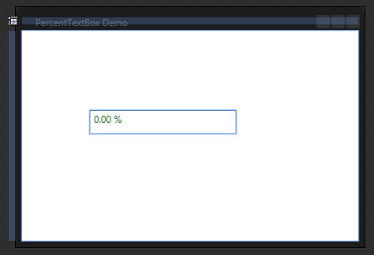
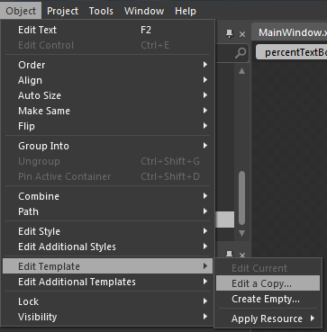
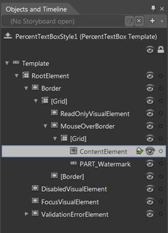
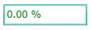

::: {style="DISPLAY: none"}
{#d2h_url_template}{#d2h_package_url style="WIDTH: 0px; DISPLAY: none; HEIGHT: 0px"}
:::

::::: {#nsbanner .d2h_main_nsbanner style="BORDER-BOTTOM: #999999 1px solid; POSITION: relative; PADDING-BOTTOM: 0px; BACKGROUND-COLOR: transparent; PADDING-LEFT: 0px; PADDING-RIGHT: 0px; DISPLAY: none; BORDER-TOP: #999999 1px solid; PADDING-TOP: 0px; LEFT: 0px"}
:::: {#TitleRow .d2h_main_titlerow style="PADDING-BOTTOM: 4px; BACKGROUND-COLOR: transparent; PADDING-LEFT: 22px; WIDTH: 100%; PADDING-RIGHT: 10px; DISPLAY: none; PADDING-TOP: 4px"}
::: {#ienav .d2h_main_ienav style="DISPLAY: none"}
{#D2HPrevious .D2HPreviousEnabled}  {#D2HNext .D2HNextEnabled}
:::
::::
:::::

::: {#nstext .d2h_main_nstext style="PADDING-BOTTOM: 10px; BACKGROUND-COLOR: transparent; PADDING-LEFT: 22px; PADDING-RIGHT: 10px; HEIGHT: 100%; OVERFLOW: auto; PADDING-TOP: 5px" hasuserbackground="true" valign="bottom"}
### Blendability

PercentTextBox Template can be edited using Expression Blend in order to get a good look and feel for an application.

This can be accomplished by creating a simple Silverlight application in Blend.

 

Thendrag and drop PercentTextBox into the application from **Assets** tab.

 

{border="0"}

Figure 245: Blend -- Design View

[]{style="FONT-FAMILY: 'Calibri','sans-serif'; FONT-SIZE: 11pt"} 

After creating the PercentTextBox, select it and go to **Object -\> Edit Style -\> Edit a Copy** to edit the Template of PercentTextBox.

[]{style="FONT-FAMILY: 'Calibri','sans-serif'; FONT-SIZE: 11pt"} 

{border="0"}

Figure 246: Blend -- Edit Template

There is another way to Edit Template.Right click on PercentTextBox control in Object and Timeline and choose Edit Template option as shown below.

{border="0"}

Figure 247: Blend -- Edit Template

This will open a dialog box where you can give a name of your style and define exactly where you want to store it.

{border="0"}

Figure 248: Blend -- Create Style Resource

The above steps include some lines of XAML within your application. This XAML represents the default style for percent PercentTextBox.

 

+----------------------------------------------------------------------------------------------------------------------------------------------------------------------------------------------------------------------------------------------------------------------------------------------------------------------------------------------------------------------------------------------------------------------------------------------------------------------------------------------------------------------------------------------------------------------------------------------------------------------------------------------------------------------------------------------------------------------------------------------------------------+
| **[\[XAML\]]{style="FONT-FAMILY: 'Courier New'; COLOR: black"}**                                                                                                                                                                                                                                                                                                                                                                                                                                                                                                                                                                                                                                                                                               |
|                                                                                                                                                                                                                                                                                                                                                                                                                                                                                                                                                                                                                                                                                                                                                                |
| **[]{style="FONT-FAMILY: 'Courier New'"}**                                                                                                                                                                                                                                                                                                                                                                                                                                                                                                                                                                                                                                                                                                                     |
|                                                                                                                                                                                                                                                                                                                                                                                                                                                                                                                                                                                                                                                                                                                                                                |
| [\<]{style="FONT-FAMILY: 'Courier New'; COLOR: blue"}[syncfusion]{style="FONT-FAMILY: 'Courier New'; COLOR: #a31515"}[:]{style="FONT-FAMILY: 'Courier New'; COLOR: blue"}[PercentTextBox]{style="FONT-FAMILY: 'Courier New'; COLOR: #a31515"}[ x]{style="FONT-FAMILY: 'Courier New'; COLOR: red"}[:]{style="FONT-FAMILY: 'Courier New'; COLOR: blue"}[Name]{style="FONT-FAMILY: 'Courier New'; COLOR: red"}[=\"percentTextBox\"]{style="FONT-FAMILY: 'Courier New'; COLOR: blue"}[ Height]{style="FONT-FAMILY: 'Courier New'; COLOR: red"}[=\"25\"]{style="FONT-FAMILY: 'Courier New'; COLOR: blue"}[ Width]{style="FONT-FAMILY: 'Courier New'; COLOR: red"}[=\"150\"]{style="FONT-FAMILY: 'Courier New'; COLOR: blue"}[ ]{style="FONT-FAMILY: 'Courier New'"} |
|                                                                                                                                                                                                                                                                                                                                                                                                                                                                                                                                                                                                                                                                                                                                                                |
| [                           [ CornerRadius]{style="COLOR: red"}[=\"2\"]{style="COLOR: blue"}[ Style]{style="COLOR: red"}[=\"{]{style="COLOR: blue"}[StaticResource]{style="COLOR: #a31515"}[ ]{style="COLOR: red"}]{style="FONT-FAMILY: 'Courier New'"}                                                                                                                                                                                                                                                                                                                                                                                                                                                                                                        |
|                                                                                                                                                                                                                                                                                                                                                                                                                                                                                                                                                                                                                                                                                                                                                                |
| [                            PercentTextBoxStyle1]{style="FONT-FAMILY: 'Courier New'; COLOR: red"}[}\"/\>]{style="FONT-FAMILY: 'Courier New'; COLOR: blue"}**[]{style="FONT-FAMILY: 'Courier New'"}**                                                                                                                                                                                                                                                                                                                                                                                                                                                                                                                                                          |
+----------------------------------------------------------------------------------------------------------------------------------------------------------------------------------------------------------------------------------------------------------------------------------------------------------------------------------------------------------------------------------------------------------------------------------------------------------------------------------------------------------------------------------------------------------------------------------------------------------------------------------------------------------------------------------------------------------------------------------------------------------------+

[]{style="FONT-FAMILY: 'Calibri','sans-serif'; FONT-SIZE: 11pt"} 

All template items can are now found in the Objects and Timeline window. Now you can customize each part in template.

[]{style="FONT-FAMILY: 'Calibri','sans-serif'; FONT-SIZE: 11pt"} 

{border="0"}

Figure 249: Blend -- Objects and Timeline

 

Here is the code to modify the Mouse over state of the PercentTextBox.

+----------------------------------------------------------------------------------------------------------------------------------------------------------------------------------------------------------------------------------------------------------------------------------------------------------------------------------------------------------------------------------------------------------------------------------------------------------------------------------------------------------------------------------------------------------------------------------+
| **[\[XAML\]]{style="FONT-FAMILY: 'Courier New'; COLOR: black"}**                                                                                                                                                                                                                                                                                                                                                                                                                                                                                                                 |
|                                                                                                                                                                                                                                                                                                                                                                                                                                                                                                                                                                                  |
| **[]{style="FONT-FAMILY: 'Courier New'"}**                                                                                                                                                                                                                                                                                                                                                                                                                                                                                                                                       |
|                                                                                                                                                                                                                                                                                                                                                                                                                                                                                                                                                                                  |
| [\<]{style="FONT-FAMILY: 'Courier New'; COLOR: blue"}[VisualState]{style="FONT-FAMILY: 'Courier New'; COLOR: #a31515"}[ x]{style="FONT-FAMILY: 'Courier New'; COLOR: red"}[:]{style="FONT-FAMILY: 'Courier New'; COLOR: blue"}[Name]{style="FONT-FAMILY: 'Courier New'; COLOR: red"}[=\"MouseOver\"\>]{style="FONT-FAMILY: 'Courier New'; COLOR: blue"}[]{style="FONT-FAMILY: 'Courier New'"}                                                                                                                                                                                    |
|                                                                                                                                                                                                                                                                                                                                                                                                                                                                                                                                                                                  |
| [      ]{style="FONT-FAMILY: 'Courier New'; COLOR: #a31515"}[\<]{style="FONT-FAMILY: 'Courier New'; COLOR: blue"}[Storyboard]{style="FONT-FAMILY: 'Courier New'; COLOR: #a31515"}[\>]{style="FONT-FAMILY: 'Courier New'; COLOR: blue"}[]{style="FONT-FAMILY: 'Courier New'"}                                                                                                                                                                                                                                                                                                     |
|                                                                                                                                                                                                                                                                                                                                                                                                                                                                                                                                                                                  |
| [            ]{style="FONT-FAMILY: 'Courier New'; COLOR: #a31515"}[\<]{style="FONT-FAMILY: 'Courier New'; COLOR: blue"}[ColorAnimationUsingKeyFrames]{style="FONT-FAMILY: 'Courier New'; COLOR: #a31515"}[ Storyboard.TargetProperty]{style="FONT-FAMILY: 'Courier New'; COLOR: red"}[=\"(Border.BorderBrush).(SolidColorBrush.Color)\"]{style="FONT-FAMILY: 'Courier New'; COLOR: blue"}[ Storyboard.TargetName]{style="FONT-FAMILY: 'Courier New'; COLOR: red"}[=\"MouseOverBorder\"\>]{style="FONT-FAMILY: 'Courier New'; COLOR: blue"}[]{style="FONT-FAMILY: 'Courier New'"} |
|                                                                                                                                                                                                                                                                                                                                                                                                                                                                                                                                                                                  |
| [                  ]{style="FONT-FAMILY: 'Courier New'; COLOR: #a31515"}[\<]{style="FONT-FAMILY: 'Courier New'; COLOR: blue"}[SplineColorKeyFrame]{style="FONT-FAMILY: 'Courier New'; COLOR: #a31515"}[ KeyTime]{style="FONT-FAMILY: 'Courier New'; COLOR: red"}[=\"0\"]{style="FONT-FAMILY: 'Courier New'; COLOR: blue"}[ Value]{style="FONT-FAMILY: 'Courier New'; COLOR: red"}[=\"#FF22DCB9\"/\>]{style="FONT-FAMILY: 'Courier New'; COLOR: blue"}[]{style="FONT-FAMILY: 'Courier New'"}                                                                                      |
|                                                                                                                                                                                                                                                                                                                                                                                                                                                                                                                                                                                  |
| [            ]{style="FONT-FAMILY: 'Courier New'; COLOR: #a31515"}[\</]{style="FONT-FAMILY: 'Courier New'; COLOR: blue"}[ColorAnimationUsingKeyFrames]{style="FONT-FAMILY: 'Courier New'; COLOR: #a31515"}[\>]{style="FONT-FAMILY: 'Courier New'; COLOR: blue"}[]{style="FONT-FAMILY: 'Courier New'"}                                                                                                                                                                                                                                                                            |
|                                                                                                                                                                                                                                                                                                                                                                                                                                                                                                                                                                                  |
| [      ]{style="FONT-FAMILY: 'Courier New'; COLOR: #a31515"}[\</]{style="FONT-FAMILY: 'Courier New'; COLOR: blue"}[Storyboard]{style="FONT-FAMILY: 'Courier New'; COLOR: #a31515"}[\>]{style="FONT-FAMILY: 'Courier New'; COLOR: blue"}[]{style="FONT-FAMILY: 'Courier New'"}                                                                                                                                                                                                                                                                                                    |
|                                                                                                                                                                                                                                                                                                                                                                                                                                                                                                                                                                                  |
| [\</]{style="FONT-FAMILY: 'Courier New'; COLOR: blue"}[VisualState]{style="FONT-FAMILY: 'Courier New'; COLOR: #a31515"}[\>]{style="FONT-FAMILY: 'Courier New'; COLOR: blue"}**[]{style="FONT-FAMILY: 'Courier New'"}**                                                                                                                                                                                                                                                                                                                                                           |
+----------------------------------------------------------------------------------------------------------------------------------------------------------------------------------------------------------------------------------------------------------------------------------------------------------------------------------------------------------------------------------------------------------------------------------------------------------------------------------------------------------------------------------------------------------------------------------+

[]{style="FONT-FAMILY: 'Calibri','sans-serif'; FONT-SIZE: 11pt"} 

{border="0"}

Figure 250: PercentTextBox

[]{#related-topics}
:::
