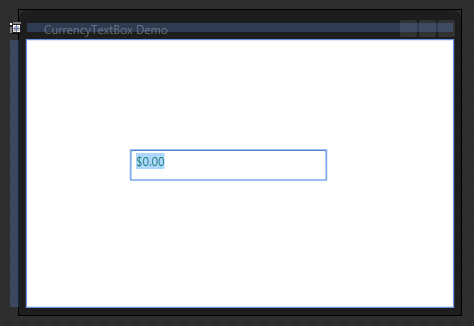
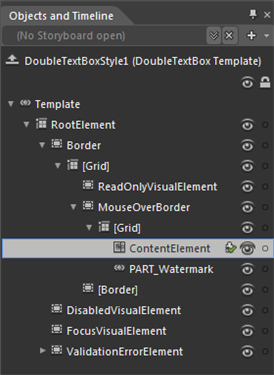
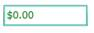

::: {style="DISPLAY: none"}
{#d2h_url_template}{#d2h_package_url style="WIDTH: 0px; DISPLAY: none; HEIGHT: 0px"}
:::

::::: {#nsbanner .d2h_main_nsbanner style="BORDER-BOTTOM: #999999 1px solid; POSITION: relative; PADDING-BOTTOM: 0px; BACKGROUND-COLOR: transparent; PADDING-LEFT: 0px; PADDING-RIGHT: 0px; DISPLAY: none; BORDER-TOP: #999999 1px solid; PADDING-TOP: 0px; LEFT: 0px"}
:::: {#TitleRow .d2h_main_titlerow style="PADDING-BOTTOM: 4px; BACKGROUND-COLOR: transparent; PADDING-LEFT: 22px; WIDTH: 100%; PADDING-RIGHT: 10px; DISPLAY: none; PADDING-TOP: 4px"}
::: {#ienav .d2h_main_ienav style="DISPLAY: none"}
{#D2HPrevious .D2HPreviousEnabled}  {#D2HNext .D2HNextEnabled}
:::
::::
:::::

::: {#nstext .d2h_main_nstext style="PADDING-BOTTOM: 10px; BACKGROUND-COLOR: transparent; PADDING-LEFT: 22px; PADDING-RIGHT: 10px; HEIGHT: 100%; OVERFLOW: auto; PADDING-TOP: 5px" hasuserbackground="true" valign="bottom"}
### Blendability

User can edit CurrencyTextBox Template to give nice look and feel using Expression Blend. This can be accomplished by creating a simple Silverlight application in Blend.Then drag and drop CurrencyTextBox into the application from **Assets** tab.

 

{border="0"}

Figure 287: CurrencyTextBox

 

After creating the CurrencyTextBox, select it and go to "**Object**" -\> "**Edit Style**" -\> "**Edit a Copy**" to edit the Template of CurrencyTextBox.

 

{border="0"}

Figure 288: "Object" -\> "Edit Style" -\> "Edit a Copy"

 

There is another way to Edit Template. Right click on CurrencyTextBox control in Object and Timeline and choose Edit Template option as shown below.

{border="0"}

Figure 289: Edit Template option

This will open a dialog box where you can give our style a name and define exactly where you want to to store it.

{border="0"}

Figure 290: Create Style Resource Dialog box

The above steps include some lines of XAML within your application. This XAML represents the default style for CurrencyTextBox.

 

 

  -----------------------------------------------------------------------------------------------------------------------------------------------------------------------------------------------------------------------------------------------------------------------------------------------------------------------------------------------------------------------------------------------------------------------------------------------------------------------------------------------------------------------------------------------------------------------------------------------------------------------------------------------------------------------------------------------------------------------------------------------------------------------------------------------------------------------------------------------------------------------------------------------------------------------------------------------------------------------------------------------------------------------------------------------
  [\<]{style="FONT-FAMILY: 'Courier New'; COLOR: blue"}[syncfusion]{style="FONT-FAMILY: 'Courier New'; COLOR: #a31515"}[:]{style="FONT-FAMILY: 'Courier New'; COLOR: blue"}[CurrencyTextBox]{style="FONT-FAMILY: 'Courier New'; COLOR: #a31515"}[ x]{style="FONT-FAMILY: 'Courier New'; COLOR: red"}[:]{style="FONT-FAMILY: 'Courier New'; COLOR: blue"}[Name]{style="FONT-FAMILY: 'Courier New'; COLOR: red"}[=\"currencyTextBox\"]{style="FONT-FAMILY: 'Courier New'; COLOR: blue"}[ Height]{style="FONT-FAMILY: 'Courier New'; COLOR: red"}[=\"25\"]{style="FONT-FAMILY: 'Courier New'; COLOR: blue"}[ Width]{style="FONT-FAMILY: 'Courier New'; COLOR: red"}[=\"150\"]{style="FONT-FAMILY: 'Courier New'; COLOR: blue"}[ Style]{style="FONT-FAMILY: 'Courier New'; COLOR: red"}[=\"{]{style="FONT-FAMILY: 'Courier New'; COLOR: blue"}[StaticResource]{style="FONT-FAMILY: 'Courier New'; COLOR: #a31515"}[ CurrencyTextBoxStyle1]{style="FONT-FAMILY: 'Courier New'; COLOR: red"}[}\"/\>]{style="FONT-FAMILY: 'Courier New'; COLOR: blue"}
  -----------------------------------------------------------------------------------------------------------------------------------------------------------------------------------------------------------------------------------------------------------------------------------------------------------------------------------------------------------------------------------------------------------------------------------------------------------------------------------------------------------------------------------------------------------------------------------------------------------------------------------------------------------------------------------------------------------------------------------------------------------------------------------------------------------------------------------------------------------------------------------------------------------------------------------------------------------------------------------------------------------------------------------------------

 

All template items are now found in the Objects and Timeline window. Now you can customize each part in template.

 

{border="0"}

Figure 291: Objects and Timeline window

Here is the code to modify the Mouse over state of the CurrencyTextBox.

+----------------------------------------------------------------------------------------------------------------------------------------------------------------------------------------------------------------------------------------------------------------------------------------------------------------------------------------------------------------------------------------------------------------------------------------------------------------------------------------------------------------------------------------------------------------------------------------------------------------------------------------------------------------------------------------------------------------------------------+
| [XAML]{style="FONT-FAMILY: 'Courier New'"}                                                                                                                                                                                                                                                                                                                                                                                                                                                                                                                                                                                                                                                                                       |
+----------------------------------------------------------------------------------------------------------------------------------------------------------------------------------------------------------------------------------------------------------------------------------------------------------------------------------------------------------------------------------------------------------------------------------------------------------------------------------------------------------------------------------------------------------------------------------------------------------------------------------------------------------------------------------------------------------------------------------+
| [\<]{style="FONT-FAMILY: 'Courier New'; COLOR: blue; FONT-SIZE: 9.5pt"}[VisualState]{style="FONT-FAMILY: 'Courier New'; COLOR: #a31515; FONT-SIZE: 9.5pt"}[ x]{style="FONT-FAMILY: 'Courier New'; COLOR: red; FONT-SIZE: 9.5pt"}[:]{style="FONT-FAMILY: 'Courier New'; COLOR: blue; FONT-SIZE: 9.5pt"}[Name]{style="FONT-FAMILY: 'Courier New'; COLOR: red; FONT-SIZE: 9.5pt"}[=\"MouseOver\"\>]{style="FONT-FAMILY: 'Courier New'; COLOR: blue; FONT-SIZE: 9.5pt"}[]{style="FONT-FAMILY: 'Courier New'; FONT-SIZE: 9.5pt"}                                                                                                                                                                                                      |
|                                                                                                                                                                                                                                                                                                                                                                                                                                                                                                                                                                                                                                                                                                                                  |
| [      ]{style="FONT-FAMILY: 'Courier New'; COLOR: #a31515; FONT-SIZE: 9.5pt"}[\<]{style="FONT-FAMILY: 'Courier New'; COLOR: blue; FONT-SIZE: 9.5pt"}[Storyboard]{style="FONT-FAMILY: 'Courier New'; COLOR: #a31515; FONT-SIZE: 9.5pt"}[\>]{style="FONT-FAMILY: 'Courier New'; COLOR: blue; FONT-SIZE: 9.5pt"}[]{style="FONT-FAMILY: 'Courier New'; FONT-SIZE: 9.5pt"}                                                                                                                                                                                                                                                                                                                                                           |
|                                                                                                                                                                                                                                                                                                                                                                                                                                                                                                                                                                                                                                                                                                                                  |
| [            ]{style="FONT-FAMILY: 'Courier New'; COLOR: #a31515; FONT-SIZE: 9.5pt"}[\<]{style="FONT-FAMILY: 'Courier New'; COLOR: blue; FONT-SIZE: 9.5pt"}[ColorAnimationUsingKeyFrames]{style="FONT-FAMILY: 'Courier New'; COLOR: #a31515; FONT-SIZE: 9.5pt"}[ Storyboard.TargetProperty]{style="FONT-FAMILY: 'Courier New'; COLOR: red; FONT-SIZE: 9.5pt"}[=\"(Border.BorderBrush).(SolidColorBrush.Color)\"]{style="FONT-FAMILY: 'Courier New'; COLOR: blue; FONT-SIZE: 9.5pt"}[ Storyboard.TargetName]{style="FONT-FAMILY: 'Courier New'; COLOR: red; FONT-SIZE: 9.5pt"}[=\"MouseOverBorder\"\>]{style="FONT-FAMILY: 'Courier New'; COLOR: blue; FONT-SIZE: 9.5pt"}[]{style="FONT-FAMILY: 'Courier New'; FONT-SIZE: 9.5pt"} |
|                                                                                                                                                                                                                                                                                                                                                                                                                                                                                                                                                                                                                                                                                                                                  |
| [                  ]{style="FONT-FAMILY: 'Courier New'; COLOR: #a31515; FONT-SIZE: 9.5pt"}[\<]{style="FONT-FAMILY: 'Courier New'; COLOR: blue; FONT-SIZE: 9.5pt"}[SplineColorKeyFrame]{style="FONT-FAMILY: 'Courier New'; COLOR: #a31515; FONT-SIZE: 9.5pt"}[ KeyTime]{style="FONT-FAMILY: 'Courier New'; COLOR: red; FONT-SIZE: 9.5pt"}[=\"0\"]{style="FONT-FAMILY: 'Courier New'; COLOR: blue; FONT-SIZE: 9.5pt"}[ Value]{style="FONT-FAMILY: 'Courier New'; COLOR: red; FONT-SIZE: 9.5pt"}[=\"#FF22DCB9\"/\>]{style="FONT-FAMILY: 'Courier New'; COLOR: blue; FONT-SIZE: 9.5pt"}[]{style="FONT-FAMILY: 'Courier New'; FONT-SIZE: 9.5pt"}                                                                                      |
|                                                                                                                                                                                                                                                                                                                                                                                                                                                                                                                                                                                                                                                                                                                                  |
| [            ]{style="FONT-FAMILY: 'Courier New'; COLOR: #a31515; FONT-SIZE: 9.5pt"}[\</]{style="FONT-FAMILY: 'Courier New'; COLOR: blue; FONT-SIZE: 9.5pt"}[ColorAnimationUsingKeyFrames]{style="FONT-FAMILY: 'Courier New'; COLOR: #a31515; FONT-SIZE: 9.5pt"}[\>]{style="FONT-FAMILY: 'Courier New'; COLOR: blue; FONT-SIZE: 9.5pt"}[]{style="FONT-FAMILY: 'Courier New'; FONT-SIZE: 9.5pt"}                                                                                                                                                                                                                                                                                                                                  |
|                                                                                                                                                                                                                                                                                                                                                                                                                                                                                                                                                                                                                                                                                                                                  |
| [      ]{style="FONT-FAMILY: 'Courier New'; COLOR: #a31515; FONT-SIZE: 9.5pt"}[\</]{style="FONT-FAMILY: 'Courier New'; COLOR: blue; FONT-SIZE: 9.5pt"}[Storyboard]{style="FONT-FAMILY: 'Courier New'; COLOR: #a31515; FONT-SIZE: 9.5pt"}[\>]{style="FONT-FAMILY: 'Courier New'; COLOR: blue; FONT-SIZE: 9.5pt"}[]{style="FONT-FAMILY: 'Courier New'; FONT-SIZE: 9.5pt"}                                                                                                                                                                                                                                                                                                                                                          |
|                                                                                                                                                                                                                                                                                                                                                                                                                                                                                                                                                                                                                                                                                                                                  |
| [\</]{style="FONT-FAMILY: 'Courier New'; COLOR: blue; FONT-SIZE: 9.5pt"}[VisualState]{style="FONT-FAMILY: 'Courier New'; COLOR: #a31515; FONT-SIZE: 9.5pt"}[\>]{style="FONT-FAMILY: 'Courier New'; COLOR: blue; FONT-SIZE: 9.5pt"}                                                                                                                                                                                                                                                                                                                                                                                                                                                                                               |
+----------------------------------------------------------------------------------------------------------------------------------------------------------------------------------------------------------------------------------------------------------------------------------------------------------------------------------------------------------------------------------------------------------------------------------------------------------------------------------------------------------------------------------------------------------------------------------------------------------------------------------------------------------------------------------------------------------------------------------+

 

{border="0"}

Figure 292: CurrencyTextBox

See Also

[·      ]{style="FONT-FAMILY: Symbol"}[Creating CurrencyTextBox by using Blend]{style="COLOR: windowtext; TEXT-DECORATION: none; text-underline: none"}

[·      ]{style="FONT-FAMILY: Symbol"}[Creating CurrencyTextBox using XAML]{style="COLOR: windowtext; TEXT-DECORATION: none; text-underline: none"}

 

[]{#related-topics}
:::
