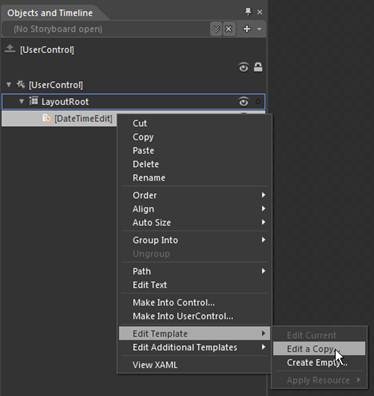
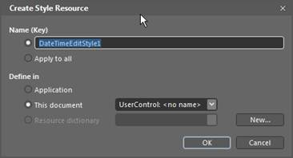
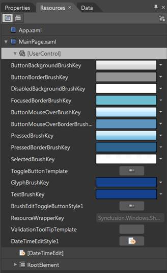

::: {style="DISPLAY: none"}
{#d2h_url_template}{#d2h_package_url style="WIDTH: 0px; DISPLAY: none; HEIGHT: 0px"}
:::

::::: {#nsbanner .d2h_main_nsbanner style="BORDER-BOTTOM: #999999 1px solid; POSITION: relative; PADDING-BOTTOM: 0px; BACKGROUND-COLOR: transparent; PADDING-LEFT: 0px; PADDING-RIGHT: 0px; DISPLAY: none; BORDER-TOP: #999999 1px solid; PADDING-TOP: 0px; LEFT: 0px"}
:::: {#TitleRow .d2h_main_titlerow style="PADDING-BOTTOM: 4px; BACKGROUND-COLOR: transparent; PADDING-LEFT: 22px; WIDTH: 100%; PADDING-RIGHT: 10px; DISPLAY: none; PADDING-TOP: 4px"}
::: {#ienav .d2h_main_ienav style="DISPLAY: none"}
{#D2HPrevious .D2HPreviousEnabled}  {#D2HNext .D2HNextEnabled}
:::
::::
:::::

::: {#nstext .d2h_main_nstext style="PADDING-BOTTOM: 10px; BACKGROUND-COLOR: transparent; PADDING-LEFT: 22px; PADDING-RIGHT: 10px; HEIGHT: 100%; OVERFLOW: auto; PADDING-TOP: 5px" hasuserbackground="true" valign="bottom"}
### Blendability

DateTimeEdit supports Blendability. DateTimeEdit template can be edited using Expression Blend in order to get a good look and feel for an application.

This can be accomplished by creating a simple Silverlight application in Blend.

 

Then simply drag and drop DateTimeEdit into the application from Asset tab.

{border="0"}

Figure 444: Creating a Silverlight application in Blend

After creating DateTimeEdit, right click on DateTimeEdit control in Object and Timeline and choose Edit Template option as shown below.

{border="0"}

Figure 445: Object and Timeline

This will open a dialog (below) where you can give a name of your style and define exactly where you want to store it.

{border="0"}

Figure 446: Create Style Resource

All the resources will be displayed on the resources pane in the right side of design area. These resources can be editable to create a new Style.

{border="0"}

Figure 447: Resources

 

 

{border="0"}

Figure 448: DateTimeEdit

See Also

[Creating DateTimeEdit using Blend]{style="COLOR: windowtext; TEXT-DECORATION: none; text-underline: none"}

 

[]{#related-topics}
:::
