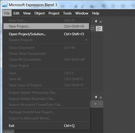
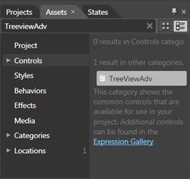
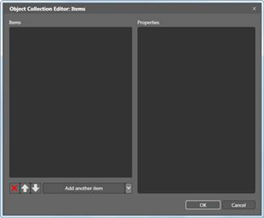
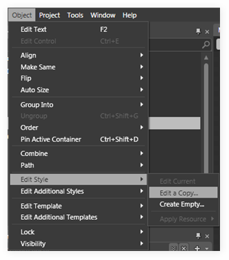
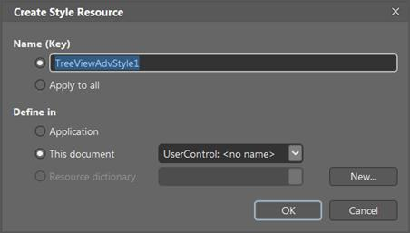
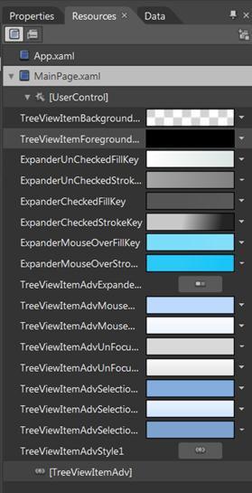
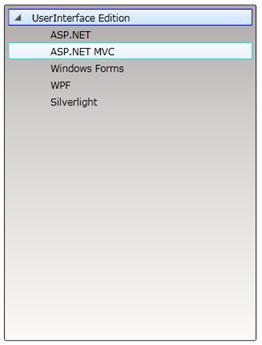

::: {style="DISPLAY: none"}
{#d2h_url_template}{#d2h_package_url style="WIDTH: 0px; DISPLAY: none; HEIGHT: 0px"}
:::

::: {.d2h_secondary_topic style="PADDING-BOTTOM: 10pt; MARGIN: 0pt; PADDING-LEFT: 0pt; PADDING-RIGHT: 0pt; PADDING-TOP: 0pt"}
#### Blendability

TreeViewAdv Control provides full Blend support. Here are the step-by-step instructions to create Silverlight application in Blend.

1.   Open *Blend*.

2.   On the *File* Menu click *New Project*. This opens the *New Project* dialog box.

 

{border="0"}

Figure 761: New Project Dialog box

3.   In the Project type's panel, select Silverlight application and then click *OK*.

{border="0"}

Figure 762: New Project

4.   Add the following reference with the sample project:

[·      ]{style="FONT-FAMILY: Symbol"}Syncfusion.Shared.Silverlight.dll

 

5.   On the *Window* menu, select *Assets*. This opens the *Assets Library* dialog box. In the Search box, type **TreeViewAdv**. This displays the search results.

{border="0"}

Figure 763: Assets Library dialog box

 

 

6.   Drag the *TreeViewAdv* control to Design View.

7.   Now select *TreeViewAdv* control to add items.

8.   Select the control, navigate to *Common Properties* located in the *Properties* pane and click the button next to Items (Collection).The Object Collection Editor will appear.

 

{border="0"}

Figure 764: Properties Window

 

 

9.   Object Collection Editor has two sections. The left one contains the list that contains the items of the selected *TreeViewAdv*.

{border="0"}

Figure 765: Object Collection Editor

 

10.  To add another item to the selected *TreeViewAdv* click *Add another Item* button located at the bottom of the *Items* list. To remove items, click the RemoveItem button. If youwant to add child items to a specific TreeViewItemAdv, select the item from the  Items list in the *Object Collection Editor* dialog.

11.  Select the item, navigate to *Common Properties* located in the *Properties* pane and click the button next to Items. The *Object Collection Editor* dialog will appear.

 

{border="0"}

Figure 766: Adding TreeViewItemAdv to TreeViewAdv,

 

12.  Click *OK* to confirm the changes and close the dialog. After adding TreeViewItemAdv to TreeViewAdv, select it and go to *Object* \> *Edit Style* \> *Edit a Copy*.

 

 

 

{border="0"}

 

Figure 767: Object \> Edit Style \> Edit a Copy

 

 

13.  This will open a dialog (below) where user can give the style name. Then click *OK*.

 

{border="0"}

Figure 768: Create Style Resource

 

14.  This will create default style for TreeViewItemAdv. Now you can edit the default style and you can edit each part in the TreeViewItemAdv template.

15.  All the resources will be displayed on the resources pane on the right side of the design area. These resources can be editable to create a new style.

 

 

{border="0"}

Figure 769: Resources

*[]{style="FONT-FAMILY: 'Calibri','sans-serif'; FONT-SIZE: 11pt"}* 

*[]{style="FONT-FAMILY: 'Calibri','sans-serif'; FONT-SIZE: 11pt"}* 

{border="0"}

Figure 770: TreeViewAdv

See Also

[[Creating TreeViewAdv using Blend]{.UGHyperlink}](../../../../../../../../Documents%20and%20Settings/riaj/Desktop/styling%20for%20ui%20silverlight/tools%20silverlight/tools%20part%202.docx#_Creating_TreeViewAdv_using)[]{.UGHyperlink}

[]{style="FONT-FAMILY: 'Calibri','sans-serif'; FONT-SIZE: 11pt"} 

[]{#related-topics}
:::
