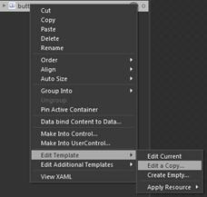
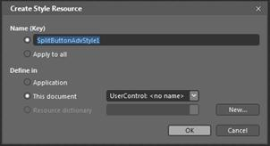
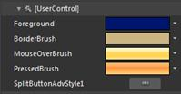

::: {style="DISPLAY: none"}
{#d2h_url_template}{#d2h_package_url style="WIDTH: 0px; DISPLAY: none; HEIGHT: 0px"}
:::

::: {.d2h_secondary_topic style="PADDING-BOTTOM: 10pt; MARGIN: 0pt; PADDING-LEFT: 0pt; PADDING-RIGHT: 0pt; PADDING-TOP: 0pt"}
#### Blendability

The Button Controls can be easily edited by using Expression Blend. The steps to edit the Button Controls by using Expression Blend are as follows:

[·      ]{style="FONT-FAMILY: Symbol"}Open the Sample in Expression Blend. Right-click the Button Control and select the **Edit Template** option, as shown below.

{border="0"}

Figure 1006: Editing the style by using Expression Blend

**[]{style="FONT-FAMILY: 'Calibri','sans-serif'"}** 

[·      ]{style="FONT-FAMILY: Symbol"}A window will appear as shown below. Click **OK**, to create a new style for the Button Control.

{border="0"}

Figure 1007: [Style Resource window]{style="FONT-FAMILY: 'Calibri','sans-serif'"}

[·      ]{style="FONT-FAMILY: Symbol"}All the resources will be displayed on the resources pane in the right side of the design area. These resources can be edited to create a new style.

{border="0"}

[Figure 22: Resources]{style="FONT-FAMILY: 'Calibri','sans-serif'"}

{border="0"}

Figure 1008: ButtonControlAdv style edited in Expression Blend

[]{#related-topics}
:::
