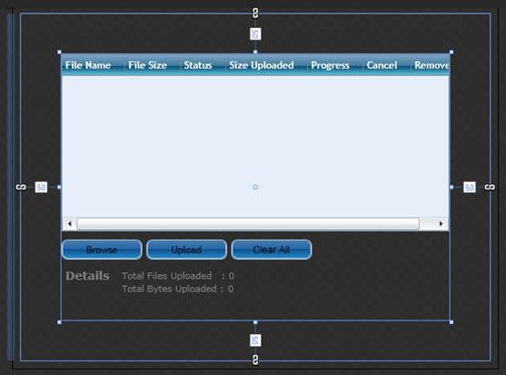
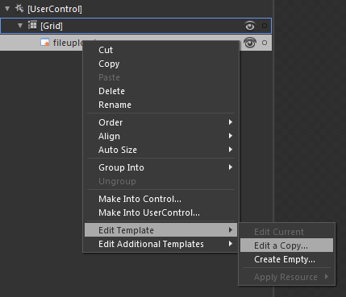
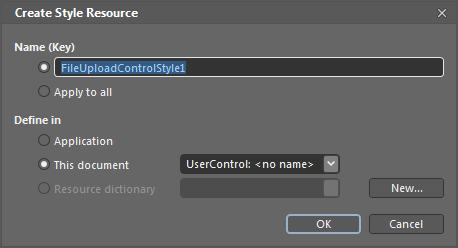
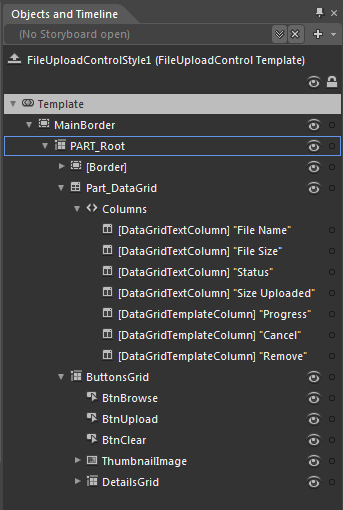
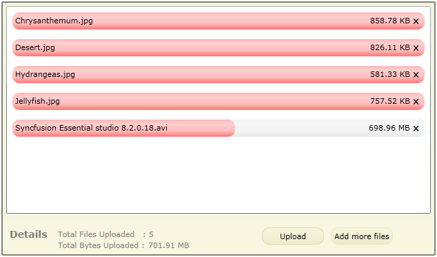

::: {style="DISPLAY: none"}
{#d2h_url_template}{#d2h_package_url style="WIDTH: 0px; DISPLAY: none; HEIGHT: 0px"}
:::

::: {.d2h_secondary_topic style="PADDING-BOTTOM: 10pt; MARGIN: 0pt; PADDING-LEFT: 0pt; PADDING-RIGHT: 0pt; PADDING-TOP: 0pt"}
#### Blendability support

[]{style="FONT-FAMILY: 'Calibri','sans-serif'; FONT-SIZE: 11pt"} 

The FileUpload control can be easily edited in Blend. The user can edit the template of the FileUpload control to give a customized look and feel for the control using Expression Blend. This can be started by simply creating an application in Blend.

Use Case Scenarios

This feature will be useful to improve the look and feel of the FileUpload control.

Adding the Blendability Support to an Application

1.   To create an application in Blend: Open **Blend**.

2.   On the **File** Menu, click **New Project**. This opens the **New Project** dialog box.

 

{border="0"}

Figure 385: Blend -- New Project

[]{style="FONT-FAMILY: 'Calibri','sans-serif'; FONT-SIZE: 11pt"} 

3.   In the **Project types** panel, select **Silverlight Application** and then click **OK**.

4.   Add the following reference with the sample project:

[·      ]{style="FONT-FAMILY: Symbol"}Syncfusion.Tools.Silverlight.dll

{border="0"}

Figure 386: Blend - New Project Dialog

[]{style="FONT-FAMILY: 'Calibri','sans-serif'; FONT-SIZE: 11pt"} 

5.   On the **Window** menu, select **Assets**. This opens the **Assets Library** dialog box.

6.   In the **Search** box, type **FileUploadControl**. This displays the search results.

7.   Drag the **FileUpload** control to **Design** view.

 

{border="0"}

Figure 387: Blend - Design View

8.   Create the **FileUpload** control.

9.   Select the **FileUpload** control and go to **Object** -\> **Edit Style** -\> **Edit a Copy**, to edit the template of the **FileUpload** control.

[]{style="FONT-FAMILY: 'Calibri','sans-serif'; FONT-SIZE: 11pt"} 

{border="0"}

Figure 388: Blend - Edit Template

[]{style="FONT-FAMILY: 'Calibri','sans-serif'; FONT-SIZE: 11pt"} 

Another way to edit the template:

1.   In **Object** and **Timeline** window, right click the **FileUpload** control and choose the **Edit Template** option as shown in the following screenshot.

[]{style="FONT-FAMILY: 'Calibri','sans-serif'; FONT-SIZE: 11pt"} 

{border="0"}

Figure 389: Blend - Edit Template

[]{style="FONT-FAMILY: 'Calibri','sans-serif'; FONT-SIZE: 11pt"} 

This will open a dialog (as shown in the following screenshot) where you can give the style a name and define exactly where you like to store it.

{border="0"}

Figure 390: Blend - Create Style

[]{style="FONT-FAMILY: 'Calibri','sans-serif'; FONT-SIZE: 11pt"} 

What is produced with the help of these steps is XAML, which is placed within the application. This XAML represents the default style for the FileUpload control.

 

+--------------------------------------------------------------------------------------------------------------------------------------------------------------------------------------------------------------------------------------------------------------------------------------------------------------------------------------------------------------------------------------------------------------------------------------------------------------------------------------------------------------------------------------------------------------------------------------------------------------------------------------------------------------------------------------------------------------------------------------------------------------------------------------------------+
| **[\[XAML\]]{style="FONT-FAMILY: 'Courier New'"}**                                                                                                                                                                                                                                                                                                                                                                                                                                                                                                                                                                                                                                                                                                                                               |
|                                                                                                                                                                                                                                                                                                                                                                                                                                                                                                                                                                                                                                                                                                                                                                                                  |
| []{style="FONT-FAMILY: 'Courier New'"}                                                                                                                                                                                                                                                                                                                                                                                                                                                                                                                                                                                                                                                                                                                                                           |
|                                                                                                                                                                                                                                                                                                                                                                                                                                                                                                                                                                                                                                                                                                                                                                                                  |
| [\<]{style="FONT-FAMILY: 'Courier New'; COLOR: blue"}[Syncfusion]{style="FONT-FAMILY: 'Courier New'; COLOR: #a31515"}[:]{style="FONT-FAMILY: 'Courier New'; COLOR: blue"}[FileUploadControl]{style="FONT-FAMILY: 'Courier New'; COLOR: #a31515"}[ x]{style="FONT-FAMILY: 'Courier New'; COLOR: red"}[:]{style="FONT-FAMILY: 'Courier New'; COLOR: blue"}[Name]{style="FONT-FAMILY: 'Courier New'; COLOR: red"}[=\"fileupload\"]{style="FONT-FAMILY: 'Courier New'; COLOR: blue"}[ Grid.Row]{style="FONT-FAMILY: 'Courier New'; COLOR: red"}[=\"0\"]{style="FONT-FAMILY: 'Courier New'; COLOR: blue"}[ EnableThumbnail]{style="FONT-FAMILY: 'Courier New'; COLOR: red"}[=\"True\"]{style="FONT-FAMILY: 'Courier New'; COLOR: blue"}[ [ Margin]{style="COLOR: red"}[=\"50\"]{style="COLOR: blue"}\ |
|         [        IsMultiSelect]{style="COLOR: red"}[=\"True\"]{style="COLOR: blue"}[ Style]{style="COLOR: red"}[=\"{]{style="COLOR: blue"}[StaticResource]{style="COLOR: #a31515"}[ FileUploadControlStyle1]{style="COLOR: red"}[}\"/\>]{style="COLOR: blue"}]{style="FONT-FAMILY: 'Courier New'"}                                                                                                                                                                                                                                                                                                                                                                                                                                                                                               |
|                                                                                                                                                                                                                                                                                                                                                                                                                                                                                                                                                                                                                                                                                                                                                                                                  |
| []{style="FONT-FAMILY: 'Courier New'"}                                                                                                                                                                                                                                                                                                                                                                                                                                                                                                                                                                                                                                                                                                                                                           |
|                                                                                                                                                                                                                                                                                                                                                                                                                                                                                                                                                                                                                                                                                                                                                                                                  |
| []{style="FONT-FAMILY: 'Courier New'"}                                                                                                                                                                                                                                                                                                                                                                                                                                                                                                                                                                                                                                                                                                                                                           |
+--------------------------------------------------------------------------------------------------------------------------------------------------------------------------------------------------------------------------------------------------------------------------------------------------------------------------------------------------------------------------------------------------------------------------------------------------------------------------------------------------------------------------------------------------------------------------------------------------------------------------------------------------------------------------------------------------------------------------------------------------------------------------------------------------+

[]{style="FONT-FAMILY: 'Calibri','sans-serif'; FONT-SIZE: 11pt"} 

All template items can now be found in the Objects and Timeline window.

 

{border="0"}

Figure 391: Objects and Timelines window

[]{style="FONT-FAMILY: 'Calibri','sans-serif'; FONT-SIZE: 11pt"} 

Now the user can edit each part in the template. As commands are used for each operation in the FileUpload control, the user can change the inner DataGrid also. In the following example, DataGrid is replaced with the ListBox and the template is edited to get a customized look and feel.

[]{style="FONT-FAMILY: 'Calibri','sans-serif'; FONT-SIZE: 11pt"} 

+-------------------------------------------------------------------------------------------------------------------------------------------------------------------------------------------------------------------------------------------------------------------------------------------------------------------------------------------------------------------------------------------------------------------------------------------------------------------------------------------------------------------------------------------------------------------------------------------------------------------------------------------------------------------------------------------------------------------------------------------------------------------------------------------------------------+
| **[\[XAML\]]{style="FONT-FAMILY: 'Courier New'"}**                                                                                                                                                                                                                                                                                                                                                                                                                                                                                                                                                                                                                                                                                                                                                          |
|                                                                                                                                                                                                                                                                                                                                                                                                                                                                                                                                                                                                                                                                                                                                                                                                             |
| []{style="FONT-FAMILY: 'Courier New'"}                                                                                                                                                                                                                                                                                                                                                                                                                                                                                                                                                                                                                                                                                                                                                                      |
|                                                                                                                                                                                                                                                                                                                                                                                                                                                                                                                                                                                                                                                                                                                                                                                                             |
| [    ]{style="FONT-FAMILY: 'Courier New'; COLOR: #a31515"}[\<]{style="FONT-FAMILY: 'Courier New'; COLOR: blue"}[UserControl.Resources]{style="FONT-FAMILY: 'Courier New'; COLOR: #a31515"}[\>]{style="FONT-FAMILY: 'Courier New'; COLOR: blue"}[\                                                                                                                                                                                                                                                                                                                                                                                                                                                                                                                                                           |
| [        ]{style="COLOR: #a31515"}[\<]{style="COLOR: blue"}[Style]{style="COLOR: #a31515"}[ x]{style="COLOR: red"}[:]{style="COLOR: blue"}[Key]{style="COLOR: red"}[=\"FileUploadControlStyle1\"]{style="COLOR: blue"}[ TargetType]{style="COLOR: red"}[=\"Syncfusion:FileUploadControl\"\>]{style="COLOR: blue"}\                                                                                                                                                                                                                                                                                                                                                                                                                                                                                          |
|  \                                                                                                                                                                                                                                                                                                                                                                                                                                                                                                                                                                                                                                                                                                                                                                                                          |
| [            ]{style="COLOR: #a31515"}[\<]{style="COLOR: blue"}[Setter]{style="COLOR: #a31515"}[ Property]{style="COLOR: red"}[=\"Background\"\>]{style="COLOR: blue"}\                                                                                                                                                                                                                                                                                                                                                                                                                                                                                                                                                                                                                                     |
| [                ]{style="COLOR: #a31515"}[\<]{style="COLOR: blue"}[Setter.Value]{style="COLOR: #a31515"}[\>]{style="COLOR: blue"}\                                                                                                                                                                                                                                                                                                                                                                                                                                                                                                                                                                                                                                                                         |
| [                    ]{style="COLOR: #a31515"}[\<]{style="COLOR: blue"}[LinearGradientBrush]{style="COLOR: #a31515"}[ EndPoint]{style="COLOR: red"}[=\"0.5,1\"]{style="COLOR: blue"}[ StartPoint]{style="COLOR: red"}[=\"0.5,0\"\>]{style="COLOR: blue"}\                                                                                                                                                                                                                                                                                                                                                                                                                                                                                                                                                   |
| [                        ]{style="COLOR: #a31515"}[\<]{style="COLOR: blue"}[GradientStop]{style="COLOR: #a31515"}[ Color]{style="COLOR: red"}[=\"#FFF3F4DC\"]{style="COLOR: blue"}[ Offset]{style="COLOR: red"}[=\"0\"/\>]{style="COLOR: blue"}\                                                                                                                                                                                                                                                                                                                                                                                                                                                                                                                                                            |
| [                        ]{style="COLOR: #a31515"}[\<]{style="COLOR: blue"}[GradientStop]{style="COLOR: #a31515"}[ Color]{style="COLOR: red"}[=\"#FFF7F7E1\"]{style="COLOR: blue"}[ Offset]{style="COLOR: red"}[=\"0.725\"/\>]{style="COLOR: blue"}\                                                                                                                                                                                                                                                                                                                                                                                                                                                                                                                                                        |
| [                        ]{style="COLOR: #a31515"}[\<]{style="COLOR: blue"}[GradientStop]{style="COLOR: #a31515"}[ Color]{style="COLOR: red"}[=\"#FFF8F8E2\"]{style="COLOR: blue"}[ Offset]{style="COLOR: red"}[=\"1\"/\>]{style="COLOR: blue"}\                                                                                                                                                                                                                                                                                                                                                                                                                                                                                                                                                            |
| [                    ]{style="COLOR: #a31515"}[\</]{style="COLOR: blue"}[LinearGradientBrush]{style="COLOR: #a31515"}[\>]{style="COLOR: blue"}\                                                                                                                                                                                                                                                                                                                                                                                                                                                                                                                                                                                                                                                             |
| [                ]{style="COLOR: #a31515"}[\</]{style="COLOR: blue"}[Setter.Value]{style="COLOR: #a31515"}[\>]{style="COLOR: blue"}\                                                                                                                                                                                                                                                                                                                                                                                                                                                                                                                                                                                                                                                                        |
| [            ]{style="COLOR: #a31515"}[\</]{style="COLOR: blue"}[Setter]{style="COLOR: #a31515"}[\>]{style="COLOR: blue"}\                                                                                                                                                                                                                                                                                                                                                                                                                                                                                                                                                                                                                                                                                  |
| [            ]{style="COLOR: #a31515"}[\<]{style="COLOR: blue"}[Setter]{style="COLOR: #a31515"}[ Property]{style="COLOR: red"}[=\"BorderBrush\"]{style="COLOR: blue"}[ Value]{style="COLOR: red"}[=\"Gray\"/\>]{style="COLOR: blue"}\                                                                                                                                                                                                                                                                                                                                                                                                                                                                                                                                                                       |
| [            ]{style="COLOR: #a31515"}[\<]{style="COLOR: blue"}[Setter]{style="COLOR: #a31515"}[ Property]{style="COLOR: red"}[=\"BorderThickness\"]{style="COLOR: blue"}[ Value]{style="COLOR: red"}[=\"2\"/\>]{style="COLOR: blue"}\                                                                                                                                                                                                                                                                                                                                                                                                                                                                                                                                                                      |
| [            ]{style="COLOR: #a31515"}[\<]{style="COLOR: blue"}[Setter]{style="COLOR: #a31515"}[ Property]{style="COLOR: red"}[=\"CornerRadius\"]{style="COLOR: blue"}[ Value]{style="COLOR: red"}[=\"1\"/\>]{style="COLOR: blue"}\                                                                                                                                                                                                                                                                                                                                                                                                                                                                                                                                                                         |
| [            ]{style="COLOR: #a31515"}[\<]{style="COLOR: blue"}[Setter]{style="COLOR: #a31515"}[ Property]{style="COLOR: red"}[=\"Header\"]{style="COLOR: blue"}[ Value]{style="COLOR: red"}[=\"Select Files\"/\>]{style="COLOR: blue"}\                                                                                                                                                                                                                                                                                                                                                                                                                                                                                                                                                                    |
| [            ]{style="COLOR: #a31515"}[\<]{style="COLOR: blue"}[Setter]{style="COLOR: #a31515"}[ Property]{style="COLOR: red"}[=\"HeaderContentTemplate\"]{style="COLOR: blue"}[ Value]{style="COLOR: red"}[=\"{]{style="COLOR: blue"}[StaticResource]{style="COLOR: #a31515"}[ FileUploadHeaderContentTemplate]{style="COLOR: red"}[}\"/\>]{style="COLOR: blue"}\                                                                                                                                                                                                                                                                                                                                                                                                                                          |
| [            ]{style="COLOR: #a31515"}[\<]{style="COLOR: blue"}[Setter]{style="COLOR: #a31515"}[ Property]{style="COLOR: red"}[=\"Template\"\>]{style="COLOR: blue"}\                                                                                                                                                                                                                                                                                                                                                                                                                                                                                                                                                                                                                                       |
| [                ]{style="COLOR: #a31515"}[\<]{style="COLOR: blue"}[Setter.Value]{style="COLOR: #a31515"}[\>]{style="COLOR: blue"}\                                                                                                                                                                                                                                                                                                                                                                                                                                                                                                                                                                                                                                                                         |
| [                    ]{style="COLOR: #a31515"}[\<]{style="COLOR: blue"}[ControlTemplate]{style="COLOR: #a31515"}[ TargetType]{style="COLOR: red"}[=\"Syncfusion:FileUploadControl\"\>]{style="COLOR: blue"}\                                                                                                                                                                                                                                                                                                                                                                                                                                                                                                                                                                                                |
|  \                                                                                                                                                                                                                                                                                                                                                                                                                                                                                                                                                                                                                                                                                                                                                                                                          |
| [                        ]{style="COLOR: #a31515"}[\<]{style="COLOR: blue"}[Border]{style="COLOR: #a31515"}[ x]{style="COLOR: red"}[:]{style="COLOR: blue"}[Name]{style="COLOR: red"}[=\"MainBorder\"]{style="COLOR: blue"}[ Background]{style="COLOR: red"}[=\"{]{style="COLOR: blue"}[TemplateBinding]{style="COLOR: #a31515"}[ Background]{style="COLOR: red"}[}\"]{style="COLOR: blue"}[ BorderThickness]{style="COLOR: red"}[=\"{]{style="COLOR: blue"}[TemplateBinding]{style="COLOR: #a31515"}[ BorderThickness]{style="COLOR: red"}[}\"]{style="COLOR: blue"} \                                                                                                                                                                                                                                     |
|                            [ BorderBrush]{style="COLOR: red"}[=\"{]{style="COLOR: blue"}[TemplateBinding]{style="COLOR: #a31515"}[ BorderBrush]{style="COLOR: red"}[}\"]{style="COLOR: blue"}[ CornerRadius]{style="COLOR: red"}[=\"{]{style="COLOR: blue"}[TemplateBinding]{style="COLOR: #a31515"}[ CornerRadius]{style="COLOR: red"}[}\"]{style="COLOR: blue"}\                                                                                                                                                                                                                                                                                                                                                                                                                                          |
|                            [ HorizontalAlignment]{style="COLOR: red"}[=\"Stretch\"]{style="COLOR: blue"}[ VerticalAlignment]{style="COLOR: red"}[=\"Stretch\"\>]{style="COLOR: blue"}\                                                                                                                                                                                                                                                                                                                                                                                                                                                                                                                                                                                                                      |
| [                            ]{style="COLOR: #a31515"}[\<]{style="COLOR: blue"}[Grid]{style="COLOR: #a31515"}[ x]{style="COLOR: red"}[:]{style="COLOR: blue"}[Name]{style="COLOR: red"}[=\"PART_Root\"\>]{style="COLOR: blue"}\                                                                                                                                                                                                                                                                                                                                                                                                                                                                                                                                                                             |
|  \                                                                                                                                                                                                                                                                                                                                                                                                                                                                                                                                                                                                                                                                                                                                                                                                          |
| [                                ]{style="COLOR: #a31515"}[\<]{style="COLOR: blue"}[Grid]{style="COLOR: #a31515"}[\>]{style="COLOR: blue"}\                                                                                                                                                                                                                                                                                                                                                                                                                                                                                                                                                                                                                                                                 |
| [                                    ]{style="COLOR: #a31515"}[\<]{style="COLOR: blue"}[Grid.RowDefinitions]{style="COLOR: #a31515"}[\>]{style="COLOR: blue"}\                                                                                                                                                                                                                                                                                                                                                                                                                                                                                                                                                                                                                                              |
| [                                        ]{style="COLOR: #a31515"}[\<]{style="COLOR: blue"}[RowDefinition]{style="COLOR: #a31515"}[ Height]{style="COLOR: red"}[=\"Auto\"/\>]{style="COLOR: blue"}\                                                                                                                                                                                                                                                                                                                                                                                                                                                                                                                                                                                                         |
| [                                        ]{style="COLOR: #a31515"}[\<]{style="COLOR: blue"}[RowDefinition]{style="COLOR: #a31515"}[ Height]{style="COLOR: red"}[=\"\*\"/\>]{style="COLOR: blue"}\                                                                                                                                                                                                                                                                                                                                                                                                                                                                                                                                                                                                           |
| [                                        ]{style="COLOR: #a31515"}[\<]{style="COLOR: blue"}[RowDefinition]{style="COLOR: #a31515"}[ Height]{style="COLOR: red"}[=\"Auto\"/\>]{style="COLOR: blue"}\                                                                                                                                                                                                                                                                                                                                                                                                                                                                                                                                                                                                         |
| [                                    ]{style="COLOR: #a31515"}[\</]{style="COLOR: blue"}[Grid.RowDefinitions]{style="COLOR: #a31515"}[\>]{style="COLOR: blue"}\                                                                                                                                                                                                                                                                                                                                                                                                                                                                                                                                                                                                                                             |
|  \                                                                                                                                                                                                                                                                                                                                                                                                                                                                                                                                                                                                                                                                                                                                                                                                          |
| [                                    ]{style="COLOR: #a31515"}[\<]{style="COLOR: blue"}[ListBox]{style="COLOR: #a31515"}[ x]{style="COLOR: red"}[:]{style="COLOR: blue"}[Name]{style="COLOR: red"}[=\"PART_ListBox\"]{style="COLOR: blue"}[ Margin]{style="COLOR: red"}[=\"5\"]{style="COLOR: blue"}[ SelectionMode]{style="COLOR: red"}[=\"Single\"]{style="COLOR: blue"}[ ItemContainerStyle]{style="COLOR: red"}[=\"{]{style="COLOR: blue"}[StaticResource]{style="COLOR: #a31515"}[ ListBoxItemStyle1]{style="COLOR: red"}[}\"]{style="COLOR: blue"}[ Grid.Row]{style="COLOR: red"}[=\"1\"]{style="COLOR: blue"}\                                                                                                                                                                                       |
|                                         [ ItemsSource]{style="COLOR: red"}[=\"{]{style="COLOR: blue"}[Binding]{style="COLOR: #a31515"}[ UploadFileCollection]{style="COLOR: red"}[,]{style="COLOR: blue"}[RelativeSource]{style="COLOR: red"}[={]{style="COLOR: blue"}[RelativeSource]{style="COLOR: #a31515"}[ TemplatedParent]{style="COLOR: red"}[}}\"\>]{style="COLOR: blue"}\                                                                                                                                                                                                                                                                                                                                                                                                                          |
| [                                        ]{style="COLOR: #a31515"}[\<]{style="COLOR: blue"}[ListBox.ItemTemplate]{style="COLOR: #a31515"}[\>]{style="COLOR: blue"}\                                                                                                                                                                                                                                                                                                                                                                                                                                                                                                                                                                                                                                         |
| [                                            ]{style="COLOR: #a31515"}[\<]{style="COLOR: blue"}[DataTemplate]{style="COLOR: #a31515"}[\>]{style="COLOR: blue"}\                                                                                                                                                                                                                                                                                                                                                                                                                                                                                                                                                                                                                                             |
| [                                                ]{style="COLOR: #a31515"}[\<]{style="COLOR: blue"}[Grid]{style="COLOR: #a31515"}[ Margin]{style="COLOR: red"}[=\"3\"\>]{style="COLOR: blue"}\                                                                                                                                                                                                                                                                                                                                                                                                                                                                                                                                                                                                              |
| [                                                    ]{style="COLOR: #a31515"}[\<]{style="COLOR: blue"}[ProgressBar]{style="COLOR: #a31515"}[ Maximum]{style="COLOR: red"}[=\"100\"]{style="COLOR: blue"}[ Minimum]{style="COLOR: red"}[=\"0\"]{style="COLOR: blue"} [ Value]{style="COLOR: red"}[=\"{]{style="COLOR: blue"}[Binding]{style="COLOR: #a31515"}[ PercentageUploaded]{style="COLOR: red"}[}\"]{style="COLOR: blue"}[ Foreground]{style="COLOR: red"}[=\"Red\"]{style="COLOR: blue"}[ Grid.ColumnSpan]{style="COLOR: red"}[=\"2\"]{style="COLOR: blue"}[ BorderThickness]{style="COLOR: red"}[=\"0\"]{style="COLOR: blue"}[ Style]{style="COLOR: red"}[=\"{]{style="COLOR: blue"}[StaticResource]{style="COLOR: #a31515"}[ ProgressBarStyle1]{style="COLOR: red"}[}\"/\>]{style="COLOR: blue"}\ |
| [                                                    ]{style="COLOR: #a31515"}[\<]{style="COLOR: blue"}[Grid]{style="COLOR: #a31515"}[ Margin]{style="COLOR: red"}[=\"5\"]{style="COLOR: blue"}[ VerticalAlignment]{style="COLOR: red"}[=\"Center\"\>]{style="COLOR: blue"}\                                                                                                                                                                                                                                                                                                                                                                                                                                                                                                                                |
| [                                                        ]{style="COLOR: #a31515"}[\<]{style="COLOR: blue"}[Grid.ColumnDefinitions]{style="COLOR: #a31515"}[\>]{style="COLOR: blue"}\                                                                                                                                                                                                                                                                                                                                                                                                                                                                                                                                                                                                                       |
| [                                                            ]{style="COLOR: #a31515"}[\<]{style="COLOR: blue"}[ColumnDefinition]{style="COLOR: #a31515"}[ Width]{style="COLOR: red"}[=\"\*\"/\>]{style="COLOR: blue"}\                                                                                                                                                                                                                                                                                                                                                                                                                                                                                                                                                                                     |
| [                                                            ]{style="COLOR: #a31515"}[\<]{style="COLOR: blue"}[ColumnDefinition]{style="COLOR: #a31515"}[ Width]{style="COLOR: red"}[=\"Auto\"/\>]{style="COLOR: blue"}\                                                                                                                                                                                                                                                                                                                                                                                                                                                                                                                                                                                   |
| [                                                        ]{style="COLOR: #a31515"}[\</]{style="COLOR: blue"}[Grid.ColumnDefinitions]{style="COLOR: #a31515"}[\>]{style="COLOR: blue"}\                                                                                                                                                                                                                                                                                                                                                                                                                                                                                                                                                                                                                      |
|  \                                                                                                                                                                                                                                                                                                                                                                                                                                                                                                                                                                                                                                                                                                                                                                                                          |
| [                                                        ]{style="COLOR: #a31515"}[\<]{style="COLOR: blue"}[TextBlock]{style="COLOR: #a31515"}[ Text]{style="COLOR: red"}[=\"{]{style="COLOR: blue"}[Binding]{style="COLOR: #a31515"}[ Path]{style="COLOR: red"}[=FileName}\"]{style="COLOR: blue"}[ HorizontalAlignment]{style="COLOR: red"}[=\"Left\"/\>]{style="COLOR: blue"}\                                                                                                                                                                                                                                                                                                                                                                                                                           |
| [                                                        ]{style="COLOR: #a31515"}[\<]{style="COLOR: blue"}[TextBlock]{style="COLOR: #a31515"}[ Text]{style="COLOR: red"}[=\"{]{style="COLOR: blue"}[Binding]{style="COLOR: #a31515"}[ Path]{style="COLOR: red"}[=FileSize}\"]{style="COLOR: blue"}[ HorizontalAlignment]{style="COLOR: red"}[=\"Right\"/\>]{style="COLOR: blue"}\                                                                                                                                                                                                                                                                                                                                                                                                                          |
|  \                                                                                                                                                                                                                                                                                                                                                                                                                                                                                                                                                                                                                                                                                                                                                                                                          |
| [                                                        ]{style="COLOR: #a31515"}[\<]{style="COLOR: blue"}[Button]{style="COLOR: #a31515"}[ Content]{style="COLOR: red"}[=\"r\"]{style="COLOR: blue"}[ FontFamily]{style="COLOR: red"}[=\"Webdings\"]{style="COLOR: blue"}[ HorizontalAlignment]{style="COLOR: red"}[=\"Right\"]{style="COLOR: blue"}[ Visibility]{style="COLOR: red"}[=\"Visible\"]{style="COLOR: blue"}\                                                                                                                                                                                                                                                                                                                                                                                 |
|                                                            [ Grid.Column]{style="COLOR: red"}[=\"1\"]{style="COLOR: blue"}[ VerticalAlignment]{style="COLOR: red"}[=\"Center\"]{style="COLOR: blue"}[ Margin]{style="COLOR: red"}[=\"3\"]{style="COLOR: blue"}[ Cursor]{style="COLOR: red"}[=\"Hand\"]{style="COLOR: blue"}\                                                                                                                                                                                                                                                                                                                                                                                                                                                                                |
|                                                            [ Command]{style="COLOR: red"}[=\"{]{style="COLOR: blue"}[Binding]{style="COLOR: #a31515"}[ CancelUploadCommand]{style="COLOR: red"}[}\"\>]{style="COLOR: blue"}\                                                                                                                                                                                                                                                                                                                                                                                                                                                                                                                                                                                |
| [                                                            ]{style="COLOR: #a31515"}[\<]{style="COLOR: blue"}[Button.Template]{style="COLOR: #a31515"}[\>]{style="COLOR: blue"}\                                                                                                                                                                                                                                                                                                                                                                                                                                                                                                                                                                                                                          |
| [                                                                ]{style="COLOR: #a31515"}[\<]{style="COLOR: blue"}[ControlTemplate]{style="COLOR: #a31515"}[ TargetType]{style="COLOR: red"}[=\"Button\"\>]{style="COLOR: blue"}\                                                                                                                                                                                                                                                                                                                                                                                                                                                                                                                                                                          |
| [                                                                    ]{style="COLOR: #a31515"}[\<]{style="COLOR: blue"}[Grid]{style="COLOR: #a31515"}[\>]{style="COLOR: blue"}\                                                                                                                                                                                                                                                                                                                                                                                                                                                                                                                                                                                                                             |
| [                                                                        ]{style="COLOR: #a31515"}[\<]{style="COLOR: blue"}[ContentPresenter]{style="COLOR: #a31515"}[/\>]{style="COLOR: blue"}\                                                                                                                                                                                                                                                                                                                                                                                                                                                                                                                                                                                                            |
| [                                                                    ]{style="COLOR: #a31515"}[\</]{style="COLOR: blue"}[Grid]{style="COLOR: #a31515"}[\>]{style="COLOR: blue"}\                                                                                                                                                                                                                                                                                                                                                                                                                                                                                                                                                                                                                            |
| [                                                                ]{style="COLOR: #a31515"}[\</]{style="COLOR: blue"}[ControlTemplate]{style="COLOR: #a31515"}[\>]{style="COLOR: blue"}\                                                                                                                                                                                                                                                                                                                                                                                                                                                                                                                                                                                                                     |
| [                                                            ]{style="COLOR: #a31515"}[\</]{style="COLOR: blue"}[Button.Template]{style="COLOR: #a31515"}[\>]{style="COLOR: blue"}\                                                                                                                                                                                                                                                                                                                                                                                                                                                                                                                                                                                                                         |
| [                                                        ]{style="COLOR: #a31515"}[\</]{style="COLOR: blue"}[Button]{style="COLOR: #a31515"}[\>]{style="COLOR: blue"}\                                                                                                                                                                                                                                                                                                                                                                                                                                                                                                                                                                                                                                      |
| [                                                    ]{style="COLOR: #a31515"}[\</]{style="COLOR: blue"}[Grid]{style="COLOR: #a31515"}[\>]{style="COLOR: blue"}\                                                                                                                                                                                                                                                                                                                                                                                                                                                                                                                                                                                                                                            |
| [                                                ]{style="COLOR: #a31515"}[\</]{style="COLOR: blue"}[Grid]{style="COLOR: #a31515"}[\>]{style="COLOR: blue"}\                                                                                                                                                                                                                                                                                                                                                                                                                                                                                                                                                                                                                                                |
| [                                            ]{style="COLOR: #a31515"}[\</]{style="COLOR: blue"}[DataTemplate]{style="COLOR: #a31515"}[\>]{style="COLOR: blue"}\                                                                                                                                                                                                                                                                                                                                                                                                                                                                                                                                                                                                                                            |
| [                                        ]{style="COLOR: #a31515"}[\</]{style="COLOR: blue"}[ListBox.ItemTemplate]{style="COLOR: #a31515"}[\>]{style="COLOR: blue"}\                                                                                                                                                                                                                                                                                                                                                                                                                                                                                                                                                                                                                                        |
| [                                    ]{style="COLOR: #a31515"}[\</]{style="COLOR: blue"}[ListBox]{style="COLOR: #a31515"}[\>]{style="COLOR: blue"}\                                                                                                                                                                                                                                                                                                                                                                                                                                                                                                                                                                                                                                                         |
|  \                                                                                                                                                                                                                                                                                                                                                                                                                                                                                                                                                                                                                                                                                                                                                                                                          |
| [                                    ]{style="COLOR: #a31515"}[\<]{style="COLOR: blue"}[Grid]{style="COLOR: #a31515"}[ Grid.Row]{style="COLOR: red"}[=\"2\"]{style="COLOR: blue"}[ HorizontalAlignment]{style="COLOR: red"}[=\"Left\"]{style="COLOR: blue"}[ Margin]{style="COLOR: red"}[=\"5\"\>]{style="COLOR: blue"}\                                                                                                                                                                                                                                                                                                                                                                                                                                                                                    |
|  \                                                                                                                                                                                                                                                                                                                                                                                                                                                                                                                                                                                                                                                                                                                                                                                                          |
| [                                        ]{style="COLOR: #a31515"}[\<]{style="COLOR: blue"}[Grid.ColumnDefinitions]{style="COLOR: #a31515"}[\>]{style="COLOR: blue"}\                                                                                                                                                                                                                                                                                                                                                                                                                                                                                                                                                                                                                                       |
| [                                            ]{style="COLOR: #a31515"}[\<]{style="COLOR: blue"}[ColumnDefinition]{style="COLOR: #a31515"}[ Width]{style="COLOR: red"}[=\"\*\"/\>]{style="COLOR: blue"}\                                                                                                                                                                                                                                                                                                                                                                                                                                                                                                                                                                                                     |
| [                                            ]{style="COLOR: #a31515"}[\<]{style="COLOR: blue"}[ColumnDefinition]{style="COLOR: #a31515"}[ Width]{style="COLOR: red"}[=\"100\"/\>]{style="COLOR: blue"}\                                                                                                                                                                                                                                                                                                                                                                                                                                                                                                                                                                                                    |
| [                                            ]{style="COLOR: #a31515"}[\<]{style="COLOR: blue"}[ColumnDefinition]{style="COLOR: #a31515"}[ Width]{style="COLOR: red"}[=\"100\"/\>]{style="COLOR: blue"}\                                                                                                                                                                                                                                                                                                                                                                                                                                                                                                                                                                                                    |
| [                                            ]{style="COLOR: #a31515"}[\<]{style="COLOR: blue"}[ColumnDefinition]{style="COLOR: #a31515"}[ Width]{style="COLOR: red"}[=\"100\"/\>]{style="COLOR: blue"}\                                                                                                                                                                                                                                                                                                                                                                                                                                                                                                                                                                                                    |
| [                                        ]{style="COLOR: #a31515"}[\</]{style="COLOR: blue"}[Grid.ColumnDefinitions]{style="COLOR: #a31515"}[\>]{style="COLOR: blue"}\                                                                                                                                                                                                                                                                                                                                                                                                                                                                                                                                                                                                                                      |
|  \                                                                                                                                                                                                                                                                                                                                                                                                                                                                                                                                                                                                                                                                                                                                                                                                          |
| [                                        ]{style="COLOR: #a31515"}[\<]{style="COLOR: blue"}[Grid]{style="COLOR: #a31515"}[ Grid.Row]{style="COLOR: red"}[=\"0\"]{style="COLOR: blue"}[ Grid.Column]{style="COLOR: red"}[=\"0\"]{style="COLOR: blue"}[ Margin]{style="COLOR: red"}[=\"0,10,0,0\"]{style="COLOR: blue"}[ x]{style="COLOR: red"}[:]{style="COLOR: blue"}[Name]{style="COLOR: red"}[=\"DetailsGrid\"]{style="COLOR: blue"} \                                                                                                                                                                                                                                                                                                                                                                    |
|                                    [ Visibility]{style="COLOR: red"}[=\"{]{style="COLOR: blue"}[Binding]{style="COLOR: #a31515"}[ RelativeSource]{style="COLOR: red"}[={]{style="COLOR: blue"}[RelativeSource]{style="COLOR: #a31515"}[ TemplatedParent]{style="COLOR: red"}[},]{style="COLOR: blue"}[Path]{style="COLOR: red"}[=EnableDetails,]{style="COLOR: blue"}[Converter]{style="COLOR: red"}[={]{style="COLOR: blue"}[StaticResource]{style="COLOR: #a31515"}[ BooleanToVisibilityConverter]{style="COLOR: red"}[}}\" \>]{style="COLOR: blue"}\                                                                                                                                                                                                                                                     |
| [                                            ]{style="COLOR: #a31515"}[\<]{style="COLOR: blue"}[Grid.ColumnDefinitions]{style="COLOR: #a31515"}[ \>]{style="COLOR: blue"}\                                                                                                                                                                                                                                                                                                                                                                                                                                                                                                                                                                                                                                  |
| [                                                ]{style="COLOR: #a31515"}[\<]{style="COLOR: blue"}[ColumnDefinition]{style="COLOR: #a31515"}[ Width]{style="COLOR: red"}[=\"60\"\>\</]{style="COLOR: blue"}[ColumnDefinition]{style="COLOR: #a31515"}[\>]{style="COLOR: blue"}\                                                                                                                                                                                                                                                                                                                                                                                                                                                                                                                            |
| [                                                ]{style="COLOR: #a31515"}[\<]{style="COLOR: blue"}[ColumnDefinition]{style="COLOR: #a31515"}[ Width]{style="COLOR: red"}[=\"\*\"\>\</]{style="COLOR: blue"}[ColumnDefinition]{style="COLOR: #a31515"}[\>]{style="COLOR: blue"}\                                                                                                                                                                                                                                                                                                                                                                                                                                                                                                                            |
| [                                            ]{style="COLOR: #a31515"}[\</]{style="COLOR: blue"}[Grid.ColumnDefinitions]{style="COLOR: #a31515"}[\>]{style="COLOR: blue"}\                                                                                                                                                                                                                                                                                                                                                                                                                                                                                                                                                                                                                                  |
|  \                                                                                                                                                                                                                                                                                                                                                                                                                                                                                                                                                                                                                                                                                                                                                                                                          |
| [                                            ]{style="COLOR: #a31515"}[\<]{style="COLOR: blue"}[TextBlock]{style="COLOR: #a31515"}[ x]{style="COLOR: red"}[:]{style="COLOR: blue"}[Name]{style="COLOR: red"}[=\"TxtDetails\"]{style="COLOR: blue"}[ Text]{style="COLOR: red"}[=\"Details\"]{style="COLOR: blue"}[ Foreground]{style="COLOR: red"}[=\"Gray\"]{style="COLOR: blue"} [ FontSize]{style="COLOR: red"}[=\"14\"]{style="COLOR: blue"}[ FontWeight]{style="COLOR: red"}[=\"Bold\"]{style="COLOR: blue"}[ Grid.Column]{style="COLOR: red"}[=\"0\"]{style="COLOR: blue"}[ Margin]{style="COLOR: red"}[=\"5,0,0,0\"\>\</]{style="COLOR: blue"}[TextBlock]{style="COLOR: #a31515"}[\>]{style="COLOR: blue"}\                                                                                           |
| [                                            ]{style="COLOR: #a31515"}[\<]{style="COLOR: blue"}[StackPanel]{style="COLOR: #a31515"}[ Grid.Column]{style="COLOR: red"}[=\"1\"]{style="COLOR: blue"} [ Margin]{style="COLOR: red"}[=\"15,2,0,0\"\>]{style="COLOR: blue"}\                                                                                                                                                                                                                                                                                                                                                                                                                                                                                                                                     |
| [                                                ]{style="COLOR: #a31515"}[\<]{style="COLOR: blue"}[StackPanel]{style="COLOR: #a31515"}[ Orientation]{style="COLOR: red"}[=\"Horizontal\" \>]{style="COLOR: blue"}\                                                                                                                                                                                                                                                                                                                                                                                                                                                                                                                                                                                         |
| [                                                    ]{style="COLOR: #a31515"}[\<]{style="COLOR: blue"}[TextBlock]{style="COLOR: #a31515"} [ x]{style="COLOR: red"}[:]{style="COLOR: blue"}[Name]{style="COLOR: red"}[=\"TxtTotalFilesHeading\"]{style="COLOR: blue"}[ Foreground]{style="COLOR: red"}[=\"Gray\"]{style="COLOR: blue"}[ Text]{style="COLOR: red"}[=\"Total Files Uploaded   : \" /\>]{style="COLOR: blue"}\                                                                                                                                                                                                                                                                                                                                                                                 |
| [                                                    ]{style="COLOR: #a31515"}[\<]{style="COLOR: blue"}[TextBlock]{style="COLOR: #a31515"} [ x]{style="COLOR: red"}[:]{style="COLOR: blue"}[Name]{style="COLOR: red"}[=\"TxtTotalFiles\"]{style="COLOR: blue"} [ Foreground]{style="COLOR: red"}[=\"Gray\"]{style="COLOR: blue"}[ Text]{style="COLOR: red"}[=\"0\"/\>]{style="COLOR: blue"}\                                                                                                                                                                                                                                                                                                                                                                                                                |
| [                                                ]{style="COLOR: #a31515"}[\</]{style="COLOR: blue"}[StackPanel]{style="COLOR: #a31515"}[\>]{style="COLOR: blue"}\                                                                                                                                                                                                                                                                                                                                                                                                                                                                                                                                                                                                                                          |
| [                                                ]{style="COLOR: #a31515"}[\<]{style="COLOR: blue"}[Grid]{style="COLOR: #a31515"}[\>]{style="COLOR: blue"}\                                                                                                                                                                                                                                                                                                                                                                                                                                                                                                                                                                                                                                                 |
| [                                                    ]{style="COLOR: #a31515"}[\<]{style="COLOR: blue"}[StackPanel]{style="COLOR: #a31515"}[ Orientation]{style="COLOR: red"}[=\"Horizontal\" \>]{style="COLOR: blue"}\                                                                                                                                                                                                                                                                                                                                                                                                                                                                                                                                                                                     |
| [                                                        ]{style="COLOR: #a31515"}[\<]{style="COLOR: blue"}[TextBlock]{style="COLOR: #a31515"}[ x]{style="COLOR: red"}[:]{style="COLOR: blue"}[Name]{style="COLOR: red"}[=\"TxtTotalBytesHeading\"]{style="COLOR: blue"}[ Foreground]{style="COLOR: red"}[=\"Gray\"]{style="COLOR: blue"}[ Text]{style="COLOR: red"}[=\"Total Bytes Uploaded : \" /\>]{style="COLOR: blue"}\                                                                                                                                                                                                                                                                                                                                                                                |
| [                                                        ]{style="COLOR: #a31515"}[\<]{style="COLOR: blue"}[TextBlock]{style="COLOR: #a31515"}[ x]{style="COLOR: red"}[:]{style="COLOR: blue"}[Name]{style="COLOR: red"}[=\"TxtTotalBytes\"]{style="COLOR: blue"} [ Foreground]{style="COLOR: red"}[=\"Gray\"]{style="COLOR: blue"}[ Text]{style="COLOR: red"}[=\"0\"/\>]{style="COLOR: blue"}\                                                                                                                                                                                                                                                                                                                                                                                                             |
| [                                                    ]{style="COLOR: #a31515"}[\</]{style="COLOR: blue"}[StackPanel]{style="COLOR: #a31515"}[\>]{style="COLOR: blue"}\                                                                                                                                                                                                                                                                                                                                                                                                                                                                                                                                                                                                                                      |
| [                                                ]{style="COLOR: #a31515"}[\</]{style="COLOR: blue"}[Grid]{style="COLOR: #a31515"}[\>]{style="COLOR: blue"}\                                                                                                                                                                                                                                                                                                                                                                                                                                                                                                                                                                                                                                                |
| [                                            ]{style="COLOR: #a31515"}[\</]{style="COLOR: blue"}[StackPanel]{style="COLOR: #a31515"}[\>]{style="COLOR: blue"}\                                                                                                                                                                                                                                                                                                                                                                                                                                                                                                                                                                                                                                              |
| [                                        ]{style="COLOR: #a31515"}[\</]{style="COLOR: blue"}[Grid]{style="COLOR: #a31515"}[\>]{style="COLOR: blue"}\                                                                                                                                                                                                                                                                                                                                                                                                                                                                                                                                                                                                                                                        |
|  \                                                                                                                                                                                                                                                                                                                                                                                                                                                                                                                                                                                                                                                                                                                                                                                                          |
|  \                                                                                                                                                                                                                                                                                                                                                                                                                                                                                                                                                                                                                                                                                                                                                                                                          |
| [                                        ]{style="COLOR: #a31515"}[\<]{style="COLOR: blue"}[Button]{style="COLOR: #a31515"}[ Style]{style="COLOR: red"}[=\"{]{style="COLOR: blue"}[StaticResource]{style="COLOR: #a31515"}[ FileUploadButtonStyle]{style="COLOR: red"}[}\"]{style="COLOR: blue"}[ Width]{style="COLOR: red"}[=\"90\"]{style="COLOR: blue"}[ Content]{style="COLOR: red"}[=\"Upload\"]{style="COLOR: blue"}[ Command]{style="COLOR: red"}[=\"{]{style="COLOR: blue"}[Binding]{style="COLOR: #a31515"}[ RelativeSource]{style="COLOR: red"}[={]{style="COLOR: blue"}[RelativeSource]{style="COLOR: #a31515"}[ TemplatedParent]{style="COLOR: red"}[},]{style="COLOR: blue"}[Path]{style="COLOR: red"}[=UploadCommand}\"]{style="COLOR: blue"}\                                                |
|                                            [ Height]{style="COLOR: red"}[=\"25\"]{style="COLOR: blue"}[ x]{style="COLOR: red"}[:]{style="COLOR: blue"}[Name]{style="COLOR: red"}[=\"Button_Upload\"]{style="COLOR: blue"}[ Grid.Column]{style="COLOR: red"}[=\"2\"/\>]{style="COLOR: blue"}\                                                                                                                                                                                                                                                                                                                                                                                                                                                                                                                |
|  \                                                                                                                                                                                                                                                                                                                                                                                                                                                                                                                                                                                                                                                                                                                                                                                                          |
| [                                        ]{style="COLOR: #a31515"}[\<]{style="COLOR: blue"}[Button]{style="COLOR: #a31515"}[ Style]{style="COLOR: red"}[=\"{]{style="COLOR: blue"}[StaticResource]{style="COLOR: #a31515"}[ FileUploadButtonStyle]{style="COLOR: red"}[}\"]{style="COLOR: blue"}[ Width]{style="COLOR: red"}[=\"90\"]{style="COLOR: blue"}[ Content]{style="COLOR: red"}[=\"Add more files\"]{style="COLOR: blue"}[ Command]{style="COLOR: red"}[=\"{]{style="COLOR: blue"}[Binding]{style="COLOR: #a31515"}[ RelativeSource]{style="COLOR: red"}[={]{style="COLOR: blue"}[RelativeSource]{style="COLOR: #a31515"}[ TemplatedParent]{style="COLOR: red"}[},]{style="COLOR: blue"}[Path]{style="COLOR: red"}[=BrowseCommand}\"]{style="COLOR: blue"}\                                        |
|                                            [ Height]{style="COLOR: red"}[=\"25\"]{style="COLOR: blue"}[ x]{style="COLOR: red"}[:]{style="COLOR: blue"}[Name]{style="COLOR: red"}[=\"Button_Addmorefiles\"]{style="COLOR: blue"}[ Grid.Column]{style="COLOR: red"}[=\"3\"/\>]{style="COLOR: blue"}\                                                                                                                                                                                                                                                                                                                                                                                                                                                                                                          |
| [                                    ]{style="COLOR: #a31515"}[\</]{style="COLOR: blue"}[Grid]{style="COLOR: #a31515"}[\>]{style="COLOR: blue"}\                                                                                                                                                                                                                                                                                                                                                                                                                                                                                                                                                                                                                                                            |
|  \                                                                                                                                                                                                                                                                                                                                                                                                                                                                                                                                                                                                                                                                                                                                                                                                          |
| [                                ]{style="COLOR: #a31515"}[\</]{style="COLOR: blue"}[Grid]{style="COLOR: #a31515"}[\>]{style="COLOR: blue"}\                                                                                                                                                                                                                                                                                                                                                                                                                                                                                                                                                                                                                                                                |
|  \                                                                                                                                                                                                                                                                                                                                                                                                                                                                                                                                                                                                                                                                                                                                                                                                          |
| [                            ]{style="COLOR: #a31515"}[\</]{style="COLOR: blue"}[Grid]{style="COLOR: #a31515"}[\>]{style="COLOR: blue"}\                                                                                                                                                                                                                                                                                                                                                                                                                                                                                                                                                                                                                                                                    |
| [                        ]{style="COLOR: #a31515"}[\</]{style="COLOR: blue"}[Border]{style="COLOR: #a31515"}[\>]{style="COLOR: blue"}\                                                                                                                                                                                                                                                                                                                                                                                                                                                                                                                                                                                                                                                                      |
| [                    ]{style="COLOR: #a31515"}[\</]{style="COLOR: blue"}[ControlTemplate]{style="COLOR: #a31515"}[\>]{style="COLOR: blue"}\                                                                                                                                                                                                                                                                                                                                                                                                                                                                                                                                                                                                                                                                 |
| [                ]{style="COLOR: #a31515"}[\</]{style="COLOR: blue"}[Setter.Value]{style="COLOR: #a31515"}[\>]{style="COLOR: blue"}\                                                                                                                                                                                                                                                                                                                                                                                                                                                                                                                                                                                                                                                                        |
| [            ]{style="COLOR: #a31515"}[\</]{style="COLOR: blue"}[Setter]{style="COLOR: #a31515"}[\>]{style="COLOR: blue"}\                                                                                                                                                                                                                                                                                                                                                                                                                                                                                                                                                                                                                                                                                  |
| [        ]{style="COLOR: #a31515"}[\</]{style="COLOR: blue"}[Style]{style="COLOR: #a31515"}[\>]{style="COLOR: blue"}\                                                                                                                                                                                                                                                                                                                                                                                                                                                                                                                                                                                                                                                                                       |
| [    ]{style="COLOR: #a31515"}[\</]{style="COLOR: blue"}[UserControl.Resources]{style="COLOR: #a31515"}[\>]{style="COLOR: blue"}\                                                                                                                                                                                                                                                                                                                                                                                                                                                                                                                                                                                                                                                                           |
|  \                                                                                                                                                                                                                                                                                                                                                                                                                                                                                                                                                                                                                                                                                                                                                                                                          |
| [    ]{style="COLOR: #a31515"}[\<]{style="COLOR: blue"}[Grid]{style="COLOR: #a31515"}[ HorizontalAlignment]{style="COLOR: red"}[=\"Stretch\"]{style="COLOR: blue"}[ VerticalAlignment]{style="COLOR: red"}[=\"Stretch\"]{style="COLOR: blue"}[ Margin]{style="COLOR: red"}[=\"10\"\>]{style="COLOR: blue"}\                                                                                                                                                                                                                                                                                                                                                                                                                                                                                                 |
| [        ]{style="COLOR: #a31515"}[\<]{style="COLOR: blue"}[Syncfusion]{style="COLOR: #a31515"}[:]{style="COLOR: blue"}[FileUploadControl]{style="COLOR: #a31515"}[ x]{style="COLOR: red"}[:]{style="COLOR: blue"}[Name]{style="COLOR: red"}[=\"fileupload\"]{style="COLOR: blue"}[ Grid.Row]{style="COLOR: red"}[=\"0\"]{style="COLOR: blue"}[ EnableThumbnail]{style="COLOR: red"}[=\"True\"]{style="COLOR: blue"} [ Margin]{style="COLOR: red"}[=\"50\"]{style="COLOR: blue"}[ Style]{style="COLOR: red"}[=\"{]{style="COLOR: blue"}[StaticResource]{style="COLOR: #a31515"}[ FileUploadControlStyle1]{style="COLOR: red"}[}\"]{style="COLOR: blue"}\                                                                                                                                                    |
|                                      [ IsMultiSelect]{style="COLOR: red"}[=\"True\"\>]{style="COLOR: blue"}\                                                                                                                                                                                                                                                                                                                                                                                                                                                                                                                                                                                                                                                                                                |
| [        ]{style="COLOR: #a31515"}[\</]{style="COLOR: blue"}[Syncfusion]{style="COLOR: #a31515"}[:]{style="COLOR: blue"}[FileUploadControl]{style="COLOR: #a31515"}[\>]{style="COLOR: blue"}\                                                                                                                                                                                                                                                                                                                                                                                                                                                                                                                                                                                                               |
| [    ]{style="COLOR: #a31515"}[\</]{style="COLOR: blue"}[Grid]{style="COLOR: #a31515"}[\>]{style="COLOR: blue"}]{style="FONT-FAMILY: 'Courier New'"}                                                                                                                                                                                                                                                                                                                                                                                                                                                                                                                                                                                                                                                        |
|                                                                                                                                                                                                                                                                                                                                                                                                                                                                                                                                                                                                                                                                                                                                                                                                             |
| []{style="FONT-FAMILY: 'Courier New'"}                                                                                                                                                                                                                                                                                                                                                                                                                                                                                                                                                                                                                                                                                                                                                                      |
|                                                                                                                                                                                                                                                                                                                                                                                                                                                                                                                                                                                                                                                                                                                                                                                                             |
| []{style="FONT-FAMILY: 'Courier New'"}                                                                                                                                                                                                                                                                                                                                                                                                                                                                                                                                                                                                                                                                                                                                                                      |
+-------------------------------------------------------------------------------------------------------------------------------------------------------------------------------------------------------------------------------------------------------------------------------------------------------------------------------------------------------------------------------------------------------------------------------------------------------------------------------------------------------------------------------------------------------------------------------------------------------------------------------------------------------------------------------------------------------------------------------------------------------------------------------------------------------------+

[]{style="FONT-FAMILY: 'Calibri','sans-serif'; FONT-SIZE: 11pt"} 

[]{style="FONT-FAMILY: 'Calibri','sans-serif'; FONT-SIZE: 11pt"} 

{border="0"}

Figure 392: FileUpload with CustomStyle

[]{#related-topics}
:::
