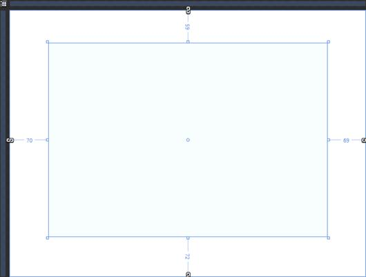
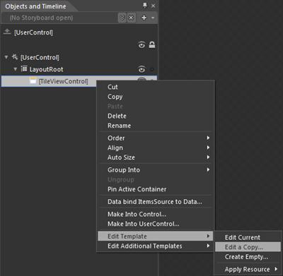
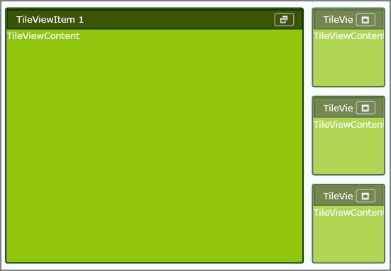

::: {style="DISPLAY: none"}
{#d2h_url_template}{#d2h_package_url style="WIDTH: 0px; DISPLAY: none; HEIGHT: 0px"}
:::

::: {.d2h_secondary_topic style="PADDING-BOTTOM: 10pt; MARGIN: 0pt; PADDING-LEFT: 0pt; PADDING-RIGHT: 0pt; PADDING-TOP: 0pt"}
#### Blendability Support

The TileViewControl includes the Blendability support that allows you to edit the control in Microsoft Expression Blend and apply their own styles for the control in place of predefined styles.

Use Case Scenarios

The feature enables you to set own styles for the control.

 

Adding Blendability Support to an Application

The following are the step-by-step procedure to edit the TileViewControl in Microsoft Expression Blend.

 

1.   Open a new Silverlight Project in Microsoft Expression Blend.

2.   Include the required dll to the application.

3.   From the Toolbox and Controls sections, drag and drop the TileViewControl into the application.

4.   Once the TileViewControl is drag and dropped, the window will look as shown below.

[]{style="FONT-FAMILY: 'Calibri','sans-serif'; FONT-SIZE: 11pt"} 

{border="0"}

Figure 869: View of MainPage.xaml after inserting TileViewControl in Expression Blend

[]{style="FONT-FAMILY: 'Calibri','sans-serif'; FONT-SIZE: 11pt"} 

 

5.   Once the TileViewControl is added to the application, the instance of TileViewControl will be added to the Object and TimeLine window.

6.   Right click the instance of the TileViewControl in the Object and TimeLine window and select "Edit Template" and then "Edit a copy" as shown below.

{border="0"}

Figure 870: Objects and TimeLine window and how to select the "Edit a Copy"

 

7.   After clicking the "Edit a Copy" a new window, "Create Style Resource" will appear as shownbelow which asks for the Name of the Style. Give the style name and press ok.

 

{border="0"}

 

Figure 871: Create Style Resource window

 

 

8.   Now edit the template and apply your own styles to the control. The sample application created using Microsoft Expression Blend will appear  as shown below.

{border="0"}

Figure 872: Sample Application, after applying styles using Expression Blend

 

 

[]{#related-topics}
:::
